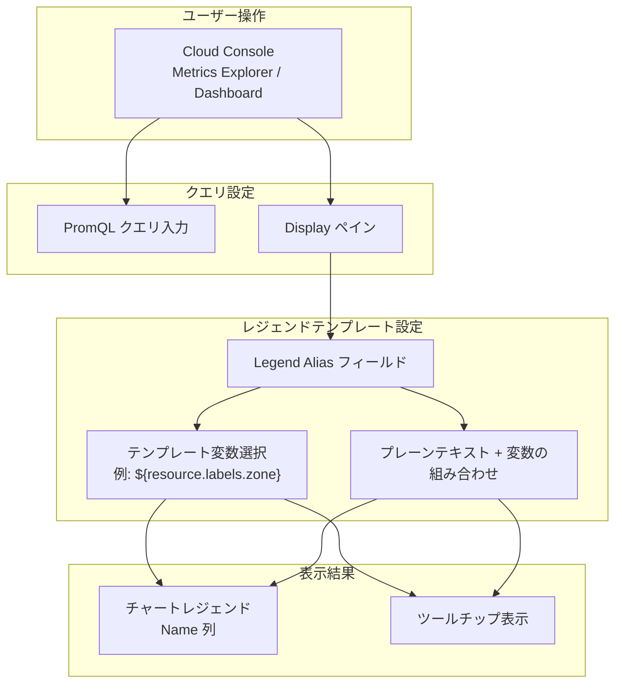

# Cloud Monitoring: PromQL チャートのレジェンドテンプレート設定

**リリース日**: 2026-03-09

**サービス**: Cloud Monitoring

**機能**: PromQL フォーマットチャートのレジェンドテンプレート設定

**ステータス**: Feature

[このアップデートのインフォグラフィックを見る](https://takech9203.github.io/google-cloud-news-summary/20260309-cloud-monitoring-promql-legend-templates.html)

## 概要

Cloud Monitoring において、PromQL フォーマットのチャートでレジェンドテンプレートを設定できるようになった。これにより、PromQL クエリで作成したチャートの凡例（レジェンド）に表示される時系列の説明をカスタマイズできるようになる。

レジェンドテンプレート機能（Legend Alias）は、チャートの凡例やツールチップに表示される時系列の説明文をユーザーが自由にカスタマイズできる機能である。従来は Monitoring フィルターベースのチャートでのみ利用可能であったが、今回のアップデートにより PromQL ベースのチャートでも同様の設定が可能になった。

テンプレートにはプレーンテキストとテンプレート変数（`${resource.labels.zone}` など）を組み合わせて使用でき、レジェンドの Name 列とツールチップに反映される。

**アップデート前の課題**

- PromQL フォーマットのチャートではレジェンドの表示名をカスタマイズできなかった
- PromQL チャートのレジェンドはシステムが自動選択したラベル値で構成され、ユーザーにとって分かりにくい表示になることがあった
- 複数の時系列を表示するチャートで、各系列を直感的に識別することが困難だった

**アップデート後の改善**

- PromQL チャートでも Legend Alias フィールドを使用してレジェンドの表示名をカスタマイズできるようになった
- テンプレート変数を使用して、リソースラベルやメトリクスラベルの値を動的にレジェンドに反映できるようになった
- プレーンテキストとテンプレート変数を組み合わせた柔軟な表示設定が可能になった

## アーキテクチャ図



PromQL チャートにおけるレジェンドテンプレートの設定フロー。Display ペインの Legend Alias フィールドでテンプレートを設定すると、チャートのレジェンドとツールチップに反映される。

## サービスアップデートの詳細

### 主要機能

1. **Legend Alias フィールドの PromQL 対応**
   - PromQL フォーマットのチャートで Legend Alias フィールドが利用可能になった
   - Display ペインから Legend Alias を展開して設定する
   - テンプレート変数のサジェスト機能が利用でき、利用可能なラベルをメニューから選択できる

2. **テンプレート変数によるカスタマイズ**
   - `${resource.labels.<ラベル名>}` 形式でリソースラベルを参照可能
   - 例: `${resource.labels.zone}` でゾーン名を表示
   - 複数のテンプレート変数とプレーンテキストを組み合わせて使用可能

3. **レジェンド列とツールチップへの反映**
   - テンプレートから生成された値はレジェンドの Name 列に表示される
   - 同じ内容がチャートのツールチップにも表示される
   - ツールチップの表示領域には制限があるため、簡潔なテンプレートが推奨される

## 技術仕様

### テンプレート構文

| 項目 | 詳細 |
|------|------|
| テンプレート変数形式 | `${resource.labels.<ラベル名>}` |
| プレーンテキスト | テンプレート変数と自由に組み合わせ可能 |
| 表示箇所 | レジェンド Name 列、ツールチップ |
| 変数のサジェスト | Display ペインのメニューから選択可能 |

### 設定場所

| 項目 | 詳細 |
|------|------|
| 対象チャートタイプ | PromQL フォーマットのチャート |
| 設定ペイン | Display ペイン |
| 設定フィールド | Legend Alias |
| 利用可能ページ | Metrics Explorer、カスタムダッシュボード |

## 設定方法

### 前提条件

1. Cloud Monitoring へのアクセス権限があること
2. PromQL クエリを使用したチャートが作成済みであること

### 手順

#### ステップ 1: PromQL チャートの表示設定を開く

Metrics Explorer またはカスタムダッシュボードのチャート編集画面で、PromQL クエリを入力した後、Display ペインを開く。

#### ステップ 2: Legend Alias の設定

Display ペインで「Legend Alias」セクションを展開し、テンプレートを入力する。

テンプレート変数のサジェスト機能を使用する場合は、「Display template variable suggestions」をクリックし、メニューからラベルを選択する。例えば `zone` を選択すると、`${resource.labels.zone}` が自動的に挿入される。

#### ステップ 3: テンプレートの確認

設定したテンプレートがチャートのレジェンド（Name 列）とツールチップに正しく反映されていることを確認する。

## メリット

### ビジネス面

- **ダッシュボードの可読性向上**: チームメンバーがチャートを見た際に、各時系列が何を表しているかを即座に理解できるようになり、モニタリング業務の効率が向上する
- **インシデント対応の迅速化**: 障害発生時にチャートのレジェンドが分かりやすく表示されることで、問題のあるリソースの特定が容易になる

### 技術面

- **PromQL ユーザーの利便性向上**: Prometheus から Cloud Monitoring に移行したユーザーや PromQL を主に使用するユーザーにとって、チャートのカスタマイズ性が向上する
- **Monitoring フィルターとの機能パリティ**: PromQL チャートでも Monitoring フィルターベースのチャートと同等のレジェンドカスタマイズが可能になった

## ユースケース

### ユースケース 1: マルチゾーン環境のリソース監視

**シナリオ**: 複数のゾーンにまたがる GKE クラスタの CPU 使用率を PromQL で監視している場合、レジェンドにゾーン名を含めることで、どのゾーンのノードに負荷がかかっているかを一目で識別できる。

**実装例**:
```
# PromQL クエリ
{\"kubernetes.io/node/cpu/allocatable_utilization\"}

# Legend Alias テンプレート
Node: ${resource.labels.node_name} (${resource.labels.zone})
```

**効果**: ゾーンごとのリソース使用状況を直感的に把握でき、特定ゾーンへの負荷集中を迅速に検知できる。

### ユースケース 2: 複数サービスのレイテンシ比較

**シナリオ**: 複数のマイクロサービスのレスポンスタイムを 1 つのチャートで比較する場合、サービス名をレジェンドに表示することで、パフォーマンスのボトルネックとなっているサービスを容易に特定できる。

**効果**: レジェンドの表示が分かりやすくなることで、チーム間でのダッシュボード共有時のコミュニケーションコストが削減される。

## 関連サービス・機能

- **Google Cloud Managed Service for Prometheus**: Cloud Monitoring で PromQL を使用するための基盤サービス。Prometheus メトリクスの収集・保存・クエリを提供する
- **Metrics Explorer**: Cloud Monitoring のメトリクス可視化ツール。PromQL タブからクエリを入力してチャートを作成できる
- **Cloud Monitoring ダッシュボード**: カスタムダッシュボードにチャートウィジェットを配置して監視画面を構築できる。レジェンドテンプレートはダッシュボード上のチャートでも利用可能
- **Cloud Logging**: ログベースメトリクスを作成し、Cloud Monitoring でチャート化する際にも PromQL とレジェンドテンプレートを活用できる

## 参考リンク

- [インフォグラフィック](https://takech9203.github.io/google-cloud-news-summary/20260309-cloud-monitoring-promql-legend-templates.html)
- [公式リリースノート](https://docs.cloud.google.com/release-notes#March_09_2026)
- [レジェンド列の名前を設定する - ドキュメント](https://docs.cloud.google.com/monitoring/charts/working-with-legends#descr_template)
- [Cloud Monitoring でのレジェンドの操作](https://docs.cloud.google.com/monitoring/charts/working-with-legends)
- [Cloud Monitoring での PromQL の使用](https://docs.cloud.google.com/monitoring/promql)
- [チャートの表示オプション設定](https://docs.cloud.google.com/monitoring/charts/chart-view-options)

## まとめ

Cloud Monitoring の PromQL フォーマットチャートでレジェンドテンプレートが設定可能になったことで、PromQL ユーザーのチャートカスタマイズ性が大幅に向上した。Prometheus エコシステムから Cloud Monitoring への移行を進めている組織や、PromQL を主要なクエリ言語として使用しているチームにとって有用なアップデートである。既存の PromQL チャートを使用している場合は、Display ペインの Legend Alias フィールドからテンプレートを設定し、ダッシュボードの可読性向上を検討することを推奨する。

---

**タグ**: #CloudMonitoring #PromQL #チャート #レジェンド #ダッシュボード #可視化 #Observability
