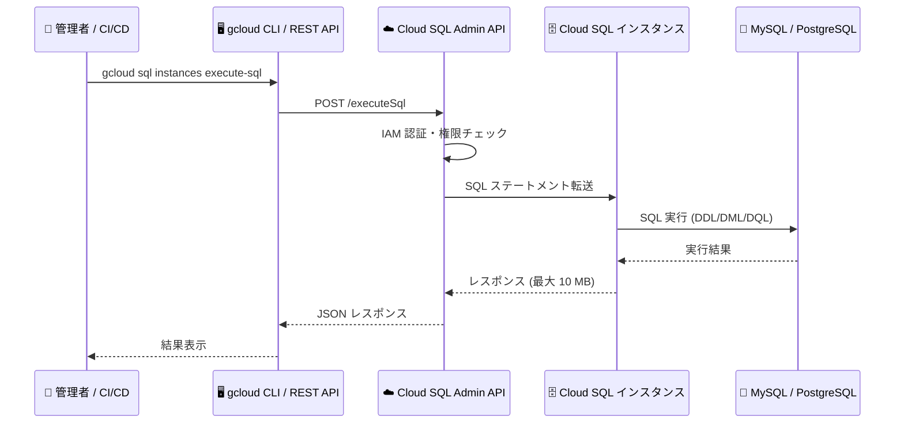

# Cloud SQL: Data API による管理クエリの実行サポート

**リリース日**: 2026-03-09

**サービス**: Cloud SQL for MySQL / Cloud SQL for PostgreSQL

**機能**: Data API で管理クエリ (Administrative Queries) を実行可能に

**ステータス**: GA

📊 [このアップデートのインフォグラフィックを見る](https://takech9203.github.io/google-cloud-news-summary/20260309-cloud-sql-data-api-admin-queries.html)

## 概要

Cloud SQL for MySQL および Cloud SQL for PostgreSQL において、Cloud SQL Data API を使用して管理クエリ (Administrative Queries) を実行できるようになった。Data API は Cloud SQL Admin API の一部として提供され、gcloud CLI または REST API 経由で SQL ステートメントをインスタンスに対して直接実行できる機能である。

Data API は、データベースロールやユーザーの作成、スキーマの小規模な変更といった管理的な SQL ステートメントの実行に適している。DML (Data Manipulation Language)、DDL (Data Definition Language)、DQL (Data Query Language) のすべての SQL ステートメントタイプをサポートしており、パブリック IP、プライベートサービスアクセス、Private Service Connect を使用するインスタンスで利用可能である。

このアップデートは MySQL と PostgreSQL の両方に同時に適用され、PostgreSQL では追加で PostgreSQL 拡張機能の有効化にも Data API を使用できる。

**アップデート前の課題**

- Cloud SQL インスタンスに対して管理クエリを実行するには、Cloud SQL Auth Proxy や直接のデータベース接続を設定する必要があった
- CI/CD パイプラインや自動化スクリプトからの管理操作には、接続ドライバーやプロキシの設定が前提だった
- 簡単なスキーマ変更やユーザー管理のためだけに、データベースクライアントツールの準備が必要だった

**アップデート後の改善**

- Cloud SQL Admin API の `executeSql` エンドポイントを通じて、REST API や gcloud CLI から直接 SQL ステートメントを実行可能になった
- IAM ベースの認証により、データベースパスワードを管理せずにセキュアに管理操作を実行できるようになった
- インフラ自動化やスクリプトから、追加の接続設定なしに管理クエリを発行できるようになった

## アーキテクチャ図



Cloud SQL Data API は Cloud SQL Admin API を経由して SQL ステートメントをインスタンスに転送し、IAM 認証による権限チェックを行った上でデータベースエンジンで実行する。

## サービスアップデートの詳細

### 主要機能

1. **REST API による SQL 実行**
   - `POST https://sqladmin.googleapis.com/sql/v1beta4/projects/{PROJECT_ID}/instances/{INSTANCE_NAME}/executeSql` エンドポイントで SQL を実行
   - リクエストボディにデータベース名と SQL ステートメントを JSON で指定
   - レスポンスサイズの制御 (`partialResultMode`) に対応

2. **gcloud CLI による SQL 実行**
   - `gcloud beta sql instances execute-sql` コマンドで直接 SQL を実行
   - `--database`、`--sql`、`--partial_result_mode` オプションを指定
   - シェルスクリプトや CI/CD パイプラインとの統合が容易

3. **IAM ベースのアクセス制御**
   - `cloudsql.instances.executesql` パーミッションによる細かなアクセス制御
   - Cloud SQL Admin (`roles/cloudsql.admin`)、Cloud SQL Instance User (`roles/cloudsql.instanceUser`)、Cloud SQL Studio User (`roles/cloudsql.studioUser`) ロールをサポート
   - IAM カスタムロールでの権限付与も可能

4. **PostgreSQL 拡張機能の有効化**
   - PostgreSQL では Data API を通じて拡張機能 (Extension) の有効化も可能
   - `CREATE EXTENSION` ステートメントを REST API 経由で実行

## 技術仕様

### Data API の仕様

| 項目 | 詳細 |
|------|------|
| 対応データベース | Cloud SQL for MySQL、Cloud SQL for PostgreSQL |
| サポートする SQL | DDL、DML、DQL すべて |
| 接続方式 | パブリック IP、プライベートサービスアクセス、Private Service Connect |
| レスポンスサイズ上限 | 10 MB |
| リクエストサイズ上限 | 0.5 MB |
| タイムアウト | 30 秒 |
| 同時実行数 | インスタンスごと・ユーザーごとに最大 10 リクエスト |
| レスポンスのメッセージ数 | 最大 10 件 (データベースメッセージ/警告) |

### 必要な IAM パーミッション

```json
{
  "permission": "cloudsql.instances.executesql",
  "supportedRoles": [
    "roles/cloudsql.admin",
    "roles/cloudsql.instanceUser",
    "roles/cloudsql.studioUser"
  ]
}
```

## 設定方法

### 前提条件

1. Cloud SQL インスタンスで IAM データベース認証が有効化されていること
2. IAM ユーザーまたはサービスアカウントがインスタンスに追加されていること
3. 適切な IAM ロールまたはパーミッションが付与されていること

### 手順

#### ステップ 1: Data API アクセスの有効化

```bash
gcloud sql instances patch INSTANCE_NAME \
  --data-api-access=ALLOW_DATA_API
```

インスタンスごとに Data API アクセスを有効化する。不要になった場合は `DENY_DATA_API` で無効化できる。

#### ステップ 2: gcloud CLI で SQL を実行

```bash
gcloud beta sql instances execute-sql INSTANCE_NAME \
  --database=DATABASE_NAME \
  --sql="CREATE USER 'new_admin'@'%' IDENTIFIED BY 'password'"
```

管理クエリをインスタンスに対して直接実行する。

#### ステップ 3: REST API で SQL を実行

```bash
curl -X POST \
  -H "Authorization: Bearer $(gcloud auth print-access-token)" \
  -H "Content-Type: application/json" \
  -d '{
    "database": "DATABASE_NAME",
    "sqlStatement": "GRANT SELECT ON *.* TO new_admin",
    "partialResultMode": "FAIL_PARTIAL_RESULT"
  }' \
  "https://sqladmin.googleapis.com/sql/v1beta4/projects/PROJECT_ID/instances/INSTANCE_NAME/executeSql"
```

REST API を使用してプログラマティックに SQL を実行する。

## メリット

### ビジネス面

- **運用コストの削減**: データベースクライアントツールやプロキシの設定・管理が不要になり、管理操作の運用負荷が軽減される
- **自動化の促進**: CI/CD パイプラインや IaC ツールからの管理操作をシンプルに統合でき、デプロイプロセスの自動化が進む

### 技術面

- **セキュリティの向上**: IAM 認証を活用することで、データベースパスワードの管理を排除し、最小権限の原則を適用しやすくなる
- **接続管理の簡素化**: Cloud SQL Auth Proxy やデータベースドライバーのセットアップなしに SQL を実行でき、サーバーレスワークロードやスクリプトからのアクセスが容易になる
- **ネットワーク柔軟性**: パブリック IP、プライベートサービスアクセス、Private Service Connect のいずれの構成でも利用可能

## デメリット・制約事項

### 制限事項

- レスポンスサイズが 10 MB を超える場合、結果が切り詰められるかエラーが返される
- リクエストのタイムアウトは 30 秒に固定され、変更不可 (MySQL の `SET SESSION MAX_EXECUTION_TIME` や PostgreSQL の `SET STATEMENT_TIMEOUT` は非サポート)
- 外部サーバーレプリケーションが設定されたインスタンスでは Data API を使用できない
- 同時実行は 1 インスタンス・1 ユーザーあたり最大 10 リクエストに制限される
- MySQL 5.6/5.7 では、長時間実行される DDL ステートメントがタイムアウトした場合、孤立ファイルやテーブルが発生する可能性がある

### 考慮すべき点

- Data API は小規模な管理クエリ向けに設計されており、大量データの取得や長時間実行クエリには適さない
- メモリを大量に消費するステートメントは Out-of-Memory エラーを引き起こす可能性がある
- SQL Server では Data API は現時点でサポートされていない

## ユースケース

### ユースケース 1: CI/CD パイプラインでのデータベースマイグレーション

**シナリオ**: アプリケーションのデプロイ時に、データベーススキーマの変更を自動化したい。Cloud SQL Auth Proxy の設定なしに、GitHub Actions や Cloud Build から直接スキーマ変更を実行する。

**実装例**:
```bash
# Cloud Build ステップで直接スキーマ変更を実行
gcloud beta sql instances execute-sql my-instance \
  --database=mydb \
  --sql="ALTER TABLE users ADD COLUMN last_login TIMESTAMP"
```

**効果**: デプロイパイプラインの簡素化と、プロキシ設定に伴うメンテナンス負荷の削減

### ユースケース 2: サーバーレス環境からの管理操作

**シナリオ**: Cloud Functions や Cloud Run から、データベースユーザーの作成やロール付与を自動化する。REST API を使用してサービスアカウント経由でセキュアに管理操作を実行する。

**効果**: サーバーレスワークロードからの管理操作をシンプルに実装でき、接続プールやドライバー管理のオーバーヘッドを回避

### ユースケース 3: PostgreSQL 拡張機能のプログラマティックな有効化

**シナリオ**: Terraform や Pulumi でインフラをプロビジョニングした後、PostgreSQL 拡張機能 (PostGIS、pg_trgm など) の有効化を自動化する。

**実装例**:
```bash
gcloud beta sql instances execute-sql my-pg-instance \
  --database=mydb \
  --sql="CREATE EXTENSION IF NOT EXISTS postgis"
```

**効果**: インフラプロビジョニングからデータベース設定までをエンドツーエンドで自動化

## 料金

Data API は Cloud SQL Admin API の一部として提供される。Data API 自体の追加料金は公式ドキュメントでは明示されていないが、Cloud SQL の標準料金 (インスタンスの vCPU、メモリ、ストレージ、ネットワーク) は通常通り適用される。API リクエストに対するレートクォータが設定されているため、大量のリクエストを発行する場合はクォータ制限に注意が必要である。

詳細は [Cloud SQL 料金ページ](https://cloud.google.com/sql/pricing) を参照。

## 利用可能リージョン

Cloud SQL Data API は、Cloud SQL for MySQL および Cloud SQL for PostgreSQL が利用可能なすべてのリージョンで使用できる。パブリック IP、プライベートサービスアクセス、Private Service Connect のいずれのネットワーク構成でも対応している。

## 関連サービス・機能

- **Cloud SQL Admin API**: Data API の基盤となる管理 API。インスタンスの作成・管理・監視に使用
- **Cloud SQL Auth Proxy**: 従来のデータベース接続方式。Data API はプロキシなしでの SQL 実行を可能にする代替手段
- **Cloud SQL Studio**: Google Cloud コンソール上の SQL エディタ。Data API と同じ `cloudsql.studioUser` ロールで利用可能
- **IAM データベース認証**: Data API の前提条件となる認証方式。IAM ユーザー/サービスアカウントでのデータベースアクセスを提供
- **Cloud SQL MCP Server**: AI エージェント向けの Cloud SQL 操作ツール。`execute_sql` ツールとして Data API を内部的に使用

## 参考リンク

- 📊 [インフォグラフィック](https://takech9203.github.io/google-cloud-news-summary/20260309-cloud-sql-data-api-admin-queries.html)
- [公式リリースノート](https://cloud.google.com/release-notes#March_09_2026)
- [Cloud SQL for MySQL - Data API ドキュメント](https://cloud.google.com/sql/docs/mysql/executesql-instance)
- [Cloud SQL for PostgreSQL - Data API ドキュメント](https://cloud.google.com/sql/docs/postgres/executesql-instance)
- [Cloud SQL 料金ページ](https://cloud.google.com/sql/pricing)

## まとめ

Cloud SQL Data API による管理クエリ実行のサポートは、Cloud SQL の運用管理を大幅に簡素化するアップデートである。従来必要だった Cloud SQL Auth Proxy やデータベースクライアントの設定を省略し、REST API や gcloud CLI から直接管理操作を実行できるようになったことで、CI/CD パイプラインやサーバーレス環境からのデータベース管理の自動化が容易になる。Cloud SQL を利用しているチームは、既存の管理ワークフローへの Data API の導入を検討することを推奨する。

---

**タグ**: #CloudSQL #MySQL #PostgreSQL #DataAPI #データベース管理 #IAM #自動化 #CI/CD
