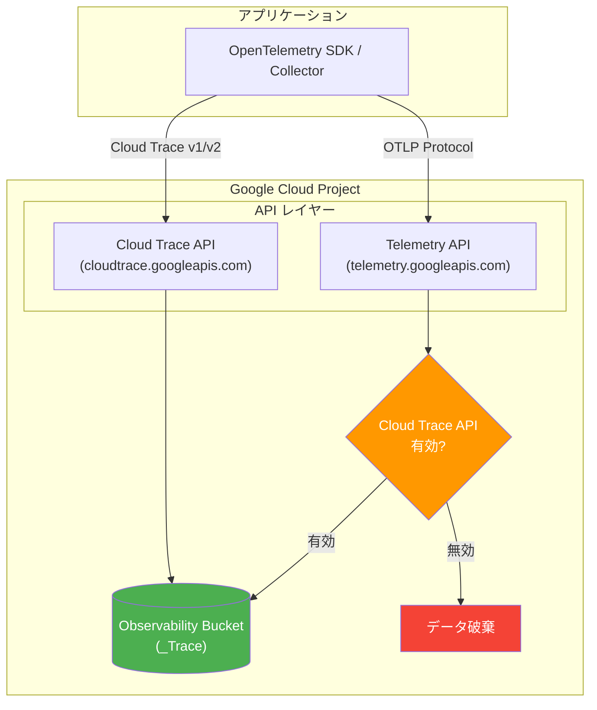

# Cloud Trace: Telemetry API 使用時の Cloud Trace API 有効化要件

**リリース日**: 2026-03-09

**サービス**: Cloud Trace

**機能**: Telemetry API エンドポイント使用時の Cloud Trace API 有効化要件

**ステータス**: Change

[このアップデートのインフォグラフィックを見る](https://takech9203.github.io/google-cloud-news-summary/20260309-cloud-trace-telemetry-api-requirement.html)

## 概要

Google Cloud は Cloud Trace におけるトレースデータ送信の API 要件を明確化した。トレースデータを Google Cloud プロジェクトに送信するには、Cloud Trace API (`cloudtrace.googleapis.com`) または Telemetry API (`telemetry.googleapis.com`) の 2 つの API を使用できる。これら 2 つの API はそれぞれ独立して有効化される。

今回の変更により、Telemetry API エンドポイントにトレースデータを送信する場合、Google Cloud Observability がトレースデータを保存するためには、Cloud Trace API がプロジェクトで有効になっている必要があることが明確化された。Cloud Trace API が無効化されている場合、Telemetry API 経由で送信されたトレースデータは Google Cloud Observability によって破棄される。

この変更は、OpenTelemetry SDK や OpenTelemetry Collector を使用してトレースデータを送信しているユーザーに特に影響がある。Telemetry API は OpenTelemetry エコシステムとの互換性を提供し、Cloud Trace API よりも緩やかな制限値を持つため推奨される API であるが、バックエンドでのデータ保存には Cloud Trace API の有効化が前提条件となる。

**アップデート前の課題**

- Telemetry API と Cloud Trace API の依存関係が明確に文書化されていなかった
- Cloud Trace API が無効化された状態で Telemetry API にデータを送信した場合、エラーなくデータが破棄される可能性があった
- 組織ポリシーで Cloud Trace API が無効化されている環境で、Telemetry API 経由のトレース収集が機能しない原因の特定が困難だった

**アップデート後の改善**

- Telemetry API 使用時に Cloud Trace API の有効化が必須であることが公式に文書化された
- Cloud Trace API が無効な場合のデータ破棄動作が明確に定義された
- トラブルシューティングの指針が明確になり、データ欠損の原因特定が容易になった

## アーキテクチャ図



Telemetry API エンドポイントにトレースデータを送信する場合、Cloud Trace API が有効でなければデータは保存されず破棄される。Cloud Trace API を直接使用する場合はこの制約は適用されない。

## サービスアップデートの詳細

### 主要機能

1. **2 つのトレースデータ送信 API**
   - Cloud Trace API (`cloudtrace.googleapis.com`): Google Cloud 独自の API。v1 (送信・取得) と v2 (送信のみ) をサポート
   - Telemetry API (`telemetry.googleapis.com`): OpenTelemetry OTLP Protocol を実装した API。OpenTelemetry SDK/Collector との互換性が高い

2. **API 間の依存関係**
   - Telemetry API と Cloud Trace API はそれぞれ独立して有効化・無効化できる
   - Telemetry API でトレースデータを送信する場合、Cloud Trace API もプロジェクトで有効である必要がある
   - Cloud Trace API が無効の場合、Telemetry API 経由のトレースデータは破棄される

3. **推奨構成**
   - Google Cloud は Telemetry API の使用を推奨している
   - Telemetry API は Cloud Trace API よりも緩やかな制限値を持つ
   - Application Monitoring など一部の機能は Telemetry API 経由でのみ利用可能

## 技術仕様

### API 比較

| 項目 | Cloud Trace API | Telemetry API |
|------|-----------------|---------------|
| サービス名 | `cloudtrace.googleapis.com` | `telemetry.googleapis.com` |
| プロトコル | REST / gRPC | OTLP (OpenTelemetry) |
| データ送信 | v1, v2 でサポート | サポート |
| データ取得 | v1 でサポート | 非サポート |
| 制限値 | 標準 | より緩やか |
| VPC Service Controls | サポート (独立) | サポート (独立) |
| Cloud Trace API 依存 | 不要 | 必要 (有効化が必須) |

### Telemetry API の制限値

| 項目 | 値 |
|------|-----|
| Span オブジェクトの名前の最大サイズ | 1024 bytes |
| Span オブジェクトあたりの最大属性数 | 1024 |
| 属性キーの最大サイズ | 512 bytes |
| 属性値の最大サイズ | 64 KiB |
| Span オブジェクトあたりの最大 Event 数 | 256 |
| Span オブジェクトあたりの最大 Link 数 | 128 |

### 必要な IAM ロール

| API | 書き込みロール |
|-----|---------------|
| Cloud Trace API | Cloud Trace Agent (`roles/cloudtrace.agent`) |
| Telemetry API | Cloud Telemetry Trace Writer (`roles/telemetry.tracesWriter`) |
| API 有効化 | Service Usage Admin (`roles/serviceusage.serviceUsageAdmin`) |

## 設定方法

### 前提条件

1. Google Cloud プロジェクトが作成されていること
2. Service Usage Admin ロール (`roles/serviceusage.serviceUsageAdmin`) が付与されていること

### 手順

#### ステップ 1: Cloud Trace API と Telemetry API の両方を有効化

```bash
# Cloud Trace API を有効化
gcloud services enable cloudtrace.googleapis.com --project=PROJECT_ID

# Telemetry API を有効化
gcloud services enable telemetry.googleapis.com --project=PROJECT_ID
```

両方の API が有効であることを確認する。特に組織ポリシーによる制約がないか確認が必要。

#### ステップ 2: API の有効化状態を確認

```bash
# 有効な API の一覧を確認
gcloud services list --enabled --filter="name:(cloudtrace.googleapis.com OR telemetry.googleapis.com)" --project=PROJECT_ID
```

Cloud Trace API と Telemetry API の両方が表示されることを確認する。

#### ステップ 3: サービスアカウントに適切なロールを付与

```bash
# Telemetry API 用のロールを付与
gcloud projects add-iam-policy-binding PROJECT_ID \
  --member="serviceAccount:SA_EMAIL" \
  --role="roles/telemetry.tracesWriter"
```

## メリット

### ビジネス面

- **データ損失リスクの低減**: API の依存関係が明文化されたことで、設定ミスによるトレースデータの意図しない破棄を防止できる
- **トラブルシューティング時間の短縮**: データが表示されない場合の原因切り分けが明確になり、問題解決までの時間が短縮される

### 技術面

- **明確な API 依存関係**: Telemetry API と Cloud Trace API の関係が文書化され、インフラ構成の設計時に考慮すべき点が明確になった
- **OpenTelemetry エコシステムとの互換性**: Telemetry API は OTLP Protocol を実装しており、ベンダー固有のエクスポーターに依存しない構成が可能

## デメリット・制約事項

### 制限事項

- Cloud Trace API が組織ポリシーで無効化されている場合、Telemetry API 経由のトレースデータも保存されない
- Assured Workloads (データ残留要件や IL4 要件) を使用している場合、Cloud Trace API と Telemetry API のいずれもトレーススパンの送信には使用できない
- トレースデータの保持期間は 30 日間

### 考慮すべき点

- 既に Telemetry API のみを有効化してトレースデータを送信している場合、Cloud Trace API が無効であればデータが破棄されている可能性がある
- VPC Service Controls の制約は Cloud Trace API と Telemetry API で独立して適用される。片方のみを制限しても、もう片方には影響しない
- Cloud Trace API を有効化する際、組織ポリシー (`constraints/serviceuser.services`) の制約を事前に確認する必要がある

## ユースケース

### ユースケース 1: OpenTelemetry Collector を使用したトレース収集

**シナリオ**: マイクロサービスアーキテクチャで OpenTelemetry Collector を使用してトレースデータを収集し、Telemetry API エンドポイントに送信している環境。

**実装例**:
```yaml
# OpenTelemetry Collector の設定例
exporters:
  otlphttp:
    endpoint: "https://telemetry.googleapis.com"
    auth:
      authenticator: google_cloud_auth

service:
  pipelines:
    traces:
      receivers: [otlp]
      processors: [batch]
      exporters: [otlphttp]
```

**効果**: Cloud Trace API が有効であることを確認することで、Telemetry API 経由で送信されたトレースデータが確実に Observability Bucket に保存される。

### ユースケース 2: 組織ポリシーで API が制限されている環境

**シナリオ**: セキュリティ要件により組織ポリシーで一部の API が無効化されている企業環境で、トレースデータの収集を行う必要がある。

**効果**: Cloud Trace API の有効化が Telemetry API の前提条件であることを理解することで、組織のセキュリティチームと連携して必要な API を適切に有効化できる。

## 料金

Cloud Trace の料金は Google Cloud Observability の料金体系に基づく。詳細は [Google Cloud Observability の料金ページ](https://cloud.google.com/products/observability/pricing) を参照。

## 関連サービス・機能

- **Cloud Monitoring**: トレースデータと組み合わせてアプリケーションのパフォーマンスを監視。メトリクスとトレースの相関分析が可能
- **Cloud Logging**: Log Analytics ページでトレースデータとログデータを SQL で結合して分析可能
- **OpenTelemetry**: Google Cloud がサポートするオープンソースの可観測性フレームワーク。Telemetry API と直接連携
- **VPC Service Controls**: Cloud Trace API と Telemetry API それぞれに独立した VPC Service Controls の制限を適用可能
- **BigQuery**: Observability Bucket にリンクされたデータセットを作成し、BigQuery でトレーススパンを分析可能

## 参考リンク

- [このアップデートのインフォグラフィック](https://takech9203.github.io/google-cloud-news-summary/20260309-cloud-trace-telemetry-api-requirement.html)
- [公式リリースノート](https://docs.cloud.google.com/release-notes#March_09_2026)
- [Cloud Trace 概要 - サポートされる API](https://docs.cloud.google.com/trace/docs/overview#supported-apis)
- [Telemetry API 概要](https://docs.cloud.google.com/stackdriver/docs/reference/telemetry/overview)
- [Cloud Trace API リファレンス](https://docs.cloud.google.com/trace/docs/reference)
- [Cloud Trace トラブルシューティング](https://docs.cloud.google.com/trace/docs/troubleshooting)
- [Cloud Trace の制限とクォータ](https://docs.cloud.google.com/trace/docs/quotas)
- [Google Cloud Observability 料金](https://cloud.google.com/products/observability/pricing)

## まとめ

今回の変更は、Telemetry API エンドポイントを使用してトレースデータを送信する場合に Cloud Trace API の有効化が必須であることを明確化したものである。既に Telemetry API を使用している場合は、Cloud Trace API がプロジェクトで有効になっていることを速やかに確認すべきである。特に組織ポリシーで API が制限されている環境では、意図せずトレースデータが破棄されている可能性があるため、`gcloud services list` コマンドで両方の API の有効化状態を検証することを推奨する。

---

**タグ**: #CloudTrace #TelemetryAPI #OpenTelemetry #Observability #GoogleCloud #トレース #OTLP #API管理
