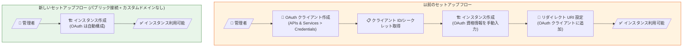

# Looker (Google Cloud core): OAuth 自動構成によるインスタンスセットアップの簡素化

**リリース日**: 2026-03-09

**サービス**: Looker (Google Cloud core)

**機能**: パブリックセキュア接続インスタンスの OAuth 自動管理

**ステータス**: GA (一般提供)

📊 [このアップデートのインフォグラフィックを見る](https://takech9203.github.io/google-cloud-news-summary/20260309-looker-auto-oauth-configuration.html)

## 概要

Looker (Google Cloud core) において、パブリックセキュア接続のみを使用し、カスタムドメインを設定しないインスタンスでは、OAuth 資格情報の手動構成が不要になった。これらのインスタンスでは、Looker (Google Cloud core) が OAuth クライアントとシークレット情報を自動的に管理し、セットアッププロセスが大幅に簡素化される。

これまで Looker (Google Cloud core) のインスタンスを作成するには、事前に Google Cloud コンソールで OAuth クライアント ID とクライアントシークレットを生成し、インスタンス作成時にそれらを指定し、さらにインスタンス作成後にリダイレクト URI を設定するという複数のステップが必要だった。今回のアップデートにより、パブリックセキュア接続でカスタムドメインを使用しないケースでは、これらの手順がすべて自動化される。

なお、プライベート接続、ハイブリッド接続、またはカスタムドメインを使用するインスタンスでは、引き続き手動での OAuth 構成が必要である。

**アップデート前の課題**

- すべての Looker (Google Cloud core) インスタンス作成時に、手動で OAuth クライアント ID とクライアントシークレットを生成する必要があった
- インスタンス作成後、OAuth クライアントにリダイレクト URI を手動で追加する必要があった
- OAuth コンセント画面の構成、スコープ設定、テストユーザーの追加など複数の事前ステップが必要だった
- これらの手順は初めて Looker を利用するユーザーにとって複雑で、セットアップ時間の増大やエラーの原因となっていた

**アップデート後の改善**

- パブリックセキュア接続かつカスタムドメインなしのインスタンスでは、OAuth 資格情報が自動的に管理される
- OAuth クライアント ID、クライアントシークレット、リダイレクト URI の手動設定が不要になった
- インスタンスのプロビジョニングからユーザーのログインまでの手順が大幅に削減された

## アーキテクチャ図

上図は、OAuth 手動構成が必要だった従来のフローと、自動構成が適用される新しいフローの比較を示している。パブリックセキュア接続でカスタムドメインを使用しない場合、管理者の操作ステップが 5 段階から 2 段階に削減される。

## サービスアップデートの詳細

### 主要機能

1. **OAuth 自動管理**
   - パブリックセキュア接続かつカスタムドメインなしのインスタンスに対して、Looker (Google Cloud core) が OAuth クライアントとシークレット情報を自動的に生成・管理する
   - 管理者は OAuth 資格情報を意識することなくインスタンスを作成できる

2. **適用条件**
   - パブリックセキュア接続 (外部からインターネット経由でアクセス可能な IP アドレスを持つ接続) を使用するインスタンスが対象
   - カスタムドメインを設定しないインスタンスが対象
   - 上記の両方の条件を満たす場合にのみ自動構成が適用される

3. **手動構成が引き続き必要なケース**
   - プライベート接続 (Private Service Connect または private services access) を使用するインスタンス
   - ハイブリッド接続 (パブリック URL + PSC エンドポイントによるアウトバウンド接続) を使用するインスタンス
   - カスタムドメインを設定するインスタンス

## 技術仕様

### 接続タイプ別の OAuth 構成要件

| 接続タイプ | カスタムドメイン | OAuth 構成 |
|-----------|----------------|-----------|
| パブリックセキュア接続 | なし | **自動** (新機能) |
| パブリックセキュア接続 | あり | 手動 |
| ハイブリッド接続 | なし/あり | 手動 |
| プライベート接続 (PSC) | なし/あり | 手動 |
| プライベート接続 (PSA) | なし/あり | 手動 |

### 従来の手動 OAuth 構成手順 (参考)

従来のインスタンス作成では、以下の手動手順が必要だった。

1. Google Cloud コンソールで OAuth クライアント ID を作成 (APIs & Services > Credentials)
2. アプリケーションタイプとして「Web application」を選択
3. クライアント ID とクライアントシークレットを取得
4. OAuth コンセント画面を構成 (ユーザータイプ、スコープ、テストユーザー)
5. インスタンス作成時に OAuth 資格情報を入力
6. インスタンス作成後、リダイレクト URI (`https://<instance-url>/oauth2callback`) を OAuth クライアントに追加

## メリット

### ビジネス面

- **導入時間の短縮**: インスタンスのセットアップに要する時間が短縮され、Looker の利用開始までのリードタイムが削減される
- **運用負荷の軽減**: OAuth 資格情報のライフサイクル管理が自動化されることで、管理者の運用負荷が軽減される

### 技術面

- **セットアップエラーの削減**: OAuth 資格情報の手動設定におけるミス (リダイレクト URI の設定漏れなど) がなくなる
- **セキュリティの向上**: OAuth クライアントシークレットが自動管理されることで、資格情報の漏洩リスクが低減される
- **Infrastructure as Code の簡素化**: Terraform や gcloud CLI でのインスタンス作成時に、OAuth 関連のパラメータ指定が不要になる

## デメリット・制約事項

### 制限事項

- パブリックセキュア接続かつカスタムドメインなしの場合にのみ適用される
- プライベート接続やハイブリッド接続を使用する Enterprise/Embed エディションのインスタンスでは利用できない
- カスタムドメインを後から追加する場合、OAuth の手動構成への移行が必要になる可能性がある

### 考慮すべき点

- 自動管理された OAuth 資格情報のカスタマイズ (例: 外部ユーザータイプへの変更) が可能かどうかは公式ドキュメントで確認が必要
- 既存のパブリックセキュア接続インスタンス (手動 OAuth 構成済み) への影響については公式ドキュメントを参照

## ユースケース

### ユースケース 1: 小規模チームでの Looker 導入

**シナリオ**: 50 名以下のチームが Standard エディションの Looker (Google Cloud core) を初めて導入する場合。パブリックセキュア接続で十分であり、カスタムドメインも不要なケース。

**効果**: OAuth の事前設定が不要になり、Google Cloud コンソールからインスタンスを作成するだけで、すぐにチームメンバーがアクセスできるようになる。初期セットアップの手順が大幅に簡素化される。

### ユースケース 2: 開発・テスト環境の迅速な構築

**シナリオ**: 既存の本番 Looker インスタンスに加えて、開発やテスト用の非本番インスタンスを素早くプロビジョニングしたい場合。

**効果**: OAuth 構成のオーバーヘッドなしに非本番インスタンスを作成でき、CI/CD パイプラインや自動テスト環境の構築が容易になる。

## 料金

Looker (Google Cloud core) の料金はエディション (Standard、Enterprise、Embed) ごとに年間契約ベースで設定されている。今回の OAuth 自動構成機能自体に追加料金は発生しない。

詳細な料金については [Looker (Google Cloud core) pricing](https://cloud.google.com/looker/pricing) ページを参照。

## 関連サービス・機能

- **Google Cloud IAM**: Looker (Google Cloud core) インスタンスへのアクセス制御に使用。OAuth 認証と組み合わせてユーザーのロール管理を行う
- **Private Service Connect**: Enterprise/Embed エディションで利用可能なプライベート接続方式。この接続タイプでは引き続き手動 OAuth 構成が必要
- **Cloud DNS**: カスタムドメイン設定時に使用。カスタムドメインを使用する場合は手動 OAuth 構成が必要
- **Gemini in Looker**: Looker (Google Cloud core) で利用可能な AI 機能。インスタンス作成時に有効化でき、OAuth 構成とは独立している

## 参考リンク

- 📊 [インフォグラフィック](https://takech9203.github.io/google-cloud-news-summary/20260309-looker-auto-oauth-configuration.html)
- [公式リリースノート](https://cloud.google.com/release-notes#March_09_2026)
- [Looker (Google Cloud core) の OAuth クライアント作成ドキュメント](https://cloud.google.com/looker/docs/looker-core-create-oauth)
- [Looker (Google Cloud core) インスタンス作成ガイド](https://cloud.google.com/looker/docs/looker-core-instance-create)
- [Looker (Google Cloud core) OAuth 認証](https://cloud.google.com/looker/docs/looker-core-oauth-authentication)
- [Looker (Google Cloud core) 概要](https://cloud.google.com/looker/docs/looker-core-overview)
- [料金ページ](https://cloud.google.com/looker/pricing)

## まとめ

今回のアップデートにより、パブリックセキュア接続でカスタムドメインを使用しない Looker (Google Cloud core) インスタンスの作成プロセスが大幅に簡素化された。特に Looker を初めて導入する組織や、開発・テスト環境を迅速に構築したいチームにとって大きなメリットがある。プライベート接続やカスタムドメインが必要な場合は引き続き手動構成が必要なため、自社の要件に応じて適切な構成を選択することが推奨される。

---

**タグ**: #Looker #GoogleCloudCore #OAuth #セットアップ簡素化 #パブリック接続 #認証
