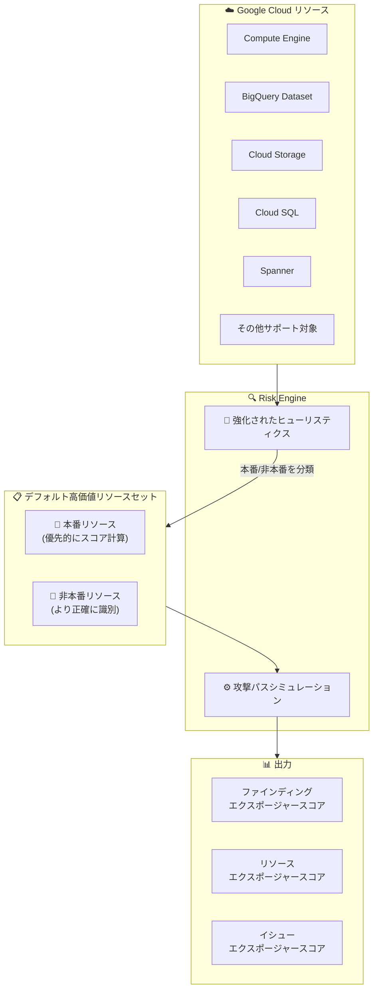

# Security Command Center: Risk Engine のデフォルト高価値リソース識別ヒューリスティクスの強化

**リリース日**: 2026-03-09

**サービス**: Security Command Center

**機能**: Risk Engine - デフォルト高価値リソースセットのヒューリスティクス改善

**ステータス**: Announcement

📊 [このアップデートのインフォグラフィックを見る](https://takech9203.github.io/google-cloud-news-summary/20260309-security-command-center-risk-engine-heuristics.html)

## 概要

2026 年 3 月、Security Command Center の Risk Engine において、デフォルト高価値リソースをより正確に識別するための強化されたヒューリスティクスがリリースされる。この改善により、Risk Engine は本番環境と非本番環境のリソースをより精緻に区別し、攻撃エクスポージャースコアの精度が向上する。

この変更はデフォルト高価値リソースセットを使用しているユーザーに影響し、ファインディング、リソース、イシューのエクスポージャースコアに変動が生じる可能性がある。カスタムリソース値構成を使用しているユーザーには影響がない。ユーザー側での対応は不要であり、自動的に適用される。

対象ユーザーは、Security Command Center の Premium または Enterprise ティアを組織レベルで有効化し、カスタムリソース値構成を定義していない (デフォルト高価値リソースセットを使用している) 組織である。

**アップデート前の課題**

- Risk Engine のヒューリスティクスが非本番用途のリソースを十分に区別できず、本番環境のリソースと同等に扱われる場合があった
- デフォルト高価値リソースセットにおいて、非本番リソースが含まれることでエクスポージャースコアの精度が最適でない状態だった
- セキュリティチームが本当に重要なリソースに集中するための優先順位付けが難しくなる場合があった

**アップデート後の改善**

- 強化されたヒューリスティクスにより、非本番用途のリソースがより正確に識別され、本番リソースのスコア計算が優先される
- エクスポージャースコアがより実態に即した値を反映するようになり、セキュリティ対応の優先順位付けが改善される
- ユーザー側の対応は不要で、自動的に改善が適用される

## アーキテクチャ図

Risk Engine は強化されたヒューリスティクスを用いて Google Cloud リソースを本番・非本番に分類し、デフォルト高価値リソースセット内で本番リソースのスコア計算を優先的に実行する。

## サービスアップデートの詳細

### 主要機能

1. **デフォルト高価値リソース識別の精度向上**
   - Risk Engine が非本番用途のアセットをより正確に識別するヒューリスティクスを使用
   - 本番リソースのエクスポージャースコア計算が非本番リソースより先に行われる
   - デフォルト高価値リソースセット内のリソース分類精度が向上

2. **エクスポージャースコアの自動更新**
   - ヒューリスティクス改善に伴い、既存のファインディング、リソース、イシューのスコアが自動的に再計算される
   - ユーザー側での設定変更やアクションは不要
   - 攻撃パスシミュレーションは約 6 時間ごとに実行され、スコアが更新される

3. **カスタム構成への非影響**
   - カスタムリソース値構成を使用しているユーザーには影響がない
   - カスタム構成が少なくとも 1 つのリソースに一致している場合、デフォルト高価値リソースセットは使用されない

## 技術仕様

### デフォルト高価値リソースセットに含まれるリソースタイプ

| リソースタイプ | サービス |
|------|------|
| `aiplatform.googleapis.com/Model` | Vertex AI |
| `artifactregistry.googleapis.com/Repository` | Artifact Registry |
| `bigquery.googleapis.com/Dataset` | BigQuery |
| `cloudbuild.googleapis.com/BuildTrigger` | Cloud Build |
| `cloudfunctions.googleapis.com/CloudFunction` | Cloud Functions |
| `compute.googleapis.com/Instance` | Compute Engine |
| `run.googleapis.com/Job` | Cloud Run |
| `run.googleapis.com/Service` | Cloud Run |
| `spanner.googleapis.com/Instance` | Spanner |
| `sqladmin.googleapis.com/Instance` | Cloud SQL |
| `storage.googleapis.com/Bucket` | Cloud Storage |

### スコア計算の仕組み

| 項目 | 詳細 |
|------|------|
| シミュレーション頻度 | 約 6 時間ごと (最低 1 日 1 回) |
| リソースのスコア範囲 | 0 〜 10 |
| ファインディングのスコア範囲 | 上限なし (露出リソース数に比例) |
| 優先度値 (HIGH) | 10 |
| 優先度値 (MEDIUM) | 5 |
| 優先度値 (LOW) | 1 |
| デフォルト高価値リソースの優先度 | LOW (Sensitive Data Protection 使用時は HIGH/MEDIUM) |

### 高価値リソースセットの制限

| 項目 | 詳細 |
|------|------|
| リソース上限 | クラウドプロバイダーあたり 1,000 |
| リソース値構成の上限 | 組織あたり 100 |
| 必要なティア | Premium または Enterprise |
| 必要なアクティベーション | 組織レベル |

## メリット

### ビジネス面

- **セキュリティ優先順位の精度向上**: 本番環境のリソースに対するリスクがより正確に評価され、セキュリティチームが真に重要な脆弱性に集中できる
- **運用負荷の軽減**: ユーザー側の対応が不要で、自動的にスコア精度が向上する

### 技術面

- **非本番リソースの適切な分類**: 開発・テスト環境のリソースが本番リソースと区別され、ノイズが削減される
- **攻撃パスシミュレーションの効率化**: 本番リソースのスコア計算が優先されることで、最も重要なリスク情報が先に提供される

## デメリット・制約事項

### 制限事項

- デフォルト高価値リソースセットを使用している場合にのみ影響がある
- カスタムリソース値構成を使用している場合は、この改善の恩恵を直接受けない
- プロジェクトレベルのアクティベーションでは攻撃エクスポージャースコア機能自体が利用できない

### 考慮すべき点

- スコアの変動が発生するため、既存のアラート閾値やダッシュボードの確認を推奨
- スコアベースの自動化ワークフロー (SOAR 連携など) を運用している場合、スコア変動による影響を事前に確認すること
- より正確なスコアを得るには、デフォルトセットに依存せず、カスタムリソース値構成を定義することが公式に推奨されている

## ユースケース

### ユースケース 1: デフォルト設定での自動改善

**シナリオ**: カスタムリソース値構成を定義せず、デフォルト高価値リソースセットをそのまま使用している組織。本番用の Cloud SQL インスタンスと開発用の Cloud SQL インスタンスが混在している。

**効果**: 強化されたヒューリスティクスにより、開発用インスタンスが非本番として正しく識別され、本番用インスタンスのエクスポージャースコアがより正確に計算される。セキュリティチームは本番環境の脆弱性により集中できるようになる。

### ユースケース 2: スコア変動を契機としたカスタム構成への移行

**シナリオ**: スコア変動を確認した後、自組織のセキュリティ優先順位に合ったカスタムリソース値構成の定義を検討する。

**効果**: カスタムリソース値構成を定義することで、デフォルトセットに依存せず、組織固有のビジネス要件に基づいた高価値リソースセットを運用できる。タグやラベルを活用してリソースを細かく分類し、より精度の高いスコアを実現できる。

## 料金

Risk Engine の攻撃エクスポージャースコア機能は、Security Command Center の Premium または Enterprise ティアに含まれる機能である。今回のヒューリスティクス改善による追加料金は発生しない。

- **Standard ティア**: 無料 (Risk Engine 機能は利用不可)
- **Premium ティア**: 従量課金またはサブスクリプション
- **Enterprise ティア**: サブスクリプション (マルチクラウド対応)

詳細は [Security Command Center の料金ページ](https://cloud.google.com/security-command-center/pricing) を参照。

## 関連サービス・機能

- **Sensitive Data Protection**: データの機密性分類と連携し、高機密・中機密データを含むリソースに対して自動的に HIGH/MEDIUM の優先度値を割り当てる
- **Cloud Asset Inventory**: Risk Engine がリソース情報を取得する際の基盤となるサービス
- **Event Threat Detection / Container Threat Detection**: Risk Engine が評価する脆弱性ファインディングとは異なり、実際の脅威を検出するサービス
- **Security Health Analytics**: 脆弱性・構成ミスのファインディングを生成し、Risk Engine がエクスポージャースコアを付与する

## 参考リンク

- 📊 [インフォグラフィック](https://takech9203.github.io/google-cloud-news-summary/20260309-security-command-center-risk-engine-heuristics.html)
- [公式リリースノート](https://docs.cloud.google.com/release-notes#March_09_2026)
- [攻撃エクスポージャーの学習 - デフォルト高価値リソースセット](https://docs.cloud.google.com/security-command-center/docs/attack-exposure-learn#default-high-value-resource-set)
- [高価値リソースセットの定義と管理](https://docs.cloud.google.com/security-command-center/docs/attack-exposure-define-high-value-resource-set)
- [攻撃エクスポージャー機能のサポート](https://docs.cloud.google.com/security-command-center/docs/attack-exposure-supported-features)
- [Security Command Center のサービスティア](https://docs.cloud.google.com/security-command-center/docs/service-tiers)
- [料金ページ](https://cloud.google.com/security-command-center/pricing)

## まとめ

今回の Risk Engine ヒューリスティクス強化は、デフォルト高価値リソースセットを使用している組織にとって、セキュリティ対応の優先順位付け精度を自動的に向上させる改善である。ユーザー側のアクションは不要だが、スコア変動に備えて既存のアラート閾値や自動化ワークフローの確認を推奨する。また、より精緻なセキュリティ管理を目指す場合は、これを機にカスタムリソース値構成の導入を検討することを推奨する。

---

**タグ**: #SecurityCommandCenter #RiskEngine #AttackExposure #HighValueResources #SecurityPosture #GCP
