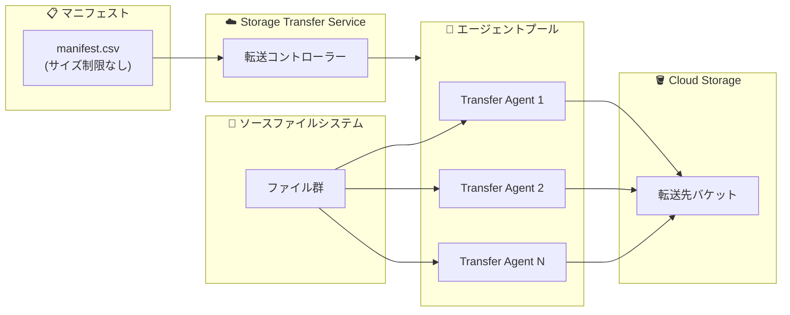

# Storage Transfer Service: エージェントベース転送のマニフェストファイルサイズ制限撤廃

**リリース日**: 2026-03-09

**サービス**: Storage Transfer Service

**機能**: エージェントベース転送におけるマニフェストファイルサイズ制限の撤廃

**ステータス**: GA

📊 [このアップデートのインフォグラフィックを見る](https://takech9203.github.io/google-cloud-news-summary/20260309-storage-transfer-service-manifest-limit-removed.html)

## 概要

Storage Transfer Service のエージェントベース転送において、マニフェストファイルのサイズ制限が撤廃された。マニフェストファイルとは、転送対象のファイルやオブジェクトのリストを CSV 形式で指定するファイルであり、特定のファイルのみを選択的に転送する際に使用される。

これまでエージェントベース転送 (ファイルシステム転送や S3 互換ストレージからの転送) では、マニフェストファイルのサイズが最大 1 GiB (約 100 万行) に制限されていた。今回のアップデートにより、エージェントレス転送と同様にサイズ制限なくマニフェストファイルを使用できるようになり、大規模なファイルリストを扱うデータ移行やバックアップワークフローが大幅に簡素化される。

**アップデート前の課題**

- エージェントベース転送のマニフェストファイルは最大 1 GiB (約 100 万行) に制限されていた
- 100 万件を超えるファイルを転送する場合、マニフェストを複数に分割して複数の転送ジョブを実行する必要があった
- マニフェストの分割・管理作業に追加の運用コストが発生していた
- エージェントレス転送にはサイズ制限がなく、エージェントベース転送との機能差があった

**アップデート後の改善**

- エージェントベース転送のマニフェストファイルサイズ制限が撤廃された
- 100 万件を超えるファイルリストも単一のマニフェストファイルで一括指定が可能になった
- マニフェスト分割の運用作業が不要になり、転送ジョブの管理が簡素化された
- エージェントレス転送とエージェントベース転送のマニフェスト機能が統一された

## アーキテクチャ図



エージェントベース転送では、マニフェストファイルで指定されたファイルリストに基づき、複数の Transfer Agent が並列にファイルを転送する。今回のアップデートにより、マニフェストファイルのサイズ制限がなくなり、任意の数のファイルを単一のマニフェストで指定できるようになった。

## サービスアップデートの詳細

### 主要機能

1. **マニフェストファイルサイズ制限の撤廃**
   - エージェントベース転送 (ファイルシステム転送、S3 互換ストレージからの転送) におけるマニフェストファイルの 1 GiB 制限が撤廃された
   - エージェントレス転送と同等に、制限なくマニフェストファイルを使用可能

2. **対象となる転送タイプ**
   - ファイルシステムから Cloud Storage への転送
   - Cloud Storage からファイルシステムへの転送
   - ファイルシステム間の転送
   - S3 互換ストレージから Cloud Storage への転送

3. **マニフェストの保存場所**
   - Cloud Storage バケットにアップロード (推奨)
   - ソースまたはデスティネーションのファイルシステムに配置
   - Cloud KMS による暗号化にも対応

## 技術仕様

### マニフェストファイルの仕様

| 項目 | 詳細 |
|------|------|
| ファイル形式 | CSV |
| 文字エンコーディング | UTF-8 |
| サイズ制限 (エージェントベース) | **なし** (以前は 1 GiB / 約 100 万行) |
| サイズ制限 (エージェントレス) | なし |
| 第 1 列 | ファイル名またはオブジェクト名 (相対パス) |
| 第 2 列 (オプション) | Cloud Storage のジェネレーション番号 |
| ワイルドカード | 非対応 |

### マニフェストファイルの形式例

```csv
dir1/subdir1/file1.txt
file2.txt
dir2/subdir1/file3.txt
```

カンマを含むファイル名はダブルクォートで囲む:

```csv
"doe,john.txt"
normal_file.txt
```

## 設定方法

### 前提条件

1. Storage Transfer Service のエージェントがインストール・設定済みであること
2. 転送先の Cloud Storage バケットに対する適切な IAM 権限が設定済みであること
3. マニフェストファイルを Cloud Storage に保存する場合、サービスエージェントに `storage.objects.get` 権限が付与されていること

### 手順

#### ステップ 1: マニフェストファイルの作成

```bash
# 転送対象ファイルのリストを CSV 形式で作成
cat > manifest.csv << 'EOF'
path/to/file1.txt
path/to/file2.txt
path/to/large_directory/file3.dat
EOF
```

#### ステップ 2: マニフェストファイルのアップロード

```bash
# Cloud Storage にマニフェストをアップロード
gcloud storage cp manifest.csv gs://my-manifest-bucket/
```

#### ステップ 3: マニフェストを使用した転送ジョブの作成

```bash
# gcloud CLI でマニフェストを指定した転送ジョブを作成
gcloud transfer jobs create \
  /source/directory \
  gs://destination-bucket \
  --source-agent-pool=projects/my-project/agentPools/my-pool \
  --manifest-file=gs://my-manifest-bucket/manifest.csv
```

## メリット

### ビジネス面

- **運用コストの削減**: マニフェスト分割や複数ジョブの管理が不要になり、大規模データ移行プロジェクトの運用負荷が低減する
- **移行プロジェクトの簡素化**: 数百万件以上のファイルを含むデータ移行でも、単一のマニフェストとジョブで管理可能

### 技術面

- **ワークフローの統一**: エージェントベースとエージェントレス転送のマニフェスト機能が同等になり、転送方式の選択がマニフェストの制約に左右されなくなった
- **自動化パイプラインの簡素化**: 上流システムが生成するファイルリストをそのままマニフェストとして使用でき、分割ロジックの実装が不要になった

## デメリット・制約事項

### 制限事項

- マニフェストファイルではワイルドカードを使用できない
- フォルダ名のみの指定 (ファイル名なし) は非対応
- 転送実行中はマニフェストファイルを変更しないこと (ロックを推奨)

### 考慮すべき点

- 非常に大きなマニフェストファイルを使用する場合、転送ジョブの初期化に時間がかかる可能性がある
- マニフェストに含まれるファイルは必ずしもリスト順に転送されるわけではない
- 転送先に既に存在するファイルは、上書きオプションが指定されていない限りスキップされる

## ユースケース

### ユースケース 1: 大規模オンプレミスデータセンターの移行

**シナリオ**: 500 万件のファイルを含むオンプレミスファイルサーバーを Cloud Storage へ移行する。移行対象ファイルのリストはデータ分類ツールにより CSV で出力される。

**実装例**:
```bash
# データ分類ツールが出力した大規模マニフェストをそのまま使用
gcloud transfer jobs create \
  /mnt/legacy-fileserver \
  gs://migration-destination \
  --source-agent-pool=projects/my-project/agentPools/migration-pool \
  --manifest-file=gs://manifest-bucket/full-migration-manifest.csv
```

**効果**: 以前は 5 つ以上のマニフェストに分割して個別に転送ジョブを管理する必要があったが、単一のジョブで完結するようになった

### ユースケース 2: データ処理パイプラインとの統合

**シナリオ**: ETL パイプラインが処理対象ファイルのリストを動的に生成し、Storage Transfer Service で Cloud Storage へ転送する。日次で数百万件のファイルが対象になる場合がある。

**効果**: パイプライン側でマニフェストのサイズを考慮した分割ロジックを実装する必要がなくなり、生成されたリストをそのまま転送ジョブに渡せるようになった

## 料金

Storage Transfer Service の料金体系は転送のタイプにより異なる。エージェントベース転送 (ファイルシステム転送) の場合、転送先に正常に到達したデータ量に対して課金される。詳細な料金については公式料金ページを参照のこと。

- [Storage Transfer Service 料金ページ](https://cloud.google.com/storage-transfer/pricing)

## 関連サービス・機能

- **Cloud Storage**: Storage Transfer Service の主要な転送先/転送元となるオブジェクトストレージサービス
- **Cloud Logging**: 転送ジョブの詳細ログを Cloud Logging で確認可能。転送の成功/失敗を監視できる
- **Cloud Monitoring**: 転送ジョブの進捗をリアルタイムで監視するための指標を提供
- **Cloud KMS**: マニフェストファイルを顧客管理の暗号鍵で暗号化可能
- **VPC Service Controls**: Storage Transfer Service と統合し、データ転送のセキュリティ境界を制御

## 参考リンク

- 📊 [インフォグラフィック](https://takech9203.github.io/google-cloud-news-summary/20260309-storage-transfer-service-manifest-limit-removed.html)
- [公式リリースノート](https://cloud.google.com/release-notes#March_09_2026)
- [マニフェストを使用した特定ファイルの転送](https://cloud.google.com/storage-transfer/docs/manifest)
- [エージェントベース転送の概要](https://cloud.google.com/storage-transfer/docs/managing-on-prem-agents)
- [Storage Transfer Service の概要](https://cloud.google.com/storage-transfer/docs/overview)
- [料金ページ](https://cloud.google.com/storage-transfer/pricing)

## まとめ

Storage Transfer Service のエージェントベース転送において、マニフェストファイルのサイズ制限 (1 GiB / 約 100 万行) が撤廃された。これにより、大規模なファイル移行やデータパイプラインにおいて、マニフェストの分割管理が不要になり、運用の簡素化が期待できる。エージェントベース転送でマニフェストを使用しているユーザーは、既存のワークフローの見直しを検討されたい。

---

**タグ**: #StorageTransferService #DataMigration #Manifest #AgentBasedTransfer #CloudStorage
