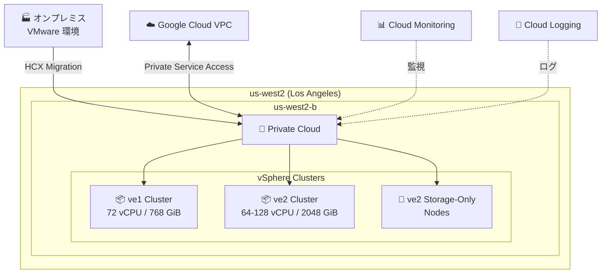

# Google Cloud VMware Engine: ve2 ノードタイプが us-west2 (Los Angeles) リージョンで利用可能に

**リリース日**: 2026-03-09

**サービス**: Google Cloud VMware Engine

**機能**: ve2 ノードタイプの us-west2 リージョン拡張

**ステータス**: 一般提供開始 (GA)

📊 [このアップデートのインフォグラフィックを見る](https://takech9203.github.io/google-cloud-news-summary/20260309-vmware-engine-ve2-us-west2.html)

## 概要

Google Cloud VMware Engine の次世代ノードタイプである ve2 が、Los Angeles, USA, North America (us-west2-b) リージョンで新たに利用可能になった。us-west2 リージョンはこれまで ve1 ノードタイプのみをサポートしていたが、今回のアップデートにより ve2 ノードファミリーも選択できるようになる。

ve2 ノードタイプは、ve1 と比較して大幅に強化されたコンピュート、メモリ、ストレージリソースを提供する。ve2 ノードは最大 128 vCPU、2,048 GiB メモリ、51.2 TB ストレージ (ve2-mega) を備え、より柔軟なサイジングオプション (small/standard/large/mega) を提供する。米国西海岸に拠点を持つ企業にとって、VMware ワークロードのモダナイゼーションにおける重要な選択肢が追加された。

**アップデート前の課題**

- us-west2 (Los Angeles) リージョンでは ve1-standard-72 ノードタイプのみが利用可能で、1 ノードあたり 72 vCPU、768 GiB メモリ、19.2 TB ストレージに制限されていた
- 大規模な VMware ワークロードを実行する場合、より多くのノードが必要となりコスト効率が低下する可能性があった
- 米国西海岸でより高いスペックのノードが必要な場合、他のリージョン (us-central1 や us-east4) を選択する必要があった

**アップデート後の改善**

- us-west2 リージョンで ve2 ノードタイプ (最大 128 vCPU、2,048 GiB メモリ) が利用可能になり、より大規模なワークロードに対応可能になった
- ve2 の豊富なバリエーション (small/standard/large/mega、64-128 vCPU) により、ワークロードに最適なサイズのノードを選択できるようになった
- ストレージオンリーノード (ve2-standard-so、ve2-mega-so など) も利用可能になり、コンピュートとストレージを独立してスケーリングできるようになった

## アーキテクチャ図



us-west2 リージョンの VMware Engine プライベートクラウドでは、ve1 と ve2 の両方のノードタイプでクラスターを構成でき、オンプレミスからの移行や Google Cloud VPC との統合が可能。

## サービスアップデートの詳細

### 主要機能

1. **ve2 ハイパーコンバージドノードタイプ**
   - 最大 128 vCPU、2,048 GiB メモリを搭載した高性能ベアメタルノード
   - small (12.8 TB)、standard (25.5 TB)、large (38.4 TB)、mega (51.2 TB) の 4 つのストレージティアから選択可能
   - 各ティアで 64/80/96/112/128 vCPU のバリエーションを提供 (合計 20 種類の HCI ノードタイプ)

2. **ve2 ストレージオンリーノードタイプ**
   - コンピュートリソースなしでストレージのみを追加可能
   - ve2-small-so (12.8 TB) から ve2-mega-so (51.2 TB) まで 4 種類
   - コンピュートとストレージを独立してスケーリングするユースケースに最適

3. **us-west2 リージョンでの ve2 利用**
   - ゾーン us-west2-b で利用可能
   - Standard および Single-Node プライベートクラウドタイプをサポート

## 技術仕様

### ve2 ノードタイプ一覧 (HCI)

| ストレージティア | vCPU 範囲 | メモリ (GiB) | ストレージ (TB) |
|-----------------|----------|-------------|---------------|
| ve2-small | 64 - 128 | 2,048 | 12.8 |
| ve2-standard | 64 - 128 | 2,048 | 25.5 |
| ve2-large | 64 - 128 | 2,048 | 38.4 |
| ve2-mega | 64 - 128 | 2,048 | 51.2 |

### ve1 との比較

| 項目 | ve1-standard-72 | ve2-standard-128 |
|------|----------------|-----------------|
| vCPU | 72 | 128 |
| メモリ | 768 GiB | 2,048 GiB |
| ストレージ | 19.2 TB | 25.5 TB |
| vCPU 選択肢 | 72 のみ | 64/80/96/112/128 |

## 設定方法

### 前提条件

1. Google Cloud プロジェクトで VMware Engine API が有効化されていること
2. 適切な IAM ロール (vmwareengine.admin) が付与されていること
3. ve2 ノードタイプの利用にはクォータの確認が必要

### 手順

#### ステップ 1: プライベートクラウドの作成

```bash
gcloud vmware private-clouds create my-private-cloud \
    --location=us-west2-b \
    --cluster=my-cluster \
    --node-count=3 \
    --node-type=ve2-standard-128
```

プライベートクラウドを us-west2-b ゾーンに ve2-standard-128 ノードタイプで作成する。最小ノード数は Standard プライベートクラウドの場合 3 ノード。

#### ステップ 2: ノードタイプの確認

```bash
gcloud vmware node-types list \
    --location=us-west2-b
```

利用可能なノードタイプの一覧を確認する。

## メリット

### ビジネス面

- **米国西海岸でのレイテンシ最適化**: Los Angeles リージョンを利用することで、米国西海岸の拠点からのレイテンシを最小化できる
- **柔軟なサイジング**: 20 種類の HCI ノードタイプから最適なサイズを選択でき、オーバープロビジョニングを削減できる

### 技術面

- **大幅なリソース強化**: ve1 比で最大 1.8 倍の vCPU、2.7 倍のメモリ、2.7 倍のストレージ (mega) を提供
- **独立したストレージスケーリング**: ストレージオンリーノードにより、コンピュートを追加せずにストレージ容量を拡張可能

## デメリット・制約事項

### 制限事項

- us-west2 では現時点で Stretched プライベートクラウドは記載がなく、Standard および Single-Node タイプのみサポート
- 混合ノードファミリー (ve1 と ve2 の混在プライベートクラウド) のサポートは us-west2 では現時点で明記されていない
- 各クラスター内のノードは同一タイプである必要がある (異なるノードタイプの混在は不可)

### 考慮すべき点

- 2025 年 10 月以降、Broadcom のライセンスモデル変更により、新規ノードは BYOL (Bring Your Own License) モデルでの VCF サブスクリプションが必要
- ve2 ノードタイプの利用にはリージョンごとのクォータ確認が必要な場合がある

## ユースケース

### ユースケース 1: 米国西海岸拠点の VMware 環境のクラウド移行

**シナリオ**: Los Angeles に本社を持つ企業が、オンプレミスの VMware 環境を Google Cloud に移行したい。大規模な SAP HANA やデータベースワークロードを実行しており、高メモリ・高ストレージのノードが必要。

**効果**: ve2-mega-128 (128 vCPU、2,048 GiB メモリ、51.2 TB ストレージ) を使用することで、大規模ワークロードを少ないノード数で実行でき、管理の複雑さとコストを削減できる。

### ユースケース 2: DR (災害復旧) サイトの構築

**シナリオ**: 米国東海岸 (us-east4) にプライマリサイトを持つ企業が、西海岸に DR サイトを構築したい。

**効果**: us-west2 で ve2 ノードを使用して DR サイトを構築し、HCX を利用したワークロードの移行・フェイルオーバーが可能。地理的に離れた 2 つのリージョンで冗長性を確保できる。

## 料金

VMware Engine の料金はノードタイプ、リージョン、およびコミットメントの種類により異なる。詳細な料金は Google Cloud の営業チームに問い合わせるか、料金ページを参照のこと。

Committed Use Discounts (CUD) を利用することで、1 年または 3 年のコミットメントに基づく割引を受けることが可能。ただし、ve1 SKU の 3 年 CUD は全リージョンで販売終了 (End-of-Sale) となっている点に注意。

## 利用可能リージョン

ve2 ノードタイプは、今回の us-west2 追加を含め、以下のリージョンで利用可能:

| リージョン | ゾーン | 備考 |
|-----------|--------|------|
| us-west2 (Los Angeles) | us-west2-b | **今回追加** |
| us-central1 (Iowa) | us-central1-a | 混合ノード対応 |
| us-east4 (North Virginia) | us-east4-a, us-east4-b | 混合ノード対応 |
| us-south1 (Dallas) | us-south1-b | 混合ノード対応 |
| northamerica-northeast1 (Montreal) | northamerica-northeast1-a | 混合ノード対応 |
| northamerica-northeast2 (Toronto) | northamerica-northeast2-a | - |
| europe-west2 (London) | europe-west2-a, europe-west2-b | 混合ノード対応 |
| europe-west3 (Frankfurt) | europe-west3-a, europe-west3-b | 混合ノード対応 |
| europe-west8 (Milan) | europe-west8-a, europe-west8-b | - |
| europe-west9 (Paris) | europe-west9-b | - |
| asia-northeast1 (Tokyo) | asia-northeast1-a | - |
| asia-northeast2 (Osaka) | asia-northeast2-a | - |
| australia-southeast1 (Sydney) | australia-southeast1-a, australia-southeast1-b | 混合ノード対応 |
| australia-southeast2 (Melbourne) | australia-southeast2-a, australia-southeast2-b | - |
| southamerica-east1 (Sao Paulo) | southamerica-east1-a, southamerica-east1-c | 混合ノード対応 |
| southamerica-west1 (Santiago) | southamerica-west1-a, southamerica-west1-b | 混合ノード対応 |
| me-central1 (Doha) | me-central1-a | - |
| me-central2 (Dammam) | me-central2-c | - |

## 関連サービス・機能

- **VMware HCX**: オンプレミスの VMware 環境から Google Cloud VMware Engine へのワークロード移行を支援するモビリティプラットフォーム
- **Cloud Monitoring / Cloud Logging**: VMware Engine プライベートクラウドのハードウェアヘルスおよび VMware 管理コンポーネントのステータス監視・ログ収集
- **VPC Service Controls**: VMware Engine のデータ漏洩防止および不正アクセス防止のためのセキュリティ境界の設定
- **Filestore / Google Cloud NetApp Volumes**: 外部 NFS データストアとしてコンピュートとは独立したストレージスケーリングを実現
- **Backup and DR Service**: VMware Engine プライベートクラウドのバックアップおよび災害復旧

## 参考リンク

- 📊 [インフォグラフィック](https://takech9203.github.io/google-cloud-news-summary/20260309-vmware-engine-ve2-us-west2.html)
- [公式リリースノート](https://cloud.google.com/release-notes#March_09_2026)
- [VMware Engine ノードタイプドキュメント](https://cloud.google.com/vmware-engine/docs/concepts-node-types)
- [VMware Engine リリースノート](https://cloud.google.com/vmware-engine/docs/release-notes)
- [VMware Engine 料金ページ](https://cloud.google.com/vmware-engine/pricing)

## まとめ

Google Cloud VMware Engine の ve2 ノードタイプが us-west2 (Los Angeles) リージョンで利用可能になったことで、米国西海岸のユーザーは最大 128 vCPU、2,048 GiB メモリの高性能ノードを活用できるようになった。これにより、大規模な VMware ワークロードのクラウド移行や DR サイト構築がより柔軟に行える。既存の us-west2 ユーザーは、ワークロード要件に応じて ve2 ノードタイプへの移行を検討することを推奨する。

---

**タグ**: #GoogleCloud #VMwareEngine #ve2 #us-west2 #LosAngeles #リージョン拡張 #ベアメタル #ハイブリッドクラウド
