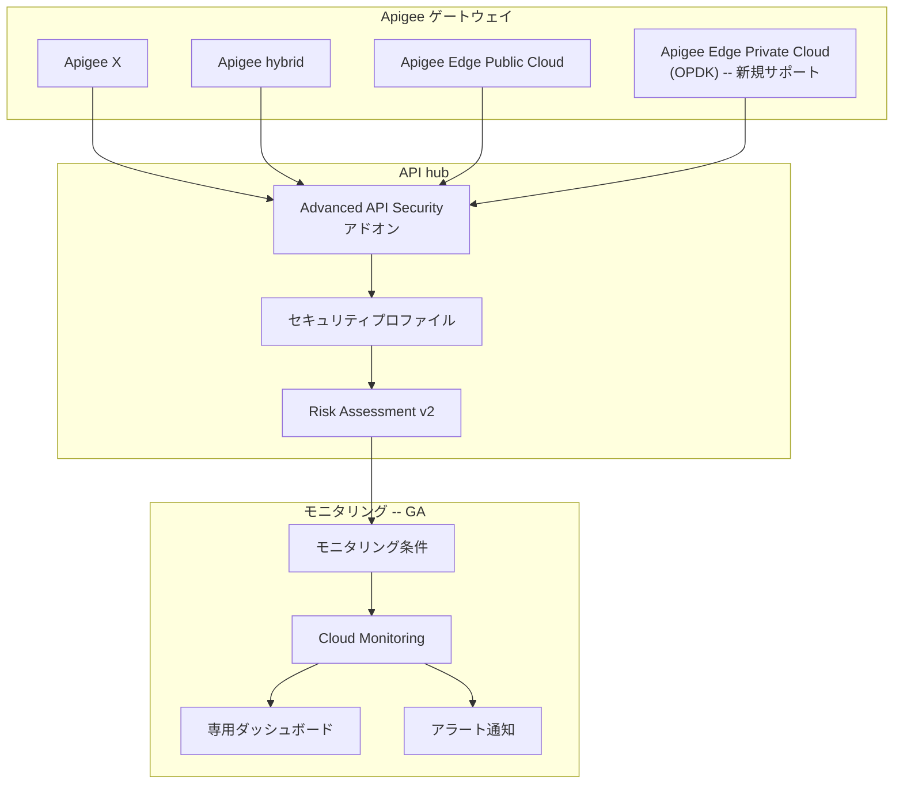

# Apigee Advanced API Security: セキュリティモニタリング条件の GA およびマルチゲートウェイ機能強化

**リリース日**: 2026-03-10

**サービス**: Apigee API hub / Apigee Advanced API Security

**機能**: セキュリティモニタリング条件の一般提供開始、マルチゲートウェイ対応強化、OPDK サポート追加

**ステータス**: GA (一般提供)

[このアップデートのインフォグラフィックを見る](https://takech9203.github.io/google-cloud-news-summary/20260310-apigee-security-monitoring-conditions-ga.html)

## 概要

Apigee Advanced API Security において、Risk Assessment v2 のモニタリング条件機能が一般提供 (GA) となりました。これにより、セキュリティプロファイルにゲートウェイリソースをマッピングし、Cloud Monitoring と連携してセキュリティスコアの時系列追跡やメトリクスベースのアラート通知が本番環境で安定的に利用可能になります。

同時に、API hub を通じた Advanced API Security のマルチゲートウェイプロジェクトにおいても、セキュリティモニタリング条件とアラートのサポートが追加されました。さらに、マルチゲートウェイのリスクアセスメントセキュリティプロファイルで Apigee Edge Private Cloud (OPDK) ゲートウェイタイプがサポートされ、オンプレミス環境のユーザーも統合的なセキュリティ管理が可能になりました。

これらのアップデートにより、複数の Apigee 組織やゲートウェイにまたがる API セキュリティの一元管理が大幅に強化され、エンタープライズ規模の API セキュリティ運用を効率化できます。

**アップデート前の課題**

- モニタリング条件機能はプレビュー段階であり、本番環境での利用にはサポートの制限があった
- マルチゲートウェイプロジェクトではセキュリティスコアの時系列監視やアラート通知ができなかった
- Apigee Edge Private Cloud (OPDK) 環境は API hub のマルチゲートウェイリスクアセスメントの対象外だった

**アップデート後の改善**

- Risk Assessment v2 のモニタリング条件が GA となり、本番環境で安定的に利用可能
- マルチゲートウェイプロジェクトで Cloud Monitoring 連携によるセキュリティスコアの追跡とアラートが可能
- OPDK ゲートウェイタイプがサポートされ、オンプレミス Apigee 環境も統合セキュリティ管理の対象に

## アーキテクチャ図



API hub の Advanced API Security が複数のゲートウェイタイプ (Apigee X、hybrid、Edge Public Cloud、OPDK) からセキュリティデータを収集し、Risk Assessment v2 のモニタリング条件を通じて Cloud Monitoring にメトリクスを発行する全体構成を示しています。

## サービスアップデートの詳細

### 主要機能

1. **Risk Assessment v2 モニタリング条件の GA**
   - セキュリティプロファイルにリソース (ゲートウェイ) をマッピングするモニタリング条件の作成・管理が一般提供となった
   - Cloud Monitoring がこのマッピングを使用して専用ダッシュボードを作成し、セキュリティスコアを時系列で追跡可能
   - メトリクスレベルに基づくアラート通知の設定が安定的にサポートされる
   - Terraform による構成管理にも対応 (`google_apigee_security_monitoring_condition` リソース)

2. **マルチゲートウェイプロジェクトでのモニタリング条件サポート**
   - API hub 経由の Advanced API Security マルチゲートウェイリスクアセスメント機能に、セキュリティモニタリング条件とアラートが追加
   - 複数の Apigee 組織・環境・ゲートウェイにまたがるセキュリティスコアを一元的に監視可能

3. **OPDK ゲートウェイタイプのサポート**
   - マルチゲートウェイのリスクアセスメントセキュリティプロファイルで Apigee Edge Private Cloud (OPDK) が対象に
   - オンプレミス環境の API もクラウドベースの統合セキュリティ管理に組み込み可能
   - サポート対象 OPDK バージョン: 4.52.02.xx 以降

4. **Abuse Detection のアップデート**
   - Advanced API Security Abuse Detection の更新版がリリース
   - API 不正利用の検出精度と機能が改善

## 技術仕様

### サポート対象ゲートウェイタイプ

| ゲートウェイタイプ | リスクアセスメント | モニタリング条件 |
|------|------|------|
| Apigee X | 対応 | 対応 |
| Apigee hybrid | 対応 | 対応 |
| Apigee Edge Public Cloud | 対応 | 対応 |
| Apigee Edge Private Cloud (OPDK) | 対応 (新規) | 対応 (新規) |

### モニタリング条件の主要パラメータ

| 項目 | 詳細 |
|------|------|
| メトリクス反映遅延 | 条件の作成・変更後、最大 5 分 |
| セキュリティスコアのデータ遅延 | 既存プロキシのスコア反映まで最大 6 時間 |
| ランタイムデータ遅延 | Analytics パイプライン経由で平均 15-20 分 |
| 構成管理 | Apigee UI、API、Terraform に対応 |

### モニタリング条件の API 設定例

```json
{
  "securityMonitoringCondition": {
    "name": "organizations/{org}/securityMonitoringConditions/{condition_id}",
    "displayName": "API Security Score Monitor",
    "securityProfileV2": "organizations/{org}/securityProfilesV2/{profile_id}",
    "scope": {
      "environmentRefs": [
        "organizations/{org}/environments/{env}"
      ]
    }
  }
}
```

## 設定方法

### 前提条件

1. Apigee 組織で Advanced API Security アドオンが有効であること
2. Risk Assessment v2 が利用可能であること
3. Cloud Monitoring API が有効であること
4. モニタリング条件の管理に必要な IAM ロールが付与されていること

### 手順

#### ステップ 1: Advanced API Security アドオンの有効化

```bash
# Subscription 組織の場合
gcloud alpha apigee organizations update ORG_NAME \
  --api-security-enabled
```

API hub でマルチゲートウェイを利用する場合は、API hub の Add-on management ページから Advanced API Security アドオンを有効にします。

#### ステップ 2: セキュリティプロファイルの作成

```bash
# カスタムセキュリティプロファイルの作成
curl -X POST \
  "https://apigee.googleapis.com/v1/organizations/ORG_NAME/securityProfilesV2" \
  -H "Authorization: Bearer $(gcloud auth print-access-token)" \
  -H "Content-Type: application/json" \
  -d '{
    "description": "Custom security profile for monitoring",
    "profileAssessmentConfigs": {
      "authorization": { "enabled": true },
      "cors": { "enabled": true },
      "threat": { "enabled": true },
      "mediation": { "enabled": true }
    }
  }'
```

#### ステップ 3: モニタリング条件の作成

Apigee UI の Risk Assessment ページからモニタリング条件を作成するか、API を使用します。

```bash
# モニタリング条件の作成
curl -X POST \
  "https://apigee.googleapis.com/v1/organizations/ORG_NAME/securityMonitoringConditions" \
  -H "Authorization: Bearer $(gcloud auth print-access-token)" \
  -H "Content-Type: application/json" \
  -d '{
    "displayName": "Production API Monitoring",
    "securityProfileV2": "organizations/ORG_NAME/securityProfilesV2/PROFILE_ID",
    "scope": {
      "environmentRefs": [
        "organizations/ORG_NAME/environments/prod"
      ]
    }
  }'
```

作成後、Cloud Monitoring にメトリクスが発行されるまで最大 5 分かかります。

#### ステップ 4: Cloud Monitoring アラートの設定

Cloud Monitoring コンソールまたは Apigee UI からアラートポリシーを設定し、セキュリティスコアが閾値を下回った場合に通知を受け取ります。

## メリット

### ビジネス面

- **統合的なセキュリティガバナンス**: 複数のゲートウェイタイプにまたがる API セキュリティを一元管理し、組織全体のセキュリティポリシーの一貫性を確保
- **プロアクティブなリスク管理**: セキュリティスコアの時系列監視とアラートにより、セキュリティ劣化を早期に検知し対応可能
- **オンプレミス環境の統合**: OPDK サポートにより、オンプレミスの Apigee Edge 環境もクラウドベースのセキュリティ管理に統合

### 技術面

- **Cloud Monitoring 連携**: Google Cloud の成熟した監視基盤を活用し、カスタムダッシュボードやアラートポリシーを柔軟に構成可能
- **Terraform サポート**: Infrastructure as Code によるモニタリング条件の管理が可能で、構成の再現性と自動化を実現
- **マルチゲートウェイ対応**: Apigee X、hybrid、Edge Public Cloud、OPDK の全ゲートウェイタイプを統一的に評価

## デメリット・制約事項

### 制限事項

- セキュリティスコアのデータ反映には最大 6 時間の遅延が発生する場合がある
- モニタリング条件の変更が Cloud Monitoring メトリクスに反映されるまで最大 5 分かかる
- VPC Service Controls (VPC-SC) が有効な環境では機能に制限がある可能性がある

### 考慮すべき点

- OPDK 環境の統合には API hub プラグインインスタンスの作成と Private Cloud コネクタのインストール・設定が必要
- Advanced API Security の料金はライセンスタイプにより異なるため、事前に Advanced API Security advisor ツールで費用を確認することを推奨
- マルチゲートウェイ機能のロールアウトは段階的に行われ、全ゾーンへの展開に 5 営業日以上かかる場合がある

## ユースケース

### ユースケース 1: マルチクラウド API セキュリティの一元監視

**シナリオ**: 大規模企業で Apigee X (クラウド)、Apigee hybrid (ハイブリッド)、Apigee Edge Private Cloud (オンプレミス) を併用しており、全環境の API セキュリティを統合的に監視したい。

**実装例**:
```bash
# 1. API hub で Advanced API Security を有効化
# 2. 各ゲートウェイタイプのプラグインインスタンスを作成
# 3. 統一セキュリティプロファイルを作成
# 4. モニタリング条件を作成して全ゲートウェイを対象に設定
# 5. Cloud Monitoring でアラートポリシーを設定

# Terraform での構成例
resource "google_apigee_security_monitoring_condition" "all_gateways" {
  org_id              = "my-org"
  display_name        = "All Gateways Monitoring"
  security_profile_v2 = google_apigee_security_profile_v2.default.id
}
```

**効果**: オンプレミスを含む全 API ゲートウェイのセキュリティスコアを単一のダッシュボードで監視し、セキュリティ基準の逸脱を即座に検知可能。

### ユースケース 2: セキュリティスコアの劣化検知と自動アラート

**シナリオ**: API プロキシのデプロイ時にセキュリティポリシーの設定漏れが発生し、セキュリティスコアが低下した場合に即座に通知を受け取りたい。

**効果**: セキュリティスコアの閾値ベースのアラートにより、設定ミスや不正トラフィックの増加を早期に検知し、MTTR (平均復旧時間) を短縮できる。

## 料金

Advanced API Security は有料アドオンとして提供されます。料金はライセンスタイプにより異なります。

### 料金例

| プラン | 料金 |
|--------|-----------------|
| Pay-as-you-go (Intermediate / Comprehensive 環境) | $350 / 100 万 API コール |
| Subscription | 契約内容に応じた価格設定 |

料金の詳細はライセンスタイプや利用形態により異なるため、[Advanced API Security advisor ツール](https://cloud.google.com/apigee/docs/apihub/advanced-api-security-advisor)で事前に確認することを推奨します。

## 利用可能リージョン

Apigee Advanced API Security は Apigee がサポートする全リージョンで利用可能です。ただし、新機能のロールアウトは段階的に行われ、全 Google Cloud ゾーンへの展開完了まで 5 営業日以上かかる場合があります。

## 関連サービス・機能

- **[Apigee API hub](https://cloud.google.com/apigee/docs/apihub/what-is-api-hub)**: API の検出、ガバナンス、一元管理を提供するプラットフォーム。マルチゲートウェイ Advanced API Security のベース
- **[Cloud Monitoring](https://cloud.google.com/monitoring/docs/monitoring-overview)**: モニタリング条件と連携し、セキュリティスコアの時系列追跡とアラート通知を提供
- **[Apigee Risk Assessment v2](https://cloud.google.com/apigee/docs/api-security/security-scores)**: API プロキシの構成を評価し、セキュリティスコアと改善推奨を提供
- **[Apigee Abuse Detection](https://cloud.google.com/apigee/docs/api-security/detection-rules)**: API への不正トラフィックを検出する機能。今回同時にアップデート版がリリース

## 参考リンク

- [インフォグラフィック](https://takech9203.github.io/google-cloud-news-summary/20260310-apigee-security-monitoring-conditions-ga.html)
- [公式リリースノート](https://docs.cloud.google.com/release-notes#March_10_2026)
- [Risk Assessment 概要と UI](https://cloud.google.com/apigee/docs/api-security/security-scores)
- [マルチゲートウェイのモニタリング条件管理](https://cloud.google.com/apigee/docs/apihub/manage-monitoring-conditions-multi-gateway)
- [マルチゲートウェイのセキュリティプロファイル管理](https://cloud.google.com/apigee/docs/apihub/manage-security-profiles-multi-gateway)
- [Advanced API Security 概要](https://cloud.google.com/apigee/docs/api-security)
- [Advanced API Security for multi-gateway projects](https://cloud.google.com/apigee/docs/apihub/advanced-api-security-multi-gateway)
- [料金ページ](https://cloud.google.com/apigee/pricing)

## まとめ

今回のアップデートにより、Apigee Advanced API Security の Risk Assessment v2 モニタリング条件が GA となり、マルチゲートウェイ環境での Cloud Monitoring 連携と OPDK サポートが追加されました。複数のゲートウェイタイプにまたがる API セキュリティの一元監視が本番環境で安定的に利用可能になったことで、エンタープライズ規模の API セキュリティ運用が大幅に効率化されます。Advanced API Security を利用中の組織は、モニタリング条件を設定してセキュリティスコアの継続的な追跡とアラートベースの運用を開始することを推奨します。

---

**タグ**: #Apigee #AdvancedAPISecurity #APIHub #RiskAssessment #MonitoringConditions #CloudMonitoring #OPDK #GA #APIセキュリティ #マルチゲートウェイ
