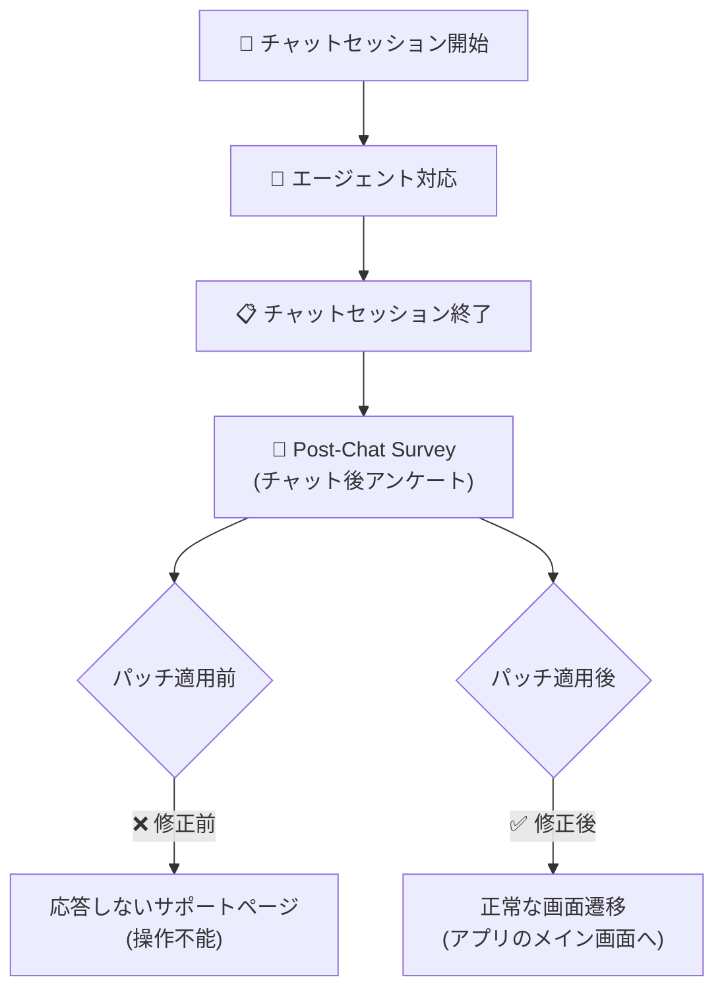

# Google Cloud CCaaS: iOS Mobile SDK パッチ (チャット終了後の画面遷移不具合修正)

**リリース日**: 2026-03-10

**サービス**: Google Cloud Contact Center as a Service (CCaaS) / CCAI Platform

**機能**: iOS Mobile SDK パッチ

**ステータス**: Fix

📊 [このアップデートのインフォグラフィックを見る](https://takech9203.github.io/google-cloud-news-summary/20260310-ccaas-mobile-sdk-ios-patch.html)

## 概要

Google Cloud Contact Center as a Service (CCaaS) の iOS Mobile SDK に対するバグ修正パッチがリリースされた。このパッチは、エンドユーザーがチャットセッションを終了し、チャット後アンケート (post-chat survey) を完了した後に、応答しないサポートページにリダイレクトされてしまう不具合を修正するものである。

CCAI Platform の iOS SDK は、iPhone や iPad アプリ内でエンドユーザーに音声およびチャットサポート体験を提供するためのツールキットである。今回の不具合は、チャットセッションのライフサイクル終了時の画面遷移処理に問題があり、ユーザーが操作不能な状態に陥るケースが発生していた。本パッチの適用により、チャット後アンケート完了後の画面遷移が正常に動作するようになる。

**アップデート前の課題**

- チャットセッション終了後、post-chat survey を完了すると応答しないサポートページに遷移してしまっていた
- エンドユーザーが操作不能な画面に誘導されることで、アプリの再起動が必要になるケースがあった
- カスタマーサポート体験の最終段階でユーザー体験が損なわれていた

**アップデート後の改善**

- チャット後アンケート完了後の画面遷移が正常に動作し、適切なページまたはアプリ画面に戻るようになった
- エンドユーザーが操作不能な状態に陥ることがなくなった
- チャットセッション終了から完了までの一連のフローが途切れなく完了するようになった

## アーキテクチャ図

チャットセッション終了後のフローを示している。修正前はアンケート完了後に応答しないページへ遷移していたが、修正後は正常にアプリのメイン画面へ戻る。

## サービスアップデートの詳細

### 修正内容

1. **Post-Chat Survey 完了後の画面遷移修正**
   - チャットセッション終了後に表示される post-chat survey を完了した際の画面遷移ロジックを修正
   - 応答しないサポートページへのリダイレクトが発生しなくなった

2. **対象プラットフォーム**
   - iOS SDK のみが対象 (Android SDK は本不具合の影響を受けない)
   - iOS 12.0 以降をサポートする既存のバージョン要件に変更なし

## 技術仕様

### 影響範囲

| 項目 | 詳細 |
|------|------|
| 対象 SDK | CCAI Platform iOS Mobile SDK |
| 修正種別 | バグ修正 (Bug Fix) |
| 影響を受ける機能 | チャットセッション終了後の post-chat survey フロー |
| 対象 OS | iOS 12.0 以降 |
| Android への影響 | なし |

### 関連する iOS SDK イベント

CCAI Platform iOS SDK では `NSNotificationCenter` を通じて以下のセッション関連イベントが通知される。今回の修正は、`UJETEventSessionDidEnd` の後に発生する画面遷移処理に関連している。

- `UJETEventSessionDidEnd`: セッション終了時に発行されるイベント
- `UJETEventPostSessionOptInDidSelected`: チャット後アンケートでの選択イベント
- `UJETEventSdkDidTerminate`: SDK 終了時のイベント

## メリット

### ビジネス面

- **カスタマー体験の改善**: チャットサポート利用後のユーザー体験が向上し、サポート全体の満足度改善に寄与する
- **サポート問い合わせの削減**: 操作不能状態に陥ったユーザーからの二次的な問い合わせが減少する

### 技術面

- **安定性の向上**: チャットセッションのライフサイクル全体を通じた画面遷移の信頼性が向上した
- **SDK の品質改善**: iOS SDK の不具合が解消され、アプリ全体の安定性に寄与する

## 関連サービス・機能

- **CCAI Platform Web SDK**: Web 版の SDK。同様のチャットサポート機能を Web サイト上で提供する
- **CCAI Platform Android SDK**: Android 版の SDK。本パッチの対象外だが、同等のチャット機能を提供する
- **CCAI Platform SmartActions**: チャット中にユーザー認証や写真リクエストなどを実行する機能。本パッチとは直接関係しないが、iOS SDK の主要機能の一つ

## 参考リンク

- 📊 [インフォグラフィック](https://takech9203.github.io/google-cloud-news-summary/20260310-ccaas-mobile-sdk-ios-patch.html)
- [公式リリースノート](https://cloud.google.com/release-notes#March_10_2026)
- [CCAI Platform iOS SDK ガイド](https://cloud.google.com/contact-center/ccai-platform/docs/ios-sdk-guide)
- [CCAI Platform Mobile SDK 概要](https://cloud.google.com/contact-center/ccai-platform/docs/mobileSDK-overview)
- [CCAI Platform リリースノート](https://cloud.google.com/contact-center/ccai-platform/docs/release-notes)

## まとめ

今回のパッチは、CCAI Platform iOS SDK における post-chat survey 完了後の画面遷移不具合を修正するものである。チャットサポートを iOS アプリに組み込んでいる企業は、エンドユーザー体験の改善のため速やかに SDK のアップデートを適用することを推奨する。影響範囲は iOS SDK のみに限定されており、Android SDK や Web SDK には影響しない。

---

**タグ**: #CCaaS #CCAI-Platform #iOS #MobileSDK #BugFix #ChatSupport #PostChatSurvey
