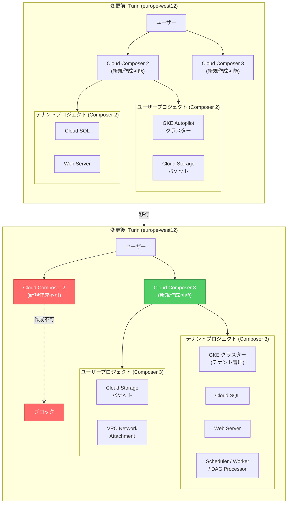

# Cloud Composer: Turin (europe-west12) リージョンにおける Cloud Composer 3 への移行

**リリース日**: 2026-03-10

**サービス**: Cloud Composer

**機能**: Turin リージョンでの Cloud Composer 2 新規作成の終了と Cloud Composer 3 専用化

**ステータス**: Announcement

[このアップデートのインフォグラフィックを見る](https://takech9203.github.io/google-cloud-news-summary/20260310-cloud-composer-turin-composer3-migration.html)

## 概要

Google Cloud は、Turin (europe-west12) リージョンにおいて Cloud Composer 2 環境の新規作成を終了し、同リージョンを Cloud Composer 3 専用に切り替えることを発表しました。今後、Turin リージョンで新しい Cloud Composer 環境を作成する場合は、Cloud Composer 3 のみが利用可能となります。

Cloud Composer 3 は、Cloud Composer の最新メジャーバージョンであり、簡素化されたネットワーク設定、テナントプロジェクトでのクラスター管理、CeleryKubernetes Executor の採用など、多くのアーキテクチャ改善が含まれています。この変更は、Google Cloud が段階的に Cloud Composer 3 への移行を推進している取り組みの一環であり、Turin リージョンがその先行リージョンとなります。

既存の Cloud Composer 2 環境は引き続き動作しますが、新規作成はできなくなるため、Turin リージョンのユーザーは Cloud Composer 3 への移行を計画する必要があります。

**アップデート前の課題**

- Turin (europe-west12) リージョンでは Cloud Composer 2 と Cloud Composer 3 の両方で環境を作成できたが、バージョン管理の複雑さがあった
- Cloud Composer 2 では環境のクラスターがユーザープロジェクトに GKE Autopilot として展開され、ネットワーク設定が複雑になる場合があった
- Cloud Composer 2 では Service Agent アカウントに追加の権限が必要だった

**アップデート後の改善**

- Turin リージョンでは Cloud Composer 3 のみが新規作成可能となり、バージョン選択がシンプルになった
- Cloud Composer 3 のテナントプロジェクトベースのアーキテクチャにより、インフラストラクチャ管理が簡素化される
- 簡素化されたネットワーク設定により、Private IP と Public IP を既存環境で切り替え可能になった

## アーキテクチャ図



Cloud Composer 2 ではユーザープロジェクトに GKE クラスターが展開されていましたが、Cloud Composer 3 ではクラスターを含む全ての Airflow コンポーネントがテナントプロジェクトで管理されます。Turin リージョンでは今後 Cloud Composer 3 のみが新規作成可能です。

## サービスアップデートの詳細

### 主要機能

1. **Turin リージョンでの Cloud Composer 2 新規作成の終了**
   - 2026年3月10日以降、europe-west12 (Turin) リージョンでは Cloud Composer 2 環境を新規作成できなくなる
   - 既存の Cloud Composer 2 環境は引き続き動作する

2. **Cloud Composer 3 専用リージョンへの切り替え**
   - Turin リージョンで新しい Composer 環境を作成する場合は Cloud Composer 3 を使用する必要がある
   - Cloud Composer 3 のアーキテクチャにより、管理の簡素化と運用効率の向上が期待できる

3. **移行パスの提供**
   - Cloud Composer 2 から Cloud Composer 3 へのサイドバイサイド移行がサポートされている
   - 移行スクリプトまたはスナップショットを使用した2つの移行方法が利用可能

## 技術仕様

### Cloud Composer 2 と Cloud Composer 3 の主な違い

| 項目 | Cloud Composer 2 | Cloud Composer 3 |
|------|-----------------|-----------------|
| クラスター管理 | ユーザープロジェクトに GKE Autopilot を展開 | テナントプロジェクトで管理 (ユーザープロジェクトに展開されない) |
| Airflow Executor | Celery Executor | CeleryKubernetes Executor |
| ネットワーク設定 | Private Service Connect | 簡素化されたネットワーク設定 (Public/Private IP の切り替えが可能) |
| DAG Processor | Scheduler に統合 | 独立したコンポーネントとして分離 |
| Airflow バージョン | Airflow 2 | Airflow 2、Airflow 3 (Preview) |
| Service Agent 権限 | 追加の権限が必要 | 追加の権限が不要 |
| データベース保持ポリシー | 未対応 | サポート済み |
| イメージバージョン形式 | composer-2.b.c-airflow-x.y.z | composer-3-airflow-x.y.z-build.t |

### 移行方法の比較

| 移行方法 | 説明 | 適用条件 |
|----------|------|----------|
| 移行スクリプト | Python スクリプトによる自動化された移行 | Cloud Composer 2 から Cloud Composer 3 への移行 |
| スナップショット | 環境スナップショットを使用したサイドバイサイド移行 | Cloud Composer 2 バージョン 2.0.9 以降 |

## 設定方法

### 前提条件

1. Cloud Composer 2 環境がバージョン 2.0.9 以降であること (スナップショットを使用する場合)
2. Airflow データベースのサイズが 20 GB 以下であること
3. /dags、/plugins、/data フォルダ内のオブジェクト数が 100,000 未満であること
4. gcloud CLI と Python 3.8 以降がインストールされていること

### 手順

#### ステップ 1: 互換性チェックの実行

```bash
# Cloud Composer 2 環境のアップグレードチェックを実行
gcloud composer environments check-upgrade \
  --location europe-west12 \
  --environment COMPOSER_2_ENV_NAME \
  --image-version composer-3-airflow-2.10.2-build.latest
```

Cloud Composer 2 の環境設定が Cloud Composer 3 と互換性があるかを確認します。ブロッキングの競合がある場合は、移行前に解決してください。

#### ステップ 2: 移行スクリプトのダウンロードと実行

```bash
# 移行スクリプトをダウンロード
curl -O https://raw.githubusercontent.com/GoogleCloudPlatform/python-docs-samples/main/composer/tools/composer_migrate.py

# ドライランで移行パラメータを確認
python3 composer_migrate.py \
  --project PROJECT_ID \
  --location europe-west12 \
  --source_environment COMPOSER_2_ENV \
  --target_environment COMPOSER_3_ENV \
  --target_airflow_version 2.10.2 \
  --dry_run

# 移行を実行
python3 composer_migrate.py \
  --project PROJECT_ID \
  --location europe-west12 \
  --source_environment COMPOSER_2_ENV \
  --target_environment COMPOSER_3_ENV \
  --target_airflow_version 2.10.2
```

移行スクリプトは、Cloud Composer 2 環境の設定を取得し、対応する Cloud Composer 3 環境を自動的に作成します。DAG の一時停止、スナップショットの保存と読み込み、DAG の再開も自動で行われます。

#### ステップ 3: 移行後の確認

```bash
# 新しい Cloud Composer 3 環境の状態を確認
gcloud composer environments describe COMPOSER_3_ENV \
  --location europe-west12

# DAG の実行状態を確認
gcloud composer environments run COMPOSER_3_ENV \
  --location europe-west12 \
  dags list
```

移行が完了したら、DAG が正常に動作していることを確認してください。

## メリット

### ビジネス面

- **インフラストラクチャ管理の簡素化**: Cloud Composer 3 ではクラスターがテナントプロジェクトで管理されるため、ユーザーが GKE クラスターを直接管理する必要がなくなり、運用負荷が軽減される
- **最新機能へのアクセス**: Airflow 3 (Preview) のサポート、データベース保持ポリシー、DAG Processor の独立化など、最新の機能を利用できる

### 技術面

- **簡素化されたネットワーク設定**: Private IP と Public IP を既存の環境で切り替え可能になり、ネットワーク構成の柔軟性が向上する
- **CeleryKubernetes Executor**: Celery Executor と Kubernetes Executor の長所を組み合わせた Executor により、タスク実行の効率が向上する
- **追加権限の不要化**: Cloud Composer Service Agent に追加の権限が不要となり、セキュリティ設定がシンプルになる

## デメリット・制約事項

### 制限事項

- Cloud Composer 2 から Cloud Composer 3 へのインプレースアップグレードはサポートされていない。サイドバイサイド移行のみが可能
- 移行スクリプトは同一リージョン・同一プロジェクトでのみ Cloud Composer 3 環境を作成可能
- スナップショットの読み込みは同一バージョンまたはより新しいバージョンの Airflow にのみ対応
- KubernetesPodOperator でカスタムサービスアカウントを使用している場合、Cloud Composer 3 ではサポートされないため代替手段が必要
- Pod affinity の設定は Cloud Composer 3 では利用不可

### 考慮すべき点

- 既存の Cloud Composer 2 環境は引き続き動作するが、新規作成ができなくなるため、スケールアウトの計画に影響する可能性がある
- Cloud Composer 3 では一部のプリインストールパッケージのバージョンが異なるため、DAG の互換性を事前に検証する必要がある
- 移行時に Airflow データベースサイズが 20 GB を超えている場合は、事前にデータベースのクリーンアップが必要

## ユースケース

### ユースケース 1: 既存の Cloud Composer 2 環境からの計画的移行

**シナリオ**: Turin リージョンで Cloud Composer 2 を運用しているチームが、新規環境の作成制限に対応するため、計画的に Cloud Composer 3 へ移行する

**実装例**:
```bash
# 1. 互換性チェック
gcloud composer environments check-upgrade \
  --location europe-west12 \
  --environment my-composer2-env \
  --image-version composer-3-airflow-2.10.2-build.latest

# 2. 移行スクリプトで自動移行
python3 composer_migrate.py \
  --project my-project \
  --location europe-west12 \
  --source_environment my-composer2-env \
  --target_environment my-composer3-env \
  --target_airflow_version 2.10.2
```

**効果**: 移行スクリプトにより、DAG、設定、環境変数が自動的に引き継がれ、最小限のダウンタイムで Cloud Composer 3 に移行できる

### ユースケース 2: 新規プロジェクトでの Cloud Composer 3 環境構築

**シナリオ**: Turin リージョンで新しいデータパイプラインプロジェクトを開始する際に、最初から Cloud Composer 3 環境を構築する

**効果**: Cloud Composer 3 の簡素化されたネットワーク設定とテナントプロジェクトベースのアーキテクチャにより、環境構築が迅速に完了し、インフラストラクチャの管理負荷が軽減される

## 料金

Cloud Composer 3 は Cloud Composer 2 とは異なる料金モデルを採用しています。詳細な料金情報は [Cloud Composer の料金ページ](https://cloud.google.com/composer/pricing) を参照してください。

## 利用可能リージョン

Cloud Composer 3 は以下のヨーロッパリージョンで利用可能です (一部抜粋):

| リージョン | ロケーション | Cloud Composer 3 |
|-----------|-------------|-----------------|
| europe-west1 | ベルギー | 対応 |
| europe-west2 | ロンドン | 対応 |
| europe-west3 | フランクフルト | 対応 |
| europe-west4 | オランダ | 対応 |
| europe-west6 | チューリッヒ | 対応 |
| europe-west8 | ミラノ | 対応 |
| europe-west9 | パリ | 対応 |
| europe-west10 | ベルリン | 対応 |
| europe-west12 | **トリノ (Cloud Composer 3 専用)** | 対応 |
| europe-north1 | フィンランド | 対応 |
| europe-central2 | ワルシャワ | 対応 |
| europe-southwest1 | マドリード | 対応 |

今回の変更により、Turin (europe-west12) は Cloud Composer 3 専用リージョンとなりました。

## 関連サービス・機能

- **Google Kubernetes Engine (GKE)**: Cloud Composer 2 ではユーザープロジェクトに GKE Autopilot クラスターが展開されるが、Cloud Composer 3 ではテナントプロジェクトで管理される
- **Cloud SQL**: Airflow メタデータデータベースとして使用され、Cloud Composer 3 ではテナントプロジェクトでホストされる
- **Cloud Storage**: 環境のバケットとして DAG、プラグイン、データ、ログを格納。Cloud Composer 2/3 共にユーザープロジェクトに配置される
- **Cloud Logging / Cloud Monitoring**: Cloud Composer 3 環境のログとメトリクスの監視に使用される

## 参考リンク

- [インフォグラフィック](https://takech9203.github.io/google-cloud-news-summary/20260310-cloud-composer-turin-composer3-migration.html)
- [公式リリースノート](https://cloud.google.com/release-notes#March_10_2026)
- [Cloud Composer バージョニング概要](https://cloud.google.com/composer/docs/composer-versioning-overview)
- [Cloud Composer 2 から Cloud Composer 3 への移行 (スナップショット)](https://cloud.google.com/composer/docs/composer-2/migrate-composer-3)
- [Cloud Composer 2 から Cloud Composer 3 への移行 (スクリプト)](https://cloud.google.com/composer/docs/composer-2/migrate-composer-3-script)
- [Cloud Composer 3 環境アーキテクチャ](https://cloud.google.com/composer/docs/composer-3/environment-architecture)
- [料金ページ](https://cloud.google.com/composer/pricing)

## まとめ

Turin (europe-west12) リージョンにおける Cloud Composer 2 の新規作成終了は、Google Cloud が Cloud Composer 3 への移行を段階的に推進していることを示す重要なアナウンスです。既存の Cloud Composer 2 環境を運用しているユーザーは、移行スクリプトまたはスナップショットを使用した Cloud Composer 3 への計画的な移行を検討することを推奨します。Cloud Composer 3 はテナントプロジェクトベースのアーキテクチャ、簡素化されたネットワーク設定、CeleryKubernetes Executor など多くの改善を含んでおり、移行により運用効率の向上が期待できます。

---

**タグ**: #CloudComposer #CloudComposer3 #Migration #europe-west12 #Turin #Airflow #Orchestration #RegionUpdate
