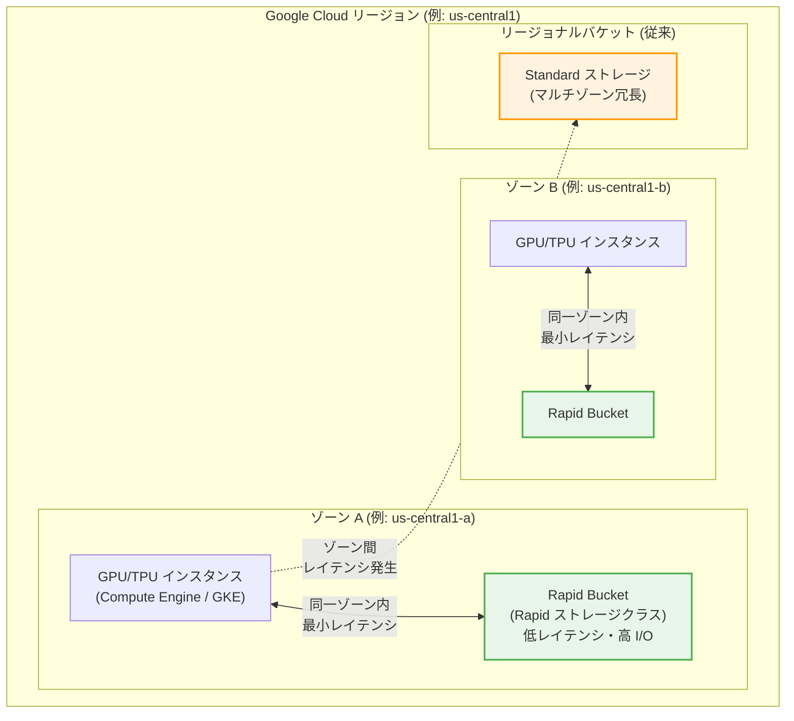

# Cloud Storage: Rapid Bucket が一般提供 (GA) 開始

**リリース日**: 2026-03-10

**サービス**: Cloud Storage

**機能**: Rapid Bucket (Rapid ストレージクラス / ゾーナルバケット)

**ステータス**: GA

📊 [このアップデートのインフォグラフィックを見る](https://takech9203.github.io/google-cloud-news-summary/20260310-cloud-storage-rapid-bucket-ga.html)

## 概要

Cloud Storage の新しいバケットタイプである Rapid Bucket が一般提供 (GA) になりました。Rapid Bucket は、ゾーン (zone) をバケットのロケーションとして定義することで、Rapid ストレージクラスにオブジェクトを格納できる新しいアーキテクチャです。従来のリージョナルバケットが複数のアベイラビリティゾーンにまたがってデータを冗長化するのに対し、Rapid Bucket は単一ゾーン内にデータを配置することで、ストレージとコンピュートリソース間のデータアクセスと I/O パフォーマンスを最適化します。

Rapid Bucket は、AI/ML の大規模トレーニングや高スケールデータ分析など、データインテンシブなワークロードに最適化されています。GPU や TPU などのアクセラレータと同一ゾーンにストレージを配置することで、ゾーン間ネットワークのレイテンシを排除し、コンピュートリソースの「グッドプット」(有効スループット) を最大化できます。

対象ユーザーは、大規模な AI/ML トレーニングジョブや高スループットが必要なデータ分析パイプラインを運用している開発者、データエンジニア、ML エンジニアです。

**アップデート前の課題**

従来の Cloud Storage では、最もパフォーマンスの高いリージョナルバケットでも、データは複数のアベイラビリティゾーンに分散して格納されていました。

- リージョナルバケットはゾーン間レプリケーションにより高い耐久性を提供するが、ゾーン間のネットワークレイテンシ (ミリ秒オーダー) がボトルネックとなり、AI/ML ワークロードの GPU/TPU 利用率が低下する場合があった
- 高スループットを実現するためには Anywhere Cache の追加設定や Cloud Storage FUSE のチューニングが必要で、構成が複雑になりがちだった
- ストレージとコンピュートを厳密に同一ゾーンに配置する手段がなく、I/O パフォーマンスの最適化に限界があった

**アップデート後の改善**

Rapid Bucket の GA により、以下の改善が実現しました。

- ゾーン単位でバケットを作成できるようになり、コンピュートリソースと同一ゾーンにストレージを配置してゾーン間レイテンシを排除できるようになった
- Rapid ストレージクラスにより、データインテンシブなワークロード向けに I/O パフォーマンスが最適化された
- Anywhere Cache のようなキャッシュレイヤーを別途構成する必要なく、ネイティブに高速なデータアクセスが可能になった

## アーキテクチャ図



Rapid Bucket はゾーン単位で作成され、同一ゾーン内のコンピュートリソースとの間でゾーン間ネットワークを介さない最小レイテンシのデータアクセスを実現します。従来のリージョナルバケットはマルチゾーン冗長性を持つ代わりに、ゾーン間のレイテンシが発生します。

## サービスアップデートの詳細

### 主要機能

1. **ゾーナルバケット (Zonal Bucket)**
   - ゾーンをロケーションとして指定してバケットを作成する新しいバケットタイプ
   - 単一ゾーン内にデータを格納することで、コンピュートとストレージのコロケーションを実現
   - 従来のリージョン・デュアルリージョン・マルチリージョンに加えた新しいロケーションタイプ

2. **Rapid ストレージクラス**
   - ゾーナルバケット専用の新しいストレージクラス
   - データアクセスと I/O パフォーマンスをデータインテンシブなワークロード向けに最適化
   - AI/ML トレーニング、推論、高スケールデータ分析に最適

3. **AI/ML ワークロードとの統合**
   - GPU/TPU インスタンスと同一ゾーンにストレージを配置可能
   - Cloud Storage FUSE や Anywhere Cache との併用によりさらなるパフォーマンス向上が可能
   - AI ゾーンとの組み合わせにより、エンドツーエンドの AI/ML パイプラインを最適化

## 技術仕様

### バケットタイプの比較

| 項目 | Rapid Bucket (ゾーナル) | リージョナルバケット | デュアルリージョンバケット |
|------|------------------------|---------------------|--------------------------|
| ロケーション | 単一ゾーン | リージョン (複数ゾーン) | 2 つのリージョン |
| ストレージクラス | Rapid | Standard / Nearline / Coldline / Archive | Standard / Nearline / Coldline / Archive |
| データ冗長性 | ゾーン内ローカル冗長 | ゾーン間冗長 (2 ゾーン以上) | リージョン間冗長 |
| 年間耐久性 | 99.999999999% (11 9's) | 99.999999999% (11 9's) | 99.999999999% (11 9's) |
| ゾーン障害時 | データが利用不可または喪失の可能性 | 自動フェイルオーバー | 自動フェイルオーバー |
| I/O パフォーマンス | 最適化 (最低レイテンシ) | 標準 | 標準 |
| 適したワークロード | AI/ML、高スケール分析 | 汎用、バックアップ | DR、地理分散 |

### 可用性と耐久性の注意事項

ゾーナルバケットのデータはローカル冗長ストレージとして格納されます。ホスト、ラック、ドライブの障害に対しては 99.999999999% (11 9's) の年間耐久性を提供しますが、アベイラビリティゾーン全体の障害が発生した場合、データが利用できなくなるか永久に失われる可能性があります。そのため、再作成可能なデータや一時的なデータに最も適しています。

### gcloud CLI でのバケット作成

```bash
# Rapid Bucket (ゾーナルバケット) の作成
gcloud storage buckets create gs://my-rapid-bucket \
    --location=us-central1-a \
    --default-storage-class=RAPID
```

## 設定方法

### 前提条件

1. Google Cloud プロジェクトが作成済みであること
2. Cloud Storage API が有効化されていること
3. 適切な IAM 権限 (`storage.buckets.create`) が付与されていること
4. `gcloud` CLI が最新バージョンに更新されていること

### 手順

#### ステップ 1: ゾーンの選択

```bash
# 利用可能なゾーンを確認
gcloud compute zones list --filter="region:us-central1"
```

コンピュートリソース (GPU/TPU インスタンス) と同一のゾーンを選択してください。AI ゾーンを使用する場合は、対応するゾーンを確認してください。

#### ステップ 2: Rapid Bucket の作成

```bash
# ゾーナルバケットを作成 (Rapid ストレージクラス)
gcloud storage buckets create gs://my-ml-training-data \
    --location=us-central1-a \
    --default-storage-class=RAPID
```

ゾーン名をロケーションとして指定し、ストレージクラスに `RAPID` を設定します。

#### ステップ 3: データのアップロードとコンピュートとの連携

```bash
# トレーニングデータのアップロード
gcloud storage cp -r ./training-data/ gs://my-ml-training-data/

# Cloud Storage FUSE でマウントして使用 (オプション)
gcsfuse my-ml-training-data /mnt/training-data
```

GPU/TPU インスタンスから直接 Rapid Bucket にアクセスするか、Cloud Storage FUSE を使用してローカルファイルシステムとしてマウントできます。

## メリット

### ビジネス面

- **GPU/TPU 利用率の最大化**: ストレージとコンピュートのコロケーションにより、アクセラレータのアイドル時間を最小化し、高価な GPU/TPU リソースの投資対効果を最大化する
- **AI/ML パイプラインの高速化**: データ読み込みのボトルネックを解消することで、トレーニング時間の短縮とモデル開発サイクルの加速を実現する
- **インフラ構成の簡素化**: キャッシュレイヤーの追加設定が不要になるケースがあり、運用の複雑性を低減できる

### 技術面

- **最小レイテンシのデータアクセス**: 同一ゾーン内のストレージアクセスにより、ゾーン間ネットワークのレイテンシを排除できる
- **I/O スループットの最適化**: Rapid ストレージクラスはデータインテンシブなワークロード向けに I/O パフォーマンスが最適化されている
- **既存ツールとの互換性**: Cloud Storage FUSE、クライアントライブラリ、gsutil など既存の Cloud Storage ツールとシームレスに連携可能

## デメリット・制約事項

### 制限事項

- データはゾーン内でのみローカル冗長化されるため、ゾーン障害時にデータが利用不可または喪失する可能性がある
- リージョナルバケットのようなゾーン間の自動フェイルオーバーは提供されない
- Rapid ストレージクラスはゾーナルバケット専用であり、既存のリージョナルバケットには適用できない

### 考慮すべき点

- 重要なデータ (モデルのチェックポイント、最終成果物など) は別途リージョナルバケットにバックアップすることが推奨される
- 推奨アーキテクチャとして、リージョナルバケットを「コールドストレージレイヤー」(データの正本)、Rapid Bucket を「パフォーマンスレイヤー」(アクティブなジョブ用) とする階層型構成が公式ドキュメントで言及されている
- 利用可能なゾーンが限定されている可能性があり、特に AI ゾーンへのアクセスには許可リストへの登録が必要な場合がある

## ユースケース

### ユースケース 1: 大規模 AI/ML モデルトレーニング

**シナリオ**: 数百 GPU を使用した大規模言語モデル (LLM) のトレーニングにおいて、数テラバイトのトレーニングデータセットに繰り返しアクセスする。ゾーン間レイテンシがデータ読み込みのボトルネックとなり、GPU 利用率が低下している。

**実装例**:
```bash
# 1. トレーニング用の Rapid Bucket を GPU と同一ゾーンに作成
gcloud storage buckets create gs://llm-training-data \
    --location=us-central1-a \
    --default-storage-class=RAPID

# 2. リージョナルバケット (正本) からトレーニングデータをコピー
gcloud storage cp -r gs://my-regional-bucket/datasets/ gs://llm-training-data/

# 3. GPU インスタンスから Cloud Storage FUSE でマウント
gcsfuse llm-training-data /mnt/training-data
```

**効果**: ゾーン間レイテンシの排除により GPU のデータ待機時間が大幅に短縮され、トレーニングジョブ全体の完了時間が改善される。

### ユースケース 2: リアルタイムデータ分析パイプライン

**シナリオ**: 高スケールなデータ分析パイプラインで、Dataflow や Spark ジョブが大量の中間データを Cloud Storage に読み書きする。同一ゾーンにコンピュートとストレージを配置して I/O パフォーマンスを最大化したい。

**効果**: 中間データの読み書きにおけるレイテンシが低減し、パイプライン全体のスループットが向上する。一時的な中間データはゾーン冗長性が不要なため、Rapid Bucket の特性と合致する。

## 料金

Rapid Bucket の料金は、Rapid ストレージクラスの料金体系に基づきます。詳細な料金はゾーナルバケットのロケーション (ゾーン) によって異なります。一般的に、ゾーン内のローカル冗長ストレージはリージョナルストレージよりもレプリケーションコストが不要なため、ストレージ単価は異なる可能性があります。

### 料金例

| 項目 | 詳細 |
|------|------|
| ストレージ料金 | Rapid ストレージクラスの料金が適用 (ゾーンにより異なる) |
| ネットワーク料金 | 同一ゾーン内のデータアクセスは無料 |
| オペレーション料金 | Cloud Storage 標準のオペレーション料金が適用 |
| レプリケーション料金 | ゾーナルバケットのためレプリケーション料金は不要 |

最新の料金情報は [Cloud Storage の料金ページ](https://cloud.google.com/storage/pricing) を参照してください。

## 利用可能リージョン

Rapid Bucket は特定のゾーンで利用可能です。AI ゾーン (例: us-central1-ai1a、us-south1-ai1b) での利用が特に推奨されますが、AI ゾーンへのアクセスには許可リストへの登録が必要な場合があります。利用可能なゾーンの最新情報は [Cloud Storage のロケーションページ](https://cloud.google.com/storage/docs/locations) を参照してください。

## 関連サービス・機能

- **[Anywhere Cache](https://cloud.google.com/storage/docs/anywhere-cache)**: SSD ベースのゾーナル読み取りキャッシュ。リージョナルバケットのパフォーマンス向上に使用。Rapid Bucket と補完的な関係
- **[Cloud Storage FUSE](https://cloud.google.com/storage/docs/gcs-fuse)**: Cloud Storage バケットをローカルファイルシステムとしてマウントするアダプタ。Rapid Bucket と併用可能
- **[AI ゾーン](https://cloud.google.com/compute/docs/regions-zones/ai-zones)**: AI/ML ワークロード向けに最適化された特殊なゾーン。Rapid Bucket との組み合わせが推奨される
- **[Compute Engine GPU/TPU](https://cloud.google.com/compute/docs/gpus)**: Rapid Bucket と同一ゾーンに配置することで、最高のパフォーマンスを発揮する

## 参考リンク

- 📊 [インフォグラフィック](https://takech9203.github.io/google-cloud-news-summary/20260310-cloud-storage-rapid-bucket-ga.html)
- [公式リリースノート](https://docs.cloud.google.com/release-notes#March_10_2026)
- [ドキュメント: Rapid Bucket](https://docs.cloud.google.com/storage/docs/rapid/rapid-bucket)
- [ドキュメント: ゾーナルバケットの作成](https://docs.cloud.google.com/storage/docs/rapid/create-zonal-buckets)
- [ドキュメント: ストレージクラス](https://cloud.google.com/storage/docs/storage-classes)
- [料金ページ](https://cloud.google.com/storage/pricing)

## まとめ

Cloud Storage Rapid Bucket の GA は、AI/ML やデータ分析ワークロードにおけるストレージパフォーマンスの大幅な改善を実現する重要なアップデートです。ゾーン単位でバケットを作成し、コンピュートリソースとストレージをコロケーションすることで、ゾーン間レイテンシを排除し GPU/TPU の利用率を最大化できます。ただし、ゾーナルバケットはゾーン障害時のデータ保護を提供しないため、重要なデータはリージョナルバケットにバックアップを取る階層型ストレージアーキテクチャの採用を推奨します。

---

**タグ**: #CloudStorage #RapidBucket #ZonalBucket #AI #ML #Performance #StorageClass #GA
