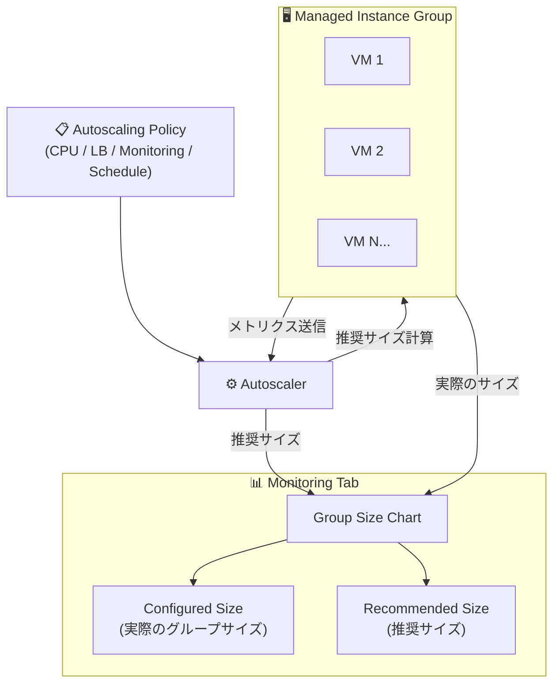

# Compute Engine: MIG オートスケーリングモニタリングチャートの強化

**リリース日**: 2026-03-10

**サービス**: Compute Engine

**機能**: Managed Instance Group (MIG) オートスケーリングモニタリング

**ステータス**: GA

📊 [このアップデートのインフォグラフィックを見る](https://takech9203.github.io/google-cloud-news-summary/20260310-compute-engine-mig-autoscale-monitoring.html)

## 概要

Compute Engine のマネージド インスタンス グループ (MIG) でオートスケーリングを使用する際、構成されたグループサイズとオートスケーラーが推奨するサイズをチャート上で監視できるようになった。これにより、オートスケーラーの判断プロセスの可視性が向上し、実際のグループサイズと推奨サイズの差異をリアルタイムで把握できる。

このアップデートは、MIG のオートスケーリングを運用するすべてのユーザーに影響する。特に、スケーリングの挙動を詳細に分析してパフォーマンスチューニングやコスト最適化を行いたい Solutions Architect やインフラエンジニアにとって有用な機能改善である。

**アップデート前の課題**

- オートスケーラーの推奨サイズと実際のグループサイズの関係をチャートで視覚的に比較することが困難だった
- オートスケーリングポリシーが適切に機能しているかの判断に、複数のメトリクスを手動で突き合わせる必要があった
- スケールイン・スケールアウトのタイミングと推奨サイズの変動の関連を直感的に把握しにくかった

**アップデート後の改善**

- 構成されたグループサイズとオートスケーラー推奨サイズをチャート上で並べて監視できるようになった
- オートスケーラーの判断根拠が可視化され、スケーリング挙動の分析が容易になった
- スケーリングポリシーの効果をリアルタイムで確認し、チューニングの判断材料として活用できるようになった

## アーキテクチャ図



MIG オートスケーラーがメトリクスを収集して推奨サイズを計算し、その結果を Monitoring タブの Group Size チャートで実際のグループサイズと並べて表示する構成を示している。

## サービスアップデートの詳細

### 主要機能

1. **Group Size チャートの強化**
   - 構成されたグループサイズ (実際の VM インスタンス数) と推奨サイズを同一チャート上に表示
   - 時系列での推移を視覚的に比較可能
   - 時間範囲セレクターによるカスタマイズに対応

2. **オートスケーラー推奨サイズの可視化**
   - 推奨サイズはオートスケーラーが安定化期間 (過去 10 分間または初期化期間のいずれか長い方) のピーク負荷に基づいて算出
   - スケールインコントロールが設定されている場合は、その制約も反映された推奨サイズが表示される
   - オートスケーラーモード (ON / ONLY_SCALE_OUT / OFF) に関わらず推奨サイズが算出される

3. **既存モニタリング機能との統合**
   - 従来からある Autoscaler utilization、CPU utilization、Disk I/O、Network metrics チャートと同じ Monitoring タブで閲覧可能
   - ログパネルとの連携により、スケーリングイベントとサイズ変動の相関分析が可能
   - チャート上のドラッグ操作でズームイン分析に対応

## 技術仕様

### 推奨サイズの算出ロジック

| 項目 | 詳細 |
|------|------|
| 算出基準 | 安定化期間中のピーク負荷に基づく推奨 VM 数 |
| 安定化期間 | 過去 10 分間または初期化期間のいずれか長い方 |
| 制約条件 | minNumReplicas / maxNumReplicas、スケールインコントロール |
| 予測的オートスケーリング | 有効時は過去の CPU 使用率パターンから将来負荷を予測 |
| 再計算頻度 | 常時再計算 |

### オートスケーラーモードと推奨サイズの関係

| モード | ターゲットサイズへの反映 |
|--------|--------------------------|
| `ON` | MIG のターゲットサイズを推奨サイズに設定 |
| `ONLY_SCALE_OUT` | 推奨サイズが増加した場合のみターゲットサイズを増加 |
| `OFF` | ターゲットサイズは変更されないが、推奨サイズは算出される |

## 設定方法

### 前提条件

1. Managed Instance Group (MIG) が作成されていること
2. オートスケーリングポリシーが構成されていること

### 手順

#### ステップ 1: Google Cloud コンソールでインスタンスグループページを開く

```
Google Cloud Console > Compute Engine > Instance groups
```

対象の MIG をクリックして詳細ページを開く。

#### ステップ 2: Monitoring タブを選択

MIG の詳細ページで **Monitoring** タブを選択すると、Group Size チャートに構成されたサイズと推奨サイズが表示される。

#### ステップ 3: チャートの分析

- 時間範囲セレクターで分析期間を調整
- チャート上でドラッグして特定のイベントにズームイン
- ログパネルを展開してスケーリングイベントの詳細を確認

## メリット

### ビジネス面

- **コスト最適化の判断材料**: 推奨サイズと実際のサイズの乖離を把握することで、オーバープロビジョニングやアンダープロビジョニングの状況を早期に発見できる
- **運用効率の向上**: オートスケーリングの挙動を一目で確認でき、トラブルシューティング時間の短縮につながる

### 技術面

- **スケーリングポリシーのチューニング**: 推奨サイズの変動パターンを分析し、ターゲット使用率やスケールインコントロールの最適な設定値を判断できる
- **インシデント分析**: スケーリングイベント発生時の推奨サイズと実際のサイズの推移を時系列で追跡し、根本原因の特定に活用できる

## デメリット・制約事項

### 制限事項

- オートスケーリングは Unmanaged Instance Group、Stateful MIG、VM 修復が無効な MIG では使用不可
- GKE が所有する MIG では Compute Engine オートスケーリングではなく Cluster Autoscaler を使用する必要がある
- 予測的オートスケーリングのチャートは CPU 使用率ベースのスケーリングメトリクスでのみ利用可能

### 考慮すべき点

- チャートは Google Cloud コンソールでのみ閲覧可能 (API やコマンドラインでの直接取得ではない)
- 詳細な分析には Cloud Monitoring のカスタムダッシュボード併用が推奨される

## ユースケース

### ユースケース 1: スケーリングポリシーの最適化

**シナリオ**: EC サイトのバックエンドで MIG オートスケーリングを使用しているが、ピーク時にレスポンスが遅延する。推奨サイズが実際のサイズを常に上回っている場合、maxNumReplicas の引き上げやターゲット使用率の引き下げを検討する。

**効果**: チャートで推奨サイズの傾向を視覚的に確認し、適切なスケーリングパラメータを迅速に特定できる。

### ユースケース 2: スケールインコントロールの検証

**シナリオ**: 初期化に時間がかかるアプリケーションで、スケールインコントロールを設定した後、推奨サイズの変動が適切に制約されているかを確認する。

**効果**: 推奨サイズの変動と実際のスケールイン速度の関係をチャートで確認し、trailing time window や maximum allowed reduction の設定が適切かを判断できる。

## 料金

オートスケーリングポリシーの構成自体に追加料金は発生しない。オートスケーラーが動的に VM インスタンスを追加・削除するため、MIG が使用するリソースに対してのみ課金される。モニタリングチャートの利用にも追加料金は発生しない。

コストは autoscaling policy の minNumReplicas と maxNumReplicas の設定で制御可能。

- [Compute Engine 料金ページ](https://cloud.google.com/compute/all-pricing)

## 利用可能リージョン

Compute Engine MIG オートスケーリングは、すべての Compute Engine 利用可能リージョンで使用可能。ゾーン MIG およびリージョナル MIG の両方で利用できる。

## 関連サービス・機能

- **Cloud Monitoring**: MIG のメトリクスを収集・可視化。カスタムダッシュボードでより詳細な分析が可能
- **Cloud Logging**: オートスケーリングイベントのログ記録。Monitoring タブのログパネルと連携
- **予測的オートスケーリング (Predictive Autoscaling)**: 過去の CPU 使用率パターンから将来の負荷を予測し、先行的にスケールアウトする機能
- **Cloud Load Balancing**: ロードバランシングのサービス提供容量に基づくオートスケーリングシグナルとの連携

## 参考リンク

- 📊 [インフォグラフィック](https://takech9203.github.io/google-cloud-news-summary/20260310-compute-engine-mig-autoscale-monitoring.html)
- [公式リリースノート](https://cloud.google.com/release-notes#March_10_2026)
- [Monitor group size - Understanding autoscaler decisions](https://cloud.google.com/compute/docs/autoscaler/understanding-autoscaler-decisions)
- [Autoscaling groups of instances](https://cloud.google.com/compute/docs/autoscaler)
- [Predictive autoscaling](https://cloud.google.com/compute/docs/autoscaler/predictive-autoscaling)
- [Compute Engine 料金](https://cloud.google.com/compute/all-pricing)

## まとめ

Compute Engine の MIG オートスケーリングモニタリングが強化され、構成されたグループサイズとオートスケーラーの推奨サイズをチャート上で並べて監視できるようになった。この改善により、スケーリングポリシーの効果を視覚的に確認し、パフォーマンスチューニングやコスト最適化の判断がより迅速に行える。既に MIG オートスケーリングを利用している場合は、Google Cloud コンソールの Monitoring タブで新しいチャート表示を確認し、現在のスケーリング設定の妥当性を検証することを推奨する。

---

**タグ**: #ComputeEngine #MIG #Autoscaling #Monitoring #オートスケーリング #モニタリング
