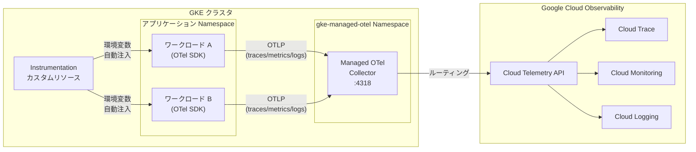

# Google Kubernetes Engine (GKE): Managed OpenTelemetry for GKE (Preview)

**リリース日**: 2026-03-10

**サービス**: Google Kubernetes Engine (GKE)

**機能**: Managed OpenTelemetry for GKE

**ステータス**: Preview

[このアップデートのインフォグラフィックを見る](https://takech9203.github.io/google-cloud-news-summary/20260310-gke-managed-opentelemetry.html)

## 概要

Google Kubernetes Engine (GKE) において、Managed OpenTelemetry for GKE が Preview として利用可能になりました。この機能は、GKE バージョン 1.34.1-gke.2178000 以降を実行するクラスタで使用でき、OpenTelemetry Protocol (OTLP) のトレース、メトリクス、ログを完全マネージドかつ簡素化された方法で収集できるようにします。

Managed OpenTelemetry for GKE は、GKE 上でトレースデータを収集するための Google Cloud 唯一のマネージドソリューションです。従来、OpenTelemetry のテレメトリデータを Google Cloud Observability に送信するには、OpenTelemetry Collector を自前でデプロイ・運用する必要がありましたが、本機能によりその負担が大幅に軽減されます。

この機能は Autopilot クラスタと Standard クラスタの両方で利用でき、OpenTelemetry SDK を使用してインストルメント済みのワークロードが対象です。Agent Development Kit (ADK) など、OpenTelemetry をネイティブサポートするフレームワークとも連携します。

**アップデート前の課題**

GKE 上で OpenTelemetry ベースのオブザーバビリティを実現するには、以下のような課題がありました。

- OpenTelemetry Collector を自前でデプロイ・管理する必要があり、認証設定、構成管理、バージョンアップ、監視などの運用負荷が発生していた
- 各ワークロードに対して OTLP エクスポーターのエンドポイントやサンプリング設定などの環境変数を手動で構成する必要があった
- Collector の可用性やスケーラビリティを自分で確保する必要があり、インフラ管理のオーバーヘッドが大きかった

**アップデート後の改善**

今回のアップデートにより、以下のことが可能になりました。

- Google Cloud がマネージドする OpenTelemetry Collector がクラスタ内に自動デプロイされ、Collector の運用管理が不要になった
- Instrumentation カスタムリソースにより、ワークロードへの環境変数の自動注入が可能になり、設定作業が大幅に簡素化された
- トレース、メトリクス、ログが Cloud Trace、Cloud Monitoring、Cloud Logging に自動ルーティングされ、Google Cloud Observability とのシームレスな統合が実現した

## アーキテクチャ図



Managed OpenTelemetry for GKE のデータフローを示す図です。Instrumentation カスタムリソースがワークロードに環境変数を自動注入し、ワークロードから送出された OTLP データがマネージド Collector を経由して Cloud Telemetry API に送信され、最終的に Cloud Trace、Cloud Monitoring、Cloud Logging で利用可能になります。

## サービスアップデートの詳細

### 主要機能

1. **Managed Collection (マネージドコレクション)**
   - クラスタ内の `gke-managed-otel` Namespace に OpenTelemetry Collector が自動デプロイされる
   - インクラスタ OTLP エンドポイント (`http://opentelemetry-collector.gke-managed-otel.svc.cluster.local:4318`) が提供される
   - 収集したテレメトリデータを Cloud Telemetry API 経由で Google Cloud Observability に自動ルーティング

2. **Automatic Configuration (自動構成)**
   - `instrumentations.telemetry.googleapis.com` カスタムリソースによりワークロードの自動構成が可能
   - Pod またはNamespace 単位で環境変数の注入対象を指定可能
   - 収集するシグナルタイプ (トレース、メトリクス、ログ) を個別に制御可能

3. **シグナルタイプの選択的収集**
   - トレースのサンプリングレートをカスタマイズ可能 (`OTEL_TRACES_SAMPLER_ARG` で 0.0 - 1.0 の範囲で設定)
   - メトリクスのエクスポート間隔を調整可能 (`OTEL_METRIC_EXPORT_INTERVAL`: 5000ms - 300000ms、デフォルト 60000ms)
   - 各シグナルタイプのエクスポーターを個別に無効化可能

## 技術仕様

### 要件

| 項目 | 詳細 |
|------|------|
| GKE バージョン | 1.34.1-gke.2178000 以降 |
| gcloud CLI バージョン | 551.0.0 以降 |
| Terraform プロバイダ | terraform-provider-google-beta v7.17.0 以降 |
| クラスタモード | Autopilot / Standard |
| ステータス | Preview (Pre-GA) |

### 自動注入される環境変数

| 環境変数 | 説明 |
|----------|------|
| `OTEL_EXPORTER_OTLP_ENDPOINT` | マネージド Collector のエンドポイント URL |
| `OTEL_TRACES_SAMPLER` | トレースサンプラーの種類 (`parentbased_traceidratio` または `parentbased_always_on`) |
| `OTEL_TRACES_SAMPLER_ARG` | トレースサンプリング比率 (0.0 - 1.0) |
| `OTEL_METRIC_EXPORT_INTERVAL` | メトリクスエクスポート間隔 (ms) |
| `OTEL_TRACES_EXPORTER` | トレースエクスポーター (`otlp` または `none`) |
| `OTEL_METRICS_EXPORTER` | メトリクスエクスポーター (`otlp` または `none`) |
| `OTEL_LOGS_EXPORTER` | ログエクスポーター (`otlp` または `none`) |

### 必要な IAM ロール

```
roles/container.clusterAdmin     # Kubernetes Engine Cluster Admin
roles/monitoring.viewer          # Monitoring Viewer
roles/logging.viewer             # Logs Viewer
roles/cloudtrace.user            # Cloud Trace User
```

## 設定方法

### 前提条件

1. GKE クラスタが バージョン 1.34.1-gke.2178000 以降で稼働していること
2. gcloud CLI バージョン 551.0.0 以降がインストールされていること
3. ワークロードが OpenTelemetry SDK でインストルメント済みであること

### 手順

#### ステップ 1: 新規クラスタで Managed OpenTelemetry を有効化

```bash
# Autopilot クラスタの場合
gcloud beta container clusters create-auto CLUSTER_NAME \
  --project=PROJECT_ID \
  --managed-otel-scope=COLLECTION_AND_INSTRUMENTATION_COMPONENTS \
  --location=LOCATION \
  --cluster-version=1.34.1-gke.2178000

# Standard クラスタの場合
gcloud beta container clusters create CLUSTER_NAME \
  --project=PROJECT_ID \
  --managed-otel-scope=COLLECTION_AND_INSTRUMENTATION_COMPONENTS \
  --location=LOCATION \
  --cluster-version=1.34.1-gke.2178000
```

新規クラスタ作成時に `--managed-otel-scope=COLLECTION_AND_INSTRUMENTATION_COMPONENTS` フラグを指定して、Managed OpenTelemetry を有効にします。

#### ステップ 2: 既存クラスタで Managed OpenTelemetry を有効化

```bash
gcloud beta container clusters update CLUSTER_NAME \
  --project=PROJECT_ID \
  --managed-otel-scope=COLLECTION_AND_INSTRUMENTATION_COMPONENTS \
  --location=LOCATION
```

既存クラスタに対して `clusters update` コマンドで有効化できます。クラスタバージョンが要件を満たしていない場合は、事前にアップグレードしてください。

#### ステップ 3: Instrumentation カスタムリソースの作成

```yaml
apiVersion: telemetry.googleapis.com/v1alpha1
kind: Instrumentation
metadata:
  name: my-instrumentation
  namespace: default
spec:
  selector: {}
  tracer_provider:
    sampler:
      type: parentbased_traceidratio
      argument: "0.5"
  meter_provider:
    export_interval_millis: 60000
```

Instrumentation カスタムリソースを作成し、テレメトリ収集の設定を定義します。`selector` でターゲットとなるワークロードを指定し、サンプリングレートやエクスポート間隔をカスタマイズできます。

#### ステップ 4: Terraform での設定 (オプション)

```hcl
resource "google_container_cluster" "default" {
  provider = google-beta
  name     = "my-gke-cluster"
  location = "us-west1"

  release_channel {
    channel = "RAPID"
  }

  managed_opentelemetry_config {
    scope = "COLLECTION_AND_INSTRUMENTATION_COMPONENTS"
  }
}
```

Terraform を使用する場合は `google-beta` プロバイダ v7.17.0 以降で `managed_opentelemetry_config` ブロックを設定します。

## メリット

### ビジネス面

- **運用コストの削減**: OpenTelemetry Collector の運用・保守が不要になり、インフラ管理の人的コストを大幅に削減できる
- **オブザーバビリティ導入の加速**: マネージドサービスにより、テレメトリ収集基盤の構築にかかる時間を短縮し、アプリケーション開発に集中できる

### 技術面

- **設定の簡素化**: Instrumentation カスタムリソースによる環境変数の自動注入により、各ワークロードへの手動設定が不要
- **Google Cloud Observability との統合**: 収集したデータが Cloud Trace、Cloud Monitoring、Cloud Logging にシームレスに連携され、統合的な分析が可能
- **スケーラビリティ**: Google Cloud がマネージドする Collector により、ワークロードの増減に応じた自動スケーリングが実現
- **ADK 対応**: Agent Development Kit (ADK) をネイティブサポートしており、AI エージェントのオブザーバビリティにも対応

## デメリット・制約事項

### 制限事項

- Preview 段階であり、Pre-GA Offerings Terms が適用される。本番環境での使用には注意が必要
- GKE バージョン 1.34.1-gke.2178000 以降が必須であり、古いバージョンのクラスタでは利用不可
- GKE Autopilot パートナーの特権ワークロードに対する OpenTelemetry 構成注入は非対応
- Collector レベルのフィルタリングやカスタム制御が必要な場合は、Google-Built OpenTelemetry Collector を別途使用する必要がある

### 考慮すべき点

- ワークロードが OpenTelemetry SDK でインストルメント済みであることが前提条件。未対応のワークロードではデータ収集されない
- Instrumentation カスタムリソースのデプロイ後にワークロードの Pod を再起動する必要がある (デプロイ順序に注意)
- テレメトリデータの送信量に応じて Cloud Monitoring、Cloud Logging、Cloud Trace の料金が発生する

## ユースケース

### ユースケース 1: マイクロサービスアーキテクチャの分散トレーシング

**シナリオ**: 複数のマイクロサービスが GKE 上で稼働しており、サービス間のリクエストフローを追跡してレイテンシのボトルネックを特定したい。

**実装例**:
```yaml
apiVersion: telemetry.googleapis.com/v1alpha1
kind: Instrumentation
metadata:
  name: microservices-tracing
  namespace: production
spec:
  selector: {}
  tracer_provider:
    sampler:
      type: parentbased_traceidratio
      argument: "0.1"
  meter_provider: null
  logger_provider: null
```

**効果**: 全マイクロサービスのトレースが自動的に Cloud Trace に送信され、サービス間のリクエストフローの可視化とレイテンシ分析が可能になる。サンプリングレート 10% により、コストを抑えつつ十分なトレースデータを収集できる。

### ユースケース 2: AI エージェントワークロードのオブザーバビリティ

**シナリオ**: Agent Development Kit (ADK) を使用して構築した AI エージェントが GKE 上で稼働しており、エージェントの処理フローやパフォーマンスを監視したい。

**効果**: ADK が OpenTelemetry をネイティブサポートしているため、Managed OpenTelemetry を有効化するだけで、AI エージェントのトレース、メトリクス、ログが自動的に Google Cloud Observability に送信される。エージェントの各ステップの実行時間や成功率を Cloud Trace と Cloud Monitoring で可視化できる。

## 料金

Managed OpenTelemetry for GKE 自体の追加料金は発生しませんが、送信されるテレメトリデータの量に応じて以下のサービスの料金が適用されます。

### 料金例

| テレメトリタイプ | 課金基準 |
|------------------|----------|
| メトリクス | Google Cloud Managed Service for Prometheus の料金体系に基づく |
| ログ | Cloud Logging の料金体系に基づく |
| トレース | Cloud Trace の料金体系に基づく |

詳細な料金は [Google Cloud Observability の料金ページ](https://cloud.google.com/stackdriver/pricing) を参照してください。

## 利用可能リージョン

Managed OpenTelemetry for GKE は、GKE バージョン 1.34.1-gke.2178000 以降が利用可能な全てのリージョンで使用できます。Preview 段階のため、利用可能なリージョンは今後変更される可能性があります。

## 関連サービス・機能

- **[Cloud Trace](https://cloud.google.com/trace)**: 分散トレースデータの保存・分析・可視化サービス。Managed OpenTelemetry から送信されたトレースの表示先
- **[Cloud Monitoring](https://cloud.google.com/monitoring)**: メトリクスデータの保存・分析・アラートサービス。OTLP メトリクスの表示先
- **[Cloud Logging](https://cloud.google.com/logging)**: ログデータの保存・分析サービス。OTLP ログの表示先
- **[Google-Built OpenTelemetry Collector](https://cloud.google.com/stackdriver/docs/instrumentation/google-built-otel)**: Collector レベルのフィルタリングや制御が必要な場合の代替ソリューション
- **[Agent Development Kit (ADK)](https://cloud.google.com/stackdriver/docs/instrumentation/ai-agent-adk)**: OpenTelemetry をネイティブサポートする AI エージェント開発フレームワーク

## 参考リンク

- [インフォグラフィック](https://takech9203.github.io/google-cloud-news-summary/20260310-gke-managed-opentelemetry.html)
- [公式リリースノート](https://docs.cloud.google.com/release-notes#March_10_2026)
- [Managed OpenTelemetry for GKE コンセプトドキュメント](https://cloud.google.com/kubernetes-engine/docs/concepts/managed-otel-gke)
- [Managed OpenTelemetry for GKE デプロイガイド](https://cloud.google.com/kubernetes-engine/docs/how-to/managed-otel-gke)
- [Google Cloud Observability 料金ページ](https://cloud.google.com/stackdriver/pricing)

## まとめ

Managed OpenTelemetry for GKE は、GKE ワークロードのオブザーバビリティを大幅に簡素化するマネージドサービスです。OpenTelemetry Collector の運用負荷を解消し、Instrumentation カスタムリソースによる自動構成で迅速なテレメトリ収集を実現します。現在 Preview 段階ですが、OpenTelemetry ベースのオブザーバビリティを GKE で導入する際には、まず開発・ステージング環境で本機能を試用し、GA リリースに備えることを推奨します。

---

**タグ**: #GoogleKubernetesEngine #GKE #OpenTelemetry #OTLP #Observability #CloudTrace #CloudMonitoring #CloudLogging #ManagedService #Preview
