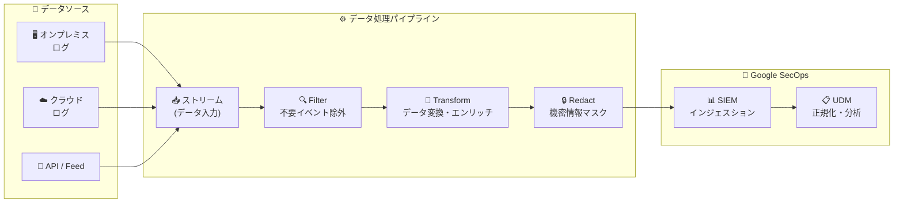

# Google SecOps SIEM: データ処理パイプライン (Data Processing Pipelines)

**リリース日**: 2026-03-10

**サービス**: Google SecOps SIEM

**機能**: データ処理パイプライン (Data Processing Pipelines)

**ステータス**: Preview

📊 [このアップデートのインフォグラフィックを見る](https://takech9203.github.io/google-cloud-news-summary/20260310-secops-siem-data-processing-pipelines.html)

## 概要

Google SecOps SIEM に、データ取り込み前にログデータのフィルタリング、変換、リダクション (秘匿化) を行える「データ処理パイプライン (Data Processing Pipelines)」機能が Preview として追加された。この機能により、Google SecOps へのデータインジェスション前の段階で、プリパース処理としてデータを制御できるようになる。

データ処理パイプラインは、セキュリティチームがインジェストするデータの品質とコストを最適化するための機能である。不要なイベントのフィルタリングによるコスト削減、データ形式の変換による互換性向上、機密情報のマスキングやリダクションによる情報保護を、取り込み前の段階で実現する。設定は Bindplane コンソールまたは Google SecOps Data Pipeline API から行える。

**アップデート前の課題**

- ログデータは Google SecOps に取り込まれた後にしか加工できず、不要なイベントもすべてインジェストされていたためコストが増加していた
- 機密情報 (個人情報、クレジットカード番号、IP アドレスなど) がそのまま保存されるリスクがあり、ストレージ前のリダクション手段が限定的だった
- 異なるソースからのログ形式の不整合を取り込み前に修正する標準的な手段がなく、パース後の処理に依存していた

**アップデート後の改善**

- インジェスション前にフィルタ処理を適用し、不要なイベントを除外することでデータ取り込みコストを削減できるようになった
- Transform プロセッサによりデータ形式の変換やフィールドのパース、ログのエンリッチメントが取り込み前に可能になった
- Redact プロセッサにより機密情報のマスキングや除去をストレージ保存前に適用できるようになった

## アーキテクチャ図



データソースから取り込まれたログは、ストリームを経由してプロセッサノード内の Filter、Transform、Redact の各プロセッサを順次通過し、処理済みデータが Google SecOps のインジェスションサービスに送信される。

## サービスアップデートの詳細

### 主要機能

1. **Filter プロセッサ**
   - 条件に基づいて不要なイベントを除外し、関連性の高いイベントのみを取り込む
   - ログ条件式 (logConditions) を使用してフィルタリングルールを定義
   - 例: Palo Alto Cortex データのフィールド値によるフィルタリング、SentinelOne データのカテゴリによる削減

2. **Transform プロセッサ**
   - データ形式の変換、フィールドのパース、ログのエンリッチメントを実行
   - OTTL (OpenTelemetry Transformation Language) ベースのステートメントで柔軟な変換ロジックを記述可能
   - 例: JSON パース、インジェスションラベルの付与、ホスト情報の抽出とマッピング

3. **Redact プロセッサ**
   - 正規表現パターンに基づいて機密情報を検出しマスキングまたは除去
   - プリセットのパターン (メールアドレス、IP アドレス、クレジットカード番号、電話番号、UUID など) を使用可能
   - allowedKeys / ignoredKeys によるきめ細かな制御が可能

## 技術仕様

### パイプライン構成要素

| 項目 | 詳細 |
|------|------|
| ストリーム | 1つ以上のデータ入力ストリーム。ログタイプ、インジェスションメソッド、フィードを指定 |
| プロセッサノード | 1つ以上のプロセッサを含むノード。データは順次処理される |
| デスティネーション | 処理済みデータの送信先となる Google SecOps インスタンス |
| インジェスションメソッド | Cloud Native Ingestion、Feed、Ingestion API、Workspace から選択 |
| 設定方法 | Bindplane コンソール または Google SecOps Data Pipeline API |

### API によるパイプライン作成例

```json
{
  "displayName": "Example Pipeline",
  "description": "フィルタ・変換・リダクションの例",
  "processors": [
    {
      "transformProcessor": {
        "statements": [
          "set(attributes[\"myKey1\"], \"myVal1\")"
        ]
      }
    },
    {
      "filterProcessor": {
        "logConditions": [
          "true and severity_number != 0 and severity_number < 9"
        ]
      }
    },
    {
      "redactProcessor": {
        "blockedValues": [
          "\\b[a-zA-Z0-9._/\\+\\-]+@[A-Za-z0-9\\-]+\\.[a-zA-Z]{2,6}\\b"
        ],
        "allowAllKeys": true,
        "redactAllTypes": true
      }
    }
  ]
}
```

## 設定方法

### 前提条件

1. Google SecOps SIEM のアクティブなインスタンス
2. Bindplane コンソールへのアクセス権限 (Bindplane コンソール経由で設定する場合)
3. Google SecOps Data Pipeline API へのアクセス権限 (API 経由で設定する場合)

### 手順

#### ステップ 1: SecOps パイプラインの作成

Bindplane コンソールの SecOps Pipelines タブから新しいパイプラインを作成する。API を使用する場合は以下のエンドポイントに POST リクエストを送信する。

```bash
curl --location \
  'https://<endpoint>/v1/projects/<project>/locations/<location>/instances/<instance>/logProcessingPipelines' \
  --header 'Content-Type: application/json' \
  --header 'Authorization: Bearer <token>' \
  --data '{
    "displayName": "My Pipeline",
    "description": "Pipeline description",
    "processors": [...]
  }'
```

#### ステップ 2: ストリームの追加とプロセッサの設定

パイプライン構成カードでストリーム (ログタイプ、インジェスションメソッド) を追加し、プロセッサノードに Filter、Transform、Redact プロセッサを構成する。

#### ステップ 3: ストリームの関連付け

```bash
curl --location \
  'https://<endpoint>/v1/<pipelineName>:associateStreams' \
  --header 'Content-Type: application/json' \
  --header 'Authorization: Bearer <token>' \
  --data '{
    "streams": [
      { "logType": "MICROSOFT_SENTINEL" },
      { "feed": "feed-id-here" }
    ]
  }'
```

#### ステップ 4: パイプラインのロールアウト

Bindplane コンソールで「Start rollout」をクリックしてパイプラインを有効化する。ロールアウトが成功すると、パイプラインのバージョン番号がインクリメントされる。

## メリット

### ビジネス面

- **コスト最適化**: 不要なイベントを取り込み前にフィルタリングすることで、データインジェスション量を削減し、ストレージおよびインジェスションコストを低減できる
- **コンプライアンス対応**: 機密情報のリダクション機能により、GDPR や HIPAA などの規制要件への対応を容易にする

### 技術面

- **データ品質の向上**: Transform プロセッサによる取り込み前のデータ正規化・エンリッチメントにより、後続の分析やルール検知の精度が向上する
- **柔軟な構成**: OTTL ベースのカスタムプロセッサにより、複雑な変換ロジックを記述可能。API と Bindplane コンソールの両方から管理できる
- **マルチソース対応**: オンプレミスとクラウドの両方のデータストリームに対してパイプラインを構成できる

## デメリット・制約事項

### 制限事項

- Preview 段階のため、Pre-GA Offerings Terms が適用される。機能やサポートが限定的な場合がある
- すべてのリージョン・すべての顧客で利用可能とは限らない
- Pre-GA 機能のため、他の Pre-GA バージョンとの互換性が保証されない場合がある

### 考慮すべき点

- フィルタリングルールの誤設定により、重要なセキュリティイベントが除外されるリスクがある。本番適用前に十分なテストが必要
- リダクション処理によりマスクされたデータは復元できないため、適用範囲の慎重な設計が求められる
- パイプラインの処理がデータインジェスションのレイテンシに影響する可能性がある

## ユースケース

### ユースケース 1: 不要ログのフィルタリングによるコスト削減

**シナリオ**: 大量のファイアウォールログを Google SecOps に取り込んでいるが、正常な通信の大部分はセキュリティ分析に不要。フィルタプロセッサを使って重要度の低いログイベントを除外する。

**実装例**:
```json
{
  "filterProcessor": {
    "logConditions": [
      "true and severity_number != 0 and severity_number < 9"
    ]
  }
}
```

**効果**: データインジェスション量が大幅に削減され、ストレージコストと処理コストが低減。重要なセキュリティイベントのみが分析対象となり、検知精度も向上する。

### ユースケース 2: 個人情報のリダクションによるコンプライアンス対応

**シナリオ**: 取り込むログにメールアドレスや IP アドレスなどの個人情報が含まれており、規制要件に基づいてストレージ保存前にマスキングが必要。

**効果**: 個人情報がマスクされた状態で保存されるため、データ漏洩時のリスクを軽減し、コンプライアンス要件を満たすことができる。

### ユースケース 3: マルチインスタンス環境でのログ分類

**シナリオ**: 複数の Google Cloud Workspace インスタンスからログを取り込んでいる環境で、Transform プロセッサを使ってインジェスションラベルを付与し、ソースストリームインスタンスを識別する。

**効果**: ログの出所が明確になり、マルチテナント環境での分析やトラブルシューティングが効率化される。

## 料金

Google SecOps SIEM の料金は、サブスクリプションモデルに基づいている。データインジェスション量に応じた課金が行われるため、データ処理パイプラインによる不要イベントのフィルタリングは直接的なコスト削減につながる。データ処理パイプライン機能自体の追加料金については公式ドキュメントを確認すること。

詳細は [Google SecOps の料金ページ](https://cloud.google.com/chronicle/docs/onboard/understand-billing) を参照。

## 利用可能リージョン

Preview 機能のため、すべてのリージョン・すべての顧客で利用可能とは限らない。利用可能なリージョンについては [Google SecOps のドキュメント](https://cloud.google.com/chronicle/docs) を参照。

## 関連サービス・機能

- **Bindplane**: データ処理パイプラインの構成・管理に使用する OTel ベースのテレメトリパイプライン。コレクターのデプロイとパイプラインの設定を一元管理する
- **Google SecOps Ingestion API**: パイプラインの作成・管理を API 経由で自動化するためのインターフェース
- **Cloud Logging**: Bindplane は Cloud Logging のオンプレミスデプロイメントにも使用される同一のソリューション
- **Google SecOps SOAR**: SIEM で検知したアラートに対する自動対応・オーケストレーション機能を提供
- **Cloud Monitoring**: パイプライン処理後のデータに対するモニタリングとアラート設定

## 参考リンク

- 📊 [インフォグラフィック](https://takech9203.github.io/google-cloud-news-summary/20260310-secops-siem-data-processing-pipelines.html)
- [公式リリースノート](https://cloud.google.com/release-notes#March_10_2026)
- [データ処理パイプラインのドキュメント](https://cloud.google.com/chronicle/docs/ingestion/data-processing-pipeline)
- [Bindplane の利用ガイド](https://cloud.google.com/chronicle/docs/ingestion/use-bindplane-agent)
- [Google SecOps SIEM 概要](https://cloud.google.com/chronicle/docs/overview)
- [料金情報](https://cloud.google.com/chronicle/docs/onboard/understand-billing)

## まとめ

Google SecOps SIEM のデータ処理パイプラインは、セキュリティデータのインジェスション前にフィルタリング、変換、リダクションを適用できる重要な機能である。不要データの除外によるコスト削減、データ品質の向上、機密情報の保護を同時に実現できるため、Google SecOps を運用するすべての組織が評価すべき機能といえる。Preview 段階のため本番環境への適用は慎重に判断し、まずは検証環境でパイプラインの動作を確認することを推奨する。

---

**タグ**: #GoogleSecOps #SIEM #DataProcessing #Pipeline #Security #Preview #Bindplane #LogManagement #DataIngestion #Redaction
