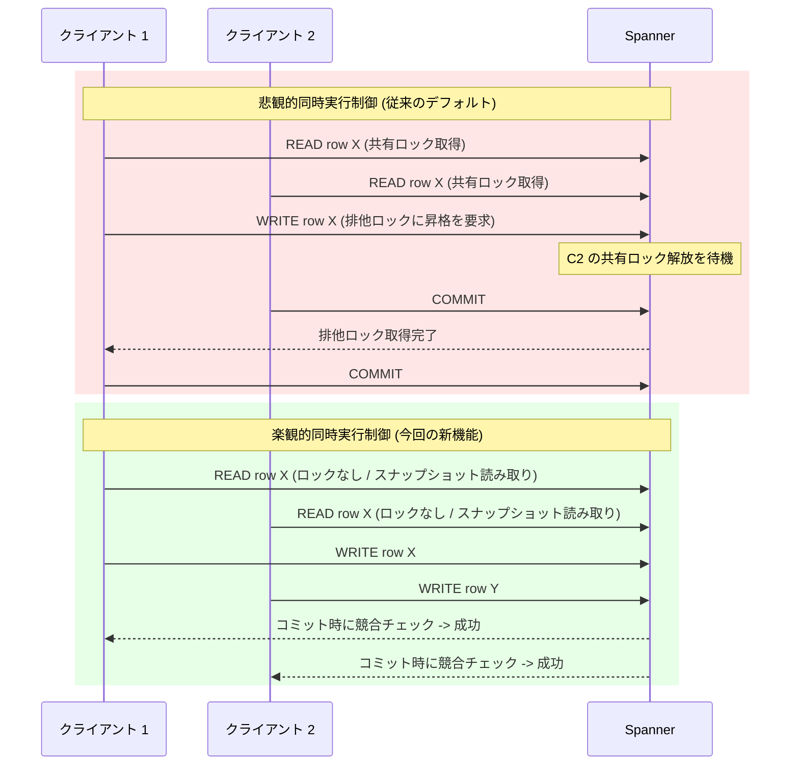

# Spanner: 楽観的同時実行制御 (Optimistic Concurrency Control) モードのサポート

**リリース日**: 2026-03-10

**サービス**: Spanner

**機能**: 楽観的同時実行制御 (Optimistic Concurrency Control) モード

**ステータス**: GA

📊 [このアップデートのインフォグラフィックを見る](https://takech9203.github.io/google-cloud-news-summary/20260310-spanner-optimistic-concurrency-control.html)

## 概要

Spanner に楽観的同時実行制御 (Optimistic Concurrency Control) モードが追加されました。これは、読み書きの競合が少ないトランザクションワークロードに最適化された同時実行制御方式です。従来の悲観的ロック方式 (Pessimistic Concurrency Control) とは異なり、トランザクション内の読み取りおよびクエリがロックを取得せずに実行されるため、同時実行性が大幅に向上します。

この楽観的同時実行制御は、Spanner の Repeatable Read 分離レベルを通じて実装されており、スナップショット分離 (Snapshot Isolation) の技術を活用しています。トランザクション間の競合がまれであることを前提として動作し、コミット時にのみ競合チェックが行われます。これにより、読み取りヘビーなワークロードやロック競合によるパフォーマンスボトルネックを抱えるアプリケーションにとって、レイテンシの改善とトランザクションアボート率の低減が期待できます。

対象ユーザーは、Spanner 上で高い同時実行性を持つアプリケーションを運用しており、特に読み書き競合が少ないワークロードを扱う開発者やデータベース管理者です。

**アップデート前の課題**

従来の Spanner では、デフォルトのシリアライザブル分離レベルにおいて悲観的ロック方式のみが提供されていました。

- 読み書きトランザクション内の読み取り操作が共有ロックを取得するため、高い同時実行性を持つワークロードでロック競合が発生しやすかった
- ロック競合によりトランザクションのアボート率が上昇し、リトライによるレイテンシの増加が問題となっていた
- デッドロック検出 (wound-wait アルゴリズム) により、新しいトランザクションが古いトランザクションによってアボートされるケースがあった

**アップデート後の改善**

楽観的同時実行制御の導入により、以下の改善が可能になりました。

- 読み書きトランザクション内の読み取りがロックなしで実行されるため、同時実行性が大幅に向上した
- ロック競合によるトランザクションアボートが減少し、全体的なスループットが改善された
- 読み取りヘビーなワークロードにおいて、読み書きトランザクションと読み取り専用トランザクションの性能差が縮小した

## アーキテクチャ図



悲観的同時実行制御では読み取り時にロックを取得するため待機が発生しますが、楽観的同時実行制御ではロックなしで読み取りが進み、コミット時にのみ競合を検証します。

## サービスアップデートの詳細

### 主要機能

1. **ロックフリーの読み取り**
   - 読み書きトランザクション内の読み取りおよびクエリがロックを取得せずに実行される
   - トランザクション開始時点のデータベースの一貫したスナップショットに基づいて読み取りが行われる

2. **コミット時の競合検出**
   - 書き込みセットがトランザクションのスナップショットタイムスタンプからコミットタイムスタンプの間に変更されていないことを検証
   - 競合が検出された場合のみトランザクションがアボートされる

3. **Repeatable Read 分離レベルとの統合**
   - 楽観的同時実行制御は Repeatable Read 分離レベルを指定することで有効化される
   - クライアントレベルまたはトランザクションレベルで分離レベルを設定可能

4. **SELECT...FOR UPDATE による書き込みスキュー防止**
   - Repeatable Read 分離レベルで発生しうる書き込みスキュー異常を防止するために、SELECT...FOR UPDATE 句または lock_scanned_ranges=exclusive ヒントを使用可能

## 技術仕様

### 分離レベルの比較

| 項目 | シリアライザブル (悲観的) | Repeatable Read (楽観的) |
|------|--------------------------|--------------------------|
| デフォルト | はい | いいえ |
| 読み取り時のロック | 共有ロックを取得 | ロックなし |
| 書き込み時のロック | 排他ロックに昇格 | コミット時に排他ロック取得 |
| 一貫性保証 | 外部一貫性 (最強) | スナップショット分離 |
| 書き込みスキュー | 発生しない | 発生しうる (対策が必要) |
| ロック競合時の挙動 | デッドロック検出 (wound-wait) | コミット時に競合検出 |
| 推奨ワークロード | 高い一貫性が必要なケース | 読み書き競合が少ないケース |

### トランザクション分離レベルの設定

```python
from google.cloud import spanner
from google.cloud.spanner_v1 import TransactionOptions

# クライアントレベルでの設定
spanner_client = spanner.Client(
    default_transaction_options=DefaultTransactionOptions(
        isolation_level=TransactionOptions.IsolationLevel.REPEATABLE_READ
    )
)

instance = spanner_client.instance("your-instance-id")
database = instance.database("your-database-id")

# トランザクションレベルでの設定
def update_data(transaction):
    results = transaction.execute_sql(
        "SELECT AlbumTitle FROM Albums WHERE SingerId = 1 AND AlbumId = 1"
    )
    for result in results:
        print("Current Title: {}".format(*result))

    row_ct = transaction.execute_update(
        "UPDATE Albums SET AlbumTitle = 'New Title' "
        "WHERE SingerId = 1 AND AlbumId = 1"
    )
    print("{} record(s) updated.".format(row_ct))

database.run_in_transaction(
    update_data,
    isolation_level=TransactionOptions.IsolationLevel.REPEATABLE_READ
)
```

### REST API での設定

```json
{
  "options": {
    "readWrite": {},
    "isolationLevel": "REPEATABLE_READ"
  }
}
```

## 設定方法

### 前提条件

1. Google Cloud プロジェクトに Spanner インスタンスが作成済みであること
2. Spanner クライアントライブラリが最新バージョンに更新されていること
3. 適切な IAM 権限 (`spanner.databases.beginOrRollbackReadWriteTransaction`) が付与されていること

### 手順

#### ステップ 1: クライアントライブラリの更新

```bash
# Python の場合
pip install --upgrade google-cloud-spanner

# Node.js の場合
npm install @google-cloud/spanner@latest

# Java の場合 (Maven)
# pom.xml の google-cloud-spanner 依存関係を最新バージョンに更新
```

最新のクライアントライブラリには Repeatable Read 分離レベルのサポートが含まれています。

#### ステップ 2: トランザクションの分離レベルを設定

```python
# 既存のトランザクションコードに分離レベルを追加
database.run_in_transaction(
    your_transaction_function,
    isolation_level=TransactionOptions.IsolationLevel.REPEATABLE_READ
)
```

トランザクション関数内のコードは変更不要です。分離レベルの指定のみで楽観的同時実行制御が有効になります。

#### ステップ 3: 書き込みスキュー対策の実装 (必要な場合)

```sql
-- 書き込みが読み取りに依存する場合は SELECT...FOR UPDATE を使用
SELECT Balance FROM Accounts WHERE AccountId = @accountId FOR UPDATE;
```

アプリケーションレベルの整合性制約に依存する書き込みがある場合は、SELECT...FOR UPDATE 句を使用して書き込みスキューを防止してください。

## メリット

### ビジネス面

- **スループットの向上**: ロック競合の削減により、同時に処理できるトランザクション数が増加し、アプリケーション全体のスループットが向上する
- **レイテンシの改善**: ロック待機時間の削減とトランザクションリトライの減少により、エンドユーザーの体感速度が改善される

### 技術面

- **ロックフリーの読み取り**: 読み取りがロックを取得しないため、読み取りヘビーなワークロードでの同時実行性が大幅に向上する
- **シンプルな設定**: 分離レベルを指定するだけで有効化でき、既存のトランザクションロジックの変更は最小限で済む
- **柔軟なロック制御**: 必要に応じて SELECT...FOR UPDATE でロックを取得でき、楽観的と悲観的の両方のアプローチを組み合わせ可能

## デメリット・制約事項

### 制限事項

- 書き込みスキュー異常が発生する可能性があり、アプリケーション側での対策 (SELECT...FOR UPDATE やチェック制約) が必要な場合がある
- パーティション DML トランザクションでは Repeatable Read 分離レベルを設定できない
- チェック制約を持つスキーマでは、制約の検証が正しく行われない既知の問題がある (Preview 段階の制限)
- 同時スキーマ変更中にトランザクションを実行すると、DML のリトライエラーや DEADLINE_EXCEEDED エラーが発生する場合がある

### 考慮すべき点

- シリアライザブル分離レベルの外部一貫性保証が不要であることを確認した上で採用を検討すべきである
- 読み取った値に基づいて書き込みを行うクリティカルセクションでは、SELECT...FOR UPDATE の使用を強く推奨する
- 既存の読み取り専用トランザクションを使用している場合は、Repeatable Read に変更しても動作に変化はない

## ユースケース

### ユースケース 1: 読み取りヘビーな在庫管理システム

**シナリオ**: EC サイトの在庫管理システムで、商品の在庫数を頻繁に参照しつつ、注文処理時にのみ在庫を更新するワークロード。多数の在庫参照リクエストと少数の在庫更新が同時に発生する。

**実装例**:
```python
def process_order(transaction):
    # 在庫の読み取り (ロックなし)
    results = transaction.execute_sql(
        "SELECT stock_count FROM Products WHERE product_id = @pid",
        params={"pid": product_id},
        param_types={"pid": spanner.param_types.INT64}
    )
    stock = list(results)[0][0]

    if stock > 0:
        # 在庫の更新 (コミット時に競合チェック)
        transaction.execute_update(
            "UPDATE Products SET stock_count = stock_count - 1 "
            "WHERE product_id = @pid",
            params={"pid": product_id},
            param_types={"pid": spanner.param_types.INT64}
        )

database.run_in_transaction(
    process_order,
    isolation_level=TransactionOptions.IsolationLevel.REPEATABLE_READ
)
```

**効果**: 大量の在庫参照リクエストがロックなしで処理されるため、注文処理中でも在庫参照のレイテンシが悪化しない。

### ユースケース 2: ユーザープロファイルの更新

**シナリオ**: ソーシャルメディアアプリケーションで、ユーザーが自身のプロファイル情報を更新する。各ユーザーが自身のプロファイルのみを更新するため、異なるユーザー間での書き込み競合はほぼ発生しない。

**効果**: ユーザー数の増加に伴い同時トランザクション数が増加しても、ロック競合によるパフォーマンス劣化を回避できる。読み取りと更新が同一トランザクション内で効率的に処理される。

## 料金

楽観的同時実行制御の使用に追加料金は発生しません。通常の Spanner コンピュート容量とストレージの料金が適用されます。

### 料金例

| 項目 | 料金 (概算) |
|------|-------------|
| コンピュート (ノードあたり / 時間) | エディションにより異なる |
| SSD ストレージ (GB / 月) | Spanner 標準料金 |
| CUD 1 年コミットメント | 20% 割引 |
| CUD 3 年コミットメント | 40% 割引 |

詳細な料金については [Spanner の料金ページ](https://cloud.google.com/spanner/pricing) を参照してください。

## 利用可能リージョン

楽観的同時実行制御は Spanner が利用可能なすべてのリージョンおよびマルチリージョン構成で使用できます。Standard、Enterprise、Enterprise Plus の全エディションで利用可能です。

## 関連サービス・機能

- **[Spanner 分離レベル](https://cloud.google.com/spanner/docs/isolation-levels)**: シリアライザブルと Repeatable Read の分離レベルの詳細な比較
- **[Spanner トランザクション](https://cloud.google.com/spanner/docs/transactions)**: 読み書きトランザクション、読み取り専用トランザクション、パーティション DML の概要
- **[ロック統計](https://cloud.google.com/spanner/docs/introspection/lock-statistics)**: ロック競合の診断と調査に使用できるイントロスペクションツール
- **[SELECT...FOR UPDATE (Repeatable Read)](https://cloud.google.com/spanner/docs/use-select-for-update-repeatable-read)**: 書き込みスキューを防止するための SELECT...FOR UPDATE の使用方法

## 参考リンク

- 📊 [インフォグラフィック](https://takech9203.github.io/google-cloud-news-summary/20260310-spanner-optimistic-concurrency-control.html)
- [公式リリースノート](https://docs.google.com/release-notes#March_10_2026)
- [ドキュメント: 同時実行制御](https://cloud.google.com/spanner/docs/concurrency-control)
- [ドキュメント: 分離レベル](https://cloud.google.com/spanner/docs/isolation-levels)
- [ドキュメント: Repeatable Read 分離の使用](https://cloud.google.com/spanner/docs/use-repeatable-read-isolation)
- [料金ページ](https://cloud.google.com/spanner/pricing)

## まとめ

Spanner の楽観的同時実行制御モードは、読み書き競合が少ないワークロードにおいてスループットとレイテンシを大幅に改善する重要なアップデートです。既存のトランザクションコードを大きく変更することなく、分離レベルの指定のみで有効化できるため、導入のハードルが低い点も魅力的です。ただし、書き込みスキュー異常のリスクを理解した上で、必要に応じて SELECT...FOR UPDATE を使用するなど、アプリケーション設計を見直すことを推奨します。

---

**タグ**: #Spanner #ConcurrencyControl #OptimisticLocking #Database #Transaction #Performance #IsolationLevel
