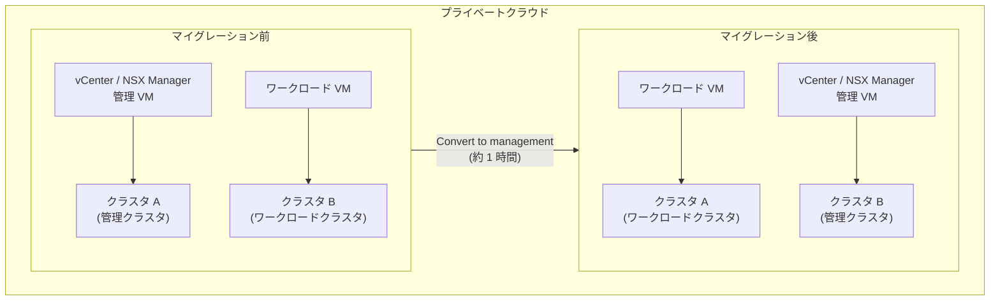

# Google Cloud VMware Engine: 管理 VM のクラスタ間マイグレーション機能

**リリース日**: 2026-03-10

**サービス**: Google Cloud VMware Engine

**機能**: 管理 VM のクラスタ間マイグレーション (Management VM Migration)

**ステータス**: Public Preview

📊 [このアップデートのインフォグラフィックを見る](https://takech9203.github.io/google-cloud-news-summary/20260310-vmware-engine-migrate-management-vms.html)

## 概要

Google Cloud VMware Engine において、VMware 管理 VM を同一プライベートクラウド内の別クラスタへマイグレーションできる機能が Public Preview として提供開始されました。この機能により、vCenter Server や NSX Manager などの管理コンポーネントをホストしているクラスタから、別のワークロードクラスタへ管理 VM を移動することが可能になります。

この操作では、移行先のワークロードクラスタが管理クラスタに昇格し、移行元の管理クラスタがワークロードクラスタに降格します。つまり、クラスタの役割が入れ替わる形でマイグレーションが実施されます。プロセス全体の所要時間は約 1 時間です。

この機能は、プライベートクラウドの運用柔軟性を向上させ、管理コンポーネントのリソース最適化やハードウェアメンテナンス時の対応を容易にします。特に、複数クラスタで構成されたプライベートクラウドを運用するエンタープライズユーザーにとって有用です。

**アップデート前の課題**

従来、VMware 管理 VM はプライベートクラウド作成時に配置された最初のクラスタ (管理クラスタ) に固定されており、柔軟な運用が困難でした。

- 管理 VM は最初に作成されたクラスタに固定されており、別のクラスタへ移動する手段が提供されていなかった
- 管理クラスタのノードをメンテナンスや更新する際に、管理コンポーネントの配置を変更できなかった
- 管理クラスタのリソースが逼迫した場合でも、管理 VM をより余裕のあるクラスタへ再配置できなかった

**アップデート後の改善**

今回のアップデートにより、管理 VM のクラスタ間移動が可能になり、運用の柔軟性が大幅に向上しました。

- 管理 VM を同一プライベートクラウド内の別クラスタへマイグレーション可能になった
- Google Cloud コンソールから数クリックでクラスタの役割を変換できるようになった
- 管理クラスタのメンテナンスウィンドウ中に管理機能を別クラスタで継続できるようになった

## アーキテクチャ図



マイグレーション操作により、ワークロードクラスタが管理クラスタへ昇格し、元の管理クラスタがワークロードクラスタへ降格します。クラスタの役割が完全に入れ替わる仕組みです。

## サービスアップデートの詳細

### 主要機能

1. **管理 VM のクラスタ間マイグレーション**
   - vCenter Server、NSX Manager などの VMware 管理アプライアンスを別クラスタへ移動
   - 同一プライベートクラウド内のクラスタ間でのみ実行可能
   - 移行先はアクティブ状態のワークロードクラスタである必要がある

2. **クラスタ役割の自動変換**
   - 移行先のワークロードクラスタが自動的に管理クラスタへ昇格
   - 移行元の管理クラスタが自動的にワークロードクラスタへ降格
   - 手動でのクラスタ再構成が不要

3. **Google Cloud コンソールからの操作**
   - プライベートクラウドの「Clusters」タブから操作可能
   - ワークロードクラスタのメニューから「Convert to management」を選択
   - 確認ダイアログでクラスタ名を入力して実行

## 技術仕様

### マイグレーション要件と制約

| 項目 | 詳細 |
|------|------|
| ステータス | Public Preview (Pre-GA) |
| 最小クラスタ数 | 2 クラスタ (管理 + ワークロード) |
| 移行先の要件 | ACTIVE 状態のワークロードクラスタ |
| 移行元の要件 | ACTIVE 状態の管理クラスタ |
| 所要時間 | 約 1 時間 |
| ネットワーク影響 | 数秒間のネットワークダウンタイムが発生する可能性あり |
| ノードタイプ制約 | ve2 ノードから ve1-standard-72 ノードへのマイグレーション不可 |

### マイグレーション中の注意事項

| 項目 | 説明 |
|------|------|
| 管理アプライアンス操作 | マイグレーション中は読み取り専用として扱うこと |
| 新規ワークロード VM | マイグレーション中のデプロイは禁止 |
| 推奨実行タイミング | メンテナンスウィンドウ中に実施 |

## 設定方法

### 前提条件

1. プライベートクラウド内に少なくとも 2 つのクラスタが存在すること
2. 移行先クラスタがワークロードクラスタかつ ACTIVE 状態であること
3. 移行元管理クラスタが ACTIVE 状態であること
4. ve2 ノードクラスタから ve1-standard-72 ノードクラスタへの移行でないこと

### 手順

#### ステップ 1: Google Cloud コンソールでプライベートクラウドページを開く

Google Cloud コンソールにログインし、VMware Engine のプライベートクラウドページに移動します。

```
https://console.cloud.google.com/vmwareengine/privateclouds
```

対象のプロジェクトを選択し、マイグレーション対象のプライベートクラウドをクリックします。

#### ステップ 2: ワークロードクラスタを管理クラスタへ変換する

```
1. プライベートクラウドの概要ページで「Clusters」タブをクリック
2. 管理クラスタにしたいワークロードクラスタの「More (...)」メニューをクリック
3. 「Convert to management」を選択
4. 確認ダイアログでクラスタ名を入力
5. 「Confirm」をクリック
```

マイグレーションプロセスが開始され、約 1 時間で完了します。プロセス中は管理アプライアンスへのアクセスは可能ですが、読み取り専用として扱ってください。

## メリット

### ビジネス面

- **運用の柔軟性向上**: 管理コンポーネントの配置を運用要件に応じて変更でき、インフラストラクチャ管理の自由度が向上する
- **計画メンテナンスの容易化**: 管理クラスタのハードウェアメンテナンス時に管理 VM を別クラスタへ退避させることで、ダウンタイムの影響を最小化できる
- **リソース最適化**: 管理 VM とワークロード VM のリソース配分を再構成でき、コスト効率の良い運用が可能になる

### 技術面

- **クラスタ管理の簡素化**: Google Cloud コンソールから数クリックで操作でき、複雑な手動手順が不要
- **自動的な役割変換**: クラスタの役割変換が自動化されており、設定ミスのリスクが低減
- **既存ワークロードへの最小限の影響**: マイグレーション中もワークロード VM は稼働を継続

## デメリット・制約事項

### 制限事項

- Public Preview 段階であり、Pre-GA Offerings Terms の対象となる。サポートが限定される場合がある
- ve2 ノードから ve1-standard-72 ノードへのクラスタ間マイグレーションは不可
- プライベートクラウド内に最低 2 クラスタが必要であり、単一クラスタ構成では利用できない
- マイグレーション中に数秒間のネットワークダウンタイムが発生する可能性がある

### 考慮すべき点

- マイグレーション中 (約 1 時間) は管理アプライアンスへの書き込み操作や新規ワークロード VM のデプロイを避ける必要がある
- メンテナンスウィンドウ中の実施が推奨されており、営業時間中の実行は慎重な検討が必要
- クラスタの役割が入れ替わるため、運用チームへの周知とドキュメント更新が必要

## ユースケース

### ユースケース 1: 管理クラスタのハードウェアメンテナンス

**シナリオ**: 管理クラスタのノードに対してハードウェアメンテナンスやファームウェアアップデートが必要な場合、管理 VM を事前に別のワークロードクラスタへマイグレーションすることで、管理機能への影響を最小化できます。

**実装例**:
```
1. メンテナンスウィンドウを設定
2. Google Cloud コンソールでワークロードクラスタを「Convert to management」
3. マイグレーション完了後 (約 1 時間)、旧管理クラスタ (現ワークロードクラスタ) のメンテナンスを実施
4. 必要に応じてメンテナンス後に元の構成へ再マイグレーション
```

**効果**: 管理コンポーネント (vCenter、NSX Manager) のダウンタイムを回避し、VMware 環境全体の可用性を維持できる

### ユースケース 2: リソースバランシング

**シナリオ**: 管理クラスタのリソース (CPU、メモリ、ストレージ) が逼迫し、管理アプライアンスのパフォーマンスに影響が出ている場合、より余裕のあるクラスタへ管理 VM をマイグレーションしてリソースを再配分できます。

**効果**: 管理アプライアンスのパフォーマンスが向上し、プライベートクラウド全体の安定性が改善される

### ユースケース 3: ノードタイプの世代更新

**シナリオ**: プライベートクラウドに ve2 ノードタイプの新しいクラスタを追加した後、管理 VM を新世代ノードクラスタへマイグレーションすることで、管理コンポーネントのパフォーマンスを向上させることができます (同一ノードファミリ間のマイグレーションの場合)。

**効果**: 最新のハードウェアリソースを管理コンポーネントに活用でき、管理操作のレスポンスが改善される

## 料金

管理 VM のクラスタ間マイグレーション操作自体に追加料金は発生しません。Google Cloud VMware Engine の料金は引き続きプライベートクラウドのノード数とノードタイプに基づいて課金されます。

### 料金例

| 構成 | 月額料金 (概算) |
|------|-----------------|
| ve1-standard-72 ノード x 3 (管理クラスタ) | [Google Cloud 料金計算ツールを参照](https://cloud.google.com/products/calculator) |
| ve2-standard-128 ノード x 3 (ワークロードクラスタ) | [Google Cloud 料金計算ツールを参照](https://cloud.google.com/products/calculator) |

マイグレーションによりクラスタの役割が変わっても、ノード課金には影響しません。

## 利用可能リージョン

本機能は Google Cloud VMware Engine が提供されているすべてのリージョンで利用可能です。VMware Engine が利用可能なリージョンの詳細については、[VMware Engine のリージョンとゾーン](https://cloud.google.com/vmware-engine/docs/overview/regions)を参照してください。

## 関連サービス・機能

- **Google Cloud VMware Engine プライベートクラウド管理**: プライベートクラウドの作成、クラスタの追加・削除など、基盤となる管理機能
- **VMware Engine ノードタイプ (ve1/ve2)**: マイグレーション時のノードタイプ互換性に関連。ve2 から ve1-standard-72 へのマイグレーションは不可
- **VMware vSphere クラスタ**: 管理 VM のホスティング基盤。vSphere HA による高可用性構成との連携
- **VMware Engine 外部 NFS データストア**: クラスタ間のストレージ共有による柔軟なリソース管理

## 参考リンク

- 📊 [インフォグラフィック](https://takech9203.github.io/google-cloud-news-summary/20260310-vmware-engine-migrate-management-vms.html)
- [公式リリースノート](https://docs.cloud.google.com/release-notes#March_10_2026)
- [ドキュメント: 管理 VM のマイグレーション](https://docs.cloud.google.com/vmware-engine/docs/private-clouds/howto-manage-private-cloud#migrate-vms)
- [VMware Engine の概要](https://docs.cloud.google.com/vmware-engine/docs/overview)
- [料金ページ](https://cloud.google.com/vmware-engine/pricing)

## まとめ

Google Cloud VMware Engine の管理 VM クラスタ間マイグレーション機能は、プライベートクラウドの運用柔軟性を大幅に向上させる重要なアップデートです。特に、計画メンテナンスやリソース最適化の観点から、複数クラスタ構成のプライベートクラウドを運用するユーザーにとって有用な機能です。現在 Public Preview 段階のため、本番環境への適用にはメンテナンスウィンドウ中の実行を推奨しますが、GA リリースに向けて早めに検証環境での評価を開始することをお勧めします。

---

**タグ**: #GoogleCloud #VMwareEngine #Migration #ManagementVM #Cluster #PublicPreview #PrivateCloud
