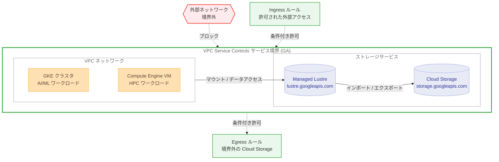

# VPC Service Controls: Managed Lustre インテグレーションが一般提供 (GA) に昇格

**リリース日**: 2026-03-10

**サービス**: VPC Service Controls

**機能**: Managed Lustre インテグレーション (General Availability)

**ステータス**: GA (一般提供)

[このアップデートのインフォグラフィックを見る](https://takech9203.github.io/google-cloud-news-summary/20260310-vpc-service-controls-managed-lustre-ga.html)

## 概要

VPC Service Controls と Google Cloud Managed Lustre のインテグレーションが一般提供 (GA) に昇格した。2026 年 2 月 11 日に Preview として発表されたこの統合が、約 1 か月の Preview 期間を経て本番環境での利用が正式にサポートされるようになった。これにより、Managed Lustre インスタンスを VPC Service Controls のサービス境界で保護し、データ流出リスクを軽減する構成を本番ワークロードで安心して採用できる。

Managed Lustre は AI/ML および HPC ワークロード向けに最適化されたフルマネージドの並列ファイルシステムであり、最大 1.5 TBps のスループットと最大 12,240,000 GiB (約 11.67 PiB) のストレージ容量を提供する。このようなミッションクリティカルなストレージサービスに対して、VPC Service Controls による境界保護が GA として正式サポートされたことは、規制要件やデータガバナンスの厳しい環境での Managed Lustre 採用を加速させる重要なマイルストーンである。

対象ユーザーは、Managed Lustre を使用して大規模データセットを処理しており、データ流出防止やコンプライアンス要件への対応が求められる組織のセキュリティ管理者、クラウドアーキテクト、および DevOps エンジニアである。

**アップデート前の課題**

Preview 期間中は VPC Service Controls と Managed Lustre の統合が利用可能であったが、本番環境での利用にはリスクがあった。

- Preview ステータスであったため「Pre-GA Offerings Terms」の条件が適用され、本番環境での使用にはサポートの制限があった
- 規制要件の厳しい業界 (金融、ヘルスケアなど) では、Preview 機能を本番環境に導入することが組織のポリシーにより認められないケースがあった
- SLA が適用されないため、ミッションクリティカルなワークロードでの採用が困難であった

**アップデート後の改善**

GA 昇格により、VPC Service Controls と Managed Lustre の統合が本番環境で正式にサポートされるようになった。

- 本番環境での利用が Google Cloud のサービスレベル契約 (SLA) の対象となり、エンタープライズグレードのサポートが提供される
- 規制要件の厳しい業界においても、組織のポリシーに準拠した形で VPC Service Controls による Managed Lustre の保護を導入できる
- Preview 期間中の制限や不安定性のリスクが解消され、安定した運用が可能になった

## アーキテクチャ図



VPC Service Controls のサービス境界内に Managed Lustre と Cloud Storage を配置し、境界外からの不正アクセスをブロックする構成を示す。GA 昇格により、この構成が本番環境で正式にサポートされる。Ingress/Egress ルールにより、必要な外部アクセスを条件付きで許可できる。

## サービスアップデートの詳細

### 主要機能

1. **サービス境界による Managed Lustre API の保護 (GA)**
   - `lustre.googleapis.com` をサービス境界に追加することで、境界外からの API リクエストを制御できる
   - GA 昇格により、本番環境での利用が正式にサポートされ、SLA の対象となる
   - 境界内のプロジェクト間では自由な通信が可能であり、既存のワークフローに影響を与えない

2. **Cloud Storage との連携におけるデータ転送制御**
   - Managed Lustre と Cloud Storage 間のデータインポート/エクスポートにおいて、同一境界内であれば追加設定不要で動作する
   - 境界外の Cloud Storage バケットとデータ転送する場合は、Managed Lustre サービスエージェント (`service-PROJECT_NUMBER@gcp-sa-lustre.iam.gserviceaccount.com`) に対する Egress ルールの構成が必要

3. **Shared VPC 環境でのサポート**
   - Shared VPC を使用している場合、ホストプロジェクト (ネットワーク) とサービスプロジェクト (Managed Lustre インスタンス) の両方を同一のサービス境界内に配置する必要がある
   - ホストプロジェクトとサービスプロジェクトを異なる境界で分離すると、既存インスタンスが利用不可になる可能性がある

## 技術仕様

### VPC Service Controls 統合の概要

| 項目 | 詳細 |
|------|------|
| サービス名 | `lustre.googleapis.com` |
| ステータス | GA (一般提供) |
| 境界保護 | 対応 (サービス境界でサービスを保護可能) |
| CMEK | VPC Service Controls 境界内では非対応 |
| Shared VPC | ホストプロジェクトとサービスプロジェクトは同一境界内に配置が必要 |
| SLA | GA として Google Cloud SLA の対象 |

### Managed Lustre の基本仕様

| 項目 | 詳細 |
|------|------|
| ストレージ容量 | 9,000 GiB から最大 12,240,000 GiB (11.67 PiB) |
| スループット | 最大 1.5 TBps |
| IOPS | 読み取り: 最大 5,800 IOPS/TiB、書き込み: 最大 5,600 IOPS/TiB |
| 最大ファイルサイズ | 0.5 PiB |
| パフォーマンスティア | 4 段階 (125 MBps/TiB から 1000 MBps/TiB) |
| POSIX 準拠 | 対応 |
| 暗号化 | 保存時暗号化、転送中暗号化 (Google Cloud 内) |

### VPC Service Controls の IAM 権限

VPC Service Controls でサービス境界を管理するために必要な権限は以下の通りである。

```
accesscontextmanager.accessPolicies.list
accesscontextmanager.servicePerimeters.create
accesscontextmanager.servicePerimeters.update
accesscontextmanager.servicePerimeters.delete
```

## 設定方法

### 前提条件

1. VPC Service Controls が有効化された Google Cloud 組織
2. Access Context Manager API が有効化されていること
3. 既存の Managed Lustre インスタンス、または新規作成の計画
4. サービス境界の管理に必要な IAM 権限

### 手順

#### ステップ 1: サービス境界の作成

サービス境界が未作成の場合は、新規に作成する。

```bash
gcloud access-context-manager perimeters create PERIMETER_NAME \
  --title="PERIMETER_TITLE" \
  --resources="projects/PROJECT_NUMBER" \
  --restricted-services="lustre.googleapis.com" \
  --policy=POLICY_ID
```

#### ステップ 2: 既存のサービス境界に Managed Lustre を追加

既存のサービス境界がある場合は、`lustre.googleapis.com` を制限対象サービスに追加する。

```bash
gcloud access-context-manager perimeters update PERIMETER_NAME \
  --add-restricted-services="lustre.googleapis.com" \
  --policy=POLICY_ID
```

#### ステップ 3: Cloud Storage との連携用 Egress ルールの構成 (必要な場合)

境界外の Cloud Storage バケットとデータ転送する場合は、Egress ルールを構成する。

```yaml
# egress_policy.yaml
- egressFrom:
    identityType: ANY_SERVICE_ACCOUNT
  egressTo:
    operations:
    - serviceName: storage.googleapis.com
      methodSelectors:
      - method: "*"
    resources:
    - "projects/EXTERNAL_PROJECT_NUMBER"
```

```bash
gcloud access-context-manager perimeters update PERIMETER_NAME \
  --set-egress-policies=egress_policy.yaml \
  --policy=POLICY_ID
```

#### ステップ 4: dry-run モードでの事前検証

本番環境に適用する前に、dry-run モードで境界構成をテストすることを推奨する。

```bash
gcloud access-context-manager perimeters dry-run create PERIMETER_NAME \
  --perimeter-title="PERIMETER_TITLE" \
  --perimeter-type="regular" \
  --perimeter-resources="projects/PROJECT_NUMBER" \
  --perimeter-restricted-services="lustre.googleapis.com" \
  --policy=POLICY_ID
```

## メリット

### ビジネス面

- **本番環境での正式サポート**: GA 昇格により SLA の対象となり、エンタープライズグレードのサポートが提供される。Preview 期間中は導入を見送っていた組織も、安心して本番環境への導入を進められる
- **コンプライアンス対応の強化**: 金融、ヘルスケア、政府機関など規制の厳しい業界において、Managed Lustre 上のデータに対するアクセス制御を強化し、コンプライアンス要件への対応を容易にする
- **データガバナンスの向上**: サービス境界によりデータ流出リスクを低減し、組織のデータガバナンスポリシーを技術的に実施できる

### 技術面

- **多層防御 (Defense in Depth)**: IAM による ID ベースのアクセス制御に加えて、VPC Service Controls による境界ベースのセキュリティを追加することで、セキュリティレイヤーを重層化できる
- **一貫したセキュリティポリシー**: Cloud Storage、BigQuery などの他の Google Cloud サービスと同じ VPC Service Controls のフレームワークで Managed Lustre を保護できるため、セキュリティポリシーの一貫性を維持できる
- **安定した運用**: GA ステータスにより、Preview 期間中に存在した潜在的な不安定性や仕様変更のリスクが解消され、長期的に安定した運用が可能になる

## デメリット・制約事項

### 制限事項

GA 昇格後も、以下の制限事項は引き続き存在する。

- VPC Service Controls の境界内では CMEK (顧客管理暗号鍵) が Managed Lustre でサポートされていない。境界内で CMEK を使用したインスタンスを作成しようとすると失敗する
- Managed Lustre と Cloud Storage 間のデータ転送において、Cloud Storage バケットを含むプロジェクトが境界外にある場合は Egress ルールの構成が必須となる
- Shared VPC 環境では、ホストプロジェクトとサービスプロジェクトを異なる境界に分離できない。分離すると既存インスタンスが利用不可になり、新規インスタンスの作成が妨げられる

### 考慮すべき点

- 境界の構成変更 (サービスの追加、Ingress/Egress ルールの変更) は既存のワークロードに影響を与える可能性があるため、dry-run モードでの事前テストを推奨する
- Network Connectivity Center (NCC) を使用してピアリング VPC から Managed Lustre にアクセスしている場合、VPC Service Controls との組み合わせにおける動作を事前に確認する必要がある
- CMEK を使用する要件がある場合は、VPC Service Controls の境界外で Managed Lustre インスタンスを運用するか、CMEK サポートが境界内で対応されるまで待つ必要がある

## ユースケース

### ユースケース 1: 金融機関における AI モデルトレーニングデータの保護

**シナリオ**: 金融機関が Managed Lustre を使用して大規模な取引データセットで AI モデルをトレーニングしている。規制要件により、トレーニングデータが組織外に流出しないことを技術的に保証する必要があり、GA ステータスの機能のみを使用するというポリシーがある。

**実装例**:

```bash
# サービス境界を作成し、Managed Lustre と Cloud Storage を保護
gcloud access-context-manager perimeters create finance-ml-perimeter \
  --title="Finance ML Training Perimeter" \
  --resources="projects/PROJECT_NUMBER" \
  --restricted-services="lustre.googleapis.com,storage.googleapis.com" \
  --policy=POLICY_ID
```

**効果**: GA 昇格により、組織のポリシーに準拠した形で VPC Service Controls による Managed Lustre の境界保護を本番環境に導入でき、データ流出リスクを技術的に軽減できる。

### ユースケース 2: ヘルスケア分野における医療画像データの保護

**シナリオ**: ヘルスケア企業が Managed Lustre を使用して大規模な医療画像データセットを処理している。HIPAA 等の規制要件に対応するため、データアクセスを厳密に制御する必要がある。

**効果**: VPC Service Controls のサービス境界により、Managed Lustre 上の医療画像データが境界外のプロジェクトやインターネットからアクセスされることを防止できる。GA ステータスにより、規制監査においても正式サポートされた機能として説明できる。

### ユースケース 3: マルチチーム環境におけるデータ分離

**シナリオ**: 大規模組織で複数のチームが異なるプロジェクトで Managed Lustre を使用しており、チーム間でデータが混在しないよう分離する必要がある。

**効果**: プロジェクトごとにサービス境界を設定することで、各チームの Managed Lustre インスタンスと Cloud Storage バケットを論理的に分離し、意図しないクロスプロジェクトアクセスを防止できる。

## 料金

VPC Service Controls 自体には追加料金は発生しない。Managed Lustre の料金は使用するストレージ容量とパフォーマンスティアに基づく。

### 料金例

| パフォーマンスティア | 最小容量 | 最大容量 |
|---------------------|---------|---------|
| 125 MBps/TiB | 72,000 GiB | 12,240,000 GiB (11.67 PiB) |
| 250 MBps/TiB | 36,000 GiB | 6,120,000 GiB (5.84 PiB) |
| 500 MBps/TiB | 18,000 GiB | 3,060,000 GiB (2.92 PiB) |
| 1000 MBps/TiB | 9,000 GiB | 1,530,000 GiB (1.46 PiB) |

詳細な料金情報は [Managed Lustre 料金ページ](https://cloud.google.com/products/managed-lustre/pricing) を参照されたい。

## 利用可能リージョン

Managed Lustre は以下の主要リージョンで利用可能である。VPC Service Controls は全リージョンで利用できるため、Managed Lustre が利用可能なすべてのリージョンで今回の GA インテグレーションを使用できる。

| リージョン | 説明 | ゾーン |
|------------|------|--------|
| asia-northeast1 | 東京 | asia-northeast1-b, asia-northeast1-c |
| asia-south1 | ムンバイ | asia-south1-b |
| asia-southeast1 | シンガポール | asia-southeast1-a, asia-southeast1-b, asia-southeast1-c |
| us-central1 | アイオワ | us-central1-a, us-central1-b, us-central1-c, us-central1-f |
| us-east1 | サウスカロライナ | us-east1-b, us-east1-c, us-east1-d |
| us-west1 | オレゴン | us-west1-a, us-west1-b, us-west1-c |
| europe-west1 | ベルギー | europe-west1-b, europe-west1-c, europe-west1-d |
| europe-west3 | フランクフルト | europe-west3-a, europe-west3-b, europe-west3-c |
| europe-west4 | オランダ | europe-west4-a, europe-west4-b, europe-west4-c |

全リージョンの一覧は [Managed Lustre のサポートされるロケーション](https://cloud.google.com/managed-lustre/docs/locations) を参照されたい。

## 関連サービス・機能

- **[VPC Service Controls](https://cloud.google.com/vpc-service-controls/docs/overview)**: サービス境界によりデータ流出防止とアクセス制御を提供する Google Cloud のセキュリティサービス。今回の統合対象
- **[Cloud Storage](https://cloud.google.com/storage/docs)**: Managed Lustre とのデータインポート/エクスポートに使用するオブジェクトストレージ。同一境界内への配置が推奨される
- **[Access Context Manager](https://cloud.google.com/access-context-manager/docs/overview)**: VPC Service Controls のアクセスレベルやサービス境界を管理するサービス
- **[Google Kubernetes Engine (GKE)](https://cloud.google.com/kubernetes-engine/docs)**: Managed Lustre CSI ドライバーを通じて Managed Lustre をボリュームとしてマウントできる。AI/ML ワークロードの実行基盤
- **[Compute Engine](https://cloud.google.com/compute/docs)**: Managed Lustre インスタンスをマウントして HPC ワークロードを実行する仮想マシンサービス
- **[Cloud Monitoring](https://cloud.google.com/monitoring/docs)**: Managed Lustre インスタンスのパフォーマンスメトリクスを自動収集し、ダッシュボードやアラートで可視化するモニタリングサービス

## 参考リンク

- [このアップデートのインフォグラフィック](https://takech9203.github.io/google-cloud-news-summary/20260310-vpc-service-controls-managed-lustre-ga.html)
- [公式リリースノート](https://docs.cloud.google.com/release-notes#March_10_2026)
- [VPC Service Controls と Managed Lustre のドキュメント](https://cloud.google.com/managed-lustre/docs/vpc-sc)
- [VPC Service Controls でサポートされるサービス一覧](https://cloud.google.com/vpc-service-controls/docs/supported-products)
- [Managed Lustre 概要](https://cloud.google.com/managed-lustre/docs/overview)
- [Managed Lustre VPC ネットワーク構成](https://cloud.google.com/managed-lustre/docs/vpc)
- [VPC Service Controls 概要](https://cloud.google.com/vpc-service-controls/docs/overview)
- [Managed Lustre 料金ページ](https://cloud.google.com/products/managed-lustre/pricing)

## まとめ

VPC Service Controls による Managed Lustre インテグレーションの GA 昇格は、高性能並列ファイルシステムのセキュリティ態勢を本番環境で正式にサポートする重要なマイルストーンである。Preview 期間中は導入を見送っていた規制要件の厳しい業界の組織も、この GA 昇格を機に VPC Service Controls による Managed Lustre の境界保護を本番環境に導入することを推奨する。dry-run モードを活用して事前にサービス境界の構成をテストし、段階的に導入を進めることが望ましい。

---

**タグ**: #VPCServiceControls #ManagedLustre #セキュリティ #GA #データ流出防止 #HPC #AIML #サービス境界 #コンプライアンス
