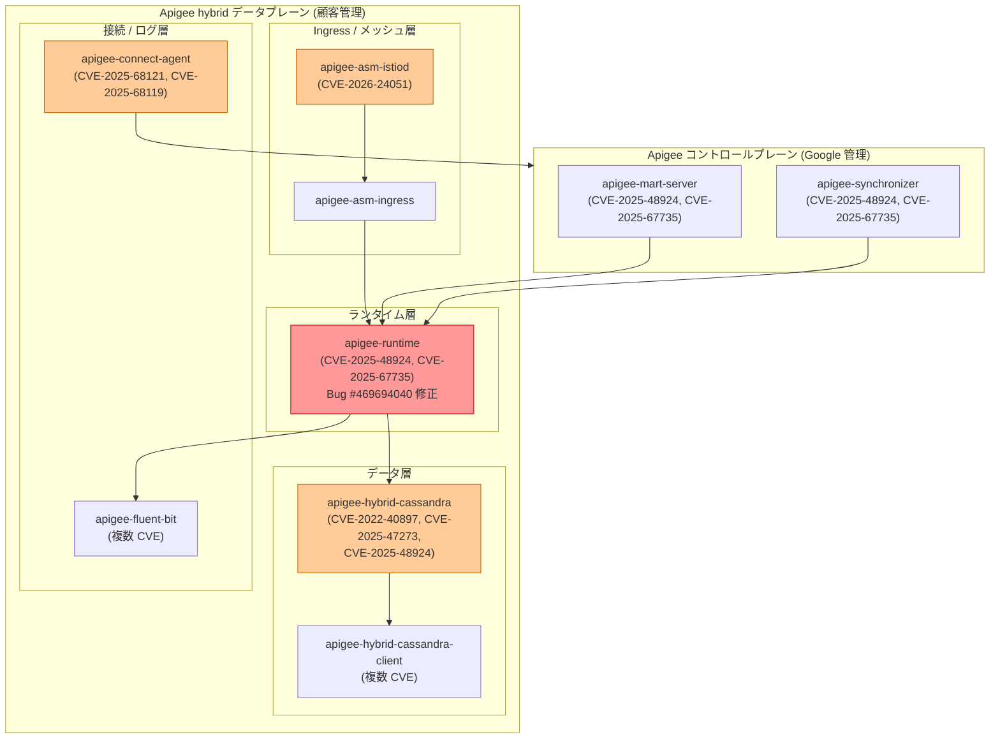

# Apigee hybrid: v1.15.2 パッチリリース (バグ修正 + セキュリティ修正)

**リリース日**: 2026-03-11
**サービス**: Apigee hybrid
**機能**: Apigee hybrid v1.15.2 パッチリリース
**ステータス**: 利用可能

[このアップデートのインフォグラフィックを見る](https://takech9203.github.io/google-cloud-news-summary/20260311-apigee-hybrid-v1-15-2.html)

## 概要

Google Cloud は 2026 年 3 月 11 日、Apigee hybrid ソフトウェアの更新バージョン v1.15.2 をリリースした。今回のパッチリリースでは、Java セキュリティポリシーに関するバグ修正と、複数のランタイムコンポーネントに対するセキュリティ脆弱性の修正が含まれている。

バグ修正では、ランタイム Pod の再起動や環境コントラクトの更新時にカスタム Java セキュリティポリシーが断続的に適用されない問題が解消された。この問題は Java Callout ポリシーにおいて "Permission denied" エラーを引き起こす可能性があり、API プロキシの正常な動作に影響を与えていた。

セキュリティ修正は、apigee-synchronizer、apigee-runtime、apigee-mart-server、apigee-hybrid-cassandra、apigee-fluent-bit、apigee-asm-ingress、apigee-asm-istiod、apigee-connect-agent、apigee-hybrid-cassandra-client など広範なコンポーネントに対して適用されている。対象ユーザーは Apigee hybrid v1.15.x を運用しているすべてのプラットフォーム管理者および API 管理者である。

**アップデート前の課題**

- ランタイム Pod の再起動時や環境コントラクトの更新時に、カスタム Java セキュリティポリシーが断続的に適用されず、Java Callout で "Permission denied" エラーが発生する可能性があった
- apigee-synchronizer、apigee-runtime、apigee-mart-server 等の主要コンポーネントに複数の CVE 脆弱性 (CVE-2025-48924、CVE-2025-67735 など) が存在していた
- apigee-hybrid-cassandra のベースイメージに既知の脆弱性 (CVE-2022-40897、CVE-2025-47273、CVE-2025-48924) が残存していた
- apigee-asm-istiod に CVE-2026-24051 が存在し、サービスメッシュのコントロールプレーンにセキュリティリスクがあった

**アップデート後の改善**

- Java セキュリティポリシーの適用が安定化し、Pod 再起動後も確実にカスタムポリシーが反映されるようになった
- 複数コンポーネントにわたるセキュリティ脆弱性が修正され、データプレーン全体のセキュリティポスチャが向上した
- Cassandra 関連コンポーネントの既知の脆弱性が解消され、データ層のセキュリティが強化された

## アーキテクチャ図



今回の v1.15.2 パッチで修正された各コンポーネントと、それぞれに関連する CVE を示す。赤色のコンポーネント (apigee-runtime) はバグ修正とセキュリティ修正の両方が適用された箇所を表す。

## サービスアップデートの詳細

### 主要機能

1. **Java セキュリティポリシーの断続的適用不具合の修正 (Bug #469694040)**
   - ランタイム Pod が再起動した際、または環境コントラクトが更新された際に、カスタム Java セキュリティポリシーが正しく適用されない場合がある問題を修正
   - この不具合により、Java Callout ポリシーで "Permission denied" エラーが発生し、API プロキシの処理が失敗する可能性があった
   - v1.14.1 で導入されたクラスインスタンス化の厳格化に関連する動作の安定性が向上

2. **コアランタイムコンポーネントのセキュリティ修正**
   - apigee-synchronizer、apigee-runtime、apigee-mart-server に対して CVE-2025-48924 および CVE-2025-67735 を修正
   - これらのコンポーネントは API プロキシの同期、実行、管理を担う中核機能であり、修正は直接的にデータプレーンのセキュリティ向上に寄与する

3. **データ層 (Cassandra) のセキュリティ修正**
   - apigee-hybrid-cassandra で CVE-2022-40897、CVE-2025-47273、CVE-2025-48924 を修正
   - apigee-hybrid-cassandra-client でも複数の CVE を修正
   - CVE-2022-40897 は Python パッケージ管理 (setuptools) に関する既知の脆弱性であり、長期間にわたって残存していた問題が今回解消された

4. **メッシュ / Ingress 層のセキュリティ修正**
   - apigee-asm-istiod に CVE-2026-24051 のパッチを適用
   - apigee-asm-ingress にもセキュリティ修正を適用
   - Istio ベースのサービスメッシュコントロールプレーンの安全性が向上

5. **接続 / ログ層のセキュリティ修正**
   - apigee-connect-agent で CVE-2025-68121 および CVE-2025-68119 等を修正
   - apigee-fluent-bit で複数の CVE を修正し、ログ収集コンポーネントのセキュリティを強化

## 技術仕様

### 修正されたバグ

| Bug ID | 説明 | 影響範囲 |
|--------|------|----------|
| 469694040 | ランタイム Pod 再起動時や環境コントラクト更新時にカスタム Java セキュリティポリシーが断続的に適用されない問題 | apigee-runtime |

### 修正されたセキュリティ脆弱性

| コンポーネント | CVE | 備考 |
|---------------|-----|------|
| apigee-synchronizer | CVE-2025-48924, CVE-2025-67735 | コアランタイム |
| apigee-runtime | CVE-2025-48924, CVE-2025-67735 | コアランタイム |
| apigee-mart-server | CVE-2025-48924, CVE-2025-67735 | コアランタイム |
| apigee-hybrid-cassandra | CVE-2022-40897, CVE-2025-47273, CVE-2025-48924 | データ層 |
| apigee-hybrid-cassandra-client | 複数 CVE | データ層 |
| apigee-fluent-bit | 複数 CVE | ログ収集 |
| apigee-asm-ingress | セキュリティ修正 | Ingress |
| apigee-asm-istiod | CVE-2026-24051 | メッシュコントロールプレーン |
| apigee-connect-agent | CVE-2025-68121, CVE-2025-68119 等 | 接続エージェント |

### アップグレード前提条件

| 項目 | 要件 |
|------|------|
| 現行バージョン | Apigee hybrid v1.14.x 以上 (v1.13 以前の場合は先に v1.14 へアップグレードが必要) |
| Helm | v3.14.2 以上 |
| kubectl | Kubernetes プラットフォームバージョンに対応したサポートバージョン |
| cert-manager | サポート対象バージョン |

## 設定方法

### 前提条件

1. Apigee hybrid v1.14.x 以上が稼働していること (v1.13 以前からの直接アップグレードは不可)
2. Helm v3.14.2 以上がインストールされていること
3. kubectl のサポートバージョンが利用可能であること

### 手順

#### ステップ 1: 現在のバージョンの確認

```bash
helm list -n apigee
```

現在インストールされている Apigee hybrid のバージョンを確認する。v1.14.x 以上であることを確認すること。

#### ステップ 2: Helm チャートの取得と更新

```bash
export HYBRID_VERSION=1.15.2

# Apigee Helm チャートリポジトリの更新
helm repo update apigee-hybrid
```

v1.15.2 の Helm チャートを取得する。

#### ステップ 3: Helm を使用したアップグレードの実行

```bash
# 各 Apigee コンポーネントを順番にアップグレード
helm upgrade apigee-operator apigee-hybrid/apigee-operator \
  --namespace apigee-system \
  --version ${HYBRID_VERSION} \
  -f overrides.yaml

helm upgrade apigee-datastore apigee-hybrid/apigee-datastore \
  --namespace apigee \
  --version ${HYBRID_VERSION} \
  -f overrides.yaml

helm upgrade apigee-env apigee-hybrid/apigee-env \
  --namespace apigee \
  --version ${HYBRID_VERSION} \
  -f overrides.yaml
```

公式のアップグレードガイドに従い、すべてのコンポーネントを順番にアップグレードする。詳細な手順は [Upgrading Apigee hybrid to version v1.15.2](https://docs.google.com/apigee/docs/hybrid/v1.15/upgrade) を参照すること。

#### ステップ 4: アップグレード後の確認

```bash
# Pod のステータスを確認
kubectl get pods -n apigee
kubectl get pods -n apigee-system

# バージョンの確認
helm list -n apigee
helm list -n apigee-system
```

すべての Pod が Running 状態であることを確認する。

## メリット

### ビジネス面

- **API 信頼性の向上**: Java Callout ポリシーの断続的なエラーが解消されることで、API プロキシの安定稼働が実現し、ダウンタイムやエラーレートの低減につながる
- **コンプライアンス要件の充足**: 複数の CVE が修正されることで、FedRAMP やその他のセキュリティコンプライアンス基準への適合が維持される

### 技術面

- **ランタイムの安定性向上**: Pod 再起動時のセキュリティポリシー適用の信頼性が向上し、ローリングアップデートやスケーリング時の予期しない動作が解消される
- **セキュリティポスチャの強化**: 9 つのコンポーネントにわたる広範なセキュリティ修正により、データプレーン全体の攻撃対象面が縮小される
- **既知の脆弱性の解消**: CVE-2022-40897 のような長期間残存していた脆弱性が修正され、セキュリティスキャン結果が改善される

## デメリット・制約事項

### 制限事項

- Apigee hybrid v1.13 以前からの直接アップグレードは不可。先に v1.14 へのアップグレードが必要
- パッチ適用にはデータプレーンのローリング再起動が伴うため、一時的なサービス中断の可能性がある
- Cassandra のバックアップとリストアは混合バージョン間では動作しないため、全クラスタを可能な限り速やかにアップグレードする必要がある

### 考慮すべき点

- 本番環境では、最低 2 クラスタ構成でトラフィックを切り替えながらアップグレードすることが推奨される
- v1.14.1 で導入されたクラスインスタンス化の厳格化チェックにより、サードパーティライブラリを使用するカスタム Java Callout ポリシーに影響が出る可能性がある。アップグレード後にポリシーの動作確認を行うことを推奨
- Apigee hybrid のセキュリティパッチは共有責任モデルに基づいており、データプレーンのパッチ適用は顧客側の責任となる

## ユースケース

### ユースケース 1: Java Callout を使用した API プロキシの安定化

**シナリオ**: カスタム Java Callout ポリシーを使用して認証トークンの検証やデータ変換を行っている API プロキシが、ランタイム Pod のスケーリングやローリングアップデート時に断続的に "Permission denied" エラーを返していた。

**効果**: v1.15.2 へのアップグレードにより、Pod 再起動後もカスタム Java セキュリティポリシーが確実に適用され、エラーが解消される。API の可用性と信頼性が向上する。

### ユースケース 2: セキュリティコンプライアンスの維持

**シナリオ**: 金融機関や医療機関など、厳格なセキュリティ基準を満たす必要がある組織が、定期的なコンテナセキュリティスキャンで Apigee hybrid コンポーネントに CVE が検出されている。

**効果**: v1.15.2 へのアップグレードにより、CVE-2022-40897 を含む複数の既知の脆弱性が修正され、セキュリティスキャン結果が改善される。コンプライアンス監査への対応が容易になる。

## 料金

Apigee hybrid v1.15.2 へのパッチアップグレードに追加料金は発生しない。Apigee hybrid の利用料金は既存のサブスクリプションプランに基づく。

| プラン | 概要 |
|--------|------|
| Apigee Standard | 基本的な API 管理機能 |
| Apigee Enterprise | 高度なセキュリティ、分析、モネタイゼーション機能を含む |
| Apigee Enterprise Plus | 最上位プランで、Advanced API Security 等を含む |

詳細は [Apigee の料金ページ](https://cloud.google.com/apigee/pricing) を参照すること。

## 利用可能リージョン

Apigee hybrid はハイブリッドデプロイメントモデルであるため、データプレーンは顧客が管理する任意の Kubernetes 環境で動作する。コントロールプレーンのリージョンは Apigee の組織設定に依存する。サポートされるプラットフォームには GKE、GKE on VMware、GKE on AWS、GKE on Azure、GKE on Bare Metal、および OpenShift が含まれる。

## 関連サービス・機能

- **Apigee X**: Google が完全に管理する Apigee のフルマネージド版。セキュリティパッチは Google が自動的に適用する
- **Anthos Service Mesh / Cloud Service Mesh**: apigee-asm-ingress および apigee-asm-istiod は Istio ベースのサービスメッシュコンポーネントであり、今回セキュリティ修正が含まれている
- **Apache Cassandra**: apigee-hybrid-cassandra は Apigee hybrid のデータストアとして使用されており、今回複数の CVE が修正された
- **Apigee Java Callout ポリシー**: 今回のバグ修正の直接的な対象。カスタム Java コードを API プロキシ内で実行するための機能

## 参考リンク

- [インフォグラフィック](https://takech9203.github.io/google-cloud-news-summary/20260311-apigee-hybrid-v1-15-2.html)
- [公式リリースノート](https://docs.cloud.google.com/release-notes#March_11_2026)
- [Apigee hybrid v1.15 アップグレードガイド](https://docs.cloud.google.com/apigee/docs/hybrid/v1.15/upgrade)
- [Apigee hybrid 新規インストールガイド](https://docs.cloud.google.com/apigee/docs/hybrid/v1.15/big-picture)
- [Apigee hybrid セキュリティパッチポリシー](https://docs.cloud.google.com/apigee/docs/hybrid/security-patching)
- [料金ページ](https://cloud.google.com/apigee/pricing)

## まとめ

Apigee hybrid v1.15.2 は、Java Callout ポリシーの安定性に影響するバグ修正と、9 つのコンポーネントにわたる広範なセキュリティ修正を含む重要なパッチリリースである。特に Java Callout を使用している環境では "Permission denied" エラーの解消が期待でき、また複数の CVE 修正によりデータプレーン全体のセキュリティポスチャが大幅に向上する。Apigee hybrid v1.15.x を運用しているすべての環境において、速やかに v1.15.2 へのアップグレードを計画・実施することを強く推奨する。

---

**タグ**: Apigee hybrid, セキュリティパッチ, バグ修正, Java Callout, CVE, v1.15.2, Cassandra, Istio, API 管理
