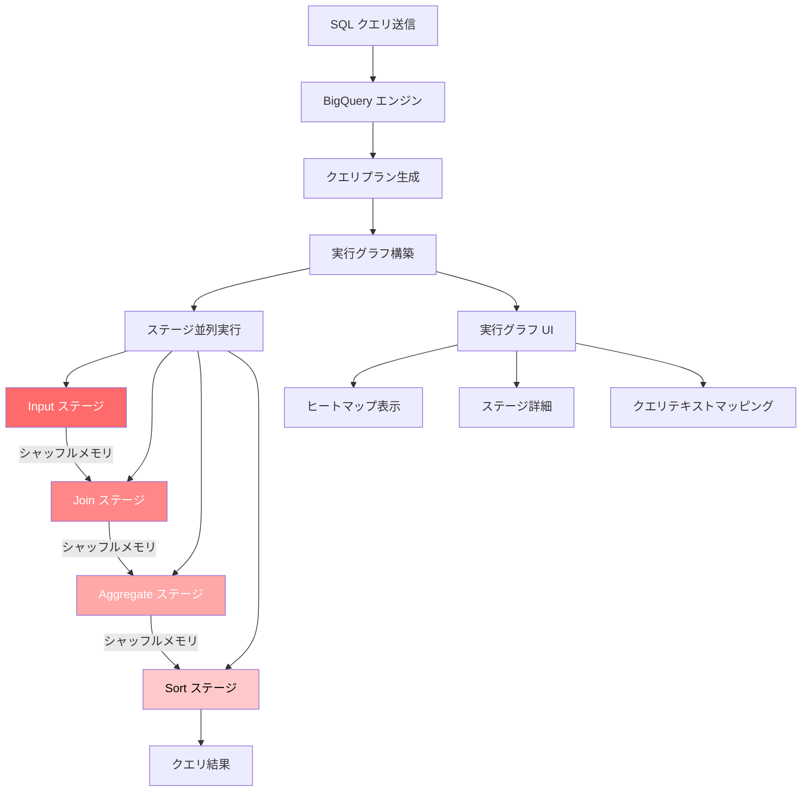

# BigQuery: クエリ実行グラフが一般提供 (GA) に昇格

**リリース日**: 2026-03-11

**サービス**: BigQuery

**機能**: クエリ実行グラフ (Query Execution Graph)

**ステータス**: GA (一般提供)

[このアップデートのインフォグラフィックを見る](https://takech9203.github.io/google-cloud-news-summary/20260311-bigquery-query-execution-graph-ga.html)

## 概要

BigQuery のクエリ実行グラフ機能が一般提供 (GA) となった。この機能は、SQL クエリの実行計画をビジュアルなグラフとして表示し、クエリパフォーマンスの理解とデバッグを支援する。ヒートマップによりスロットタイムを多く消費するステージが視覚的にハイライトされるため、パフォーマンスボトルネックの特定が容易になる。

BigQuery は高度な分散並列アーキテクチャを採用しており、SQL の宣言的な性質がクエリ実行の複雑さを隠す場合がある。クエリが想定より遅い場合や過去の実行と比較してパフォーマンスが低下した場合、原因を特定することが困難だった。クエリ実行グラフは、クエリプランと実行パフォーマンスの詳細を動的なグラフィカルインターフェースで提供し、実行中または完了済みのクエリに対して利用できる。

この機能は、データエンジニア、データアナリスト、Solutions Architect など、BigQuery でクエリパフォーマンスの最適化に取り組むすべてのユーザーに有用である。

**アップデート前の課題**

- クエリの実行計画はテキストベースの Execution Details でしか確認できず、複雑なクエリのボトルネック特定が直感的でなかった
- どのステージがスロットタイムを多く消費しているかを把握するには、個々のステージの統計を手動で比較する必要があった
- SQL テキストのどの部分がパフォーマンスに大きく影響しているかを可視化する手段が限られていた

**アップデート後の改善**

- クエリ実行計画をグラフ形式で視覚的に確認でき、ステージ間のデータフローとシャッフルメモリの流れが一目で把握できるようになった
- ヒートマップによりスロットタイムを多く消費するステージが色の濃さで即座に特定できるようになった
- クエリテキストヒートマップにより、SQL のどの部分がパフォーマンスに影響しているかを視覚的にマッピングできるようになった

## アーキテクチャ図



BigQuery がクエリを受け取ると実行グラフに変換し、各ステージを並列実行する。実行グラフ UI ではヒートマップによりスロットタイム消費量の多いステージが視覚的にハイライトされる。

## サービスアップデートの詳細

### 主要機能

1. **実行グラフの視覚化**
   - クエリプランの各ステージをノードとして表示し、ステージ間のシャッフルメモリのやり取りをエッジとして表現
   - ステージ名はその主要な処理内容を要約 (例: JOIN、Aggregate、Sort)
   - ステージ名末尾の「+」は追加の重要なステップがあることを示す
   - エッジ上の数値はステージ間で交換される推定行数を表示

2. **スロットタイムヒートマップ**
   - ステージのスロットタイム消費量に基づいた色分け表示
   - スロットタイムが多いステージほど濃い赤色で表示
   - 「Highlight top stages by duration」と「Highlight top stages by processing」の切り替えが可能

3. **クエリテキストヒートマップ**
   - SQL テキストとステージのステップをマッピングし、パフォーマンスへの影響箇所を可視化
   - クエリテキスト上のマッピングされた部分にカーソルを合わせると、関連するステージとスロットタイムがツールチップで表示
   - ビュー参照時はビューのクエリテキストも表示

4. **パフォーマンスインサイト**
   - クエリのパフォーマンス改善に関するベストエフォートの提案を提供
   - ステージごとにインサイトの有無がアイコンで表示 (情報アイコン: インサイトあり、チェックアイコン: インサイトなし)

## 技術仕様

### ステージの種類と詳細

| ステージタイプ | 説明 |
|---------------|------|
| Input | テーブルからのデータ読み取り、カラム選択 |
| Join | JOIN 条件に基づくデータ結合 |
| Aggregate | SUM などの集計計算 |
| Sort | 結果の並び替え |
| Repartition | データ分散の改善 (デフォルトで非表示) |
| Coalesce | データ統合 (デフォルトで非表示) |

### 必要な IAM 権限

| 権限 | 説明 |
|------|------|
| `bigquery.jobs.get` | ジョブ情報の取得 |
| `bigquery.jobs.listAll` | すべてのジョブの一覧表示 |

以下の事前定義された IAM ロールで上記の権限が付与される:

```
roles/bigquery.admin
roles/bigquery.resourceAdmin
roles/bigquery.resourceEditor
roles/bigquery.resourceViewer
```

## 設定方法

### 前提条件

1. Google Cloud プロジェクトで BigQuery が有効化されていること
2. 必要な IAM ロール (`bigquery.jobs.get`, `bigquery.jobs.listAll`) が付与されていること

### 手順

#### ステップ 1: BigQuery コンソールでジョブ履歴を開く

Google Cloud コンソールの BigQuery ページにアクセスし、左側の Explorer ペインで「Job history」をクリックする。「Personal History」または「Project History」を選択する。

#### ステップ 2: 対象クエリの実行グラフを表示

ジョブ一覧から対象のクエリジョブを選択し、「Actions」メニューから「View job in editor」を選択する。「Execution graph」タブをクリックして実行グラフを表示する。

#### ステップ 3: パフォーマンス分析

- ステージをクリックしてステージ詳細パネルを開き、統計情報、ステップ詳細、パフォーマンスインサイトを確認する
- 実行中のクエリの場合は「Sync」ボタンで最新状態に更新する
- 「Show shuffle redistribution stages」でシャッフル再分配ステージの表示を切り替える

## メリット

### ビジネス面

- **パフォーマンス改善による運用コスト削減**: ボトルネックを迅速に特定し最適化することで、スロットタイム消費を削減し、オンデマンド料金モデルでは処理データ量の削減、容量ベースモデルではスロット使用効率の向上が期待できる
- **トラブルシューティング時間の短縮**: 視覚的なインターフェースにより、クエリパフォーマンス問題の原因特定が迅速化され、エンジニアの生産性が向上する

### 技術面

- **直感的なボトルネック特定**: ヒートマップにより、テキストベースの情報を手動で比較する必要がなくなり、パフォーマンスの問題箇所を即座に把握できる
- **SQL とステージのマッピング**: クエリテキストヒートマップにより、SQL のどの部分が実行コストに影響しているかを可視化でき、クエリの書き換え箇所を特定しやすくなる
- **GA 昇格による安定性**: 本番ワークロードでのパフォーマンス分析に安心して利用できる

## デメリット・制約事項

### 制限事項

- クエリテキストヒートマップの色はステージ全体のスロットタイムに基づいており、個々のステップのスロットタイムは測定されないため、複数の複雑な操作を行うステージでは実際のスロットタイムが過大に表現される場合がある
- 参照しているビューが削除された場合、または `bigquery.tables.get` 権限を失った場合、そのビューのステップマッピングは表示されない
- 実行グラフが複雑すぎる場合、サブステップが切り詰められることがある
- ドライランリクエストやキャッシュ結果を使用するクエリには実行グラフが生成されない

### 考慮すべき点

- パフォーマンスインサイトはベストエフォートの提案であり、クエリパフォーマンスの全体像を示すとは限らない
- シャッフルメモリがクォータを超過してディスクにスピルすると、クエリパフォーマンスが大幅に低下する可能性がある。実行グラフでこの状況を検知し、スロット数の見直しを検討する必要がある

## ユースケース

### ユースケース 1: 遅いクエリのボトルネック特定

**シナリオ**: データエンジニアが毎日実行しているパイプラインクエリの実行時間が徐々に増加していることに気づいた。実行グラフを使用してボトルネックを特定する。

**実装例**:
1. BigQuery コンソールで対象クエリのジョブ履歴を開く
2. 「Execution graph」タブでヒートマップを確認し、濃い赤色のステージを特定
3. 該当ステージをクリックし、ステップ詳細で JOIN 操作が大量の中間データを生成していることを発見
4. クエリテキストヒートマップで該当する SQL の JOIN 句を特定し、フィルタ条件の追加で最適化

**効果**: JOIN ステージの出力行数を削減し、クエリ実行時間を大幅に短縮できる

### ユースケース 2: コスト最適化のためのスロットタイム分析

**シナリオ**: 容量ベースの料金モデルを利用している組織が、スロット使用量の最適化を検討している。高コストなクエリのスロットタイム消費パターンを分析する。

**効果**: スロットタイムを多く消費するステージを特定し、クエリの書き換えやデータモデルの見直しにより、必要なスロット数を削減し、容量コストを最適化できる

## 料金

クエリ実行グラフ自体に追加料金は発生しない。BigQuery の標準機能として含まれている。

BigQuery の料金モデルは以下の 2 種類がある:

| 料金モデル | 課金方式 | 特徴 |
|-----------|---------|------|
| オンデマンド | クエリ処理データ量 (TiB 単位) | デフォルト、プロジェクトごとのスロット上限あり |
| 容量ベース (Editions) | スロット時間 (スロット/時間) | ベースライン + オートスケーリング、エディション選択可能 |

詳細は [BigQuery 料金ページ](https://cloud.google.com/bigquery/pricing) を参照。

## 利用可能リージョン

BigQuery が利用可能なすべてのリージョンおよびマルチリージョンで使用可能。詳細は [BigQuery のロケーション](https://cloud.google.com/bigquery/docs/locations) を参照。

## 関連サービス・機能

- **BigQuery INFORMATION_SCHEMA.JOBS ビュー**: クエリプランとタイムライン情報をプログラムで取得でき、実行グラフと組み合わせてパフォーマンス分析を自動化できる
- **Cloud Monitoring**: BigQuery のスロット使用率やジョブメトリクスを監視し、実行グラフで特定したボトルネックのモニタリングに活用できる
- **BigQuery Reservations**: 容量ベースモデルでのスロット管理。実行グラフで特定したスロットタイム消費パターンに基づきリザベーションの最適化が可能
- **BigQuery Visualizer**: オープンソースの可視化ツール。実行グラフの補完として、ジョブ実行のフローを視覚的に分析できる

## 参考リンク

- [インフォグラフィック](https://takech9203.github.io/google-cloud-news-summary/20260311-bigquery-query-execution-graph-ga.html)
- [公式リリースノート](https://docs.cloud.google.com/release-notes#March_11_2026)
- [クエリ実行グラフ ドキュメント](https://cloud.google.com/bigquery/docs/query-insights)
- [クエリプランの説明](https://cloud.google.com/bigquery/docs/query-plan-explanation)
- [パフォーマンス最適化ガイド](https://cloud.google.com/bigquery/docs/best-practices-performance-overview)
- [料金ページ](https://cloud.google.com/bigquery/pricing)

## まとめ

BigQuery のクエリ実行グラフが GA となり、クエリパフォーマンスの視覚的な分析が本番環境で安定して利用可能になった。ヒートマップとクエリテキストマッピングにより、SQL のどの部分がパフォーマンスボトルネックになっているかを直感的に特定でき、クエリ最適化の効率が大幅に向上する。BigQuery を利用しているチームは、パフォーマンスに課題のあるクエリに対してまず実行グラフを確認することを推奨する。

---

**タグ**: #BigQuery #QueryPerformance #ExecutionGraph #GA #パフォーマンス最適化 #クエリ分析
