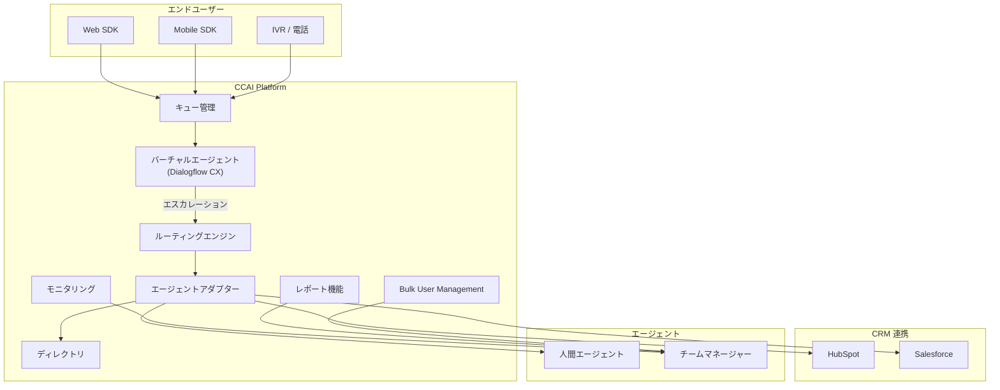

# Google Cloud Contact Center as a Service (CCaaS): 複数のバグ修正と新機能追加

**リリース日**: 2026-03-11

**サービス**: Google Cloud Contact Center as a Service (CCaaS) / CCAI Platform

**機能**: バグ修正 12 件および新機能 3 件

**ステータス**: Fixed + Feature

[このアップデートのインフォグラフィックを見る](https://takech9203.github.io/google-cloud-news-summary/20260311-ccaas-bug-fixes-features-march.html)

## 概要

Google Cloud Contact Center as a Service (CCaaS) / CCAI Platform において、2026 年 3 月 11 日付けで 12 件のバグ修正と 3 件の新機能がリリースされた。CCAI Platform は Google Cloud 上にネイティブに構築された AI 駆動のコンタクトセンタープラットフォームであり、Gemini Enterprise for CX の中核を構成するサービスである。

今回のアップデートでは、エージェントアダプター、キュー管理、CRM 連携 (Salesforce / HubSpot)、チャットモニタリング、Web SDK など、プラットフォーム全体にわたる幅広い修正が行われた。特にキュー管理画面の読み込み問題やエージェントレポートのダウンロード障害など、運用に直接影響する問題が解消されている。

新機能としては、HubSpot 連携の強化が目立つ。モバイル電話番号によるルックアップ機能や Company プロファイルに対する検索機能が追加され、CRM 統合の幅が広がった。また、内線検索における複数エージェントマッチの改善により、エージェント間の転送操作がより効率的になった。

**アップデート前の課題**

- 大量のキューを持つインスタンスでキュー管理ページが読み込めなかった
- エージェントアダプターでインタラクション履歴が空で表示される場合があった
- Salesforce の Person Account 設定でアカウントルックアップ設定を保存できなかった
- チャットアダプターの「以前のインタラクション」に重複・不正確な見出しが表示されていた
- チームマネージャーが「全エージェント」フィルターでエージェントレポートをダウンロードできなかった
- 営業時間外のバーチャルエージェントチャットエスカレーションで失敗理由が記録されなかった
- Bulk User Management での非アクティブ化処理が失敗していた
- チャットモニタリング画面で吹き出しのずれや名前の欠落が発生していた
- 内部通話転送時にディレクトリ画面が空で表示されていた
- Web SDK でテキストメッセージのアンダースコアが削除されていた
- Web SDK の iOS でサーベイボタンが非表示になっていた

**アップデート後の改善**

- 大量のキューを持つインスタンスでもキュー管理ページが正常に読み込まれるようになった
- エージェントアダプターのインタラクション履歴が正しく表示されるようになった
- Salesforce Person Account でのアカウントルックアップ設定保存が可能になった
- チャットアダプターの「以前のインタラクション」の見出しが正しく表示されるようになった
- チームマネージャーが「全エージェント」フィルターでレポートをダウンロードできるようになった
- バーチャルエージェントチャットの営業時間外エスカレーション失敗理由が記録されるようになった
- Bulk User Management の非アクティブ化が正常に動作するようになった
- チャットモニタリング画面の表示が修正された
- 内部通話転送時のディレクトリ画面が正しく表示されるようになった
- HubSpot 連携でモバイル電話番号ルックアップおよび Company プロファイル検索が利用可能になった
- 内線検索での複数エージェントマッチが 8 件ずつのグループ表示に改善された

## アーキテクチャ図



CCAI Platform の主要コンポーネントと今回のアップデートの影響範囲を示す。エンドユーザーからのインタラクションはキュー管理を経由してバーチャルエージェントまたは人間エージェントにルーティングされ、CRM 連携を通じて顧客情報が参照される。

## サービスアップデートの詳細

### バグ修正

1. **キュー管理ページの読み込み修正**
   - 大量のキューを持つインスタンスでキュー管理ページ (Settings > Queue) が読み込まれない問題が修正された
   - 大規模なコンタクトセンター運用において、キューの設定変更やエージェント割り当てが正常に行えるようになった

2. **エージェントアダプターのインタラクション履歴修正**
   - エージェントアダプターでインタラクション履歴が空で表示される問題が修正された
   - エージェントが過去のやり取りを参照しながら対応できるようになり、顧客対応品質の向上に寄与

3. **Salesforce Person Account ルックアップ設定の修正**
   - Salesforce で Person Account を使用している場合にアカウントルックアップ設定を保存できない問題が修正された
   - B2C ビジネスで一般的に使用される Person Account モデルでの CRM 連携が正常に機能するようになった

4. **チャットアダプター「以前のインタラクション」の修正**
   - チャットアダプターの「Previous Interactions」セクションで重複した見出しや不正確な見出しが表示される問題が修正された
   - エージェントが正確な履歴情報を参照できるようになった

5. **チームマネージャーのレポートダウンロード修正**
   - チームマネージャーが「All Agents」フィルターを使用してエージェントレポートをダウンロードできない問題が修正された
   - チーム全体のパフォーマンス分析が可能になった

6. **バーチャルエージェントエスカレーション失敗理由の記録修正**
   - 営業時間外にバーチャルエージェントチャットがエスカレーションされた場合の失敗理由が記録されない問題が修正された
   - エスカレーション分析や運用改善のためのデータが正確に取得できるようになった

7. **Bulk User Management 非アクティブ化の修正**
   - Bulk User Management での一括ユーザー非アクティブ化処理が失敗する問題が修正された
   - 大量のユーザー管理操作が正常に実行できるようになった

8. **チャットモニタリング画面の表示修正**
   - チャットモニタリング画面で吹き出しのずれや参加者名の欠落が発生する問題が修正された
   - スーパーバイザーがリアルタイムでチャットセッションを正確にモニタリングできるようになった

9. **ディレクトリ画面の修正**
   - 内部通話転送時にディレクトリ画面が空で表示される問題が修正された
   - エージェント間の転送操作がスムーズに行えるようになった

10. **エージェント優先度 (Deltacast) の修正**
    - Deltacast 選択におけるエージェント優先度の問題が修正された
    - ルーティングの優先度設定が正しく適用されるようになった

11. **Web SDK テキストメッセージのアンダースコア修正**
    - Web SDK でテキストメッセージ内のアンダースコアが削除される問題が修正された
    - 技術的な内容やコード片を含むメッセージが正確に表示されるようになった

12. **Web SDK iOS サーベイボタンの修正**
    - Web SDK の iOS 環境でセッション後のサーベイボタンが非表示になる問題が修正された
    - iOS ユーザーからのフィードバック収集が正常に機能するようになった

### 新機能

1. **HubSpot モバイル電話番号ルックアップ**
   - 音声およびチャットセッションで HubSpot のモバイル電話番号を使用したルックアップが可能になった
   - 固定電話番号だけでなく、モバイル電話番号でも顧客の CRM レコードを自動検索できるようになり、顧客特定の精度が向上

2. **複数エージェントマッチの改善 (内線検索)**
   - 内線番号検索で複数のエージェントがマッチした場合の表示が改善された
   - 8 件ずつのグループで表示されるようになり、大量のエージェントがいる環境での内線検索・転送操作が効率化された

3. **HubSpot Company プロファイルルックアップ**
   - HubSpot の Company プロファイル (Contacts および Companies) に対するルックアップが可能になった
   - B2B シナリオにおいて、企業レベルでの顧客情報参照が実現し、より包括的な顧客コンテキストの把握が可能に

## 技術仕様

### 影響範囲

| コンポーネント | 修正/機能 | 影響 |
|------|------|------|
| キュー管理 (Settings > Queue) | バグ修正 | 大量キューインスタンスの読み込み改善 |
| エージェントアダプター | バグ修正 | インタラクション履歴の表示修正 |
| Salesforce 連携 | バグ修正 | Person Account ルックアップ設定の保存 |
| チャットアダプター | バグ修正 | Previous Interactions 見出しの修正 |
| レポート機能 | バグ修正 | All Agents フィルターでのダウンロード |
| バーチャルエージェント | バグ修正 | 営業時間外エスカレーション失敗理由の記録 |
| Bulk User Management | バグ修正 | 一括非アクティブ化処理の修正 |
| チャットモニタリング | バグ修正 | 表示ずれ・名前欠落の修正 |
| ディレクトリ | バグ修正 | 内部転送時の空表示修正 |
| ルーティング (Deltacast) | バグ修正 | エージェント優先度の修正 |
| Web SDK | バグ修正 | アンダースコア削除・iOS サーベイボタン |
| HubSpot 連携 | 新機能 | モバイル電話番号ルックアップ、Company ルックアップ |
| 内線検索 | 新機能 | 複数マッチ時の 8 件グループ表示 |

### HubSpot 連携の設定

HubSpot 連携の設定は CCAI Platform ポータルの Settings > Developer Settings > CRM から行う。

```
Settings > Developer Settings > CRM
  Agent Platform: HubSpot
    - HubSpot Domain ID
    - API Key (Private App Auth Token)
    - CRM Record Type (Tickets / Deals)
    - Phone Number Format
    - Attach call data to Call object
    - Attach session metadata files to CRM records
```

新たに追加されたモバイル電話番号ルックアップおよび Company プロファイルルックアップは、既存の HubSpot 連携設定の範囲内で有効化される。

## メリット

### ビジネス面

- **コンタクトセンター運用の安定性向上**: キュー管理やレポート機能の修正により、大規模環境での安定した運用が可能になった
- **顧客対応品質の向上**: インタラクション履歴やチャットモニタリングの修正により、エージェントとスーパーバイザーが正確な情報を基に対応できるようになった
- **CRM 連携の強化**: HubSpot の新しいルックアップ機能により、B2B / B2C 両方のシナリオで顧客情報の自動取得精度が向上した
- **フィードバック収集の改善**: iOS でのサーベイボタン修正により、顧客満足度データの収集率が向上する

### 技術面

- **スケーラビリティの改善**: 大量のキューを持つインスタンスでの読み込み問題が解消され、大規模デプロイメントの信頼性が向上した
- **Web SDK の安定性向上**: テキストメッセージの処理やクロスプラットフォーム (iOS) の互換性が改善された
- **CRM API 統合の拡張**: HubSpot の Company オブジェクトへの検索がサポートされ、Contacts と Companies の両方からの統合的なルックアップが実現した
- **運用データの正確性向上**: バーチャルエージェントエスカレーションの失敗理由記録の修正により、運用分析データの品質が向上した

## デメリット・制約事項

### 制限事項

- 今回のバグ修正は既存の問題の解消であり、新たなアーキテクチャ変更を伴うものではない
- HubSpot Company ルックアップは Contacts と Companies オブジェクトに限定される
- CCAI Platform のインスタンスサイズとクォータの制限は引き続き適用される (Small: 250 同時セッション～ 3X-Large: 100,000 同時セッション)

### 考慮すべき点

- 大量のキューを持つ環境では、修正後もパフォーマンスを確認することを推奨
- HubSpot の新しいルックアップ機能を使用するには、HubSpot 側の Private App に適切な API スコープ (Contacts, Companies) が設定されている必要がある
- Web SDK を使用しているカスタマーは、最新バージョンへの更新が必要な場合がある

## ユースケース

### ユースケース 1: B2B コンタクトセンターでの HubSpot Company ルックアップ活用

**シナリオ**: 法人向けサポートセンターで、着信した顧客の電話番号から HubSpot の Company プロファイルを自動検索し、企業情報と過去のチケット履歴をエージェントに表示する。

**効果**: エージェントは通話開始前に顧客企業の契約状況やサポート履歴を把握でき、初回応答時間の短縮と顧客満足度の向上が期待される。

### ユースケース 2: 大規模コンタクトセンターでのキュー管理

**シナリオ**: 数百のキューを運用する大規模コンタクトセンターで、キュー管理ページの読み込み問題が解消されたことにより、管理者がスムーズにキュー設定の変更やエージェント配置の最適化を行える。

**効果**: 運用管理のダウンタイムが削減され、トラフィック変動に対する迅速なキュー調整が可能になる。

### ユースケース 3: バーチャルエージェント運用の改善

**シナリオ**: 24 時間対応のバーチャルエージェントが営業時間外にエスカレーションを試みた場合の失敗理由が正確に記録されるようになったことで、運用チームがエスカレーションパターンを分析し、バーチャルエージェントのフロー設計を最適化する。

**効果**: 営業時間外の顧客対応フローが改善され、不要なエスカレーションの削減や適切なデフレクション設定の実施が可能になる。

## 料金

CCAI Platform はインスタンスベースの月額課金モデルを採用しており、以下の課金方式がある。

- **同時エージェント数**: 月間の最大同時ログインエージェント数に基づく課金
- **ネームドエージェント数**: エージェントロールを持つ総ユーザー数に基づく課金
- **利用時間 (分)**: エージェントのログイン時間に基づく課金

テレフォニー料金は従量課金で別途発生する。今回のバグ修正および新機能追加による追加料金は発生しない。

詳細な料金情報については [CCAI Platform 料金ページ](https://cloud.google.com/contact-center/ccai-platform/pricing) を参照。

## 利用可能リージョン

CCAI Platform の利用可能リージョンについては [ロケーションページ](https://cloud.google.com/contact-center/ccai-platform/docs/localities) を参照。

## 関連サービス・機能

- **Dialogflow CX**: CCAI Platform のバーチャルエージェント基盤。今回のエスカレーション失敗理由の記録修正はバーチャルエージェント運用に直接関連する
- **Gemini Enterprise for CX**: CCAI Platform を含む Google Cloud のカスタマーエクスペリエンス向け AI ソリューション群
- **Agent Assist**: エージェント支援機能。インタラクション中にリアルタイムで推奨事項やナレッジ記事を提示する
- **Customer Experience Insights (CCAI Insights)**: コンタクトセンターのインタラクションデータを分析し、コールドライバーやセンチメントを可視化する
- **Salesforce 連携**: 今回の Person Account 修正が関連。CCAI Platform は Salesforce との標準連携を提供している
- **HubSpot 連携**: 今回のモバイル電話番号ルックアップおよび Company ルックアップの新機能が追加された

## 参考リンク

- [インフォグラフィック](https://takech9203.github.io/google-cloud-news-summary/20260311-ccaas-bug-fixes-features-march.html)
- [公式リリースノート](https://docs.cloud.google.com/release-notes#March_11_2026)
- [CCAI Platform ドキュメント](https://cloud.google.com/contact-center/ccai-platform/docs)
- [CCAI Platform HubSpot 連携ガイド](https://cloud.google.com/contact-center/ccai-platform/docs/hubspot)
- [CCAI Platform Web SDK ガイド](https://cloud.google.com/contact-center/ccai-platform/docs/web-sdk)
- [CCAI Platform バーチャルエージェント](https://cloud.google.com/contact-center/ccai-platform/docs/virtual-agent)
- [CCAI Platform キュー設定](https://cloud.google.com/contact-center/ccai-platform/docs/Queue_and_Menu_Setup)
- [CCAI Platform Bulk User Management](https://cloud.google.com/contact-center/ccai-platform/docs/bulk-user-management)

## まとめ

今回の CCAI Platform アップデートは、コンタクトセンター運用における幅広いバグ修正と HubSpot 連携の強化を含む包括的なリリースである。特にキュー管理ページの読み込み修正、エージェントアダプターの安定性向上、Web SDK のクロスプラットフォーム対応改善は、日常的な運用品質に直接影響する重要な修正である。CCAI Platform を利用中の組織は、HubSpot 連携を使用している場合は新しいルックアップ機能の活用を検討し、Web SDK を利用している場合は最新バージョンへの更新を推奨する。

---

**タグ**: #GoogleCloud #CCaaS #CCAIPlatform #ContactCenter #BugFix #HubSpot #Salesforce #WebSDK #VirtualAgent #CRM
