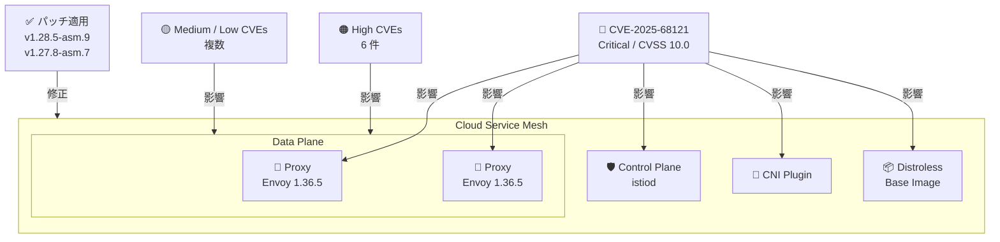

# Cloud Service Mesh: 2026 年 3 月セキュリティパッチリリース (GCP-2026-013)

**リリース日**: 2026-03-11

**サービス**: Cloud Service Mesh

**機能**: セキュリティパッチ (バージョン 1.28.5-asm.9 / 1.27.8-asm.7)

**ステータス**: 利用可能

📊 [このアップデートのインフォグラフィックを見る](https://takech9203.github.io/google-cloud-news-summary/20260311-cloud-service-mesh-security-patches-march.html)

## 概要

Google Cloud は、インクラスター Cloud Service Mesh 向けに 2 つのセキュリティパッチバージョンをリリースしました。本リリースはセキュリティ掲示板 GCP-2026-013 に対応するもので、Critical レベルの CVE-2025-68121 (CVSS 10.0) を含む複数の脆弱性に対する修正が含まれています。

パッチ対象バージョンは 1.28.5-asm.9 (Envoy 1.36.5 使用) と 1.27.8-asm.7 の 2 つです。影響を受けるコンポーネントは Proxy、Control Plane、Distroless、CNI と広範にわたり、Critical から Low まで多数の CVE が修正されています。特に CVE-2025-68121 は CVSS スコア 10.0 の Critical 脆弱性であり、すべてのインクラスター Cloud Service Mesh ユーザーに対して早急なアップグレードが推奨されます。

**アップデート前の課題**

- 旧バージョンの Cloud Service Mesh には Critical レベル (CVSS 10.0) を含む複数のセキュリティ脆弱性が存在していた
- Proxy、Control Plane、Distroless、CNI の各コンポーネントが CVE-2025-68121 の影響を受けていた
- 複数の High レベルの CVE により、サービスメッシュのセキュリティ境界が侵害されるリスクがあった

**アップデート後の改善**

- CVE-2025-68121 (Critical, CVSS 10.0) を含むすべての対象 CVE が修正された
- Envoy 1.36.5 への更新により、プロキシレイヤーのセキュリティが強化された
- GCP-2026-013 のセキュリティ掲示板に記載されたすべてのプラットフォーム CVE に対応した

## アーキテクチャ図



本図は、今回のセキュリティパッチで修正対象となった Cloud Service Mesh の各コンポーネント (Control Plane、Proxy、CNI、Distroless) と、影響する CVE の重大度レベルを示しています。

## サービスアップデートの詳細

### 主要機能

1. **バージョン 1.28.5-asm.9 パッチリリース**
   - Envoy 1.36.5 を使用した最新のセキュリティ修正
   - GCP-2026-013 で報告されたすべての脆弱性に対応
   - 1.28 系列を使用しているクラスタ向けのアップグレードパス

2. **バージョン 1.27.8-asm.7 パッチリリース**
   - 1.27 系列を使用しているクラスタ向けのセキュリティ修正
   - GCP-2026-013 のすべてのプラットフォーム CVE に対応
   - 長期サポート版を利用しているユーザー向け

3. **Critical 脆弱性 CVE-2025-68121 の修正**
   - CVSS スコア 10.0 の最も深刻な脆弱性
   - Proxy、Control Plane、Distroless、CNI の全コンポーネントに影響
   - 本パッチ適用により完全に修正

## 技術仕様

### 対象 CVE 一覧

| CVE ID | 重大度 | CVSS スコア | 影響コンポーネント |
|--------|--------|-------------|-------------------|
| CVE-2025-68121 | Critical | 10.0 | Proxy, Control Plane, Distroless, CNI |
| CVE-2025-61732 | High | 8.6 | Proxy, Control Plane |
| CVE-2025-15558 | High | 8.0 | Proxy, Control Plane |
| CVE-2025-61731 | High | 7.8 | Proxy, Control Plane |
| CVE-2025-61726 | High | 7.5 | Proxy, Control Plane |
| CVE-2026-25679 | High | 7.5 | Proxy, Control Plane |
| CVE-2026-24051 | High | 7.0 | Proxy, Control Plane |
| その他複数 | Medium / Low | - | 各コンポーネント |

### パッチバージョン対応表

| 現在のバージョン系列 | アップグレード先 | Envoy バージョン |
|---------------------|-----------------|-----------------|
| 1.28.x-asm.x | 1.28.5-asm.9 | Envoy 1.36.5 |
| 1.27.x-asm.x | 1.27.8-asm.7 | - |

## 設定方法

### 前提条件

1. インクラスター Cloud Service Mesh がデプロイされていること
2. `asmcli` ツールまたは `istioctl` がインストールされていること
3. 対象クラスタへの管理者アクセス権限があること

### 手順

#### ステップ 1: 現在のバージョンを確認

```bash
# インクラスター Cloud Service Mesh のバージョンを確認
kubectl get pods -n istio-system -o jsonpath='{.items[*].spec.containers[*].image}' | tr ' ' '\n' | sort -u
```

現在のバージョンが 1.28.5-asm.9 または 1.27.8-asm.7 より前であれば、アップグレードが必要です。

#### ステップ 2: asmcli を使用してアップグレード

```bash
# asmcli をダウンロード
curl https://storage.googleapis.com/csm-artifacts/asm/asmcli > asmcli
chmod +x asmcli

# Cloud Service Mesh をアップグレード (1.28 系列の例)
./asmcli install \
  --project_id PROJECT_ID \
  --cluster_name CLUSTER_NAME \
  --cluster_location CLUSTER_LOCATION \
  --output_dir OUTPUT_DIR \
  --enable_all
```

プロジェクト ID、クラスタ名、ロケーションを環境に合わせて設定してください。

#### ステップ 3: ワークロードの再デプロイ

```bash
# サイドカープロキシを更新するため、ワークロードをローリング再起動
kubectl rollout restart deployment -n YOUR_NAMESPACE
```

サイドカーインジェクションが有効な名前空間のワークロードを再起動することで、新しいバージョンの Envoy プロキシが適用されます。

## メリット

### ビジネス面

- **コンプライアンス対応**: Critical レベルの CVE 修正により、セキュリティ監査やコンプライアンス要件を満たすことができる
- **リスク低減**: CVSS 10.0 の脆弱性を含む複数のセキュリティリスクを排除し、サービスの信頼性を維持できる

### 技術面

- **包括的なセキュリティ修正**: Proxy、Control Plane、CNI、Distroless の全コンポーネントにわたる脆弱性が一括で修正される
- **Envoy 1.36.5 への更新**: 最新の Envoy バージョンにより、データプレーンのセキュリティが向上する

## デメリット・制約事項

### 制限事項

- 本パッチはインクラスター Cloud Service Mesh のみが対象であり、マネージド Cloud Service Mesh には別途対応が必要な場合がある
- 1.26 以前のバージョンを使用している場合、直接このパッチバージョンにアップグレードできない可能性がある

### 考慮すべき点

- アップグレード後にワークロードの再デプロイ (ローリング再起動) が必要であり、一時的にサービスの可用性に影響する可能性がある
- マルチクラスタメッシュ環境では、すべてのクラスタで同時にアップグレードを計画する必要がある
- CVE-2025-68121 が Critical (CVSS 10.0) であるため、できるだけ早急にパッチを適用することが推奨される

## ユースケース

### ユースケース 1: GKE 上のマイクロサービスアーキテクチャのセキュリティ強化

**シナリオ**: GKE クラスタ上でインクラスター Cloud Service Mesh を使用してマイクロサービス間の通信を管理している環境で、本セキュリティパッチを適用する。

**実装例**:
```bash
# 現在のバージョンを確認
istioctl version

# asmcli でパッチ適用済みバージョンにアップグレード
./asmcli install \
  --project_id my-project \
  --cluster_name my-cluster \
  --cluster_location us-central1 \
  --output_dir ./asm-output \
  --enable_all

# 全名前空間のワークロードを再起動
for ns in $(kubectl get ns -l istio-injection=enabled -o jsonpath='{.items[*].metadata.name}'); do
  kubectl rollout restart deployment -n $ns
done
```

**効果**: Critical 脆弱性を含むすべてのセキュリティ修正が適用され、サービスメッシュ全体のセキュリティ態勢が強化される。

### ユースケース 2: コンプライアンス要件を満たすための定期パッチ適用

**シナリオ**: PCI DSS や SOC 2 などのコンプライアンスフレームワークに準拠する必要がある組織が、Critical/High の CVE に対して迅速にパッチを適用する。

**効果**: セキュリティ監査において脆弱性管理のプロセスが適切に実行されていることを証明できる。CVSS 10.0 の脆弱性に対する迅速な対応はコンプライアンスレポートにおいて重要な評価項目となる。

## 料金

Cloud Service Mesh のセキュリティパッチ適用に追加料金は発生しません。Cloud Service Mesh の料金体系は GKE Enterprise の一部として提供されています。Cloud Service Mesh certificate authority のコストは Cloud Service Mesh の料金に含まれています。

詳細は [Cloud Service Mesh 料金ページ](https://cloud.google.com/service-mesh/pricing) を参照してください。

## 関連サービス・機能

- **Google Kubernetes Engine (GKE)**: Cloud Service Mesh のインクラスターデプロイメントの基盤となるコンテナオーケストレーションサービス
- **Cloud Service Mesh certificate authority**: mTLS 証明書を発行するマネージド認証局。セキュリティパッチと併せて証明書ローテーションの設定も確認が推奨される
- **Certificate Authority Service**: Cloud Service Mesh の代替認証局として使用可能。高度なコンプライアンス要件がある場合に利用
- **Cloud Monitoring**: Cloud Service Mesh のセキュリティメトリクスやパッチ適用後のサービス正常性を監視

## 参考リンク

- 📊 [インフォグラフィック](https://takech9203.github.io/google-cloud-news-summary/20260311-cloud-service-mesh-security-patches-march.html)
- [公式リリースノート](https://docs.cloud.google.com/release-notes#March_11_2026)
- [Cloud Service Mesh セキュリティ掲示板](https://cloud.google.com/service-mesh/docs/security-bulletins)
- [Cloud Service Mesh アップグレードガイド](https://cloud.google.com/service-mesh/docs/upgrade/upgrade)
- [Cloud Service Mesh セキュリティ概要](https://cloud.google.com/service-mesh/docs/security/security-overview)
- [料金ページ](https://cloud.google.com/service-mesh/pricing)

## まとめ

今回のセキュリティパッチは、CVSS 10.0 の Critical 脆弱性 (CVE-2025-68121) を含む多数の CVE に対応するもので、インクラスター Cloud Service Mesh を使用しているすべてのユーザーにとって早急な適用が必要です。バージョン 1.28.5-asm.9 または 1.27.8-asm.7 へのアップグレードを計画し、ワークロードの再デプロイまでを含めたパッチ適用作業を速やかに実施することを強く推奨します。

---

**タグ**: #CloudServiceMesh #Security #CVE #GCP-2026-013 #Envoy #ServiceMesh #GKE #Critical #PatchRelease
