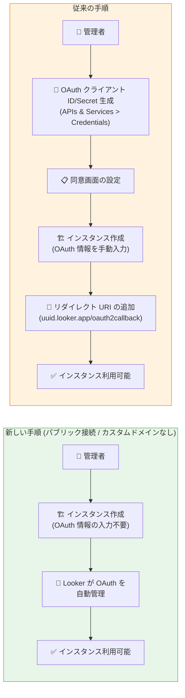

# Looker (Google Cloud core): OAuth 認証情報の自動管理

**リリース日**: 2026-03-11

**サービス**: Looker (Google Cloud core)

**機能**: パブリックセキュア接続インスタンスにおける OAuth 認証情報の自動管理

**ステータス**: Feature

:bar_chart: [このアップデートのインフォグラフィックを見る](https://takech9203.github.io/google-cloud-news-summary/20260311-looker-auto-oauth-management.html)

## 概要

Looker (Google Cloud core) において、パブリックセキュア接続のみを使用し、カスタムドメインを設定しないインスタンスでは、OAuth 認証情報の手動設定が不要になった。これらのインスタンスでは、Looker (Google Cloud core) が OAuth クライアントとシークレット情報を自動的に管理するようになり、インスタンスのセットアッププロセスが大幅に簡素化される。

従来、Looker (Google Cloud core) インスタンスの作成には、事前に Google Cloud コンソールで OAuth クライアント ID とクライアントシークレットを生成し、同意画面を設定し、インスタンス作成時にこれらの認証情報を手動で入力する必要があった。今回のアップデートにより、パブリックセキュア接続のみのインスタンスではこの一連の手順が自動化された。

なお、プライベート接続、ハイブリッド接続、またはカスタムドメインを使用するインスタンスでは、引き続き手動での OAuth 設定が必要である。

**アップデート前の課題**

すべての Looker (Google Cloud core) インスタンス作成時に、以下の手動操作が必須だった。

- OAuth クライアント ID とクライアントシークレットを Google Cloud コンソールの APIs & Services > Credentials から手動で生成する必要があった
- OAuth 同意画面 (ユーザータイプ、承認済みドメインなど) を事前に設定する必要があった
- インスタンス作成後に、インスタンスの URL をリダイレクト URI としてOAuth クライアントに手動で追加する必要があった (`https://uuid.looker.app/oauth2callback` の形式)
- OAuth 関連の IAM 権限 (`clientauthconfig.*`、`oauthconfig.*` など) を持つユーザーが設定を行う必要があった

**アップデート後の改善**

パブリックセキュア接続のみかつカスタムドメインなしのインスタンスについて、以下が改善された。

- OAuth クライアントとシークレットが Looker によって自動的に管理されるようになった (Looker managed)
- インスタンス作成時の OAuth 認証情報の入力が不要になった
- リダイレクト URI の手動追加が不要になった
- OAuth 関連の初期設定手順が大幅に削減され、インスタンスの立ち上げ時間が短縮された

## アーキテクチャ図



左側が従来のインスタンス作成フロー (5 ステップ)、右側が今回のアップデート後のフロー (3 ステップ) を示している。パブリックセキュア接続かつカスタムドメインなしの場合、OAuth の設定手順が自動化により大幅に短縮される。

## サービスアップデートの詳細

### 主要機能

1. **Looker managed OAuth 認証情報**
   - パブリックセキュア接続のみのインスタンスに対して、Looker が自動的に OAuth クライアントとシークレットを割り当てる
   - Google Cloud コンソールのインスタンス編集画面で OAuth 認証情報の設定が「Looker managed」と表示される
   - クライアント ID とクライアントシークレットは表示されず、Looker によって内部的に管理される

2. **手動設定への切り替えオプション**
   - 自動管理されている OAuth 認証情報を手動設定 (Manual) に切り替えることが可能
   - インスタンスの編集画面から「Manual」を選択し、カスタムの OAuth クライアント ID とシークレットを入力できる
   - 一度「Looker managed」から「Manual」に変更した場合、手動で認証情報を管理する必要がある

3. **接続タイプによる動作の分岐**
   - パブリックセキュア接続のみ (カスタムドメインなし): OAuth 自動管理
   - プライベート接続 (Private Service Connect / Private Services Access): 手動設定が必須
   - ハイブリッド接続: 手動設定が必須
   - カスタムドメイン使用時: カスタムドメイン設定プロセスの一部として手動設定が必須

## 技術仕様

### 接続タイプ別の OAuth 設定要件

| 接続タイプ | カスタムドメイン | OAuth 設定 | 備考 |
|-----------|----------------|-----------|------|
| パブリックセキュア接続 | なし | 自動管理 (Looker managed) | 今回のアップデート対象 |
| パブリックセキュア接続 | あり | 手動設定が必要 | カスタムドメイン設定時に OAuth を構成 |
| プライベート接続 (PSC) | - | 手動設定が必要 | インスタンス作成時に OAuth 情報を入力 |
| プライベート接続 (PSA) | - | 手動設定が必要 | インスタンス作成時に OAuth 情報を入力 |
| ハイブリッド接続 | - | 手動設定が必要 | インスタンス作成時に OAuth 情報を入力 |

### OAuth 認証情報の確認方法

Google Cloud コンソールでインスタンスの OAuth 設定タイプを確認できる。

1. Google Cloud コンソールで Looker インスタンスページに移動
2. 対象インスタンスをクリックして詳細ページを開く
3. 「Edit」をクリック
4. 「OAuth application credentials」セクションを確認
   - **Looker managed**: 自動管理中 (クライアント ID/シークレットは非表示)
   - **Manual**: 手動設定中 (`****` プレースホルダーが表示)

## 設定方法

### 前提条件

1. Google Cloud プロジェクトで Looker (Google Cloud core) API が有効化されていること
2. インスタンス作成に必要な IAM ロール (`roles/looker.admin` など) を持っていること

### 手順

#### ステップ 1: インスタンスの作成 (パブリックセキュア接続の場合)

```bash
# gcloud CLI でインスタンスを作成する場合
gcloud looker instances create INSTANCE_NAME \
  --project=PROJECT_ID \
  --region=REGION \
  --edition=EDITION_TYPE \
  --public-ip-enabled
```

パブリックセキュア接続でカスタムドメインを使用しない場合、OAuth 認証情報の指定は不要。Looker が自動的に OAuth クライアントとシークレットを管理する。

#### ステップ 2: OAuth 設定の確認

インスタンス作成後、Google Cloud コンソールでインスタンスの「Edit」画面を開き、OAuth application credentials セクションが「Looker managed」になっていることを確認する。

## メリット

### ビジネス面

- **初期セットアップ時間の短縮**: OAuth クライアントの作成、同意画面の設定、リダイレクト URI の追加といった手順が不要になり、インスタンスの立ち上げが迅速化する
- **運用負荷の軽減**: OAuth 認証情報のローテーションやメンテナンスを Looker が自動で管理するため、管理者の負担が減る
- **ヒューマンエラーの防止**: 手動設定における入力ミスやリダイレクト URI の設定漏れによるログイン失敗を防止できる

### 技術面

- **セットアップの簡素化**: 5 ステップの OAuth 設定プロセスが自動化により実質 0 ステップに削減される
- **セキュリティの向上**: Looker が管理する OAuth 認証情報は内部的に安全に管理され、外部に露出しない
- **柔軟性の維持**: 必要に応じて手動設定 (Manual) に切り替えることができ、カスタム要件にも対応可能

## デメリット・制約事項

### 制限事項

- パブリックセキュア接続かつカスタムドメインなしのインスタンスのみが対象であり、プライベート接続、ハイブリッド接続、カスタムドメイン使用時は引き続き手動設定が必要
- Looker managed の状態では OAuth クライアント ID やシークレットを直接確認することができない
- 「Looker managed」から「Manual」に切り替えた場合、再度「Looker managed」に戻す手順については公式ドキュメントの確認が必要

### 考慮すべき点

- 既にパブリックセキュア接続で手動設定済みの既存インスタンスについては、Looker managed への移行可否を確認する必要がある
- カスタムドメインの追加を将来的に予定している場合は、その時点で手動 OAuth 設定への移行が必要になる

## ユースケース

### ユースケース 1: 小規模チームでの迅速な BI 環境構築

**シナリオ**: スタートアップ企業が 10 名程度のチーム向けに Looker (Google Cloud core) Standard エディションを導入する。パブリックインターネット経由でのアクセスで十分であり、カスタムドメインも不要。

**効果**: OAuth の事前設定なしで即座にインスタンスを作成でき、チームは短時間で BI ダッシュボードの構築を開始できる。Google Cloud の管理経験が少ないチームでも、複雑な OAuth 設定に悩むことなくセットアップが完了する。

### ユースケース 2: 開発・テスト環境の迅速なプロビジョニング

**シナリオ**: Enterprise エディションを利用している組織が、本番環境とは別にステージング用のインスタンスを頻繁に作成・削除する。ステージング環境はパブリック接続で十分。

**効果**: 開発・テスト用インスタンスの作成が簡素化され、CI/CD パイプラインの一環としてインスタンスのプロビジョニングを自動化しやすくなる。OAuth 設定の手間が省けることで、環境構築のサイクルタイムが短縮される。

## 料金

Looker (Google Cloud core) の料金はエディション (Standard、Enterprise、Embed) によって異なる。今回の OAuth 自動管理機能自体に追加料金は発生しない。

詳細な料金情報については [Looker (Google Cloud core) 料金ページ](https://cloud.google.com/looker/pricing) を参照。

### エディション別の主な違い

| エディション | 最大ユーザー数 | プライベート接続 | 月間クエリ API コール |
|-------------|--------------|-----------------|---------------------|
| Standard | 50 | 非対応 | 1,000 |
| Enterprise | 無制限 | 対応 | 100,000 |
| Embed | 無制限 | 対応 | 500,000 |

## 利用可能リージョン

Looker (Google Cloud core) が利用可能なすべてのリージョンで、この OAuth 自動管理機能を利用できる。対応リージョンの最新情報は [Looker (Google Cloud core) ドキュメント](https://cloud.google.com/looker/docs/looker-core-instance-create) を参照。

## 関連サービス・機能

- **Google Cloud IAM**: Looker (Google Cloud core) インスタンスへのユーザーアクセス制御に使用される。OAuth とは独立してユーザーの認可を管理する
- **Cloud DNS**: カスタムドメインを設定する場合に DNS A レコードの作成に使用される。カスタムドメインを使用する場合は手動 OAuth 設定が必要
- **Private Service Connect (PSC)**: プライベート接続構成に使用される。PSC を使用するインスタンスでは引き続き手動 OAuth 設定が必要
- **VPC Service Controls**: Enterprise/Embed エディションで利用可能なセキュリティ機能。プライベート接続が前提となるため、手動 OAuth 設定が必要

## 参考リンク

- :bar_chart: [インフォグラフィック](https://takech9203.github.io/google-cloud-news-summary/20260311-looker-auto-oauth-management.html)
- [公式リリースノート](https://docs.google.com/release-notes#March_11_2026)
- [Looker (Google Cloud core) OAuth 認証情報の作成ドキュメント](https://cloud.google.com/looker/docs/looker-core-create-oauth)
- [Looker (Google Cloud core) OAuth 認証の設定ドキュメント](https://cloud.google.com/looker/docs/looker-core-oauth-authentication)
- [Looker (Google Cloud core) ネットワーキングオプション](https://cloud.google.com/looker/docs/looker-core-networking-options)
- [料金ページ](https://cloud.google.com/looker/pricing)

## まとめ

今回のアップデートにより、パブリックセキュア接続のみでカスタムドメインを使用しない Looker (Google Cloud core) インスタンスの作成が大幅に簡素化された。特に、Google Cloud の OAuth 設定に不慣れな管理者や、開発・テスト環境を頻繁にプロビジョニングする組織にとって有益なアップデートである。プライベート接続やカスタムドメインを必要とする本番環境では引き続き手動設定が必要なため、自組織の接続要件を確認した上で適切な構成を選択することを推奨する。

---

**タグ**: #Looker #GoogleCloudCore #OAuth #認証 #セットアップ簡素化 #パブリック接続
