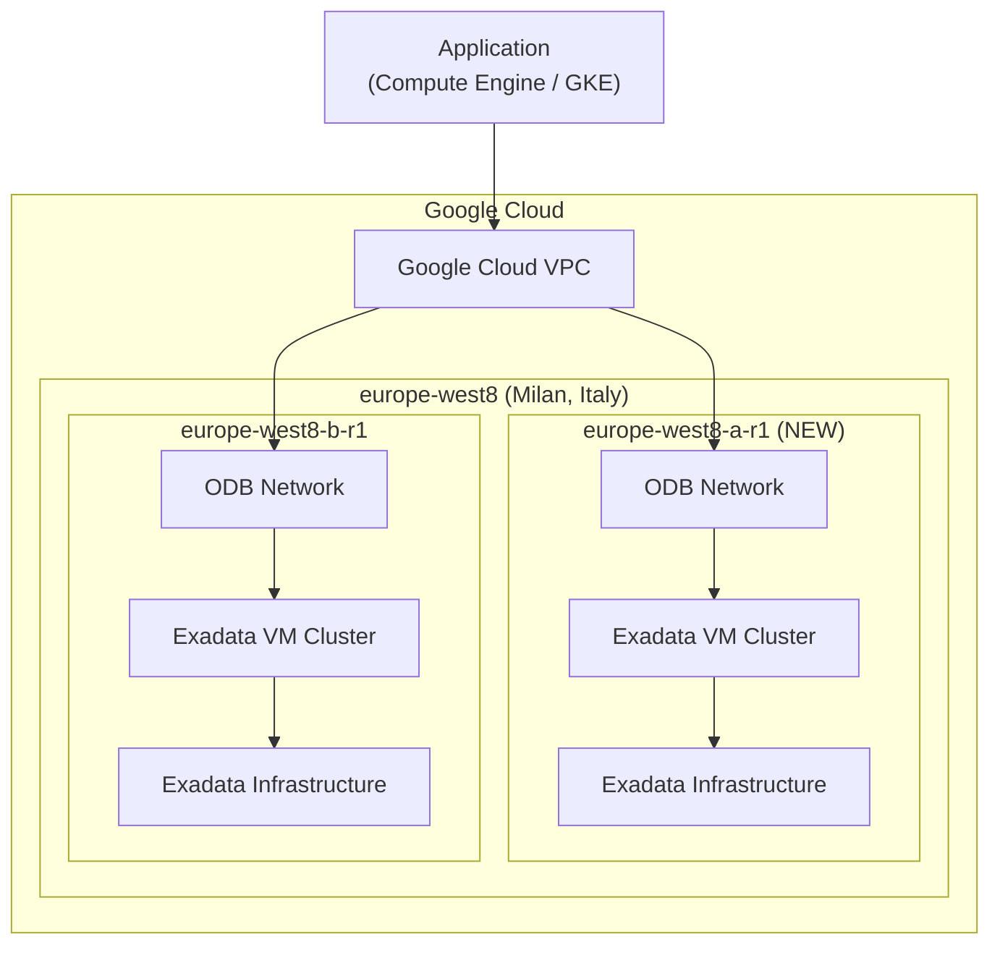

# Oracle Database@Google Cloud: Exadata Database Service にミラノ (europe-west8-a-r1) ゾーン追加

**リリース日**: 2026-03-11

**サービス**: Oracle Database@Google Cloud

**機能**: Exadata Database Service に europe-west8-a-r1 (Milan, Italy) ゾーン追加

**ステータス**: GA

📊 [このアップデートのインフォグラフィックを見る](https://takech9203.github.io/google-cloud-news-summary/20260311-oracle-database-google-cloud-milan-zone.html)

## 概要

Oracle Database@Google Cloud の Exadata Database Service において、新たにゾーン europe-west8-a-r1 (ミラノ、イタリア) が利用可能になった。europe-west8 リージョンでは、2026年3月6日に追加された europe-west8-b-r1 に続く2番目のゾーンとなり、ミラノリージョンにおけるマルチゾーン構成が可能になった。

Oracle Database@Google Cloud は、Google Cloud と Oracle Cloud Infrastructure (OCI) の提携により、Google Cloud データセンター内で OCI Exadata ハードウェア上に Oracle Database サービスをデプロイできるマネージドサービスである。今回のゾーン追加により、欧州のデータレジデンシー要件を持つ企業が、イタリア国内でより高い可用性を確保した Oracle Database の運用を実現できるようになる。

**アップデート前の課題**

- europe-west8 リージョンの Exadata Database Service では europe-west8-b-r1 の1ゾーンのみが利用可能だった
- ミラノリージョン内でのゾーン冗長構成ができず、単一ゾーン障害時のリスクがあった
- イタリアに近接した高可用性要件のあるワークロードに対して、マルチゾーン構成の選択肢が限定されていた

**アップデート後の改善**

- europe-west8-a-r1 が追加され、ミラノリージョンで2ゾーン構成が可能になった
- ゾーン間での冗長構成により、Exadata Database Service の可用性が向上した
- イタリアおよび南欧圏のデータレジデンシー要件を満たしつつ、高可用性アーキテクチャを構築できるようになった

## アーキテクチャ図

ミラノリージョン (europe-west8) 内の2つのゾーンにまたがって Exadata Database Service リソースを配置し、Google Cloud VPC を通じてアプリケーションから低レイテンシで接続するマルチゾーン構成を示している。

## サービスアップデートの詳細

### 主要機能

1. **新規ゾーン europe-west8-a-r1 の追加**
   - ミラノリージョンで2番目の Exadata Database Service 対応ゾーンとして利用可能
   - Exadata Infrastructure インスタンス、Exadata VM Cluster、ODB Network をデプロイ可能

2. **マルチゾーン高可用性構成の実現**
   - europe-west8-a-r1 と europe-west8-b-r1 の2ゾーン構成により、ゾーンレベルの冗長性を確保可能
   - Oracle Real Application Clusters (RAC) と組み合わせた高可用性データベース構成をサポート

3. **欧州リージョンカバレッジの強化**
   - ロンドン (europe-west2)、フランクフルト (europe-west3) に続き、ミラノ (europe-west8) でもマルチゾーン構成が可能に
   - 欧州全体での Oracle Database ワークロードの分散配置と災害復旧戦略の選択肢が拡大

## 技術仕様

### europe-west8 リージョンの Exadata Database Service ゾーン一覧

| ゾーン | 状態 | 追加日 |
|------|------|--------|
| europe-west8-a-r1 | 利用可能 (NEW) | 2026-03-11 |
| europe-west8-b-r1 | 利用可能 | 2026-03-06 |

### Exadata Database Service 欧州リージョン対応状況

| リージョン | ゾーン数 | ゾーン |
|-----------|---------|-------|
| europe-west2 (ロンドン) | 2 | europe-west2-a-r1, europe-west2-c-r2 |
| europe-west3 (フランクフルト) | 2 | europe-west3-a-r2, europe-west3-b-r1 |
| europe-west8 (ミラノ) | 2 | europe-west8-a-r1, europe-west8-b-r1 |

## 設定方法

### 前提条件

1. Oracle Database@Google Cloud の Google Cloud Marketplace 注文が完了していること
2. Oracle Cloud Infrastructure (OCI) アカウントとのリンクが完了していること
3. プロジェクトで ODB Network が構成されていること

### 手順

#### ステップ 1: ODB Network の作成

Google Cloud コンソールで Oracle Database@Google Cloud のページに移動し、europe-west8 リージョンの europe-west8-a-r1 ゾーンに ODB Network を作成する。ODB Network と他のゾーンリソース (Exadata Infrastructure、Exadata VM Cluster) は同一リージョン・ゾーンに配置する必要がある。

#### ステップ 2: Exadata Infrastructure の作成

europe-west8-a-r1 ゾーンに Exadata Infrastructure インスタンスを作成する。Google Cloud コンソール、gcloud CLI、または Oracle Database@Google Cloud API を使用して作成可能。

#### ステップ 3: Exadata VM Cluster の作成

作成した Exadata Infrastructure 上に Exadata VM Cluster を作成する。ライセンスは BYOL (Bring Your Own License) または Google Cloud Marketplace 注文で購入したライセンスを使用可能。

## メリット

### ビジネス面

- **データレジデンシー対応の強化**: イタリア国内でデータを保持しながら高可用性を確保できるため、GDPR やイタリアの規制に対応するワークロードに最適
- **事業継続性の向上**: マルチゾーン構成により、単一ゾーン障害時にも事業継続が可能

### 技術面

- **ゾーンレベルの冗長性**: 2つのゾーンを活用することで、計画メンテナンスや障害発生時のダウンタイムを最小化
- **低レイテンシの維持**: 同一リージョン内のゾーン間通信はネットワーク料金が Oracle Database@Google Cloud の価格に含まれており、低レイテンシで接続可能

## デメリット・制約事項

### 制限事項

- Exadata Database のデータベース自体の作成・管理は Oracle Cloud Infrastructure (OCI) コンソールを通じて行う必要がある
- Base Database Service および Exadata Database Service on Exascale Infrastructure は本ゾーンでは未対応

### 考慮すべき点

- マルチゾーン構成を構築する場合、各ゾーンに個別の Exadata Infrastructure と VM Cluster が必要となり、コストが増加する
- OCI アカウントとの連携セットアップが必要で、Google Cloud 単独では完結しない

## ユースケース

### ユースケース 1: イタリア国内データレジデンシー要件のある Oracle ERP ワークロード

**シナリオ**: イタリアに拠点を持つ企業が、Oracle E-Business Suite を Google Cloud 上で運用し、データベースをイタリア国内に保持する必要がある。単一ゾーン障害時にもサービスを継続する高可用性構成が求められる。

**効果**: europe-west8-a-r1 と europe-west8-b-r1 の2ゾーンに Exadata Database Service をデプロイし、Oracle Data Guard を構成することで、イタリア国内でのデータレジデンシーを満たしつつ高可用性を実現。

### ユースケース 2: 欧州マルチリージョン災害復旧構成

**シナリオ**: 欧州全体で事業を展開する企業が、ミラノをプライマリリージョン、フランクフルトやロンドンをDRリージョンとする災害復旧構成を検討している。

**効果**: ミラノリージョン内でマルチゾーン高可用性を確保しつつ、フランクフルトやロンドンへのクロスリージョン DR 構成を組み合わせることで、多層的な可用性設計を実現。

## 料金

Oracle Database@Google Cloud の料金は、Public (Pay-As-You-Go) と Private (カスタム価格交渉) の2つのオファータイプがある。詳細な料金は [Oracle Database@Google Cloud pricing](https://www.oracle.com/cloud/google/oracle-database-at-google-cloud/pricing/) を参照。同一リージョン内のアプリケーションと Oracle Exadata データベース間のネットワーク転送料金は Oracle Database@Google Cloud の価格に含まれている。

## 利用可能リージョン

Exadata Database Service は以下の欧州リージョンおよびゾーンで利用可能:

| リージョン | 都市 | ゾーン |
|-----------|------|-------|
| europe-west2 | ロンドン (イギリス) | europe-west2-a-r1, europe-west2-c-r2 |
| europe-west3 | フランクフルト (ドイツ) | europe-west3-a-r2, europe-west3-b-r1 |
| europe-west8 | ミラノ (イタリア) | europe-west8-a-r1, europe-west8-b-r1 |

その他、アジア太平洋、北米、南米リージョンでも利用可能。完全なリストは [Supported regions and zones](https://cloud.google.com/oracle/database/docs/regions-and-zones) を参照。

## 関連サービス・機能

- **Oracle Exadata Database Service on Exascale Infrastructure**: Exascale インフラストラクチャ上でのデータベースサービス。europe-west8 では現時点で未対応
- **Oracle Autonomous AI Database Service**: europe-west8 リージョンで利用可能なサーバーレスデータベースサービス
- **Oracle Base Database Service**: シングルノードデータベースサービス。europe-west8 では現時点で未対応
- **Cloud Key Management Service (CMEK)**: Exadata VM Cluster で顧客管理暗号鍵を使用可能 (GA)

## 参考リンク

- 📊 [インフォグラフィック](https://takech9203.github.io/google-cloud-news-summary/20260311-oracle-database-google-cloud-milan-zone.html)
- [公式リリースノート](https://cloud.google.com/release-notes#March_11_2026)
- [Oracle Database@Google Cloud リリースノート](https://cloud.google.com/oracle/database/docs/release-notes)
- [ドキュメント: Regions and zones](https://cloud.google.com/oracle/database/docs/regions-and-zones)
- [ドキュメント: Oracle Database@Google Cloud 概要](https://cloud.google.com/oracle/database/docs/overview)
- [料金ページ](https://www.oracle.com/cloud/google/oracle-database-at-google-cloud/pricing/)
- [購入・請求](https://cloud.google.com/oracle/database/docs/purchase-and-billing)

## まとめ

Oracle Database@Google Cloud の Exadata Database Service にミラノ (europe-west8-a-r1) ゾーンが追加され、同リージョンで2ゾーン構成が可能になった。イタリア国内でのデータレジデンシー要件を満たしつつ高可用性を確保したい企業は、マルチゾーン構成の導入を検討すべきである。欧州リージョン全体でのカバレッジ拡大が継続的に進んでおり、Oracle Database ワークロードの Google Cloud への移行がより柔軟に実施できるようになっている。

---

**タグ**: #OracleDatabase #ExadataDatabase #GoogleCloud #europe-west8 #Milan #RegionExpansion #HighAvailability #MultiZone #DataResidency #GDPR
