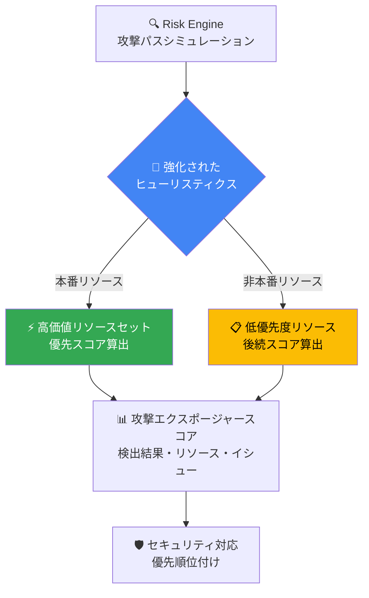

# Security Command Center: Risk Engine のデフォルト高価値リソース識別ヒューリスティクス強化

**リリース日**: 2026-03-11

**サービス**: Security Command Center

**機能**: Risk Engine - デフォルト高価値リソース識別ヒューリスティクスの強化

**ステータス**: Announcement

[このアップデートのインフォグラフィックを見る](https://takech9203.github.io/google-cloud-news-summary/20260311-security-command-center-risk-engine-heuristics.html)

## 概要

2026 年 3 月、Security Command Center の Risk Engine において、デフォルト高価値リソースをより正確に識別するための強化されたヒューリスティクスがリリースされる。この改善により、Risk Engine は本番環境と非本番環境のリソースをより精度高く区別し、攻撃エクスポージャースコアの算出精度が向上する。

この変更はデフォルトの高価値リソースセットを使用しているユーザーに影響する。カスタムリソース値構成を使用しているユーザーには影響がない。ユーザー側での操作は不要であり、自動的に適用される。ただし、デフォルト高価値リソースセットを使用している場合、検出結果 (findings)、リソース、イシューのエクスポージャースコアに変動が生じる可能性がある。

**アップデート前の課題**

Risk Engine はデフォルト高価値リソースセットに対してヒューリスティクスを用いて非本番用途のアセットを識別していたが、識別精度に改善の余地があった。

- 非本番環境のリソースが高価値リソースとして誤認識される場合があり、エクスポージャースコアが実態と乖離する可能性があった
- デフォルト高価値リソースセットの自動分類の精度が限定的であった
- 非本番リソースのスコア算出に不要なリソースが消費される場合があった

**アップデート後の改善**

強化されたヒューリスティクスにより、デフォルト高価値リソースの識別がより正確になる。

- 本番環境と非本番環境のリソースをより正確に区別できるようになり、エクスポージャースコアの信頼性が向上する
- 重要なアセットの攻撃エクスポージャースコアが優先的に算出され、セキュリティ対応の優先順位付けが改善される
- ユーザー側の操作なしで自動的に適用されるため、運用負荷がない

## アーキテクチャ図

Risk Engine が強化されたヒューリスティクスを用いてデフォルト高価値リソースセット内のリソースを本番・非本番に分類し、攻撃エクスポージャースコアの算出精度を向上させるフローを示す。

## サービスアップデートの詳細

### 主要機能

1. **強化されたヒューリスティクスによるリソース分類**
   - デフォルト高価値リソースセット内のリソースについて、本番用途と非本番用途をより正確に識別する
   - 従来のヒューリスティクスを改善し、誤分類を削減する

2. **エクスポージャースコアの精度向上**
   - 本番リソースの攻撃エクスポージャースコアが優先的に算出される
   - 非本番リソースは後続で算出されるため、重要なアセットのスコアがより迅速に利用可能になる

3. **自動適用 (操作不要)**
   - ユーザー側での設定変更やアクションは不要
   - カスタムリソース値構成を使用しているユーザーには影響なし

## 技術仕様

### デフォルト高価値リソースセットの対象リソースタイプ

デフォルト高価値リソースセットには以下のリソースタイプが含まれる。

| リソースタイプ | サービス |
|------|------|
| `aiplatform.googleapis.com/Model` | Vertex AI |
| `artifactregistry.googleapis.com/Repository` | Artifact Registry |
| `bigquery.googleapis.com/Dataset` | BigQuery |
| `cloudbuild.googleapis.com/BuildTrigger` | Cloud Build |
| `cloudfunctions.googleapis.com/CloudFunction` | Cloud Functions |
| `compute.googleapis.com/Instance` | Compute Engine |
| `run.googleapis.com/Job` | Cloud Run |
| `run.googleapis.com/Service` | Cloud Run |
| `spanner.googleapis.com/Instance` | Cloud Spanner |
| `sqladmin.googleapis.com/Instance` | Cloud SQL |
| `storage.googleapis.com/Bucket` | Cloud Storage |

### Risk Engine の制限事項

| 項目 | 上限値 |
|------|------|
| アクティブな検出結果の最大数 | 250,000,000 |
| アクティブなアセットの最大数 | 26,000,000 |
| 高価値リソースセットの最大リソースインスタンス数 | 1,000 |
| リソース値構成の最大数 (組織あたり) | 100 |

### 攻撃パスシミュレーションのスケジュール

- 約 6 時間ごとに実行
- 組織の規模に応じて実行時間は変動するが、最低 1 日 1 回は実行される

## 前提条件

1. Security Command Center Premium または Enterprise ティアが組織レベルで有効化されていること
2. プロジェクトレベルのアクティベーションでは攻撃パスシミュレーションは利用不可

## メリット

### ビジネス面

- **セキュリティ対応の精度向上**: より正確なエクスポージャースコアにより、真に重要なリソースへの対応を優先できる
- **運用負荷ゼロ**: ユーザー側の操作が不要であり、自動的に改善が適用される

### 技術面

- **スコアリング精度の改善**: 非本番リソースの誤認識が減少し、本番環境のリスク評価の信頼性が向上する
- **リソース効率の向上**: 本番リソースのスコア算出が優先されるため、重要なセキュリティ情報がより迅速に利用可能になる

## デメリット・制約事項

### 制限事項

- デフォルト高価値リソースセットを使用しているユーザーのみが影響を受ける
- 攻撃パスシミュレーションは組織レベルのアクティベーションでのみ利用可能

### 考慮すべき点

- デフォルト高価値リソースセットを使用している場合、既存のエクスポージャースコアが変動する可能性がある。セキュリティダッシュボードやアラート閾値を設定している場合は、スコア変動を考慮した確認が推奨される
- より正確なセキュリティ優先順位付けが必要な場合は、カスタムリソース値構成の利用が推奨される。カスタム構成を使用している場合、この変更の影響は受けない

## ユースケース

### ユースケース 1: デフォルト設定での運用改善

**シナリオ**: 中規模組織でカスタムリソース値構成を設定せずに Security Command Center を運用しており、開発環境と本番環境の両方が Google Cloud 上に存在する。

**効果**: 強化されたヒューリスティクスにより、開発用の Compute Engine インスタンスや Cloud Storage バケットが本番リソースと誤認識される頻度が減少し、本番環境の脆弱性に集中して対応できるようになる。

### ユースケース 2: スコアベースのセキュリティアラート

**シナリオ**: エクスポージャースコアに基づいてセキュリティアラートの優先順位を設定しており、閾値を超えたスコアの検出結果を優先対応している。

**効果**: スコアの精度が向上することで、不要なアラートが減少し、真に重要なセキュリティ問題に対するアラートの信頼性が高まる。

## 料金

Risk Engine の攻撃エクスポージャースコアと攻撃パスシミュレーションは、Security Command Center の Premium ティアおよび Enterprise ティアに含まれる機能である。

| ティア | 料金体系 |
|--------|-----------------|
| Standard | 無料 (Risk Engine は利用不可) |
| Premium | 従量課金制またはサブスクリプション |
| Enterprise | サブスクリプション (Google Cloud 営業への問い合わせが必要) |

詳細な料金については [Security Command Center の料金ページ](https://cloud.google.com/security-command-center/pricing) を参照。

## 利用可能リージョン

Security Command Center の Risk Engine は組織レベルで有効化され、Google Cloud、AWS、Azure のマルチクラウド環境に対応している。リージョン固有の制限については [公式ドキュメント](https://cloud.google.com/security-command-center/docs/attack-exposure-supported-features) を参照。

## 関連サービス・機能

- **Security Command Center Premium/Enterprise**: Risk Engine を含む上位ティアのセキュリティプラットフォーム
- **Sensitive Data Protection**: 高感度・中感度データを含むリソースに対して、対応する優先度値 (HIGH/MEDIUM) を自動的に割り当てる連携機能
- **Event Threat Detection / Container Threat Detection**: 実際の攻撃を監視する脅威検出サービス (Risk Engine は仮想的な攻撃パスの分析を行う)
- **Cloud Asset Inventory**: Risk Engine が環境モデルを生成する際に使用するアセット情報の基盤

## 参考リンク

- [インフォグラフィック](https://takech9203.github.io/google-cloud-news-summary/20260311-security-command-center-risk-engine-heuristics.html)
- [公式リリースノート](https://docs.google.com/release-notes#March_11_2026)
- [攻撃エクスポージャースコアの概要](https://cloud.google.com/security-command-center/docs/attack-exposure-learn)
- [Risk Engine の機能サポート](https://cloud.google.com/security-command-center/docs/attack-exposure-supported-features)
- [高価値リソースセットの定義と管理](https://cloud.google.com/security-command-center/docs/attack-exposure-define-high-value-resource-set)
- [料金ページ](https://cloud.google.com/security-command-center/pricing)

## まとめ

今回のアップデートは、Security Command Center の Risk Engine におけるデフォルト高価値リソース識別の精度を向上させるものであり、ユーザー側の操作なしで自動的に適用される。デフォルト高価値リソースセットを使用しているユーザーは、エクスポージャースコアの変動に留意しつつ、より信頼性の高いスコアに基づいたセキュリティ対応が可能になる。カスタムリソース値構成を未設定の組織は、この機会にカスタム構成の導入を検討することで、さらに精度の高いリスク評価を実現できる。

---

**タグ**: #SecurityCommandCenter #RiskEngine #AttackExposureScore #HighValueResources #セキュリティ #CNAPP
