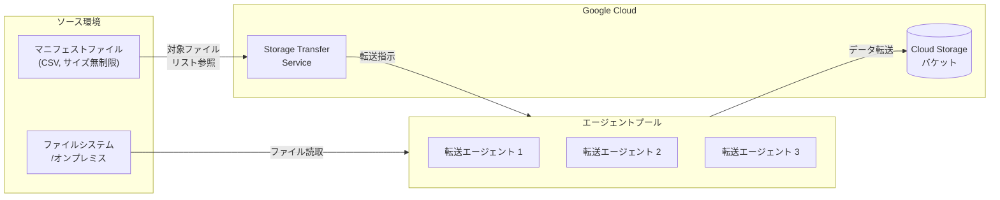

# Storage Transfer Service: エージェントベース転送のマニフェストファイルサイズ制限撤廃

**リリース日**: 2026-03-11

**サービス**: Storage Transfer Service

**機能**: エージェントベース転送におけるマニフェストファイルのサイズ制限撤廃

**ステータス**: Change (GA)

[このアップデートのインフォグラフィックを見る](https://takech9203.github.io/google-cloud-news-summary/20260311-storage-transfer-service-manifest-limit-removed.html)

## 概要

Storage Transfer Service のエージェントベース転送において、マニフェストファイルのサイズ制限が撤廃された。マニフェストファイルとは、転送対象のファイルやオブジェクトを CSV 形式でリストアップしたファイルであり、特定のファイルのみを選択的に転送する際に使用される。

これまでエージェントベース転送ではマニフェストファイルにサイズ上限が設けられており、大量のファイルを指定する際に制約となっていた。今回のアップデートにより、マニフェストファイルのサイズに制限がなくなり、数百万件規模のファイルリストを一度に指定して転送できるようになった。

このアップデートは、オンプレミスやファイルシステムから Cloud Storage への大規模データ移行を行うエンタープライズユーザーや、データパイプラインの一環として選択的なファイル転送を自動化している開発者に特に有用である。

**アップデート前の課題**

- エージェントベース転送ではマニフェストファイルにサイズ上限があり、大量のファイルを一度に指定できなかった
- サイズ制限を回避するために、マニフェストを複数に分割し、それぞれ個別の転送ジョブを作成する必要があった
- 大規模なデータ移行プロジェクトにおいて、転送ジョブの管理が煩雑になっていた

**アップデート後の改善**

- マニフェストファイルのサイズ制限がなくなり、任意の数のファイルを一つのマニフェストで指定可能になった
- 大規模転送でもマニフェストを分割する必要がなくなり、転送ジョブの管理が簡素化された
- 公式ドキュメントにも「There is no limit to the size of the manifest file」と明記されている

## アーキテクチャ図



エージェントベース転送では、マニフェストファイルで指定されたファイルリストを Storage Transfer Service が読み取り、エージェントプール内の各エージェントが並列でファイルを転送する。今回のアップデートにより、マニフェストファイルのサイズに制限がなくなった。

## サービスアップデートの詳細

### 主要機能

1. **マニフェストファイルのサイズ制限撤廃**
   - エージェントベース転送で使用するマニフェストファイルのサイズ上限が完全に撤廃された
   - 数百万件以上のファイルパスを含むマニフェストでも問題なく利用可能

2. **マニフェストファイルの格納場所**
   - Cloud Storage バケットにアップロードして使用可能
   - ソースまたはデスティネーションのファイルシステム上に直接配置することも可能
   - Cloud KMS のカスタマー管理暗号鍵 (CMEK) によるマニフェストの暗号化にも対応

3. **対応する転送パターン**
   - ファイルシステムから Cloud Storage へのエージェントベース転送
   - Cloud Storage からファイルシステムへのエージェントベース転送
   - ファイルシステム間のエージェントベース転送
   - S3 互換ストレージからのエージェントベース転送

## 技術仕様

### マニフェストファイルの仕様

| 項目 | 詳細 |
|------|------|
| ファイル形式 | CSV |
| 文字エンコーディング | UTF-8 |
| サイズ制限 | なし (今回のアップデートで撤廃) |
| 第 1 列 | ファイル名またはオブジェクト名 (転送ジョブのルートパスからの相対パス) |
| 第 2 列 (オプション) | Cloud Storage の世代番号 (オブジェクトストレージ転送の場合) |
| ワイルドカード | 非対応 |
| カンマを含むファイル名 | ダブルクォートで囲む必要あり |

### マニフェストの指定方法

```bash
# gcloud CLI でマニフェストを指定した転送ジョブの作成
gcloud transfer jobs create \
  posix:///source/directory \
  gs://destination-bucket \
  --source-agent-pool=projects/my-project/agentPools/my-pool \
  --manifest-file=gs://manifest-bucket/manifest.csv
```

## 設定方法

### 前提条件

1. Storage Transfer Service API が有効化されたプロジェクト
2. エージェントプールの作成とエージェントのインストール (推奨: 3 台以上)
3. マニフェストファイルを格納する Cloud Storage バケット (バケット経由で使用する場合)

### 手順

#### ステップ 1: マニフェストファイルの作成

```csv
dir1/subdir1/file1.txt
dir2/file2.txt
dir3/subdir2/file3.txt
```

対象ファイルのパスをルートディレクトリからの相対パスで CSV 形式に記述する。サイズ制限がないため、大量のファイルパスを一つのファイルにまとめることが可能。

#### ステップ 2: マニフェストファイルのアップロード

```bash
gcloud storage cp manifest.csv gs://my-manifest-bucket/manifest.csv
```

サービスエージェントに対して、マニフェストが格納されたバケットの `storage.objects.get` 権限を付与する。

#### ステップ 3: 転送ジョブの作成と実行

```bash
gcloud transfer jobs create \
  posix:///data/source \
  gs://my-destination-bucket \
  --source-agent-pool=projects/my-project/agentPools/my-pool \
  --manifest-file=gs://my-manifest-bucket/manifest.csv
```

マニフェストファイルの場所として、Cloud Storage バケット (`gs://`) またはファイルシステム上のパス (`source://`, `destination://`) を指定できる。

## メリット

### ビジネス面

- **大規模移行プロジェクトの効率化**: 数百万ファイルの移行でもマニフェストを分割する必要がなくなり、プロジェクト管理の負担が軽減される
- **運用コストの削減**: 転送ジョブの数を削減でき、ジョブ管理や監視の工数が低減される

### 技術面

- **自動化パイプラインの簡素化**: 上流処理で生成されたファイルリストをそのままマニフェストとして使用でき、分割ロジックが不要になる
- **スケーラビリティの向上**: ファイル数の増加に伴うマニフェスト管理の複雑さが解消され、将来的なデータ量の増加にも柔軟に対応可能

## デメリット・制約事項

### 制限事項

- マニフェストファイルにワイルドカードは使用不可。各ファイルの完全なパスを個別に記載する必要がある
- フォルダ名のみの指定 (ファイル名なし) は非対応
- 転送中はマニフェストファイルの変更を行わないこと (ロック推奨)

### 考慮すべき点

- 非常に大きなマニフェストファイルの場合、Cloud Storage へのアップロードや読み込みに時間がかかる可能性がある
- エージェントベース転送では、名前ベースのプレフィックスフィルタリングや更新日時ベースのフィルタリングは利用できない。特定ファイルの選択にはマニフェストが最適な手段となる

## ユースケース

### ユースケース 1: 大規模オンプレミスデータセンターの移行

**シナリオ**: オンプレミスのファイルサーバーに格納された数千万件のファイルのうち、特定の条件に合致するファイルのみを Cloud Storage に移行する。事前にスクリプトで対象ファイルリストを生成し、マニフェストとして使用する。

**実装例**:
```bash
# 対象ファイルリストを生成 (例: 2025年以降に更新されたファイル)
find /data -type f -newermt "2025-01-01" > manifest.csv

# マニフェストをアップロード
gcloud storage cp manifest.csv gs://migration-manifests/batch-001.csv

# 転送ジョブを作成
gcloud transfer jobs create \
  posix:///data \
  gs://migration-destination \
  --source-agent-pool=projects/my-project/agentPools/migration-pool \
  --manifest-file=gs://migration-manifests/batch-001.csv
```

**効果**: ファイル数に関わらず一つのマニフェストで管理でき、移行プロジェクト全体の追跡が容易になる。

### ユースケース 2: データパイプラインでの選択的ファイル同期

**シナリオ**: 日次バッチ処理で生成された出力ファイルのリストを、そのままマニフェストとして Storage Transfer Service に渡し、Cloud Storage に自動的にアップロードする。

**効果**: バッチ処理の出力規模に制限なくマニフェストを生成でき、パイプラインの安定性が向上する。

## 料金

Storage Transfer Service の料金は転送タイプにより異なる。

| 転送タイプ | 料金 |
|-----------|------|
| エージェントベース転送 (オンプレミス/ファイルシステム) | $0.0125/GB (転送先に正常に書き込まれたデータ量) |
| クラウド間転送 (エージェントレス) | 無料 |

- マニフェストファイルの使用自体に追加料金は発生しない
- Cloud Storage の保存料金やオペレーション料金は別途発生する
- 詳細は [Storage Transfer Service の料金ページ](https://cloud.google.com/storage-transfer/pricing) を参照

## 利用可能リージョン

Storage Transfer Service はグローバルサービスとして提供されており、すべての Google Cloud リージョンの Cloud Storage バケットを転送先として利用可能。エージェントベース転送はエージェントが稼働する任意の環境から利用できる。

## 関連サービス・機能

- **Cloud Storage**: 転送先のオブジェクトストレージ。ストレージクラスの指定やAutoclass との連携が可能
- **Cloud Monitoring**: 転送ジョブの進捗やデータ量をリアルタイムでモニタリング可能
- **Cloud Logging**: エージェントベース転送のログ記録。スキップされたファイルの情報も記録される
- **VPC Service Controls**: Storage Transfer Service のセキュリティ境界設定に対応

## 参考リンク

- [インフォグラフィック](https://takech9203.github.io/google-cloud-news-summary/20260311-storage-transfer-service-manifest-limit-removed.html)
- [公式リリースノート](https://docs.cloud.google.com/release-notes#March_11_2026)
- [マニフェストを使用した特定ファイルの転送](https://cloud.google.com/storage-transfer/docs/manifest)
- [エージェントベース転送の概要](https://cloud.google.com/storage-transfer/docs/create-transfers/agent-based/file-system-to-cloud-storage)
- [Storage Transfer Service の概要](https://cloud.google.com/storage-transfer/docs/overview)
- [料金ページ](https://cloud.google.com/storage-transfer/pricing)

## まとめ

Storage Transfer Service のエージェントベース転送におけるマニフェストファイルのサイズ制限が撤廃され、大規模なファイル転送がより柔軟に実行できるようになった。特に数百万件以上のファイルを扱うデータ移行プロジェクトやデータパイプラインにおいて、マニフェスト分割の手間が不要となり運用効率が向上する。エージェントベース転送で選択的なファイル転送を行っているユーザーは、マニフェストの運用方法を見直し、統合されたマニフェスト管理への移行を検討することを推奨する。

---

**タグ**: #StorageTransferService #DataMigration #AgentBasedTransfer #Manifest #CloudStorage #GoogleCloud
