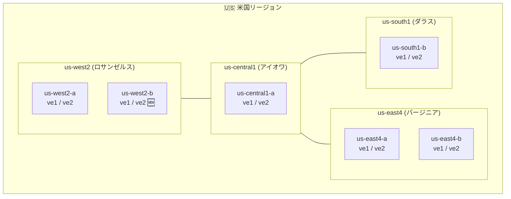

# Google Cloud VMware Engine: ve2 ノードタイプがロサンゼルスリージョンで利用可能に

**リリース日**: 2026-03-11

**サービス**: Google Cloud VMware Engine

**機能**: ve2 ノードタイプのロサンゼルス (us-west2-b) リージョン対応

**ステータス**: 利用可能

📊 [このアップデートのインフォグラフィックを見る](https://takech9203.github.io/google-cloud-news-summary/20260311-vmware-engine-ve2-los-angeles.html)

## 概要

Google Cloud VMware Engine の ve2 ノードタイプが、新たにロサンゼルス (us-west2-b) リージョンで利用可能になった。これにより、米国西海岸のユーザーは最新世代の ve2 ノードを使用して、より高性能な VMware プライベートクラウド環境を構築できるようになる。

ve2 ノードファミリーは、ve1 と比較して大幅に強化されたコンピュート、メモリ、ストレージリソースを提供する。HCI (ハイパーコンバージドインフラストラクチャ) ノードでは最大 128 vCPU、2048 GiB メモリ、51.2 TB ストレージを備え、大規模なワークロードに対応する。今回のリージョン拡張により、米国西海岸に拠点を持つ企業やエンターテインメント、メディア業界の顧客にとって、低レイテンシでの VMware 環境運用が可能になる。

us-west2 リージョンでは us-west2-a と us-west2-b の 2 つのゾーンで ve2 ノードが利用可能となり、Standard および Single-Node タイプのプライベートクラウドを作成できる。

**アップデート前の課題**

- us-west2 (ロサンゼルス) リージョンでは ve2 ノードタイプが利用できず、旧世代の ve1 ノードのみでプライベートクラウドを構築する必要があった
- 米国西海岸で ve2 ノードを利用するには、us-central1 (アイオワ) など他のリージョンを選択する必要があり、レイテンシの増加が課題だった
- ロサンゼルス近郊の顧客は、高性能なノードタイプを利用するためにデータの地理的要件を妥協する必要があった

**アップデート後の改善**

- us-west2 (ロサンゼルス) リージョンで ve2 ノードファミリーの全バリエーション (small, standard, large, mega) が利用可能になった
- 米国西海岸の顧客が低レイテンシで最新世代のノードを利用できるようになった
- ve2 ノードの HCI タイプとストレージオンリータイプの両方を使用したクラスタ構成が可能になった

## アーキテクチャ図



米国内の VMware Engine ve2 ノード対応リージョンの分布を示す。今回のアップデートにより us-west2-b ゾーンが追加され、米国内の全リージョンで ve2 ノードが利用可能になった。

## サービスアップデートの詳細

### 主要機能

1. **ve2 HCI ノードタイプの利用**
   - ve2-small (12.8 TB ストレージ)、ve2-standard (25.5 TB)、ve2-large (38.4 TB)、ve2-mega (51.2 TB) の各バリエーションが利用可能
   - 各バリエーションで 64、80、96、112、128 vCPU の構成を選択可能
   - 全ノードタイプで 2048 GiB (2 TB) のメモリを搭載

2. **ve2 ストレージオンリーノードの利用**
   - ve2-small-so (12.8 TB)、ve2-standard-so (25.5 TB)、ve2-large-so (38.4 TB)、ve2-mega-so (51.2 TB) が利用可能
   - HCI ノードと同一クラスタ内で混在構成が可能 (同一ノードファミリー内)

3. **プライベートクラウドタイプのサポート**
   - Standard プライベートクラウドの作成が可能
   - Single-Node プライベートクラウドの作成が可能

## 技術仕様

### ve2 ノードタイプ一覧

| ノードタイプ | vCPU/ノード | メモリ/ノード (GiB) | ストレージ/ノード (TB) |
|------|------|------|------|
| ve2-small-64 〜 128 | 64 〜 128 | 2048 | 12.8 |
| ve2-standard-64 〜 128 | 64 〜 128 | 2048 | 25.5 |
| ve2-large-64 〜 128 | 64 〜 128 | 2048 | 38.4 |
| ve2-mega-64 〜 128 | 64 〜 128 | 2048 | 51.2 |

### ve1 との比較

| 項目 | ve1-standard-72 | ve2-standard-128 |
|------|------|------|
| vCPU | 72 | 128 |
| メモリ (GiB) | 768 | 2048 |
| ストレージ (TB) | 19.2 | 25.5 |

## 設定方法

### 前提条件

1. Google Cloud プロジェクトで VMware Engine API が有効化されていること
2. 適切な IAM ロール (`roles/vmwareengine.vmwareengineAdmin`) が付与されていること
3. VMware Engine サービスのクォータが十分であること

### 手順

#### ステップ 1: プライベートクラウドの作成

```bash
gcloud vmware private-clouds create my-private-cloud \
    --location=us-west2-b \
    --cluster=my-cluster \
    --node-count=3 \
    --node-type-id=ve2-standard-128
```

プライベートクラウドを us-west2-b ゾーンに作成する。最小ノード数は 3 (Standard プライベートクラウドの場合)。

#### ステップ 2: クラスタの確認

```bash
gcloud vmware private-clouds list \
    --location=us-west2-b
```

作成されたプライベートクラウドの状態を確認する。

## メリット

### ビジネス面

- **米国西海岸での低レイテンシ運用**: ロサンゼルス近郊のデータセンターを利用することで、西海岸の顧客やエンドユーザーへのレイテンシを最小化できる
- **データ主権の確保**: 米国西海岸にデータを保持する必要がある規制要件に対応可能

### 技術面

- **高性能ノードの利用**: ve2 ノードは ve1 と比較して最大 1.78 倍の vCPU、2.67 倍のメモリを提供し、大規模ワークロードに対応
- **柔軟なサイジング**: 24 種類の ve2 HCI ノードタイプから最適な構成を選択でき、リソースの無駄を削減

## デメリット・制約事項

### 制限事項

- Stretched プライベートクラウドは us-west2 リージョンではサポートされていない
- ve1 と ve2 の混在プライベートクラウドは us-west2 では現時点でサポートされていない (混在対応リージョンには記号が付与されている)
- 同一クラスタ内で異なる HCI ノードタイプを混在させることはできない

### 考慮すべき点

- ve2 ノードタイプは一部リージョンでのみ利用可能であり、リージョン選択時に確認が必要
- ノードタイプの変更にはクラスタの再作成が必要になる場合がある

## ユースケース

### ユースケース 1: エンターテインメント・メディア業界の VMware 移行

**シナリオ**: ロサンゼルスに拠点を持つメディア企業が、オンプレミスの VMware 環境を Google Cloud に移行する。大容量のメディアファイル処理のため、高メモリ・高ストレージのノードが必要。

**効果**: ve2-mega-128 ノード (128 vCPU、2048 GiB メモリ、51.2 TB ストレージ) を使用することで、大規模なメディア処理ワークロードをロサンゼルスリージョンで低レイテンシかつ高性能で実行可能。

### ユースケース 2: 西海岸の DR (ディザスタリカバリ) サイト構築

**シナリオ**: 東海岸 (us-east4) にプライマリの VMware 環境を持つ企業が、地理的に離れた DR サイトを構築する。

**効果**: us-west2 に ve2 ノードで DR 環境を構築することで、大陸横断の地理的冗長性を確保しつつ、最新世代のノードで効率的な DR 運用が可能。

## 料金

VMware Engine の料金はノードタイプ、利用時間、コミットメント (CUD) の有無によって決定される。

- **オンデマンド**: 時間単位の従量課金
- **1 年コミットメント (CUD)**: オンデマンドと比較して割引適用
- **3 年コミットメント (CUD)**: 最大の割引率

詳細な料金は [VMware Engine 料金ページ](https://cloud.google.com/vmware-engine/pricing) を参照。

## 利用可能リージョン

ve2 ノードタイプが利用可能な主要リージョン:

| リージョン | ゾーン | 混在対応 |
|------|------|------|
| us-west2 (ロサンゼルス) | us-west2-a, us-west2-b | - |
| us-central1 (アイオワ) | us-central1-a | 対応 |
| us-east4 (バージニア) | us-east4-a, us-east4-b | 対応 |
| us-south1 (ダラス) | us-south1-b | 対応 |
| asia-northeast1 (東京) | asia-northeast1-a | - |
| asia-northeast2 (大阪) | asia-northeast2-a | - |
| europe-west3 (フランクフルト) | europe-west3-a, europe-west3-b | 対応 |
| australia-southeast1 (シドニー) | australia-southeast1-a, australia-southeast1-b | 対応 |
| northamerica-northeast1 (モントリオール) | northamerica-northeast1-a | 対応 |
| northamerica-northeast2 (トロント) | northamerica-northeast2-a | - |

## 関連サービス・機能

- **VMware HCX**: オンプレミスの VMware 環境から Google Cloud VMware Engine へのワークロード移行を支援するサービス
- **Cloud Monitoring / Cloud Logging**: VMware Engine のハードウェアヘルスや管理コンポーネントのステータスモニタリングに活用
- **VPC Service Controls**: VMware Engine 環境のデータ漏洩防止と不正アクセス防止のための追加セキュリティレイヤー
- **Essential Contacts**: サービス影響イベントのメール通知を適切な連絡先カテゴリに送信

## 参考リンク

- 📊 [インフォグラフィック](https://takech9203.github.io/google-cloud-news-summary/20260311-vmware-engine-ve2-los-angeles.html)
- [公式リリースノート](https://docs.google.com/release-notes#March_11_2026)
- [VMware Engine ノードタイプ ドキュメント](https://cloud.google.com/vmware-engine/docs/concepts-node-types)
- [VMware Engine 料金ページ](https://cloud.google.com/vmware-engine/pricing)

## まとめ

Google Cloud VMware Engine の ve2 ノードタイプがロサンゼルス (us-west2-b) リージョンで利用可能になったことで、米国西海岸の顧客は最新世代の高性能ノードを低レイテンシで利用できるようになった。特にエンターテインメント、メディア、テクノロジー企業が集中するロサンゼルス地域において、大規模な VMware ワークロードのクラウド移行やハイブリッド運用が加速することが期待される。米国西海岸に VMware 環境を必要とする組織は、ve2 ノードの豊富なバリエーションを活用した最適なサイジングを検討することを推奨する。

---

**タグ**: #GoogleCloud #VMwareEngine #ve2 #ロサンゼルス #us-west2 #リージョン拡張 #プライベートクラウド #ベアメタル
