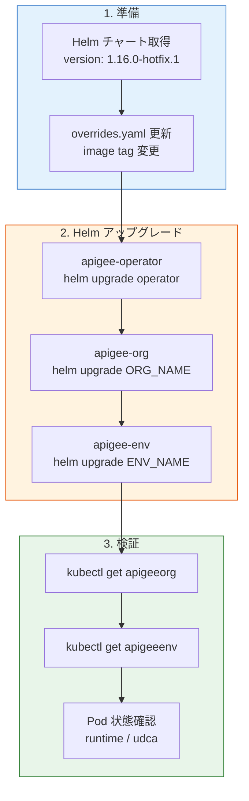

# Apigee hybrid: バージョン 1.16.0-hotfix.1 リリース

**リリース日**: 2026-03-12

**サービス**: Apigee hybrid

**機能**: 1.16.0-hotfix.1 バグ修正リリース

**ステータス**: Fixed / Announcement

📊 [このアップデートのインフォグラフィックを見る](https://takech9203.github.io/google-cloud-news-summary/20260312-apigee-hybrid-1-16-0-hotfix-1.html)

## 概要

2026 年 3 月 12 日、Google Cloud は Apigee hybrid 1.16.0-hotfix.1 をリリースした。このホットフィックスには、Helm テンプレートのプロキシ設定、EKS/AKS 環境での Workload Identity Federation (WIF) 対応、マルチ組織構成でのプロキシチェイニング、モネタイゼーション有効時の組織アップグレードなど、9 件のバグ修正が含まれている。

本リリースは Apigee hybrid v1.16.0 を既に運用しているユーザーを対象としたホットフィックスであり、Helm チャートのアップグレード手順に従って適用する。特に EKS や AKS 上で Federated Workload Identity を使用している環境、アウトバウンドプロキシを経由する構成、モネタイゼーション機能を有効にしている組織では、速やかな適用が推奨される。

**アップデート前の課題**

- 認証付きアウトバウンドプロキシを使用する場合、Helm テンプレート内の `http_proxy`/`https_proxy` 文字列が不正な形式で生成されていた
- EKS 環境で Workload Identity Federation (WIF) を使用すると、Apigee Operator のガードレール Pod が起動に失敗していた
- マルチ組織・単一ネームスペース構成でプロキシチェイニングを行うと HTTP 404 エラーが発生していた
- モネタイゼーションが有効な組織のアップグレード時に apigeeorg admission webhook がアップグレードをブロックしていた
- WIF と HTTP Forward Proxy の組み合わせでデータ移行後に API プロダクト・アプリ・デベロッパーの読み込みに失敗していた
- AKS/EKS 環境で Federated Workload Identity 使用時に ServiceAccount の作成に失敗していた

**アップデート後の改善**

- Helm テンプレートで認証付きプロキシの `http_proxy`/`https_proxy` 文字列が正しく生成されるようになった
- EKS 上の WIF 環境でガードレール Pod が正常に起動するようになった
- マルチ組織・単一ネームスペース構成でのプロキシチェイニングが正常に動作し HTTP 404 が解消された
- モネタイゼーション有効時でも組織のアップグレードが正常に完了するようになった
- WIF + HTTP Forward Proxy 構成でのデータ移行後、API プロダクト等の読み込みが正常に動作するようになった
- AKS/EKS での Federated Workload Identity 使用時に ServiceAccount が正しく作成されるようになった
- 非推奨の `apigee-stackdriver-logging-agent` イメージが `apigee-pull-push.sh` から削除された
- `apigee-manager` ロールに Deployment リソースの watch 権限が追加された
- 1.16.0-hotfix.1 タグの Helm チャートイメージが利用可能になった

## アーキテクチャ図



この図は Apigee hybrid 1.16.0-hotfix.1 の適用フローを示している。Helm チャートの取得と overrides.yaml の更新を行った後、Operator、Organization、Environment の順にアップグレードし、最後に各リソースの状態を検証する。

## サービスアップデートの詳細

### 主要機能

1. **認証付きアウトバウンドプロキシの修正 (490308770)**
   - Helm テンプレートで `http_proxy`/`https_proxy` の文字列が不正な形式で生成される問題を修正
   - 認証情報を含むプロキシ URL が正しくレンダリングされるようになった

2. **EKS での WIF ガードレール Pod 修正 (488417252)**
   - Amazon EKS 上で Workload Identity Federation を使用した場合に、Apigee Operator のガードレール Pod が起動に失敗する問題を修正
   - マルチクラウド環境での安定性が向上

3. **非推奨イメージの削除 (485526221)**
   - `apigee-pull-push.sh` スクリプトから非推奨の `apigee-stackdriver-logging-agent` イメージ参照を削除
   - イメージ同期時の不要なダウンロードを排除

4. **Helm チャートイメージの提供 (484405364)**
   - 1.16.0-hotfix.1 タグ付き Helm チャートイメージが Google Artifact Registry で利用可能

5. **Deployment watch 権限の追加 (482209901)**
   - `apigee-manager` ロールに Deployment リソースの watch 権限を追加
   - Operator がデプロイメント状態を適切に監視可能になった

6. **マルチ組織プロキシチェイニング修正 (482077193)**
   - マルチ組織・単一ネームスペース構成でプロキシチェイニング時に HTTP 404 が返される問題を修正
   - 複数組織を単一ネームスペースで運用する環境での信頼性が向上

7. **モネタイゼーション有効時のアップグレード修正 (481793880)**
   - `apigeeorg` admission webhook がモネタイゼーション有効な組織のアップグレードをブロックする問題を修正
   - 課金機能を利用している組織で安全にアップグレードが可能になった

8. **WIF + HTTP Forward Proxy でのデータ読み込み修正 (479872706)**
   - WIF と HTTP Forward Proxy の組み合わせ環境でデータ移行後に API プロダクト・アプリ・デベロッパーの読み込みに失敗する問題を修正

9. **AKS/EKS での ServiceAccount 作成修正 (479040521)**
   - AKS および EKS 環境で Federated Workload Identity 使用時に ServiceAccount の作成に失敗する問題を修正
   - マルチクラウド Kubernetes 環境での互換性が改善

## 技術仕様

### 修正バグ一覧

| Bug ID | 影響範囲 | 説明 |
|--------|----------|------|
| 490308770 | Helm テンプレート | 認証付き `http_proxy`/`https_proxy` 文字列の修正 |
| 488417252 | EKS + WIF | ガードレール Pod の起動失敗修正 |
| 485526221 | イメージ管理 | 非推奨 `apigee-stackdriver-logging-agent` の削除 |
| 484405364 | Helm チャート | 1.16.0-hotfix.1 タグイメージの提供 |
| 482209901 | RBAC | `apigee-manager` に Deployment watch 権限追加 |
| 482077193 | プロキシチェイニング | マルチ組織・単一ネームスペースでの HTTP 404 修正 |
| 481793880 | Admission Webhook | モネタイゼーション有効時のアップグレードブロック修正 |
| 479872706 | データ移行 | WIF + HTTP Forward Proxy 環境でのデータ読み込み修正 |
| 479040521 | ServiceAccount | AKS/EKS での WIF 利用時の SA 作成修正 |

### 対象コンポーネント

| コンポーネント | バージョン |
|---------------|-----------|
| Apigee hybrid | 1.16.0-hotfix.1 |
| Helm チャート | 1.16.0-hotfix.1 |
| 前提バージョン | Apigee hybrid v1.16.0 |
| Helm 要件 | v3.14.2 以上 |

## 設定方法

### 前提条件

1. Apigee hybrid v1.16.0 が既にインストール済みであること
2. Helm v3.14.2 以上がインストール済みであること
3. kubectl が適切なバージョンで利用可能であること

### 手順

#### ステップ 1: Helm チャートの取得

```bash
export CHART_REPO=oci://us-docker.pkg.dev/apigee-release/apigee-hybrid-helm-charts
export CHART_VERSION=1.16.0-hotfix.1

helm pull $CHART_REPO/apigee-operator --version $CHART_VERSION --untar
helm pull $CHART_REPO/apigee-datastore --version $CHART_VERSION --untar
helm pull $CHART_REPO/apigee-env --version $CHART_VERSION --untar
helm pull $CHART_REPO/apigee-ingress-manager --version $CHART_VERSION --untar
helm pull $CHART_REPO/apigee-org --version $CHART_VERSION --untar
helm pull $CHART_REPO/apigee-redis --version $CHART_VERSION --untar
helm pull $CHART_REPO/apigee-telemetry --version $CHART_VERSION --untar
helm pull $CHART_REPO/apigee-virtualhost --version $CHART_VERSION --untar
```

Google Artifact Registry から 1.16.0-hotfix.1 タグの Helm チャートをすべて取得する。

#### ステップ 2: Apigee Operator のアップグレード

```bash
# ドライラン
helm upgrade operator apigee-operator/ \
  --install \
  --namespace APIGEE_NAMESPACE \
  -f OVERRIDES_FILE \
  --dry-run=server

# 実行
helm upgrade operator apigee-operator/ \
  --install \
  --namespace APIGEE_NAMESPACE \
  -f OVERRIDES_FILE
```

ドライランで問題がないことを確認してからアップグレードを実行する。

#### ステップ 3: Organization と Environment のアップグレード

```bash
# Organization のアップグレード
helm upgrade ORG_NAME apigee-org/ \
  --install \
  --namespace APIGEE_NAMESPACE \
  -f OVERRIDES_FILE

# Environment のアップグレード (環境ごとに実行)
helm upgrade ENV_RELEASE_NAME apigee-env/ \
  --install \
  --namespace APIGEE_NAMESPACE \
  --set env=ENV_NAME \
  -f OVERRIDES_FILE
```

Organization、Environment の順にアップグレードする。複数環境がある場合は環境ごとに繰り返す。

#### ステップ 4: 状態の検証

```bash
kubectl -n APIGEE_NAMESPACE get apigeeorg
kubectl -n APIGEE_NAMESPACE get apigeeenv
kubectl -n APIGEE_NAMESPACE get pods -l app=apigee-runtime
kubectl -n APIGEE_NAMESPACE get pods -l app=apigee-udca
```

すべてのリソースが `running` 状態であることを確認する。

## メリット

### ビジネス面

- **マルチクラウド運用の安定性向上**: EKS/AKS 環境での WIF 関連の問題が解消され、AWS や Azure 上での Apigee hybrid 運用が安定する
- **課金機能との互換性確保**: モネタイゼーション有効時のアップグレード問題が解消され、API 収益化を利用する組織でも安全にバージョンを最新に保てる

### 技術面

- **プロキシチェイニングの信頼性向上**: マルチ組織構成での HTTP 404 問題が解消され、マイクロサービス間のプロキシ連携が安定する
- **セキュアなプロキシ構成のサポート**: 認証付きアウトバウンドプロキシが正しく動作し、企業のネットワークセキュリティ要件に適合する
- **運用の簡素化**: 非推奨イメージの削除と RBAC 権限の追加により、運用時のトラブルシューティング工数が削減される

## デメリット・制約事項

### 制限事項

- 本ホットフィックスは Apigee hybrid v1.16.0 からのアップグレードのみサポート。v1.15 以前からの場合はまず v1.16.0 への通常アップグレードが必要
- アップグレード時に Apigee コントローラーのローリングリスタートが発生するため、本番環境ではダウンタイムが生じる可能性がある
- ホットフィックスは一時的なリリースであり、次の標準リリースに変更内容が統合される

### 考慮すべき点

- 本番環境では最低 2 クラスター構成でのローリングアップグレードが推奨される。1 クラスターをオフラインにしてアップグレードし、トラフィックを切り替える方式が安全
- アップグレード前に Cassandra データベースのバックアップを取得すること
- 混在バージョン (1.15 と 1.16) では Cassandra のバックアップとリストアが正常に動作しないため、全クラスターを可能な限り早くアップグレードすること

## ユースケース

### ユースケース 1: マルチクラウド環境での API 管理

**シナリオ**: AWS EKS 上で Apigee hybrid を運用し、Federated Workload Identity を使用してサービスアカウントを管理している環境で、ガードレール Pod の起動失敗や ServiceAccount 作成エラーが発生している。

**効果**: Bug ID 488417252 および 479040521 の修正により、EKS/AKS 上での WIF 関連の問題が解消され、マルチクラウド環境での安定した API 管理基盤を構築できる。

### ユースケース 2: エンタープライズプロキシ経由でのデータ移行

**シナリオ**: セキュリティポリシーにより HTTP Forward Proxy を経由した外部通信が必須の環境で、Apigee hybrid 1.16.0 へのデータ移行後に API プロダクトやデベロッパー情報の読み込みに失敗している。

**効果**: Bug ID 479872706 の修正により、WIF と HTTP Forward Proxy を組み合わせた構成でもデータ移行後のデータ読み込みが正常に動作する。

## 料金

Apigee hybrid の料金はサブスクリプションモデルで提供される。ホットフィックスの適用自体に追加料金は発生しない。

| プラン | hybrid 対応 | 主な内容 |
|--------|-----------|----------|
| Enterprise | 25 組織対応 | 300 vCPU の Anthos 含む |
| Enterprise Plus | 25 組織対応 | 800 vCPU の Anthos 含む |

Pay-as-you-go 料金は現時点で Apigee hybrid には対応していない。詳細はサブスクリプションの料金ページを参照。

## 関連サービス・機能

- **Apigee**: クラウドネイティブの API 管理プラットフォーム。hybrid はそのオンプレミス/マルチクラウドデプロイメントモデル
- **Google Kubernetes Engine (GKE)**: Apigee hybrid のプライマリ実行環境。GKE 上での運用が最もテストされている
- **Amazon EKS / Azure AKS**: 本ホットフィックスで修正された WIF 関連のバグが影響するマルチクラウド Kubernetes プラットフォーム
- **Workload Identity Federation**: Google Cloud の認証メカニズム。外部 ID プロバイダーとの連携に使用
- **Cloud Monitoring / Cloud Logging**: Apigee hybrid の監視・ログ収集に使用。非推奨の `apigee-stackdriver-logging-agent` はこれらのサービスへのログ転送に関連

## 参考リンク

- 📊 [インフォグラフィック](https://takech9203.github.io/google-cloud-news-summary/20260312-apigee-hybrid-1-16-0-hotfix-1.html)
- [公式リリースノート](https://docs.cloud.google.com/release-notes#March_12_2026)
- [Apigee hybrid リリースノート](https://cloud.google.com/apigee/docs/hybrid/release-notes)
- [Apigee hybrid v1.16 アップグレードガイド](https://cloud.google.com/apigee/docs/hybrid/v1.16/upgrade)
- [Apigee hybrid v1.16 インストールガイド](https://cloud.google.com/apigee/docs/hybrid/v1.16/big-picture)
- [Apigee サブスクリプション料金](https://cloud.google.com/apigee/docs/api-platform/reference/subscription-entitlements)

## まとめ

Apigee hybrid 1.16.0-hotfix.1 は、マルチクラウド環境 (EKS/AKS) での Workload Identity Federation 対応、認証付きプロキシ構成、モネタイゼーション有効時のアップグレードなど、運用上の重要なバグを 9 件修正するリリースである。特に EKS/AKS 上で WIF を使用している環境や、アウトバウンドプロキシ経由の構成を利用している場合は速やかな適用が推奨される。Helm チャートによるアップグレード手順に従い、ドライランで検証した上で本番環境に適用すること。

---

**タグ**: #Apigee #ApigeeHybrid #Hotfix #BugFix #Helm #Kubernetes #EKS #AKS #WorkloadIdentityFederation #APIManagement
