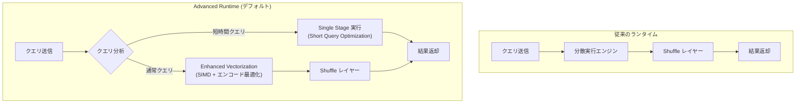

# BigQuery: Advanced Runtime が全プロジェクトでデフォルト有効化

**リリース日**: 2026-03-12

**サービス**: BigQuery

**機能**: Advanced Runtime デフォルト有効化

**ステータス**: Change

:bar_chart: [このアップデートのインフォグラフィックを見る](https://takech9203.github.io/google-cloud-news-summary/20260312-bigquery-advanced-runtime-default.html)

## 概要

BigQuery の Advanced Runtime が、全プロジェクトでデフォルトのランタイムとして有効化されました。2025 年 9 月 15 日に GA としてリリースされて以降、段階的に展開が進められてきた Advanced Runtime の全面展開が完了した形です。

Advanced Runtime は、Enhanced Vectorization (強化されたベクトル化実行) と Short Query Optimizations (短時間クエリ最適化) という 2 つの主要なパフォーマンス強化機能で構成されています。ユーザーのコード変更やアクション不要で、分析ワークロードを自動的に高速化します。

このアップデートは、BigQuery を利用する全てのプロジェクトに影響します。既にオプトインしていたユーザーには変更はありませんが、これまで手動で有効化していなかったプロジェクトでも自動的に Advanced Runtime が適用されるようになります。

**アップデート前の課題**

- Advanced Runtime を利用するには、プロジェクトまたは組織レベルで `ALTER PROJECT` / `ALTER ORGANIZATION` を使って手動で有効化する必要があった
- 手動設定を行っていないプロジェクトでは、従来のランタイムで実行されるためパフォーマンス改善の恩恵を受けられなかった
- リージョンごとに展開状況が異なり、一部のリージョンではデフォルト有効化がまだ完了していなかった

**アップデート後の改善**

- 全プロジェクトでデフォルトで Advanced Runtime が有効化され、手動設定が不要になった
- 全てのユーザーが自動的にクエリ実行時間の短縮とスロット消費の削減の恩恵を受けられるようになった
- リージョンに関わらず統一的に Advanced Runtime が適用されるようになった

## アーキテクチャ図



Advanced Runtime では、クエリの特性に応じて Short Query Optimization による単一ステージ実行と、Enhanced Vectorization による高速化が自動的に適用されます。

## サービスアップデートの詳細

### 主要機能

1. **Enhanced Vectorization (強化されたベクトル化実行)**
   - CPU キャッシュサイズに合わせたカラムデータブロック単位で処理し、SIMD (Single Instruction, Multiple Data) 命令を活用
   - Capacitor ストレージフォーマットの特殊エンコーディングを活用し、エンコードされたデータのままフィルタ評価を実行
   - クエリプラン全体で特殊エンコーディングを伝搬し、エンコード状態のままより多くのデータを処理
   - Expression Folding により決定的関数や定数式を事前評価し、複雑な述語を定数値に簡略化

2. **Short Query Optimizations (短時間クエリ最適化)**
   - 単一ステージで実行可能なクエリを動的に識別し、分散 Shuffle レイヤーをバイパス
   - レイテンシとスロット消費を削減
   - Optional Job Creation Mode と組み合わせると、ジョブの起動・管理・結果取得のレイテンシも最小化

3. **自動適用**
   - ユーザーのコード変更は一切不要
   - 対象クエリを自動的に判定して最適なランタイムを適用
   - プロジェクト内の全ユーザーのクエリに適用

## 技術仕様

### Short Query Optimizations の適用条件

Short Query Optimizations の適用はクエリの特性に基づいて動的に判定されます。

| 判定要素 | 詳細 |
|------|------|
| データスキャンサイズ | 予測されるスキャンデータサイズ |
| データ移動量 | クエリ実行に必要なデータ移動の量 |
| フィルタ選択性 | クエリフィルタの選択性 |
| データ物理レイアウト | ストレージ内のデータの種類と物理配置 |
| クエリ構造 | クエリ全体の構造 |
| 実行履歴 | 過去のクエリ実行の統計情報 |

### 必要な権限

| 項目 | 詳細 |
|------|------|
| ランタイム設定変更 | `bigquery.config.update` 権限 (BigQuery Admin ロール) |
| 自動適用 | 権限設定は不要 (デフォルトで全クエリに適用) |

## 設定方法

### デフォルト動作の確認

デフォルト有効化により、特別な設定は不要です。ただし、Advanced Runtime の適用状況を確認する場合は、以下の方法を使用します。

#### ステップ 1: クエリの最適化状況を確認

```sql
SELECT
  job_id,
  query_info.optimization_details.optimizations
FROM
  `region-us`.INFORMATION_SCHEMA.JOBS_BY_PROJECT
WHERE
  EXTRACT(DATE FROM creation_time) > DATE_SUB(CURRENT_DATE(), INTERVAL 7 DAY)
LIMIT 10;
```

`optimization_details` 内の `enhanced_vectorization` が `applied` になっていれば、Advanced Runtime が適用されています。

#### ステップ 2: パフォーマンス改善の推定

```sql
WITH jobs AS (
  SELECT *,
    query_info.query_hashes.normalized_literals AS query_hash,
    TIMESTAMP_DIFF(end_time, start_time, MILLISECOND) AS elapsed_ms,
    EXISTS(
      SELECT 1
      FROM UNNEST(JSON_QUERY_ARRAY(query_info.optimization_details.optimizations)) AS o
      WHERE JSON_VALUE(o, '$.enhanced_vectorization') = 'applied'
    ) AS has_advanced_runtime
  FROM `region-LOCATION`.INFORMATION_SCHEMA.JOBS_BY_PROJECT
  WHERE EXTRACT(DATE FROM creation_time) > DATE_SUB(CURRENT_DATE(), INTERVAL 30 DAY)
),
most_recent_jobs_without_advanced_runtime AS (
  SELECT *
  FROM jobs
  WHERE NOT has_advanced_runtime
  QUALIFY ROW_NUMBER() OVER (PARTITION BY query_hash ORDER BY end_time DESC) = 1
)
SELECT
  job.job_id,
  100 * SAFE_DIVIDE(
    original_job.elapsed_ms - job.elapsed_ms,
    original_job.elapsed_ms
  ) AS percent_execution_time_saved,
  job.elapsed_ms AS new_elapsed_ms,
  original_job.elapsed_ms AS original_elapsed_ms
FROM jobs AS job
INNER JOIN most_recent_jobs_without_advanced_runtime AS original_job
  USING (query_hash)
WHERE job.has_advanced_runtime
  AND original_job.end_time < job.start_time
ORDER BY percent_execution_time_saved DESC
LIMIT 10;
```

このクエリにより、Advanced Runtime 適用前後での実行時間の改善率を確認できます。`LOCATION` は対象リージョンに置き換えてください。

### 手動でのオプトアウト (必要な場合)

Advanced Runtime を無効化する必要がある場合は、`ALTER PROJECT` で設定を変更できます。

```sql
ALTER PROJECT `my-project`
SET OPTIONS (
  `region-us.query_runtime` = NULL
);
```

## メリット

### ビジネス面

- **コスト削減**: スロット消費の削減により、オンデマンドモデルではスキャンデータ量の最適化、キャパシティモデルでは同一スロット数でより多くのクエリ処理が可能
- **ゼロコスト導入**: コード変更や追加設定なしで自動的にパフォーマンスが向上するため、移行コストが不要

### 技術面

- **クエリ実行時間の短縮**: 公式のサンプルデータでは最大 45% の実行時間短縮が確認されており、特に短時間クエリで効果が大きい
- **スロット効率の向上**: Short Query Optimization により単一ステージで処理可能なクエリの Shuffle オーバーヘッドが排除される
- **ベクトル化処理の強化**: SIMD 命令の活用とエンコード状態でのデータ処理により、CPU 効率が向上

## デメリット・制約事項

### 制限事項

- Short Query Optimizations の適用はクエリの特性に依存するため、全てのクエリが最適化対象になるわけではない
- Advanced Runtime がデフォルト有効化されても、`INFORMATION_SCHEMA.PROJECT_OPTIONS` ビューには手動設定した場合のみ値が表示される
- パフォーマンス改善の効果はクエリのパターン、データ量、データレイアウトによって異なる

### 考慮すべき点

- 既存のクエリのパフォーマンス特性が変わる可能性があるため、パフォーマンスモニタリングの実施を推奨
- スロット消費パターンが変化するため、キャパシティベースの料金モデルを利用している場合はリザベーション設定の見直しが有効な場合がある

## ユースケース

### ユースケース 1: ダッシュボードクエリの高速化

**シナリオ**: BI ツールから多数の短時間クエリが発行されるダッシュボード環境で、ユーザー体験を向上させたい。

**実装例**:
```sql
-- Optional Job Creation Mode と併用して最大限の効果を得る
-- REST API でのクエリ実行時に jobCreationMode を OPTIONAL に設定
-- これにより Short Query Optimization の効果が最大化される
```

**効果**: Short Query Optimizations と Optional Job Creation Mode の組み合わせにより、ダッシュボードの応答時間が大幅に短縮される。ジョブ起動オーバーヘッドの削減と単一ステージ実行により、特にインタラクティブなダッシュボード操作での体感速度が向上する。

### ユースケース 2: 大規模分析パイプラインの効率化

**シナリオ**: 夜間バッチ処理で大量の分析クエリを実行しており、処理時間の短縮とスロットコストの削減を実現したい。

**効果**: Enhanced Vectorization によるエンコード状態でのデータ処理とフィルタ評価の最適化により、大規模データスキャンを含む分析クエリの実行効率が向上する。同一のスロット数でより多くのクエリを処理できるため、バッチウィンドウの短縮やコスト削減に寄与する。

## 料金

Advanced Runtime 自体に追加料金は発生しません。BigQuery の既存の料金モデル (オンデマンドまたはキャパシティベース) がそのまま適用されます。Advanced Runtime によるスロット消費の削減は、キャパシティベースモデルではコスト効率の向上に直接つながります。

### 料金モデル

| 料金モデル | 概要 |
|--------|-----------------|
| オンデマンド | クエリあたりのスキャンデータ量 (TiB) に基づく課金。Advanced Runtime による追加料金なし |
| キャパシティベース (Enterprise) | スロット時間に基づく課金。スロット効率向上によりコスト削減効果あり |
| キャパシティベース (Enterprise Plus) | Enterprise と同様。より高い優先度でスロット確保 |

詳細は [BigQuery 料金ページ](https://cloud.google.com/bigquery/pricing) を参照してください。

## 利用可能リージョン

Advanced Runtime は BigQuery が利用可能な全リージョンで有効です。詳細は [BigQuery ロケーション](https://cloud.google.com/bigquery/docs/locations) を参照してください。

## 関連サービス・機能

- **BigQuery BI Engine**: インメモリキャッシュによるクエリ高速化サービス。Advanced Runtime と併用することでさらなるパフォーマンス向上が期待できる
- **BigQuery Reservations**: スロットの割り当てと管理機能。Advanced Runtime によるスロット効率向上の効果をモニタリングする際に活用
- **Cloud Monitoring**: BigQuery ジョブのリソース消費をモニタリングし、Advanced Runtime の効果を計測するために使用
- **Optional Job Creation Mode**: Short Query Optimizations と組み合わせて使用することで、ジョブ起動オーバーヘッドを最小化

## 参考リンク

- :bar_chart: [インフォグラフィック](https://takech9203.github.io/google-cloud-news-summary/20260312-bigquery-advanced-runtime-default.html)
- [公式リリースノート](https://docs.cloud.google.com/release-notes#March_12_2026)
- [BigQuery Advanced Runtime ドキュメント](https://cloud.google.com/bigquery/docs/advanced-runtime)
- [BigQuery 料金ページ](https://cloud.google.com/bigquery/pricing)
- [BigQuery スロットの概要](https://cloud.google.com/bigquery/docs/slots)
- [クエリパフォーマンス最適化](https://cloud.google.com/bigquery/docs/best-practices-performance-overview)

## まとめ

BigQuery Advanced Runtime が全プロジェクトでデフォルト有効化されたことで、全ユーザーがコード変更なしでクエリパフォーマンスの向上とスロット効率の改善を享受できるようになりました。特に短時間クエリでは最大 45% の実行時間短縮が期待できます。推奨される次のアクションとして、`INFORMATION_SCHEMA` を活用して自身のプロジェクトでの改善効果を計測し、必要に応じてキャパシティプランニングの見直しを行うことをお勧めします。

---

**タグ**: #BigQuery #AdvancedRuntime #パフォーマンス #ベクトル化 #クエリ最適化
