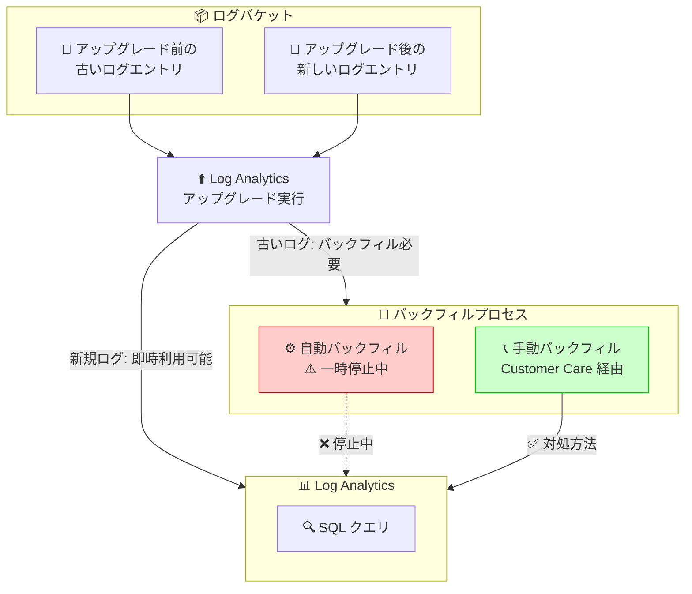

# Cloud Logging: Log Analytics バックフィル操作の一時停止

**リリース日**: 2026-03-12

**サービス**: Cloud Logging

**機能**: Log Analytics バックフィル操作の一時停止

**ステータス**: Issue (既知の問題)

📊 [このアップデートのインフォグラフィックを見る](https://takech9203.github.io/google-cloud-news-summary/20260312-cloud-logging-backfill-paused.html)

## 概要

Cloud Logging において、Log Analytics にアップグレードされたログバケットに対して自動的に実行されるバックフィル操作が一時的に停止されている。バックフィル操作とは、Log Analytics へのアップグレード前に書き込まれた古いログエントリを Log Analytics インターフェースで分析可能にするためのプロセスであり、通常はアップグレード後に自動的に開始される。

今回の問題により、新たにログバケットを Log Analytics にアップグレードした場合、アップグレード前のログエントリが Log Analytics で分析できない状態が続く可能性がある。なお、アップグレード後に新規に取り込まれたログエントリについては、引き続き Log Analytics で正常に分析可能である。

手動でバックフィル操作を開始するには、Cloud Customer Care に連絡する必要がある。この問題は一時的なものであり、自動バックフィルの再開時期については Google からの追加アナウンスを待つ必要がある。

**アップデート前の課題**

通常の動作では、ログバケットを Log Analytics にアップグレードすると、自動的にバックフィル操作が開始され、アップグレード前のログエントリも数時間から数日で Log Analytics で分析可能になる。

- ユーザーは特別な操作をせずとも、アップグレード前のログエントリを含めて Log Analytics で SQL クエリを実行できた
- バックフィルプロセスは自動的に完了し、ユーザーの介入は不要だった

**アップデート後の改善**

今回は Issue (既知の問題) の報告であるため、改善ではなく影響と対処方法を記載する。

- 自動バックフィル操作が一時停止されているため、新規アップグレード時にアップグレード前のログが自動的に利用可能にならない
- 手動でバックフィルを開始するには Cloud Customer Care への連絡が必要
- アップグレード後の新規ログエントリは影響を受けず、引き続き Log Analytics で分析可能

## アーキテクチャ図



この図は、Log Analytics アップグレード時のバックフィルフローを示している。現在、自動バックフィルが一時停止されており、アップグレード前の古いログを Log Analytics で分析するには Customer Care 経由で手動バックフィルを依頼する必要がある。

## サービスアップデートの詳細

### 主要ポイント

1. **自動バックフィルの一時停止**
   - ログバケットを Log Analytics にアップグレードした際に自動的に開始されるバックフィル操作が一時的に停止されている
   - この問題は既に Log Analytics にアップグレード済みでバックフィルが完了しているバケットには影響しない

2. **影響範囲**
   - 新たに Log Analytics にアップグレードするログバケットが対象
   - アップグレード前に書き込まれたログエントリが Log Analytics で分析できない状態が継続する
   - アップグレード後の新規ログエントリには影響なし

3. **手動バックフィルによる対処**
   - Cloud Customer Care に連絡することで、手動でバックフィル操作を開始できる
   - バックフィルの完了には通常数時間から数日を要する

## 技術仕様

### Log Analytics バックフィルの仕組み

| 項目 | 詳細 |
|------|------|
| バックフィル対象 | アップグレード前にログバケットに書き込まれたログエントリ |
| 通常の所要時間 | 数時間から数日 |
| 現在のステータス | 自動バックフィル一時停止中 |
| 対処方法 | Cloud Customer Care に手動バックフィルを依頼 |
| 新規ログへの影響 | なし (アップグレード後のログは即座に Log Analytics で利用可能) |

### Log Analytics アップグレードの制約事項

| 項目 | 詳細 |
|------|------|
| 対象バケット | Google Cloud プロジェクトレベルで作成されたログバケット |
| ロック状態 | アンロック状態のバケット (_Required バケットを除く) |
| 保留中の更新 | バケットに保留中の更新がないこと |
| 取り消し | アップグレード操作は取り消し不可 |

### アップグレードコマンド

```bash
# gcloud CLI でログバケットを Log Analytics にアップグレード
gcloud logging buckets update BUCKET_ID \
  --location=LOCATION \
  --enable-analytics \
  --async
```

## 設定方法

### 前提条件

1. Google Cloud プロジェクトレベルで作成されたログバケットが存在すること
2. バケットがアンロック状態であること (または _Required バケットであること)
3. バケットに保留中の更新がないこと

### 手順 (手動バックフィルの依頼)

#### ステップ 1: Log Analytics アップグレードの状態を確認

```bash
# ログバケットの状態を確認
gcloud logging buckets describe BUCKET_ID \
  --location=LOCATION
```

`analyticsEnabled` が `true` になっていることを確認する。

#### ステップ 2: Cloud Customer Care に連絡

Google Cloud コンソールからサポートケースを作成し、対象のログバケットに対するバックフィル操作の手動開始を依頼する。

サポートケースには以下の情報を含める:
- プロジェクト ID
- ログバケット ID
- ログバケットのロケーション
- Log Analytics アップグレードの実施日

## メリット

### ビジネス面

- **サポートによる回避策の提供**: 自動バックフィルが停止中であっても、Customer Care 経由で手動バックフィルを依頼することで業務への影響を最小限に抑えられる
- **新規ログ分析への影響なし**: アップグレード後のログエントリは引き続き Log Analytics で分析可能であり、リアルタイムのログ分析業務に支障はない

### 技術面

- **新規ログの取り込みに影響なし**: Log Analytics のコア機能であるログの取り込みと SQL クエリの実行は正常に動作する
- **既存のアップグレード済みバケットへの影響なし**: 既にバックフィルが完了しているバケットは影響を受けない

## デメリット・制約事項

### 制限事項

- 自動バックフィルが再開されるまでの間、アップグレード前のログを Log Analytics で分析するには手動対応が必要
- Customer Care への連絡が必要となるため、サポートプランに応じた対応時間の遅延が発生する可能性がある
- バックフィル操作自体にも数時間から数日の処理時間が必要

### 考慮すべき点

- この問題の解消時期は現時点で未定であるため、Log Analytics へのアップグレードを計画している場合は、バックフィルの遅延を考慮した計画が必要
- アップグレード前の過去ログの分析が緊急に必要な場合は、Logs Explorer を使用する代替手段を検討する
- BigQuery にルーティングされたログがある場合は、BigQuery 側での分析も代替手段として利用可能

## ユースケース

### ユースケース 1: 新規に Log Analytics へアップグレードする場合

**シナリオ**: 運用チームが既存のログバケットを Log Analytics にアップグレードし、過去のログも含めて SQL クエリで分析したいが、自動バックフィルが停止中である。

**対処方法**:
1. アップグレードを実行し、新規ログの分析を開始する
2. 過去ログの分析が必要な場合は Cloud Customer Care に手動バックフィルを依頼する
3. バックフィル完了までの間、過去ログの分析には Logs Explorer を使用する

**効果**: 新規ログの分析は即座に開始でき、過去ログも手動バックフィル完了後に分析可能になる

### ユースケース 2: アップグレードのタイミングを検討する場合

**シナリオ**: Log Analytics への移行を計画中で、過去ログの分析が重要な要件である。

**対処方法**:
1. 自動バックフィルの再開を待ってからアップグレードを実施する
2. または、アップグレードを実施しつつ Customer Care 経由で手動バックフィルを依頼する
3. 代替として BigQuery へのログルーティングを設定し、BigQuery で過去ログを分析する

**効果**: 計画的な移行により、過去ログの分析に関する影響を最小化できる

## 料金

Cloud Logging の料金体系は Google Cloud Observability の料金ページに記載されている。Log Analytics 自体の利用に追加料金は発生しないが、以下の点に留意する必要がある。

- ログの取り込み: 月間 50 GiB まで無料、超過分は $0.50/GiB
- ログの保存: デフォルト保持期間中は無料、延長分は $0.01/GiB
- BigQuery リンクドデータセット: BigQuery への取り込み・保存コストは不要だが、SQL クエリの実行に BigQuery 分析料金が適用される

バックフィル操作自体に追加料金は発生しない。

## 利用可能リージョン

Cloud Logging はすべての Google Cloud リージョンで利用可能。ログバケットのリージョン設定は作成時に指定し、後から変更することはできない。詳細は [Cloud Logging のリージョンサポート](https://cloud.google.com/logging/docs/region-support) を参照。

## 関連サービス・機能

- **Log Analytics**: ログバケットのデータに対して SQL クエリを実行する機能。今回の問題はバックフィルに関するものであり、Log Analytics のクエリ機能自体は正常に動作する
- **BigQuery (リンクドデータセット)**: Log Analytics にアップグレードしたバケットに対して BigQuery データセットをリンクすることで、BigQuery からログデータを直接読み取り・分析できる
- **Logs Explorer**: 従来のログ閲覧・検索インターフェース。バックフィル完了前でも、ログエントリの閲覧が可能
- **Cloud Monitoring**: ログベースの指標と連携して、ログデータに基づくアラートやダッシュボードを構成できる

## 参考リンク

- 📊 [インフォグラフィック](https://takech9203.github.io/google-cloud-news-summary/20260312-cloud-logging-backfill-paused.html)
- [公式リリースノート](https://docs.google.com/release-notes#March_12_2026)
- [Cloud Logging ログバケット管理ドキュメント](https://cloud.google.com/logging/docs/buckets)
- [Log Analytics 概要](https://cloud.google.com/logging/docs/log-analytics)
- [Google Cloud Observability 料金ページ](https://cloud.google.com/products/observability/pricing)

## まとめ

Cloud Logging の Log Analytics バックフィル操作が一時停止されている。Log Analytics にアップグレード済みまたは新規にアップグレードするログバケットにおいて、アップグレード前の古いログエントリを自動的に Log Analytics で分析可能にするバックフィル機能が利用できない状態である。過去ログの分析が必要な場合は Cloud Customer Care に連絡して手動バックフィルを依頼するか、Logs Explorer や BigQuery を代替手段として活用することが推奨される。自動バックフィルの再開については、Google からの追加アナウンスを確認すること。

---

**タグ**: #CloudLogging #LogAnalytics #Backfill #Issue #Observability #GCP
