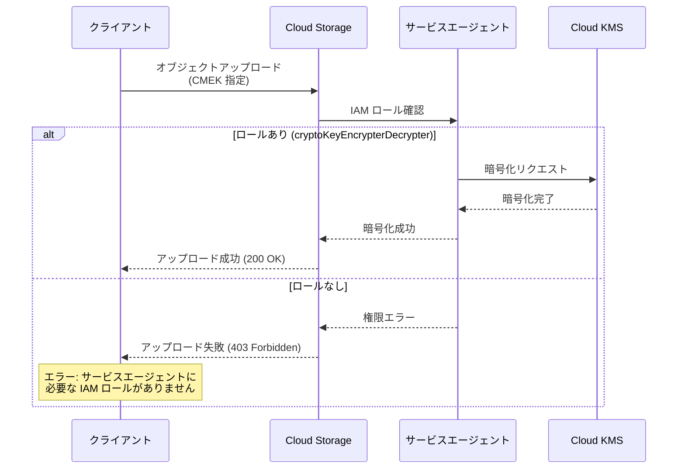

# Cloud Storage: CMEK を使用したオブジェクトアップロード時の IAM ロール検証の厳格化

**リリース日**: 2026-03-12

**サービス**: Cloud Storage

**機能**: CMEK (顧客管理暗号鍵) を使用したオブジェクトアップロード時に、サービスエージェントの IAM ロール不足でアップロードが失敗するよう変更

**ステータス**: GA

📊 [このアップデートのインフォグラフィックを見る](https://takech9203.github.io/google-cloud-news-summary/20260312-cloud-storage-cmek-upload-enforcement.html)

## 概要

Cloud Storage において、顧客管理暗号鍵 (CMEK: Customer-Managed Encryption Keys) を使用したオブジェクトアップロードの動作が変更された。Cloud Storage サービスエージェントがオブジェクトの復号に必要な IAM ロールを持っていない場合、アップロードが即座に失敗するようになった。これは、暗号化されたオブジェクトが後から読み取れなくなるという潜在的な問題を事前に防止するための変更である。

CMEK は Cloud Key Management Service (Cloud KMS) で作成・管理される暗号鍵であり、Cloud Storage のデフォルト暗号化に代わって、顧客自身が暗号鍵のライフサイクル、ローテーション、アクセス制御を管理できる仕組みである。Cloud Storage サービスエージェントには `roles/cloudkms.cryptoKeyEncrypterDecrypter` ロールが必要であり、このロールが付与されていない状態での CMEK アップロードが明示的にブロックされるようになった。

この変更は、セキュリティのベストプラクティスに沿ったものであり、CMEK を使用するすべての Cloud Storage ユーザーに影響する。適切な IAM ロールが設定されていれば、既存のワークフローに変更は不要である。

**アップデート前の課題**

- サービスエージェントに適切な IAM ロールが付与されていない場合でも、CMEK を指定したオブジェクトアップロードが成功する可能性があった
- アップロードは成功するが、後からオブジェクトを復号・読み取りできないという不整合な状態が発生し得た
- IAM 設定の不備に気付くのが遅れ、データアクセス不能のトラブルシューティングが困難になることがあった

**アップデート後の改善**

- サービスエージェントの IAM ロール不足時にアップロードが即座に失敗するため、設定ミスを早期に検出できるようになった
- アップロード成功 = 復号可能という一貫性が保証されるようになった
- エラーメッセージにより、必要な IAM ロールの設定手順が明確に示されるようになった

## アーキテクチャ図



CMEK を使用したオブジェクトアップロード時のフローを示している。サービスエージェントに `roles/cloudkms.cryptoKeyEncrypterDecrypter` ロールがない場合、アップロードが即座に失敗する。

## サービスアップデートの詳細

### 主要機能

1. **アップロード時の IAM ロール事前検証**
   - CMEK を指定したオブジェクトアップロード時に、Cloud Storage サービスエージェントが対象の Cloud KMS 鍵に対する復号権限を持っているか事前に検証する
   - 権限が不足している場合、オブジェクトの書き込みを行わずにエラーを返す

2. **明確なエラーメッセージの提供**
   - アップロード失敗時に、サービスエージェントに必要な IAM ロールと設定手順へのリンクが提示される
   - ドキュメント「[Assign a Cloud KMS key to a service agent](https://docs.cloud.google.com/storage/docs/encryption/using-customer-managed-keys#service-agent-access)」への参照が含まれる

3. **既存の正しい設定への影響なし**
   - サービスエージェントに適切なロールが付与済みの環境では、動作に変更なし
   - Cloud KMS Autokey を使用している場合、サービスエージェントへのロール付与は自動的に行われるため影響なし

## 技術仕様

### 必要な IAM ロール

| 項目 | 詳細 |
|------|------|
| 対象サービスエージェント | `service-{PROJECT_NUMBER}@gs-project-accounts.iam.gserviceaccount.com` |
| 必要な IAM ロール | `roles/cloudkms.cryptoKeyEncrypterDecrypter` |
| ロールの権限 | `cloudkms.cryptoKeyVersions.useToEncrypt`, `cloudkms.cryptoKeyVersions.useToDecrypt` |
| 適用スコープ | Cloud KMS 鍵、鍵リング、またはプロジェクトレベルで付与可能 |

### Cloud KMS 鍵の制約事項

| 項目 | 詳細 |
|------|------|
| 鍵の種類 | 対称暗号鍵のみ対応 |
| 鍵リングのロケーション | バケットと同一ロケーションに配置する必要あり |
| HSM 鍵 | 対応 (Cloud HSM クォータを消費) |
| 外部鍵 (EKM) | 対応 (Cloud EKM クォータを消費) |

## 設定方法

### 前提条件

1. Cloud Storage バケットが作成済みであること
2. Cloud KMS で暗号鍵が作成済みであること
3. 鍵リングのロケーションとバケットのロケーションが一致していること

### 手順

#### ステップ 1: Cloud Storage サービスエージェントの確認

```bash
# プロジェクトの Cloud Storage サービスエージェントを確認
gcloud storage service-agent --project=PROJECT_ID
```

サービスエージェントのメールアドレスが `service-PROJECT_NUMBER@gs-project-accounts.iam.gserviceaccount.com` の形式で返される。

#### ステップ 2: サービスエージェントに IAM ロールを付与

```bash
# gcloud CLI を使用してサービスエージェントに CMEK 権限を付与
gcloud storage service-agent \
  --project=PROJECT_STORING_OBJECTS \
  --authorize-cmek=projects/PROJECT_ID/locations/LOCATION/keyRings/KEY_RING/cryptoKeys/KEY_NAME
```

このコマンドにより、Cloud Storage サービスエージェントに対象の Cloud KMS 鍵への `roles/cloudkms.cryptoKeyEncrypterDecrypter` ロールが自動的に付与される。

#### ステップ 3: CMEK を使用したオブジェクトのアップロード

```bash
# バケットのデフォルト暗号鍵として CMEK を設定
gcloud storage buckets update gs://BUCKET_NAME \
  --default-encryption-key=projects/PROJECT_ID/locations/LOCATION/keyRings/KEY_RING/cryptoKeys/KEY_NAME

# 個別のオブジェクトに CMEK を指定してアップロード
gcloud storage cp LOCAL_FILE gs://BUCKET_NAME/OBJECT_NAME \
  --encryption-key=projects/PROJECT_ID/locations/LOCATION/keyRings/KEY_RING/cryptoKeys/KEY_NAME
```

## メリット

### ビジネス面

- **データアクセス不能リスクの排除**: アップロード時点で権限不足を検知するため、後から「暗号化されたデータにアクセスできない」というインシデントが発生しない
- **コンプライアンス対応の確実性向上**: CMEK による暗号化が正しく機能することをアップロード時に保証でき、監査要件への対応が容易になる

### 技術面

- **Fail-Fast 原則の適用**: 設定不備を早期に検出することで、デバッグコストを大幅に削減
- **運用の一貫性**: アップロード成功 = 暗号化・復号が正しく動作する状態であることが保証される

## デメリット・制約事項

### 制限事項

- サービスエージェントに適切な IAM ロールが付与されていない既存の CMEK ワークフローは、今回の変更により即座に失敗するようになる (破壊的変更)
- Cloud KMS 鍵リングはバケットと同一ロケーションに配置する必要があり、この制約は引き続き適用される

### 考慮すべき点

- 既存の CMEK アップロードパイプラインで IAM ロール設定が不完全な場合、即座に影響を受ける可能性がある
- CI/CD パイプラインやサービスアカウントベースのワークフローで CMEK を使用している場合、事前に IAM ロールの確認が必要
- Cloud KMS 鍵の無効化・破棄とアクセス制御の反映には遅延があり ([Cloud KMS Resource Consistency](https://docs.cloud.google.com/kms/docs/consistency#key_versions))、鍵の無効化後も一時的にアップロードが成功する可能性がある

## ユースケース

### ユースケース 1: 医療データのコンプライアンス対応ストレージ

**シナリオ**: 医療機関が患者データを Cloud Storage に保存する際、HIPAA 準拠のため CMEK で暗号化する必要がある。新しいプロジェクトセットアップ時にサービスエージェントの IAM ロール設定が漏れていた。

**実装例**:
```bash
# サービスエージェントへの CMEK 権限付与
gcloud storage service-agent \
  --project=healthcare-project \
  --authorize-cmek=projects/healthcare-project/locations/us-central1/keyRings/hipaa-keys/cryptoKeys/patient-data-key

# バケットのデフォルト暗号鍵を設定
gcloud storage buckets update gs://patient-records \
  --default-encryption-key=projects/healthcare-project/locations/us-central1/keyRings/hipaa-keys/cryptoKeys/patient-data-key
```

**効果**: IAM ロール設定漏れがアップロード時に即座に検出されるため、暗号化されていない、または復号不能なデータが保存されるリスクがなくなる。

### ユースケース 2: マルチプロジェクト環境での CMEK 一元管理

**シナリオ**: 中央のセキュリティチームが Cloud KMS 鍵を一元管理し、複数のプロジェクトの Cloud Storage バケットで CMEK を使用する。新規プロジェクト追加時にサービスエージェントへのロール付与を忘れることがある。

**効果**: 新規プロジェクトからの最初のアップロード時にエラーが明示的に返されるため、Infrastructure as Code (Terraform 等) のテンプレートに IAM ロール設定を追加する必要性が即座に明確になる。

## 料金

今回の変更自体に追加料金は発生しない。CMEK の利用に関連する料金は従来どおり Cloud KMS の料金体系に従う。

### 料金例

| 項目 | 月額料金 (概算) |
|------|-----------------|
| Cloud KMS ソフトウェア鍵 (アクティブなバージョンごと) | $0.06/月 |
| Cloud KMS HSM 鍵 (アクティブなバージョンごと) | $1.00/月 |
| Cloud KMS 鍵操作 (暗号化/復号、10,000 操作ごと) | $0.03 |
| Cloud Storage Standard ストレージ (US マルチリージョン) | $0.020/GB/月 |

Cloud KMS ソフトウェア鍵を使用した暗号化・復号操作では Cloud KMS クォータは消費されない。HSM 鍵および EKM 鍵を使用する場合はそれぞれのクォータが消費される。

## 利用可能リージョン

この変更はすべての Cloud Storage リージョンおよびマルチリージョンに適用される。Cloud KMS 鍵リングはバケットと同一ロケーションに作成する必要がある。デュアルリージョンバケットの場合、鍵リングはデュアルリージョンのロケーションコードと一致するマルチリージョンまたは事前定義デュアルリージョンに配置する必要がある。

## 関連サービス・機能

- **Cloud Key Management Service (Cloud KMS)**: CMEK の作成・管理・ローテーションを行うサービス。今回の変更における暗号鍵の提供元
- **Cloud KMS Autokey**: 鍵リングと鍵をオンデマンドで自動生成し、サービスエージェントへの IAM ロール付与も自動的に行う機能。Autokey を使用している場合、今回の変更の影響は受けにくい
- **Cloud Storage 顧客指定暗号鍵 (CSEK)**: 顧客がリクエストごとに暗号鍵を提供する方式。CMEK とは異なり、鍵は Cloud KMS に保存されない。今回の変更は CSEK には影響しない
- **組織ポリシー (CMEK)**: `constraints/gcp.restrictNonCmekServices` を使用して、CMEK なしでのリソース作成を制限する組織ポリシー

## 参考リンク

- 📊 [インフォグラフィック](https://takech9203.github.io/google-cloud-news-summary/20260312-cloud-storage-cmek-upload-enforcement.html)
- [公式リリースノート](https://docs.cloud.google.com/release-notes#March_12_2026)
- [ドキュメント: CMEK を使用した Cloud Storage の暗号化](https://docs.cloud.google.com/storage/docs/encryption/using-customer-managed-keys)
- [ドキュメント: サービスエージェントへの Cloud KMS 鍵の割り当て](https://docs.cloud.google.com/storage/docs/encryption/using-customer-managed-keys#service-agent-access)
- [ドキュメント: 顧客管理暗号鍵 (CMEK) 概要](https://docs.cloud.google.com/kms/docs/cmek)
- [料金ページ: Cloud KMS](https://cloud.google.com/kms/pricing)
- [料金ページ: Cloud Storage](https://cloud.google.com/storage/pricing)

## まとめ

Cloud Storage における CMEK アップロード時の IAM ロール検証が厳格化され、サービスエージェントに必要な `roles/cloudkms.cryptoKeyEncrypterDecrypter` ロールが不足している場合にアップロードが即座に失敗するようになった。CMEK を使用している環境では、サービスエージェントの IAM ロール設定を確認し、`gcloud storage service-agent --authorize-cmek` コマンドで適切な権限が付与されていることを検証することを推奨する。この変更は Fail-Fast 原則に基づいたセキュリティ強化であり、暗号化データの一貫性と信頼性を向上させるものである。

---

**タグ**: #CloudStorage #CMEK #CloudKMS #Encryption #IAM #Security #ServiceAgent #DataProtection #Compliance
