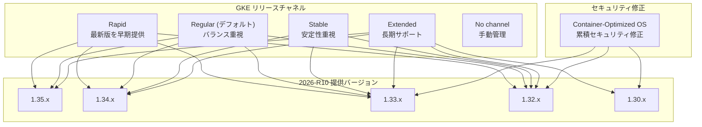

# Google Kubernetes Engine (GKE): 2026-R10 バージョンおよびセキュリティアップデート

**リリース日**: 2026-03-12

**サービス**: Google Kubernetes Engine (GKE)

**機能**: 2026-R10 バージョンアップデートおよび Container-Optimized OS セキュリティ修正

**ステータス**: GA

[このアップデートのインフォグラフィックを見る](https://takech9203.github.io/google-cloud-news-summary/20260312-gke-version-security-updates-2026-r10.html)

## 概要

GKE 2026-R10 リリースとして、すべてのリリースチャネル (Rapid、Regular、Stable、Extended、No channel) に新しいクラスタバージョンが提供された。今回のアップデートでは、Rapid チャネルに Kubernetes 1.35.2 系の最新パッチが追加され、Regular チャネルと Extended チャネルのデフォルトバージョンが 1.34.4-gke.1047000 に、Stable チャネルのデフォルトバージョンが 1.33.5-gke.2392000 に更新されている。

セキュリティ面では、GKE バージョン 1.30.14 から 1.33.9 に対応する Container-Optimized OS (COS) イメージが更新され、累積的なセキュリティ修正が適用された。COS イメージのセキュリティ修正は累積的であり、前回の GKE リリース以降にリリースされたすべての COS バージョンのセキュリティ修正が含まれる。

本アップデートは、GKE を利用するすべてのユーザーに影響する定期的なバージョンアップデートであり、特にセキュリティパッチの適用はすべての本番環境クラスタで推奨される。

**アップデート前の課題**

- 以前のバージョンには、COS イメージに含まれる既知のセキュリティ脆弱性が存在していた
- Rapid チャネルでは Kubernetes 1.35.2 系のパッチバージョンが利用できなかった
- Stable チャネルおよび Extended チャネルで利用可能なバージョンの選択肢が限られていた

**アップデート後の改善**

- Container-Optimized OS イメージの累積セキュリティ修正により、既知の脆弱性が解消された
- 各チャネルで最新のパッチバージョンが利用可能になり、新規クラスタ作成および既存クラスタのアップグレードの選択肢が拡大した
- Rapid チャネルに Kubernetes 1.35.2-gke.1269000 が追加され、最新の Kubernetes 機能を早期に検証可能になった

## アーキテクチャ図



各リリースチャネルで利用可能なバージョン範囲と、セキュリティ修正が適用された COS イメージの対象バージョンを示す。Rapid チャネルが最も広いバージョン範囲を提供し、Extended チャネルは 1.30 からの長期サポートを含む。

## サービスアップデートの詳細

### 主要機能

1. **Rapid チャネルのバージョン更新**
   - Kubernetes 1.35.2-gke.1269000 が新たに追加され、最新の Kubernetes 1.35 系パッチが利用可能に
   - 1.32.13-gke.1059000、1.33.9-gke.1060000、1.34.5-gke.1076000 も追加
   - Rapid チャネルは新しい Kubernetes バージョンを最も早く提供するチャネルであり、本番環境前の検証に推奨

2. **Regular / Stable / Extended チャネルのバージョン更新**
   - Regular チャネル: デフォルトバージョンが 1.34.4-gke.1047000 に更新。1.32.12、1.33.8、1.34.4、1.35.1 が追加
   - Stable チャネル: デフォルトバージョンが 1.33.5-gke.2392000 に更新。1.32.11、1.33.5、1.34.3 が追加
   - Extended チャネル: デフォルトバージョンが 1.34.4-gke.1047000 に更新。1.30.14 から 1.35.1 まで幅広いバージョンをサポート

3. **Container-Optimized OS セキュリティ修正**
   - GKE バージョン 1.30.14 から 1.33.9 に対応する COS イメージが更新
   - 累積的なセキュリティ修正が適用され、前回の GKE リリース以降に公開されたすべての脆弱性修正を含む
   - COS イメージの詳細は各バージョンのリリースノートで確認可能

## 技術仕様

### チャネル別バージョン一覧

#### Rapid チャネル

| マイナーバージョン | パッチバージョン |
|------|------|
| 1.32 | 1.32.13-gke.1059000 |
| 1.33 | 1.33.9-gke.1060000 |
| 1.34 | 1.34.5-gke.1076000 |
| 1.35 | 1.35.2-gke.1269000 |

#### Regular チャネル

| 項目 | 詳細 |
|------|------|
| デフォルトバージョン | 1.34.4-gke.1047000 |
| 1.32 系 | 1.32.12 |
| 1.33 系 | 1.33.8 |
| 1.34 系 | 1.34.4 |
| 1.35 系 | 1.35.1 |

#### Stable チャネル

| 項目 | 詳細 |
|------|------|
| デフォルトバージョン | 1.33.5-gke.2392000 |
| 1.32 系 | 1.32.11 |
| 1.33 系 | 1.33.5 |
| 1.34 系 | 1.34.3 |

#### Extended チャネル

| 項目 | 詳細 |
|------|------|
| デフォルトバージョン | 1.34.4-gke.1047000 |
| 利用可能範囲 | 1.30.14 ~ 1.35.1 |

#### No channel

| 項目 | 詳細 |
|------|------|
| デフォルトバージョン | 1.34.4-gke.1047000 |

### セキュリティ修正対象の COS イメージ

| GKE バージョン | 対象 |
|------|------|
| 1.30.14 ~ 1.33.9 | 累積セキュリティ修正適用済み COS イメージ |

### リリースチャネルの選択基準

| チャネル | 特徴 | 推奨用途 |
|------|------|------|
| Rapid | 最新バージョンを最も早く提供 | 開発・検証環境、新機能の早期評価 |
| Regular (デフォルト) | Rapid の 2-3 か月後に提供 | 一般的な本番環境 |
| Stable | Regular の 2-3 か月後に提供 | 安定性を最優先する本番環境 |
| Extended | Regular と同期 + 最大 24 か月サポート | 長期サポートが必要な環境 |
| No channel | Regular と同期 (非推奨) | ノード自動アップグレードを無効化したい場合 |

## 設定方法

### 前提条件

1. Google Cloud プロジェクトで GKE API が有効化されていること
2. `gcloud` CLI がインストールおよび認証済みであること
3. 対象クラスタに対する `container.clusters.update` 権限があること

### 手順

#### ステップ 1: 利用可能なバージョンを確認

```bash
# 特定チャネルで利用可能なバージョンを確認
gcloud container get-server-config \
  --zone=asia-northeast1-a \
  --format="yaml(channels)"
```

各チャネルで利用可能なバージョンとデフォルトバージョンを確認できる。

#### ステップ 2: クラスタのコントロールプレーンをアップグレード

```bash
# コントロールプレーンを指定バージョンにアップグレード
gcloud container clusters upgrade my-cluster \
  --zone=asia-northeast1-a \
  --master \
  --cluster-version=1.34.4-gke.1047000
```

コントロールプレーンのアップグレードは数分から数十分かかる。アップグレード中もワークロードは引き続き実行される。

#### ステップ 3: ノードプールをアップグレード

```bash
# ノードプールを指定バージョンにアップグレード
gcloud container clusters upgrade my-cluster \
  --zone=asia-northeast1-a \
  --node-pool=default-pool \
  --cluster-version=1.34.4-gke.1047000
```

ノードプールのアップグレードはサージアップグレード方式で実行され、ワークロードの可用性が維持される。

## メリット

### ビジネス面

- **セキュリティリスクの低減**: COS イメージの累積セキュリティ修正により、既知の脆弱性に対するリスクが軽減される。コンプライアンス要件を満たすためにも定期的なアップデート適用が重要
- **運用の安定性向上**: 各チャネルで検証済みのバージョンが提供されるため、安定した運用が可能

### 技術面

- **最新 Kubernetes 機能へのアクセス**: Rapid チャネルで 1.35.2 が利用可能になり、最新の Kubernetes API やリソースタイプを検証できる
- **柔軟なバージョン管理**: Extended チャネルでは 1.30 から 1.35 まで幅広いバージョンをサポートしており、アプリケーションの互換性に応じて適切なバージョンを選択可能

## デメリット・制約事項

### 制限事項

- Rapid チャネルのバージョンは GKE SLA の対象外であり、既知の回避策がない問題が含まれる可能性がある
- ロールアウトはリリースノート公開時点で既に進行中であり、すべての Google Cloud ゾーンで利用可能になるまで数日かかる場合がある
- Extended チャネルには Autopilot クラスタ、Alpha クラスタなど利用できない機能がある

### 考慮すべき点

- コントロールプレーンとノードプールのバージョンは最大 2 マイナーバージョンの差が許容されるが、可能な限り近いバージョンを使用することが推奨される
- セキュリティ修正は COS イメージに含まれるため、ノードプールのアップグレードが必要。コントロールプレーンのアップグレードだけでは COS のセキュリティ修正は適用されない
- メンテナンスウィンドウやメンテナンス除外を設定している場合、自動アップグレードのタイミングが影響を受ける

## ユースケース

### ユースケース 1: 本番環境のセキュリティパッチ適用

**シナリオ**: Regular チャネルを使用している本番クラスタで、COS のセキュリティ修正を早期に適用したい。

**実装例**:
```bash
# 現在のクラスタバージョンを確認
gcloud container clusters describe my-prod-cluster \
  --zone=asia-northeast1-a \
  --format="value(currentMasterVersion)"

# Regular チャネルの最新パッチバージョンにアップグレード
gcloud container clusters upgrade my-prod-cluster \
  --zone=asia-northeast1-a \
  --master \
  --cluster-version=1.34.4-gke.1047000

# ノードプールもアップグレード (COS セキュリティ修正を適用)
gcloud container clusters upgrade my-prod-cluster \
  --zone=asia-northeast1-a \
  --node-pool=default-pool
```

**効果**: COS イメージの累積セキュリティ修正が適用され、既知の脆弱性に対するリスクが解消される。

### ユースケース 2: Kubernetes 1.35 の早期検証

**シナリオ**: 開発環境で Kubernetes 1.35 の新機能を検証し、本番環境への移行計画を立てたい。

**実装例**:
```bash
# Rapid チャネルで 1.35.2 のクラスタを新規作成
gcloud container clusters create dev-cluster-135 \
  --zone=asia-northeast1-a \
  --release-channel=rapid \
  --cluster-version=1.35.2-gke.1269000 \
  --num-nodes=3
```

**効果**: 最新の Kubernetes 1.35 機能を早期に評価でき、本番環境への移行に向けた互換性テストを実施できる。

## 料金

GKE の料金はクラスタモード (Autopilot / Standard) によって異なる。バージョンアップデート自体に追加料金は発生しない。

- **Autopilot**: Pod のリソースリクエスト (vCPU、メモリ、エフェメラルストレージ) に基づく従量課金
- **Standard**: クラスタ管理手数料 + ノードの Compute Engine インスタンス料金
- **Extended チャネル**: 延長サポート期間に入ったマイナーバージョンを使用する場合、追加料金が発生

詳細は [GKE 料金ページ](https://cloud.google.com/kubernetes-engine/pricing) を参照。

## 関連サービス・機能

- **Container-Optimized OS**: GKE ノードで使用される OS イメージ。セキュリティ修正は COS イメージの更新として提供される
- **Cloud Monitoring / Cloud Logging**: クラスタのバージョン情報やアップグレード状況の監視に活用
- **Binary Authorization**: コンテナイメージのデプロイポリシーを管理。バージョンアップグレード時のセキュリティ検証に利用可能
- **GKE Security Posture**: クラスタのセキュリティ構成を評価し、推奨事項を提示。バージョンアップデート後のセキュリティ状態確認に有用

## 参考リンク

- [インフォグラフィック](https://takech9203.github.io/google-cloud-news-summary/20260312-gke-version-security-updates-2026-r10.html)
- [公式リリースノート](https://docs.cloud.google.com/release-notes#March_12_2026)
- [GKE リリースノート](https://cloud.google.com/kubernetes-engine/docs/release-notes)
- [リリースチャネルの概要](https://cloud.google.com/kubernetes-engine/docs/concepts/release-channels)
- [GKE バージョニングとサポート](https://cloud.google.com/kubernetes-engine/versioning)
- [GKE リリーススケジュール](https://cloud.google.com/kubernetes-engine/docs/release-schedule)
- [GKE セキュリティ情報](https://cloud.google.com/kubernetes-engine/docs/security-bulletins)
- [料金ページ](https://cloud.google.com/kubernetes-engine/pricing)

## まとめ

GKE 2026-R10 は、すべてのリリースチャネルにおけるバージョン更新と、COS イメージの累積セキュリティ修正を含む定期アップデートである。特にセキュリティ修正は本番環境クラスタへの早期適用が推奨される。各チャネルの特性を理解した上で、自組織の運用要件に合ったバージョンとチャネルを選択し、計画的なアップグレードを実施することが重要である。

---

**タグ**: #GKE #GoogleKubernetesEngine #Kubernetes #セキュリティ #バージョンアップデート #ContainerOptimizedOS #リリースチャネル #2026-R10
