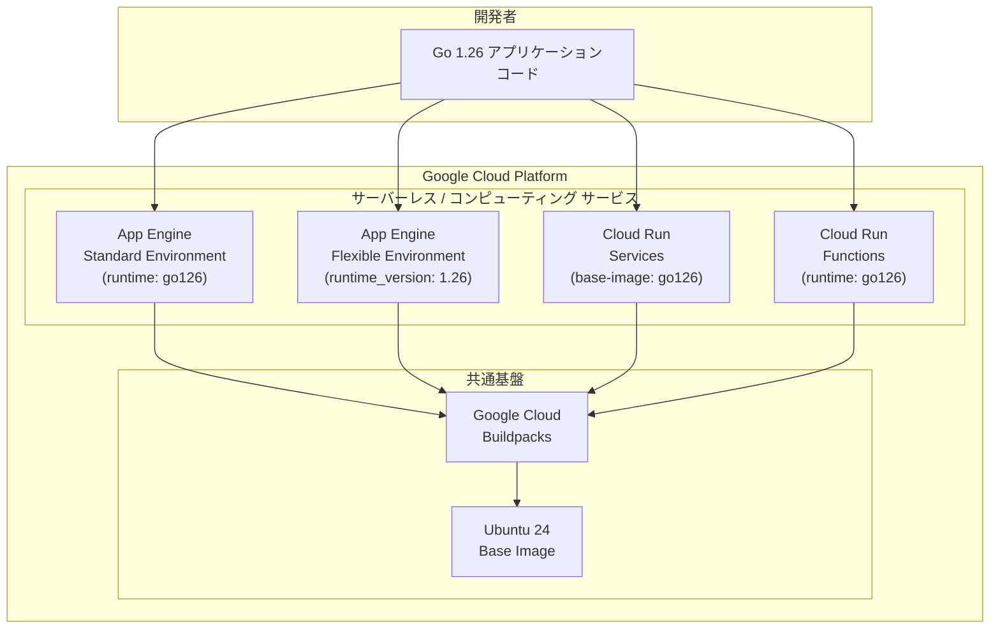

# Go 1.26 ランタイム GA (General Availability)

**リリース日**: 2026-03-12

**サービス**: App Engine flexible environment (Go), App Engine standard environment (Go), Cloud Run, Cloud Run functions

**機能**: Go 1.26 ランタイムの一般提供開始

**ステータス**: GA (General Availability)

[このアップデートのインフォグラフィックを見る](https://takech9203.github.io/google-cloud-news-summary/20260312-go-1-26-runtime-ga.html)

## 概要

Google Cloud は、Go 1.26 ランタイムのサポートを General Availability (GA) として複数のサーバーレス/コンピューティングサービスで提供開始しました。対象サービスは App Engine standard environment、App Engine flexible environment、Cloud Run、および Cloud Run functions の 4 サービスです。

Go 1.26 ランタイムの GA 化により、本番環境での Go 1.26 の利用が正式にサポートされます。これまで Preview ステータスであった Go 1.26 が GA となったことで、SLA の適用対象となり、エンタープライズワークロードでの安心した採用が可能になりました。Google Cloud のサーバーレスプラットフォーム全体で統一的に Go 1.26 を利用できるため、マイクロサービスアーキテクチャやイベント駆動型アプリケーションの構築において、最新の Go 言語機能を活用できます。

**アップデート前の課題**

- Go 1.26 ランタイムは Preview ステータスであり、本番ワークロードでの利用には SLA が適用されなかった
- Go 1.25 以前のランタイムを使用する必要があり、Go 1.26 の新機能を本番環境で活用できなかった
- Preview ステータスのランタイムは機能や安定性が変更される可能性があり、エンタープライズ利用にリスクがあった

**アップデート後の改善**

- Go 1.26 ランタイムが GA となり、SLA の適用対象として本番環境で安心して利用可能になった
- App Engine (standard/flexible)、Cloud Run、Cloud Run functions の 4 サービスすべてで Go 1.26 が正式サポート
- Go 1.26 の最新言語機能とパフォーマンス改善を本番ワークロードで活用可能になった

## アーキテクチャ図



Go 1.26 ランタイムは Google Cloud の 4 つのサーバーレス/コンピューティングサービスで利用可能です。いずれも Google Cloud Buildpacks を基盤とし、Ubuntu 24 ベースイメージ上で動作します。

## サービスアップデートの詳細

### 対象サービスと設定方法

1. **App Engine standard environment**
   - `app.yaml` の `runtime` フィールドに `go126` を指定
   - App Engine が自動的にパッチリビジョンを更新 (メジャーバージョンの自動更新は行われない)
   - デフォルトで F1 インスタンスクラスと自動スケーリングが適用

2. **App Engine flexible environment**
   - `app.yaml` の `runtime_config` セクションで `runtime_version: "1.26"` および `operating_system: "ubuntu24"` を指定
   - Buildpacks ベースのビルドプロセスを使用
   - `go.mod` ファイルによる依存関係管理が推奨

3. **Cloud Run (サービス)**
   - ソースからのデプロイ時に `--base-image` フラグで `go126` を指定可能
   - Buildpacks により自動ビルド
   - 自動セキュリティアップデートのサポート

4. **Cloud Run functions**
   - ランタイム ID `go126` を使用
   - ベースイメージ: `google-24/go126` (デフォルト) または `google-24-full/go126`
   - `--base-image go126` フラグでデプロイ時にランタイムを指定

## 技術仕様

### サービス別設定一覧

| サービス | 設定方法 | ランタイム ID / 指定値 | ベースイメージ |
|---------|---------|----------------------|---------------|
| App Engine standard | `app.yaml` の `runtime` | `go126` | Google 管理 |
| App Engine flexible | `app.yaml` の `runtime_config` | `1.26` | Ubuntu 24 |
| Cloud Run | `--base-image` フラグ | `go126` | `google-24/go126` |
| Cloud Run functions | `--base-image` フラグ | `go126` | `google-24/go126` |

### Cloud Run functions ベースイメージ

| スタック | ベースイメージ |
|---------|--------------|
| google-24 (デフォルト) | `google-24/go126` |
| google-24-full | `google-24-full/go126` |

## 設定方法

### 前提条件

1. Google Cloud SDK (gcloud CLI) バージョン 420.0.0 以降がインストールされていること
2. Go 1.26 がローカル開発環境にインストールされていること
3. `go.mod` ファイルによる依存関係管理が設定されていること

### 手順

#### App Engine standard environment

```yaml
# app.yaml
runtime: go126
```

```bash
gcloud app deploy
```

#### App Engine flexible environment

```yaml
# app.yaml
runtime: go
env: flex
runtime_config:
  operating_system: "ubuntu24"
  runtime_version: "1.26"
```

```bash
gcloud app deploy
```

#### Cloud Run (サービス)

```bash
gcloud run deploy SERVICE_NAME \
  --source . \
  --base-image go126
```

#### Cloud Run functions

```bash
gcloud run deploy FUNCTION_NAME \
  --source . \
  --function FUNCTION_ENTRYPOINT \
  --base-image go126
```

## メリット

### ビジネス面

- **本番環境での安定運用**: GA ステータスにより SLA が適用され、エンタープライズワークロードでの採用リスクが低減
- **統一的な開発体験**: 4 つのサービスすべてで同一の Go バージョンを利用でき、チーム間の技術スタック統一が容易

### 技術面

- **最新言語機能の活用**: Go 1.26 の新機能やパフォーマンス改善を本番環境で利用可能
- **自動セキュリティアップデート**: Cloud Run では自動ベースイメージ更新により、OS レベルのセキュリティパッチが自動適用
- **自動パッチ更新**: App Engine では指定バージョン内のパッチリビジョンが自動更新 (例: 1.26.x の範囲内)

## デメリット・制約事項

### 制限事項

- App Engine ではメジャーバージョンの自動更新は行われないため、将来的な Go バージョンアップは手動でのランタイム指定変更が必要
- Cloud Run functions では Go の依存関係は `go.mod` ファイルまたは `vendor` ディレクトリで提供する必要がある

### 考慮すべき点

- 既存の Go アプリケーションを Go 1.26 に移行する際は、Go のリリースノートで破壊的変更がないか確認すること
- Go のリリースポリシーにより、各メジャーリリースは 2 つの新しいメジャーリリースが公開されるまでサポートされる。サポートスケジュールを確認し、計画的なバージョン管理を行うこと

## ユースケース

### ユースケース 1: マイクロサービスアーキテクチャの統一

**シナリオ**: 複数の Go マイクロサービスを App Engine standard と Cloud Run で運用しているチームが、すべてのサービスを Go 1.26 に統一する。

**実装例**:
```yaml
# App Engine standard の app.yaml
runtime: go126
```

```bash
# Cloud Run サービスのデプロイ
gcloud run deploy my-service --source . --base-image go126
```

**効果**: サービス間で Go のバージョンが統一され、共通ライブラリの互換性管理が容易になる。

### ユースケース 2: イベント駆動型処理の構築

**シナリオ**: Cloud Run functions で Go 1.26 を使用し、Cloud Storage や Pub/Sub からのイベントを処理するサーバーレスアプリケーションを構築する。

**実装例**:
```bash
gcloud run deploy my-function \
  --source . \
  --function ProcessEvent \
  --base-image go126
```

**効果**: Go 1.26 の最新機能を活用したイベント処理ロジックを、インフラ管理なしで本番運用できる。

## 関連サービス・機能

- **Google Cloud Buildpacks**: Go 1.26 ランタイムのビルドとコンテナイメージ生成を担う基盤技術
- **自動ベースイメージ更新 (Cloud Run)**: OS レベルのセキュリティパッチを自動適用する機能。Go 1.26 ランタイムでも利用可能
- **Go Functions Framework**: Cloud Run functions で Go 関数を実行するためのフレームワーク

## 参考リンク

- [インフォグラフィック](https://takech9203.github.io/google-cloud-news-summary/20260312-go-1-26-runtime-ga.html)
- [公式リリースノート](https://docs.cloud.google.com/release-notes#March_12_2026)
- [App Engine standard Go ランタイム](https://cloud.google.com/appengine/docs/standard/go/runtime)
- [App Engine flexible Go ランタイム](https://cloud.google.com/appengine/docs/flexible/go/runtime)
- [Cloud Run Go ランタイム](https://cloud.google.com/run/docs/runtimes/go)
- [Cloud Run functions Go ランタイム](https://cloud.google.com/run/docs/runtimes/go)
- [自動ベースイメージ更新](https://cloud.google.com/run/docs/configuring/services/automatic-base-image-updates)

## まとめ

Go 1.26 ランタイムが Google Cloud の主要なサーバーレス/コンピューティングサービス 4 つ (App Engine standard、App Engine flexible、Cloud Run、Cloud Run functions) で GA となりました。Solutions Architect の観点からは、本番ワークロードでの Go 1.26 採用が正式にサポートされたことで、最新の Go 言語機能を活用したアプリケーション開発を安心して進められます。既存の Go アプリケーションを運用しているチームは、各サービスの設定ファイルでランタイムバージョンを `go126` (または `1.26`) に更新することで、段階的な移行を開始することを推奨します。

---

**タグ**: #AppEngine #CloudRun #CloudRunFunctions #Go #Runtime #GA #ServerlessComputing
