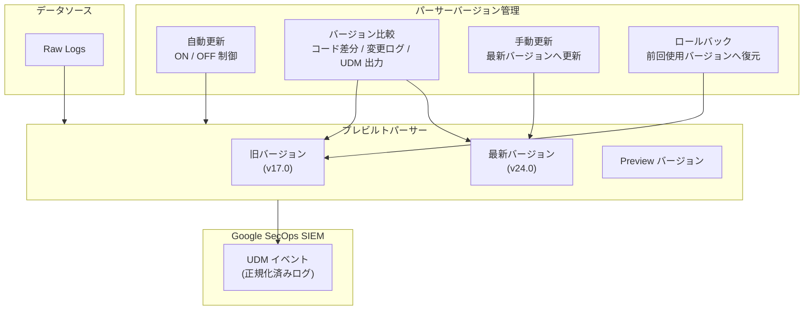

# Google SecOps: パーサーバージョン管理 (Manage Parser Versions)

**リリース日**: 2026-03-12

**サービス**: Google SecOps

**機能**: パーサーバージョン管理 (Manage Parser Versions)

**ステータス**: Public Preview

📊 [このアップデートのインフォグラフィックを見る](https://takech9203.github.io/google-cloud-news-summary/20260312-google-secops-parser-version-management.html)

## 概要

Google SecOps の「パーサーバージョン管理 (Manage Parser Versions)」機能が、全顧客向けに Public Preview として提供開始された。この機能は 2025 年 10 月に Preview として初めて発表されたもので、今回のアップデートにより全ての Google SecOps 顧客がプレビルトパーサーのバージョン管理をきめ細かく制御できるようになった。

パーサーバージョン管理機能は、Google SecOps が提供するプレビルトパーサーの更新ライフサイクル全体を管理するための機能である。自動更新のオプトイン・オプトアウト、バージョン間の処理ロジックの比較、手動での新バージョンへの更新、および以前のバージョンへのロールバックが可能となる。これにより、セキュリティチームは本番環境へのパーサー変更を慎重にテスト・検証してから適用できるようになる。

**アップデート前の課題**

- プレビルトパーサーの更新が自動適用され、組織のテストプロセスを経ずに本番環境のログパース処理が変更されるリスクがあった
- パーサーのバージョン間の処理ロジックの差分を確認する標準的な手段がなく、更新による影響を事前に評価することが困難だった
- パーサー更新後に問題が発生した場合、以前のバージョンへのロールバック手段が限定的であった

**アップデート後の改善**

- 自動更新のオプトイン・オプトアウトにより、パーサー更新のタイミングを組織のポリシーに合わせて制御できるようになった
- バージョン間のコード差分、変更ログ、UDM 出力の比較が可能になり、更新の影響を事前に評価できるようになった
- ワンクリックで以前のバージョンへのロールバックが可能になり、問題発生時の迅速な復旧が実現された

## アーキテクチャ図



パーサーバージョン管理機能は、プレビルトパーサーの更新ライフサイクル全体を制御するレイヤーとして機能する。管理者は自動更新の制御、バージョン比較、手動更新、ロールバックの各操作を通じて、本番環境のパーサーを安全に管理できる。

## サービスアップデートの詳細

### 主要機能

1. **自動更新のオプトイン・オプトアウト**
   - プレビルトパーサーごとに自動更新の有効・無効を切り替え可能
   - 自動更新を無効にすると、手動で更新するか再度有効にするまで現在のバージョンが維持される
   - Settings > Parsers のメニューから簡単に操作可能

2. **バージョン間の比較**
   - 現在のバージョンと新しいバージョンのコード差分を視覚的に表示
   - Change log タブで変更内容のサマリーを確認可能
   - サンプルの Raw Log に対する UDM 出力の比較が可能で、パースへの実際の影響を検証できる

3. **手動バージョン更新**
   - 自動更新がオフの場合、管理者が任意のタイミングで最新バージョンへ更新可能
   - 更新前に Compare parsers ページで変更内容を確認してから適用できる
   - パーサーの有効化には約 20 分を要する

4. **バージョンロールバック**
   - 問題発生時に前回使用していたバージョンへワンクリックで復元可能
   - ロールバックは直前に使用していたバージョンへのみ実行可能 (例: v17.0 から v24.0 に更新した場合、v17.0 に戻る)
   - 連続ロールバックは 1 回のみ実行可能

## 技術仕様

### パーサータイプ

| パーサータイプ | 説明 |
|------|------|
| Prebuilt | Google SecOps が作成・管理する標準パーサー。Raw Log を UDM フィールドにマッピングする |
| Prebuilt Extended | 顧客が追加のマッピング指示を含めて拡張したプレビルトパーサー |
| Custom | プレビルトではなく、カスタムのデータマッピング指示を持つパーサー |
| Custom Extended | パーサーエクステンションを使用した追加マッピング指示を持つカスタムパーサー |

### バージョン管理の動作仕様

| 項目 | 詳細 |
|------|------|
| 更新サイクル | 毎月第 4 週にプレビルトパーサーが更新される |
| パーサー有効化時間 | 更新後約 20 分で正規化プロセスに反映 |
| ロールバック反映時間 | 約 30 分 |
| ロールバック回数制限 | 連続 1 回のみ |
| サポートポリシー | 最新安定バージョンのみがバグ修正・機能強化を受ける |
| Preview パーサー参加条件 | 自動更新が有効かつ最新バージョンであること |

### 必要な権限

```json
{
  "roles": [
    {
      "role": "Administrator",
      "permissions": "パーサー管理の全操作が可能"
    },
    {
      "role": "Editor",
      "permissions": "パーサー管理の全操作が可能"
    }
  ],
  "note": "RBAC によりカスタムロールにパーサー管理権限を付与可能"
}
```

## 設定方法

### 前提条件

1. Google SecOps インスタンスへのアクセス権限 (Administrator または Editor ロール)
2. 管理対象のプレビルトパーサーが Active 状態であること

### 手順

#### ステップ 1: 自動更新の無効化

```
Settings > Parsers に移動
対象パーサーの Menu (三点リーダー) をクリック
"Turn off auto updates" を選択
```

自動更新を無効にすると、そのパーサーは現在のバージョンに固定される。

#### ステップ 2: 新バージョンの確認と比較

```
Settings > Parsers に移動
対象パーサーの Menu (三点リーダー) をクリック
"Update to latest version" を選択
Compare parsers ページでコード差分・変更ログ・UDM 出力を確認
```

Compare parsers ページでは、サンプル Raw Log を編集して異なるログパターンに対する UDM 出力も検証できる。

#### ステップ 3: 手動でのバージョン更新

```
Compare parsers ページで変更内容を確認後
"Update parser" ボタンをクリック
約 20 分後にパーサーが有効化される
```

更新後、問題が発生した場合はロールバックで前のバージョンに戻すことができる。

#### ステップ 4: ロールバック (必要な場合)

```
Settings > Parsers に移動
対象パーサーの Menu (三点リーダー) をクリック
"Roll back to last used version" を選択
Compare parsers ページで差分を確認
"Proceed to roll back" をクリック
```

ロールバック後、約 30 分でパーサーが前のバージョンに復元される。

## メリット

### ビジネス面

- **変更管理プロセスとの統合**: パーサー更新を組織の変更管理ポリシーに沿って制御でき、本番環境の安定性を維持しながら段階的に更新を適用できる
- **インシデント対応の迅速化**: パーサー更新に起因する問題を即座にロールバックで解消でき、ログパースの中断による影響を最小限に抑えられる
- **コンプライアンス対応**: パーサーの変更履歴を追跡でき、監査要件への対応が容易になる

### 技術面

- **影響の事前評価**: バージョン間のコード差分と UDM 出力比較により、パーサー更新がログ正規化に与える影響を事前に詳細に評価できる
- **段階的な更新適用**: 自動更新の無効化と手動更新の組み合わせにより、テスト環境で検証してから本番環境に適用するワークフローが実現可能
- **ロールバック機能**: 問題発生時のダウンタイムを最小限に抑え、ログパースの継続性を確保できる

## デメリット・制約事項

### 制限事項

- ロールバックは直前のバージョンへのみ可能で、任意の過去バージョンへの復元はできない
- 連続ロールバックは 1 回のみ実行可能で、2 回連続のロールバックはできない
- Preview パーサーのテスト中にアクティブなカスタムパーサーがある場合、Preview ツールは使用できない
- 最新安定バージョン以外のバージョンにはバグ修正やセキュリティパッチが提供されない

### 考慮すべき点

- 自動更新を長期間無効にすると、セキュリティ修正や新しいログフォーマットへの対応が遅れるリスクがある
- パーサー更新の有効化には約 20-30 分のタイムラグがあり、その間はログパースに一時的な不整合が発生する可能性がある
- カスタムパーサーを使用している場合、プレビルトパーサーのバージョン管理機能の一部が利用できない

## ユースケース

### ユースケース 1: 金融機関のセキュリティチームによる段階的パーサー更新

**シナリオ**: 金融機関のセキュリティチームが、本番環境の Google SecOps で使用しているプレビルトパーサーの更新を、組織の変更管理プロセスに沿って安全に適用する。

**実装例**:
```
1. 自動更新をオフにする (Settings > Parsers > Turn off auto updates)
2. 新バージョンが利用可能になったら Compare parsers で差分を確認
3. テスト環境で UDM 出力を検証
4. 変更管理承認後に手動で Update parser を実行
5. 問題があればロールバックを実行
```

**効果**: 本番環境の安定性を維持しながら、新しいパーサーバージョンの恩恵を受けることができる。変更管理の記録としてもバージョン比較情報を活用可能。

### ユースケース 2: マルチテナント MSSP 環境でのパーサー管理

**シナリオ**: マネージドセキュリティサービスプロバイダ (MSSP) が、複数の顧客環境でパーサー更新を管理し、顧客ごとの要件に応じた更新スケジュールを実現する。

**効果**: 顧客ごとの SLA やコンプライアンス要件に合わせたパーサー更新管理が可能になり、更新に起因する問題発生時の影響範囲を限定できる。

## 料金

パーサーバージョン管理機能は Google SecOps の標準機能として提供され、追加料金は発生しない。Google SecOps の料金体系に含まれる。

| プラン | パーサーバージョン管理 |
|--------|-----------------|
| Google SecOps Standard | 利用可能 |
| Google SecOps Enterprise | 利用可能 |
| Google SecOps Enterprise Plus | 利用可能 |

## 利用可能リージョン

Google SecOps が利用可能な全リージョンで本機能を利用できる。Public Preview として全顧客に提供されている。

## 関連サービス・機能

- **Google SecOps SIEM パーサー**: プレビルトパーサーおよびカスタムパーサーによるログの UDM 正規化処理の基盤機能
- **パーサーエクステンション**: プレビルトパーサーに追加のフィールドマッピングを定義してログデータの抽出範囲を拡張する機能
- **Google SecOps RBAC**: パーサー管理機能へのアクセスをロールベースで制御する機能
- **データ処理パイプライン**: インジェスション前のログデータのフィルタリング・変換・リダクションを行う機能 (Preview)

## 参考リンク

- 📊 [インフォグラフィック](https://takech9203.github.io/google-cloud-news-summary/20260312-google-secops-parser-version-management.html)
- [公式リリースノート](https://docs.cloud.google.com/release-notes#March_12_2026)
- [ドキュメント: Manage prebuilt and custom parsers](https://docs.cloud.google.com/chronicle/docs/event-processing/manage-parser-updates)
- [ドキュメント: パーサーバージョン管理](https://docs.cloud.google.com/chronicle/docs/event-processing/manage-parser-updates#manage-parser-versions)

## まとめ

Google SecOps のパーサーバージョン管理機能が Public Preview として全顧客に開放されたことにより、セキュリティチームはプレビルトパーサーの更新ライフサイクルをきめ細かく制御できるようになった。自動更新の制御、バージョン比較、手動更新、ロールバックといった包括的な管理機能により、本番環境の安定性を維持しながら最新のパーサー機能を活用できる。特に変更管理プロセスが厳格な組織やマネージドセキュリティサービスプロバイダにとって、パーサー更新の安全な適用とリスク低減に大きく貢献する機能である。

---

**タグ**: #GoogleSecOps #SIEM #Parser #VersionManagement #SecurityOperations #LogParsing #UDM #PublicPreview
