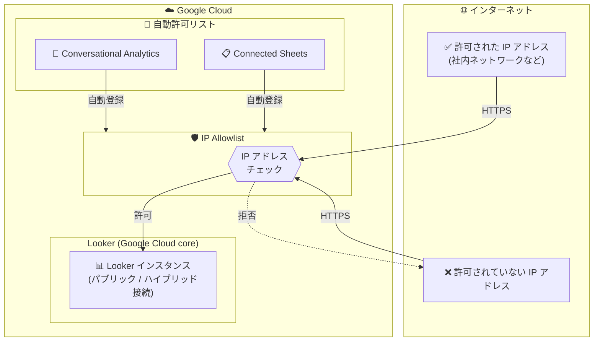

# Looker: IP Allowlist によるアクセス制御

**リリース日**: 2026-03-12

**サービス**: Looker (Google Cloud core)

**機能**: IP Allowlist (IP 許可リスト)

**ステータス**: Feature

📊 [このアップデートのインフォグラフィックを見る](https://takech9203.github.io/google-cloud-news-summary/20260312-looker-ip-allowlists.html)

## 概要

Looker (Google Cloud core) のパブリック接続またはハイブリッド接続を使用するインスタンスで、IP Allowlist (IP 許可リスト) がサポートされるようになった。この機能により、指定した IP アドレスからのトラフィックのみがインスタンスにアクセスできるようになり、ネットワークレイヤーでのセキュリティが大幅に強化される。

Conversational Analytics や Connected Sheets などの Google Cloud サービスに接続する場合、それらのサービスに必要な IP 範囲を自動的に許可リストに追加するオプションも提供される。既存のインスタンスについては、Google Cloud コンソールでインスタンスを編集することで IP Allowlist を構成できる。この機能は今後 1 週間かけて段階的にロールアウトされる。

**アップデート前の課題**

従来、Looker (Google Cloud core) のパブリック接続およびハイブリッド接続インスタンスでは、IP Allowlist がサポートされていなかった。公式ドキュメントでも「Not supported」と明記されており、プライベート接続インスタンスでは VPC 設定でアクセス制御が可能だったが、パブリック接続やハイブリッド接続では同等のネットワークレベルのアクセス制御手段がなかった。

- パブリック接続インスタンスでは、インターネット上のすべての IP アドレスからのアクセスを許可する構成となっていた
- ハイブリッド接続インスタンスでも、受信 (northbound) トラフィックはパブリック接続経由であり、IP ベースのアクセス制限ができなかった
- Conversational Analytics や Connected Sheets との連携時に、必要な IP 範囲を手動で把握・管理する必要があった

**アップデート後の改善**

- パブリック接続およびハイブリッド接続インスタンスで IP Allowlist を構成し、特定の IP アドレスからのトラフィックのみを許可できるようになった
- Conversational Analytics や Connected Sheets などの Google Cloud サービス向けに、必要な IP 範囲を自動で許可リストに追加するオプションが提供された
- Google Cloud コンソールから既存インスタンスの編集で簡単に設定できるようになった

## アーキテクチャ図

IP Allowlist はネットワークレイヤーでトラフィックをフィルタリングし、許可された IP アドレスからのアクセスのみを Looker インスタンスに到達させる。Conversational Analytics や Connected Sheets の IP 範囲は自動登録オプションで簡単に許可できる。

## サービスアップデートの詳細

### 主要機能

1. **IP Allowlist (IP 許可リスト)**
   - パブリック接続またはハイブリッド接続の Looker (Google Cloud core) インスタンスに対して、アクセスを許可する IP アドレスのリストを設定できる
   - 指定された IP アドレスからのトラフィックのみがインスタンスにアクセス可能となり、それ以外のトラフィックはブロックされる

2. **Google Cloud サービス向け自動許可リスト**
   - Conversational Analytics や Connected Sheets などの Google Cloud サービスと連携する際、必要な IP 範囲を自動的に許可リストに追加するオプションを提供
   - 手動で IP 範囲を調べて設定する手間が不要になる

3. **Google Cloud コンソールからの設定**
   - 既存のインスタンスに対して、Google Cloud コンソール上でインスタンスを編集することで IP Allowlist を構成可能
   - 新規インスタンス作成時にも設定できる

## 技術仕様

### 対応するネットワーク構成

| 項目 | 詳細 |
|------|------|
| 対応接続タイプ | パブリック接続 (Public secure connections)、ハイブリッド接続 (Hybrid connections) |
| 非対応接続タイプ | プライベート接続 (Private connections) - VPC 設定でアクセス制御が可能なため不要 |
| 自動許可対象サービス | Conversational Analytics、Connected Sheets |
| 設定方法 | Google Cloud コンソールからインスタンスの編集 |
| ロールアウト期間 | 2026 年 3 月 12 日から約 1 週間で段階的に展開 |

### Looker (Google Cloud core) のネットワーク構成の種類

| ネットワーク構成 | 受信トラフィック | 送信トラフィック | IP Allowlist |
|------------------|------------------|------------------|-------------|
| パブリック接続 | パブリック IP | パブリック IP | 対応 (今回追加) |
| ハイブリッド接続 (PSA) | パブリック URL | VPC 経由 (プライベート) | 対応 (今回追加) |
| ハイブリッド接続 (PSC) | パブリック URL | PSC 経由 | 対応 (今回追加) |
| プライベート接続 (PSA/PSC) | VPC 経由 | VPC 経由 | 不要 (VPC で制御) |

## 設定方法

### 前提条件

1. Looker (Google Cloud core) インスタンスがパブリック接続またはハイブリッド接続で構成されていること
2. Google Cloud コンソールへのアクセス権限があること
3. インスタンスの編集権限 (`looker.instances.update`) を持っていること

### 手順

#### ステップ 1: Google Cloud コンソールで Looker インスタンスに移動

Google Cloud コンソールにログインし、Looker のインスタンスページに移動する。対象のインスタンスを選択する。

#### ステップ 2: インスタンスの編集

インスタンスの詳細ページで「編集」を選択し、IP Allowlist セクションで許可する IP アドレスまたは CIDR 範囲を追加する。

#### ステップ 3: Google Cloud サービスの自動許可 (オプション)

Conversational Analytics や Connected Sheets と連携する場合、自動許可リストオプションを有効にして、必要な IP 範囲を自動的に追加する。

#### ステップ 4: 設定の保存

設定内容を確認し、保存する。変更は段階的にインスタンスに反映される。

## メリット

### ビジネス面

- **コンプライアンス強化**: 許可された IP アドレスからのみアクセスを許可することで、規制要件やセキュリティポリシーへの準拠が容易になる
- **ゼロトラストセキュリティの推進**: ネットワークレイヤーでのアクセス制御を追加することで、多層防御アプローチを実現できる

### 技術面

- **ネットワークセキュリティの向上**: パブリック接続インスタンスでも、特定の IP アドレスからのトラフィックのみを許可できるようになった
- **運用効率の改善**: Google Cloud サービス向けの IP 範囲を自動で許可リストに追加できるため、手動管理の負担が軽減される
- **既存インスタンスへの適用**: 新規インスタンスだけでなく、既存のインスタンスにも設定可能

## デメリット・制約事項

### 制限事項

- プライベート接続インスタンスには適用されない (VPC 設定でアクセス制御を行う)
- ロールアウトは段階的に行われるため、すべてのインスタンスで即座に利用可能になるわけではない (約 1 週間)

### 考慮すべき点

- IP Allowlist を設定する際、許可する IP アドレスの漏れがあるとユーザーがアクセスできなくなる可能性がある
- 動的 IP アドレスを使用している環境では、CIDR 範囲を適切に設定する必要がある
- VPN やプロキシ経由のアクセスを考慮して、すべてのアクセス経路の IP アドレスを許可リストに含める必要がある

## ユースケース

### ユースケース 1: 企業ネットワークからのアクセス制限

**シナリオ**: 大企業が Looker (Google Cloud core) をパブリック接続で利用しており、社内ネットワークからのみアクセスを許可したい場合。

**効果**: 企業の固定 IP アドレスまたは IP 範囲のみを許可リストに登録することで、社外からの不正アクセスを防止できる。VPN 経由のリモートアクセスも、VPN サーバーの IP アドレスを許可リストに追加することで対応可能。

### ユースケース 2: マルチクラウド環境でのセキュアなアクセス

**シナリオ**: ハイブリッド接続で Looker を利用しつつ、Conversational Analytics と Connected Sheets も活用したい場合。

**効果**: 自動許可リスト機能を利用して Google Cloud サービスの IP 範囲を簡単に許可しつつ、それ以外のアクセスは企業のゲートウェイ IP に限定できる。手動での IP 範囲管理が不要になり、運用負荷が軽減される。

## 料金

IP Allowlist 機能自体の追加料金は、リリースノートでは言及されていない。Looker (Google Cloud core) の料金はエディション (Standard、Enterprise、Embed) によって異なる。

詳細は [Looker (Google Cloud core) 料金ページ](https://cloud.google.com/looker/pricing) を参照。

## 利用可能リージョン

Looker (Google Cloud core) が利用可能なすべてのリージョンで、パブリック接続またはハイブリッド接続のインスタンスに対して利用可能。段階的なロールアウトにより、約 1 週間ですべてのインスタンスに展開される。

## 関連サービス・機能

- **[Conversational Analytics](https://cloud.google.com/looker/docs/conversational-analytics-overview)**: Gemini を活用した自然言語でのデータ分析機能。IP Allowlist の自動許可リスト対象サービス
- **[Connected Sheets](https://cloud.google.com/looker/docs/connected-sheets)**: Google Sheets から Looker の LookML モデルのデータを探索する機能。IP Allowlist の自動許可リスト対象サービス
- **[VPC Service Controls](https://cloud.google.com/looker/docs/looker-core-vpcsc)**: プライベート接続インスタンスで利用可能なセキュリティ機能。IP Allowlist とは異なるアプローチでアクセス制御を実現
- **[Private Service Connect](https://cloud.google.com/looker/docs/looker-core-psc-overview)**: プライベート接続オプションの一つ。IP Allowlist が不要な完全プライベートなネットワーク構成を提供

## 参考リンク

- 📊 [インフォグラフィック](https://takech9203.github.io/google-cloud-news-summary/20260312-looker-ip-allowlists.html)
- [公式リリースノート](https://docs.cloud.google.com/release-notes#March_12_2026)
- [Looker (Google Cloud core) ネットワーク構成オプション](https://cloud.google.com/looker/docs/looker-core-networking-options)
- [Looker セキュアなデータベースアクセスの有効化](https://cloud.google.com/looker/docs/enabling-secure-db-access)
- [Looker (Google Cloud core) 機能の違い (ネットワーク構成別)](https://cloud.google.com/looker/docs/looker-core-feature-differences)
- [料金ページ](https://cloud.google.com/looker/pricing)

## まとめ

今回のアップデートにより、Looker (Google Cloud core) のパブリック接続およびハイブリッド接続インスタンスで、これまでサポートされていなかった IP Allowlist が利用可能になった。これはネットワークレイヤーでのアクセス制御を実現する重要なセキュリティ強化であり、特にパブリック接続を利用する企業にとって大きな価値がある。Conversational Analytics や Connected Sheets 向けの自動許可リスト機能も提供されるため、Google Cloud コンソールから既存インスタンスの設定を確認し、IP Allowlist の導入を検討することを推奨する。

---

**タグ**: #Looker #GoogleCloudCore #Security #IPAllowlist #NetworkSecurity #ConversationalAnalytics #ConnectedSheets
