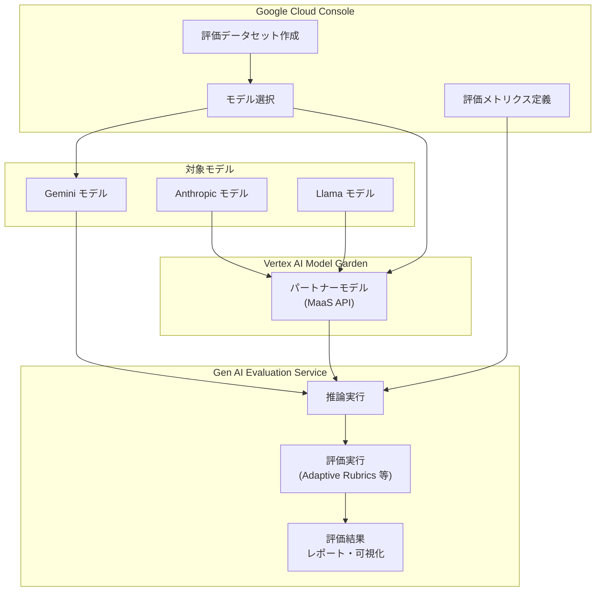

# Generative AI on Vertex AI: パートナーモデル評価のサポート

**リリース日**: 2026-03-12

**サービス**: Generative AI on Vertex AI

**機能**: パートナーモデル評価のサポート

**ステータス**: Feature

:bar_chart: [このアップデートのインフォグラフィックを見る](https://takech9203.github.io/google-cloud-news-summary/20260312-vertex-ai-partner-model-evaluations.html)

## 概要

Vertex AI の Gen AI Evaluation Service において、パートナーモデル (サードパーティモデル) の評価がサポートされました。これにより、Anthropic や Llama といったサードパーティモデルを、Google Cloud コンソール上から Gemini モデルと同じ評価基盤を使って統一的に評価できるようになります。

Gen AI Evaluation Service は、Adaptive Rubrics (適応型ルーブリック) をはじめとする企業向けの評価手法を提供しており、今回のアップデートにより、これらの評価手法がパートナーモデルにも適用可能になりました。マルチモデル戦略を採用する組織にとって、統一された評価基盤で複数ベンダーのモデルを比較検証できることは、モデル選定プロセスの効率化と客観性の向上に直結します。

対象ユーザーは、Vertex AI 上で複数の LLM を活用している、または今後マルチモデル戦略の採用を検討している Solutions Architect、ML エンジニア、データサイエンティストです。

**アップデート前の課題**

- サードパーティモデルの評価には SDK を通じたプログラマティックな実装が必要で、コンソールからの直接評価はサポートされていなかった
- Gemini モデルとサードパーティモデルを同一基準で比較するには、独自の評価パイプラインを構築する必要があった
- モデル間の性能比較において、評価基盤やメトリクスの統一が難しく、客観的な比較が困難だった

**アップデート後の改善**

- Google Cloud コンソールから Anthropic、Llama モデルを直接選択して評価を実行できるようになった
- Gemini モデルと同じ評価メトリクス (Adaptive Rubrics、Static Rubrics、Computation-based Metrics 等) を使ってサードパーティモデルを評価可能になった
- モデル選定におけるデータドリブンな意思決定が、追加の開発工数なしに実現できるようになった

## アーキテクチャ図



ユーザーはコンソール上でデータセットとメトリクスを定義し、Gemini モデルおよび Model Garden 経由のパートナーモデルを選択して評価を実行します。全てのモデルの応答が同一の評価基盤で評価され、統一されたレポートとして出力されます。

## サービスアップデートの詳細

### 主要機能

1. **コンソールからのパートナーモデル評価**
   - Google Cloud コンソールの評価 UI から、Anthropic および Llama モデルを直接選択して評価を実行可能
   - サードパーティモデルは Vertex AI Model Garden を通じて提供され、事前に Model Garden でモデルを有効化する必要がある

2. **統一された評価メトリクスの適用**
   - Adaptive Rubrics (推奨): プロンプトごとにユニークな合格/不合格基準を自動生成
   - Static Rubrics: 全プロンプトに固定のスコアリング基準を適用
   - Computation-based Metrics: ROUGE や BLEU など、正解データがある場合の決定的アルゴリズムによる評価
   - Custom Functions: Python で独自の評価ロジックを定義

3. **マルチモデル比較ワークフロー**
   - 複数モデルの応答を同一データセットで生成し、同じメトリクスで横断的に比較
   - コンソール上でのインタラクティブなレポートと可視化機能

## 技術仕様

### 対応パートナーモデル

| モデルベンダー | 提供形態 | 前提条件 |
|------|------|------|
| Anthropic | Vertex AI Model Garden (MaaS) | Model Garden でモデルを有効化 |
| Llama (Meta) | Vertex AI Model Garden (MaaS) | Model Garden でモデルを有効化 |

### 評価メトリクス

| メトリクス | 種類 | 説明 |
|------|------|------|
| Adaptive Rubrics | 推奨 | プロンプトごとに固有の合格/不合格テストを自動生成 |
| Static Rubrics | 手動定義 | 全プロンプトに固定のスコアリング基準を適用 |
| ROUGE / BLEU | Computation-based | 正解データとの一致度を算出 |
| Custom Functions | ユーザー定義 | Python による独自評価ロジック |

### サポートインターフェース

| インターフェース | パートナーモデル対応 | 備考 |
|------|------|------|
| Google Cloud コンソール | 対応 (今回の新機能) | Anthropic、Llama を UI から直接選択可能 |
| Python SDK (GenAI Client) | 対応 (既存機能) | LiteLLM 経由で任意のモデルを評価可能 |

## 設定方法

### 前提条件

1. Google Cloud プロジェクトで Vertex AI API が有効化されていること
2. 評価対象のサードパーティモデルが Vertex AI Model Garden で有効化されていること
3. 適切な IAM 権限 (Vertex AI ユーザーロール等) が付与されていること

### 手順

#### ステップ 1: Model Garden でパートナーモデルを有効化

Google Cloud コンソールから Vertex AI Model Garden にアクセスし、評価対象のモデル (Anthropic または Llama) を有効化します。

```
Google Cloud Console > Vertex AI > Model Garden > 対象モデルのカード > 有効化
```

#### ステップ 2: 評価データセットの準備

コンソールの評価画面からデータセットを作成します。以下の方法が利用可能です。

- プロンプトインスタンスを含むファイルをアップロード
- プロンプトテンプレートと変数値ファイルの組み合わせ
- 本番ログからのサンプリング
- 合成データ生成

#### ステップ 3: コンソールから評価を実行

```
Google Cloud Console > Vertex AI > Evaluation > 新しい評価を作成
```

モデル選択メニューからパートナーモデルを選択し、評価メトリクスを定義して実行します。

### SDK による評価 (参考)

SDK を使用する場合は、GenAI Client を利用してプログラマティックに評価を実行できます。

```python
from vertexai import Client
from vertexai import types
import pandas as pd

client = Client(project=PROJECT_ID, location=LOCATION)

# 評価データセットの作成
prompts_df = pd.DataFrame({
    "prompt": [
        "Write a simple story about a dinosaur",
        "Generate a poem about Vertex AI",
    ],
})

# モデルの推論実行
eval_dataset = client.evals.run_inference(
    model="gemini-2.5-flash",
    src=prompts_df
)

# 評価メトリクスの定義と実行
eval_result = client.evals.evaluate(
    dataset=eval_dataset,
    metrics=[types.RubricMetric.GENERAL_QUALITY]
)

# 結果の表示
eval_result.show()
```

## メリット

### ビジネス面

- **モデル選定の客観性向上**: ベンダーに依存しない統一基準でモデルを比較でき、データドリブンなモデル選定が可能になる
- **評価コストの削減**: 独自の評価パイプラインを構築する必要がなくなり、マネージドサービスとして評価を実行できる
- **マルチモデル戦略の実現促進**: タスクごとに最適なモデルを選択する戦略の検証が容易になる

### 技術面

- **統一された評価フレームワーク**: Adaptive Rubrics をはじめとする高度な評価手法を、Gemini、Anthropic、Llama 全てのモデルに適用可能
- **ノーコードでの評価実行**: コンソール UI からの操作のみでモデル評価を完結でき、SDK によるコーディングが不要
- **再現性の確保**: 同一データセット・同一メトリクスによる評価で、比較結果の再現性と信頼性を担保

## デメリット・制約事項

### 制限事項

- コンソールからの評価対象は現時点で Anthropic および Llama のみ。SDK ではより多くのサードパーティモデルに対応 (LiteLLM 経由)
- パートナーモデルの推論にはモデルごとの課金が発生する (評価サービス自体の追加料金ではなく、推論コスト)
- パートナーモデルの利用には事前に Model Garden での有効化が必要

### 考慮すべき点

- 評価結果はデータセットとメトリクスの設計に大きく依存するため、自社のユースケースを適切に反映したデータセットの設計が重要
- パートナーモデルの推論コストは評価回数に比例して増加するため、大規模な評価を行う場合はコスト見積もりを事前に行うことを推奨
- モデル間で対応する入出力形式が異なる場合があるため、比較の公平性を確保するためのプロンプト設計に注意が必要

## ユースケース

### ユースケース 1: タスク別最適モデルの選定

**シナリオ**: カスタマーサポート向けのチャットボットを構築するにあたり、Gemini、Claude (Anthropic)、Llama のどのモデルが自社の FAQ データセットに最も適しているか、客観的に比較検証したい。

**効果**: コンソールから同一の FAQ データセットを使って 3 つのモデルの応答品質を Adaptive Rubrics で評価し、回答の正確性、網羅性、トーンの一貫性を統一基準で比較できる。評価結果に基づいて、タスクに最適なモデルを選定し、根拠のある技術選定を行える。

### ユースケース 2: モデルマイグレーションの影響評価

**シナリオ**: 現在 Anthropic モデルを使用しているワークロードを、コスト最適化のために Gemini モデルへの移行を検討している。移行前に品質の劣化がないことを確認したい。

**効果**: 既存の本番プロンプトを評価データセットとして使用し、現行の Anthropic モデルと移行先の Gemini モデルを同一メトリクスで評価。品質スコアの差分を定量的に把握し、移行判断の根拠とすることができる。

## 料金

パートナーモデルの評価に関する料金は、Vertex AI Model Garden でのモデル推論にかかる料金に基づきます。Gen AI Evaluation Service 自体の利用に追加料金は発生しません。

各パートナーモデルの推論料金は、Vertex AI の料金ページを参照してください。

- [Generative AI on Vertex AI 料金ページ](https://cloud.google.com/vertex-ai/generative-ai/pricing)

## 利用可能リージョン

Gen AI Evaluation Service は以下のリージョンで利用可能です。

| リージョン | ロケーション |
|------|------|
| us-central1 | アイオワ |
| us-east4 | 北バージニア |
| us-west1 | オレゴン |
| us-west4 | ラスベガス |
| europe-west1 | ベルギー |
| europe-west4 | オランダ |
| europe-west9 | パリ |

パートナーモデルの利用可能リージョンは、各モデルの Model Garden のドキュメントを確認してください。

## 関連サービス・機能

- **Vertex AI Model Garden**: パートナーモデルのホスティング基盤。評価対象モデルの有効化と推論 API の提供を行う
- **Vertex AI Studio**: プロンプト設計とテストのためのインターフェース。評価前のプロンプト調整に活用可能
- **Vertex AI SDK (GenAI Client)**: プログラマティックな評価実行のための SDK。コンソール以外の評価ワークフローに対応
- **Model Armor**: 安全性とコンプライアンスのためのランタイム防御機能。評価と組み合わせた品質保証に活用可能

## 参考リンク

- :bar_chart: [インフォグラフィック](https://takech9203.github.io/google-cloud-news-summary/20260312-vertex-ai-partner-model-evaluations.html)
- [公式リリースノート](https://docs.cloud.google.com/release-notes#March_12_2026)
- [Gen AI Evaluation Service 概要](https://cloud.google.com/vertex-ai/generative-ai/docs/models/evaluation-overview)
- [コンソールでの評価実行](https://cloud.google.com/vertex-ai/generative-ai/docs/models/evaluation-genai-console)
- [SDK での評価実行](https://cloud.google.com/vertex-ai/generative-ai/docs/models/evaluation-genai-sdk)
- [サードパーティモデル評価ノートブック](https://github.com/GoogleCloudPlatform/generative-ai/blob/main/gemini/evaluation/evaluating_third_party_llms_vertex_ai_gen_ai_eval_sdk.ipynb)
- [Generative AI on Vertex AI 料金](https://cloud.google.com/vertex-ai/generative-ai/pricing)

## まとめ

Gen AI Evaluation Service でのパートナーモデル評価サポートにより、Gemini、Anthropic、Llama モデルをコンソールから統一基準で比較評価できるようになりました。マルチモデル戦略を推進する組織にとって、モデル選定やマイグレーション判断をデータドリブンに行えることは大きな前進です。推奨される次のアクションとして、自社のユースケースを反映した評価データセットを作成し、候補モデル間の品質比較を実施することをお勧めします。

---

**タグ**: #VertexAI #GenAIEvaluation #パートナーモデル #Anthropic #Llama #モデル評価 #マルチモデル
