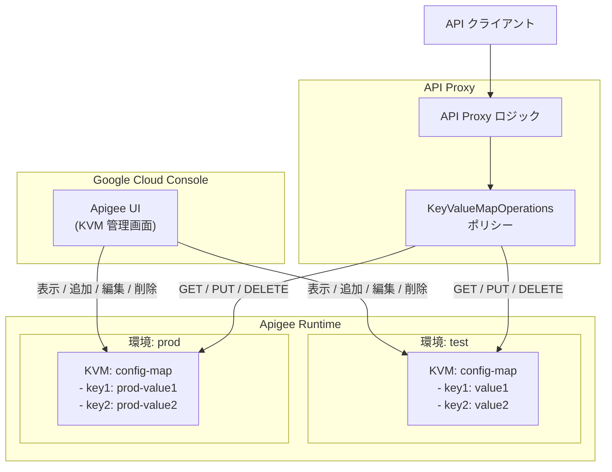

# Apigee UI: 環境スコープの Key Value Maps (KVM) 管理機能

**リリース日**: 2026-03-13

**サービス**: Apigee UI

**機能**: 環境スコープの Key Value Maps (KVM) エントリの表示・追加・編集・削除

**ステータス**: Feature

[このアップデートのインフォグラフィックを見る](https://takech9203.github.io/google-cloud-news-summary/20260313-apigee-ui-kvm-management.html)

## 概要

Apigee UI において、環境スコープの Key Value Map (KVM) エントリの表示、追加、編集、削除が可能になった。これまで Apigee UI では KVM の作成と削除のみが可能であり、KVM 内のエントリ (キーと値のペア) を操作するには API または KeyValueMapOperations ポリシーを使用する必要があった。

今回のアップデートにより、API 管理者や開発者は Google Cloud Console の Apigee UI から直接 KVM エントリを操作できるようになり、API プロキシの設定値や環境固有のパラメータを GUI ベースで管理できる。これは特に、API のデバッグや設定変更の際に CLI や API コールに頼る必要がなくなるという点で、運用効率の向上に貢献する。

本アップデートの主な対象ユーザーは、Apigee を利用して API 管理を行う開発者、API プラットフォーム管理者、および DevOps エンジニアである。

**アップデート前の課題**

- Apigee UI では環境スコープの KVM の作成・削除のみが可能であり、KVM エントリ (キーと値のペア) の操作は UI からは行えなかった
- KVM エントリの表示・追加・編集・削除には Apigee API を直接呼び出すか、KeyValueMapOperations ポリシーを使用する必要があった
- API 呼び出しによる KVM エントリ管理は、curl コマンドや API クライアントの知識が必要であり、非技術者にとって敷居が高かった

**アップデート後の改善**

- Google Cloud Console の Apigee UI から直接 KVM エントリの表示・追加・編集・削除が可能になった
- API コールや CLI を使用せずに、GUI ベースで KVM の内容を確認・変更できるようになった
- 環境ごとの KVM エントリを視覚的に管理でき、設定ミスの発見や迅速な設定変更が容易になった

## アーキテクチャ図



Apigee UI から環境スコープの KVM エントリを直接操作できるようになったことで、API と UI の両方から KVM を管理する二重のアクセスパスが確立された。API プロキシは従来通り KeyValueMapOperations ポリシーを通じて KVM にアクセスする。

## サービスアップデートの詳細

### 主要機能

1. **KVM エントリの表示**
   - 環境スコープの KVM に含まれるキーと値のペアを Apigee UI 上で一覧表示できる
   - マスキングが有効な KVM では、値がアスタリスク (*****) で表示される

2. **KVM エントリの追加**
   - UI からキーと値のペアを新規追加できる
   - キー名と値を入力するだけで、API コールなしにエントリを追加可能

3. **KVM エントリの編集**
   - 既存の KVM エントリの値を UI から直接編集できる
   - 環境固有の設定値を迅速に変更する際に有用

4. **KVM エントリの削除**
   - 不要になった KVM エントリを UI から削除できる
   - 削除前に確認ダイアログが表示され、誤削除を防止する

## 技術仕様

### KVM のスコープ

| スコープ | 説明 | UI での管理 |
|----------|------|-------------|
| API プロキシ | 特定の API プロキシのみがアクセス可能 | API のみ |
| 環境 | 特定の環境内のすべての API プロキシがアクセス可能 | UI および API |
| 組織 | すべての環境のすべての API プロキシがアクセス可能 | API のみ |

### KVM の暗号化

Apigee では、すべての KVM エントリは Cloud KMS キーを使用して AES256 で暗号化される。暗号化キーは Apigee 組織のプロビジョニング時に指定された `runtimeDatabaseEncryptionKey` が使用される。

### KVM マスキング

| 設定 | 説明 |
|------|------|
| マスキング有効 | UI 上で値がアスタリスク (*****) として表示される |
| マスキング無効 | UI 上で値がプレーンテキストとして表示される |

マスキングは KVM レベルで設定され、個別のエントリ単位では設定できない。既存の KVM に対してマスキングを有効化する場合は、明示的に更新する必要がある。

## 設定方法

### 前提条件

1. Google Cloud プロジェクトで Apigee が有効化されていること
2. 適切な IAM ロール (Apigee Environment Admin 以上) が付与されていること
3. 環境スコープの KVM が作成済みであること

### 手順

#### ステップ 1: Apigee 環境ページへのアクセス

Google Cloud Console で Apigee > Management > Environments ページにアクセスする。

```
Google Cloud Console > Apigee > Management > Environments
```

#### ステップ 2: 環境と KVM の選択

対象の環境を選択し、「Key value maps」タブを開く。既存の KVM が一覧表示される。

#### ステップ 3: KVM エントリの操作

KVM 名をクリックしてエントリ一覧を表示し、以下の操作を実行する。

- **追加**: エントリ追加ボタンからキーと値を入力して追加
- **編集**: 既存エントリの編集アイコンをクリックして値を変更
- **削除**: 削除アイコンをクリックし、確認ダイアログで削除を確定

### API を使用した KVM エントリ管理 (参考)

UI に加えて、Apigee API を使用した管理も引き続き可能である。

```bash
# 環境スコープの KVM エントリ一覧を取得
curl -X GET \
  "https://apigee.googleapis.com/v1/organizations/{ORG}/environments/{ENV}/keyvaluemaps/{KVM_NAME}/entries" \
  -H "Authorization: Bearer $(gcloud auth print-access-token)"

# KVM エントリの追加
curl -X POST \
  "https://apigee.googleapis.com/v1/organizations/{ORG}/environments/{ENV}/keyvaluemaps/{KVM_NAME}/entries" \
  -H "Authorization: Bearer $(gcloud auth print-access-token)" \
  -H "Content-Type: application/json" \
  -d '{
    "name": "my-key",
    "value": "my-value"
  }'
```

## メリット

### ビジネス面

- **運用効率の向上**: API コールや CLI 操作なしに KVM エントリを管理できるため、設定変更に要する時間が短縮される
- **非技術者のアクセス向上**: GUI ベースの操作により、API の知識がない管理者でも KVM エントリの確認・変更が可能になる
- **インシデント対応の迅速化**: 障害時に KVM の設定値を即座に UI で確認・修正でき、MTTR (平均復旧時間) の短縮に寄与する

### 技術面

- **操作の可視性向上**: KVM エントリの内容を UI で視覚的に確認できるため、設定ミスの発見が容易になる
- **環境間の設定比較が容易**: 環境を切り替えながら KVM エントリを確認でき、test 環境と prod 環境の設定差異を把握しやすくなる
- **API とポリシーの二重管理が不要**: 単純なエントリの追加・変更であれば、KeyValueMapOperations ポリシーのデプロイや API コールが不要

## デメリット・制約事項

### 制限事項

- UI での KVM 管理は環境スコープのみに対応しており、API プロキシスコープおよび組織スコープの KVM は引き続き API を使用する必要がある
- 大量のエントリ (150 キーを超える KVM) の操作については、API の使用が推奨される (Apigee Edge の場合)

### 考慮すべき点

- UI から直接 KVM エントリを変更できるため、本番環境の KVM に対する不用意な変更を防ぐために IAM ロールによるアクセス制御を適切に設定する必要がある
- マスキングが有効な KVM では UI 上で値が表示されないため、設定内容を確認する際は API を使用する必要がある場合がある
- KVM エントリの変更は即座に反映されるため、実行中の API プロキシへの影響を事前に評価することが重要

## ユースケース

### ユースケース 1: 環境固有の設定値管理

**シナリオ**: API プロキシが外部サービスのエンドポイント URL やタイムアウト値を環境ごとに異なる KVM エントリとして保持しているケース。開発者が test 環境のエンドポイント URL を変更する必要がある。

**実装例**:
```
KVM: service-config (環境: test)
  - backend_url: https://test-api.example.com/v2
  - timeout_ms: 5000
  - retry_count: 3
```

**効果**: UI から直接値を変更でき、API プロキシの再デプロイや API コールが不要。設定変更にかかる時間を数分から数秒に短縮できる。

### ユースケース 2: API キーやフィーチャーフラグの管理

**シナリオ**: API プロキシが KVM に保存されたフィーチャーフラグを参照して、特定の機能の有効・無効を制御しているケース。新機能のロールアウトや緊急の機能無効化を行う。

**効果**: 運用担当者が GUI から即座にフィーチャーフラグを切り替え可能。API プロキシの再デプロイなしに動作を変更でき、ダウンタイムなしの運用が実現できる。

## 料金

KVM 機能自体は Apigee の基本機能として提供されており、KVM の使用に対する追加課金は発生しない。Apigee の料金は、環境タイプ、API コール数、プロキシデプロイメントユニット数に基づいて課金される。

| 環境タイプ | 環境使用料 (時間/リージョンあたり) | 含まれるプロキシデプロイメントユニット |
|------------|-----------------------------------|---------------------------------------|
| Base | $0.5 | 20 |
| Intermediate | $2.0 | 50 |
| Comprehensive | $4.7 | 100 |

詳細は [Apigee 料金ページ](https://cloud.google.com/apigee/pricing) を参照のこと。

## 関連サービス・機能

- **KeyValueMapOperations ポリシー**: API プロキシの実行時に KVM エントリの取得・設定・削除を行うポリシー。UI で管理した KVM エントリを API プロキシから参照する際に使用する
- **Apigee API**: 環境スコープに加えて、API プロキシスコープおよび組織スコープの KVM を管理するための REST API
- **Cloud KMS**: Apigee の KVM エントリの暗号化に使用される鍵管理サービス。組織プロビジョニング時に指定された暗号化キーですべての KVM エントリが保護される
- **Apigee 環境管理**: KVM は環境単位で管理され、test 環境と prod 環境で異なる設定値を保持できる

## 参考リンク

- [インフォグラフィック](https://takech9203.github.io/google-cloud-news-summary/20260313-apigee-ui-kvm-management.html)
- [公式リリースノート](https://docs.cloud.google.com/release-notes#March_13_2026)
- [Using key value maps (KVM) ドキュメント](https://cloud.google.com/apigee/docs/api-platform/cache/key-value-maps)
- [KeyValueMapOperations ポリシー](https://cloud.google.com/apigee/docs/api-platform/reference/policies/key-value-map-operations-policy)
- [環境スコープ KVM API リファレンス](https://cloud.google.com/apigee/docs/reference/apis/apigee/rest/v1/organizations.environments.keyvaluemaps)
- [環境スコープ KVM エントリ API リファレンス](https://cloud.google.com/apigee/docs/reference/apis/apigee/rest/v1/organizations.environments.keyvaluemaps.entries)
- [Apigee 料金ページ](https://cloud.google.com/apigee/pricing)

## まとめ

Apigee UI における環境スコープ KVM エントリの管理機能追加は、API 管理の運用効率を大幅に改善するアップデートである。これまで API コールでしか操作できなかった KVM エントリを GUI から直接管理できるようになったことで、設定変更やデバッグの作業時間が短縮される。Apigee を利用する組織では、本番環境の KVM に対する不用意な変更を防ぐため、IAM ロールによる適切なアクセス制御と併せて本機能を活用されたい。

---

**タグ**: #Apigee #KVM #KeyValueMaps #API管理 #UI機能強化 #環境管理 #設定管理
