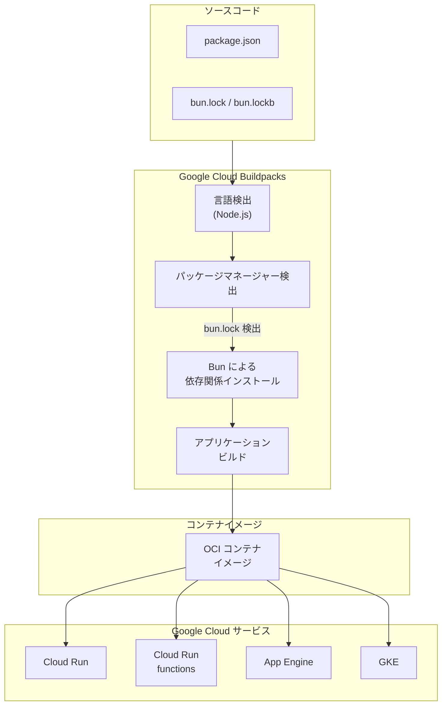

# Buildpacks: Node.js ビルドパックが Bun パッケージマネージャーをサポート

**リリース日**: 2026-03-13

**サービス**: Google Cloud Buildpacks

**機能**: Node.js ビルドパックにおける Bun パッケージマネージャーのサポート

**ステータス**: Preview

[このアップデートのインフォグラフィックを見る](https://takech9203.github.io/google-cloud-news-summary/20260313-buildpacks-nodejs-bun-support.html)

## 概要

Google Cloud の Node.js ビルドパックが、Bun パッケージマネージャーを Preview でサポートしました。これにより、Bun を使用して依存関係を管理している Node.js プロジェクトを、Cloud Run、Cloud Run functions、App Engine、GKE などの Google Cloud サービスへソースコードからデプロイすることが可能になります。

Bun は高速な JavaScript / TypeScript ランタイムおよびパッケージマネージャーとして急速に普及しており、npm と比較して大幅に高速なパッケージインストールを実現します。今回のサポートにより、Google Cloud Buildpacks は NPM、Yarn、Pnpm に加えて 4 つ目のパッケージマネージャーとして Bun を利用できるようになりました。

このアップデートは、Bun をパッケージマネージャーとして採用している Node.js 開発者や、ビルドパフォーマンスの最適化を重視するプラットフォームエンジニアにとって重要な機能追加です。

**アップデート前の課題**

- Bun を使用するプロジェクトを Google Cloud にソースデプロイする場合、事前に npm や yarn の lock ファイルを生成し直す必要があった
- Bun の高速なパッケージインストール性能をビルドパック環境で活用できなかった
- Bun ベースのプロジェクトでは、デプロイ前にパッケージマネージャーの切り替え作業が発生していた

**アップデート後の改善**

- Bun の lock ファイルをプロジェクトに含めるだけで、ビルドパックが自動的に Bun を使用して依存関係をインストール
- Bun の高速なパッケージインストール性能をビルドプロセスで直接活用可能
- 開発環境と本番デプロイで同一のパッケージマネージャーを使用できるため、依存関係の一貫性が向上

## アーキテクチャ図



ビルドパックはソースコード内の lock ファイルを検出してパッケージマネージャーを自動判定し、Bun で依存関係をインストールした後、OCI コンテナイメージを生成します。このイメージは Cloud Run をはじめとする複数の Google Cloud サービスにデプロイ可能です。

## サービスアップデートの詳細

### 主要機能

1. **Bun パッケージマネージャーの自動検出**
   - プロジェクトルートに Bun の lock ファイル (bun.lock または bun.lockb) が存在する場合、ビルドパックが自動的に Bun をパッケージマネージャーとして選択
   - 既存の NPM、Yarn、Pnpm と同様の検出メカニズムに従う

2. **高速な依存関係インストール**
   - Bun のネイティブなパッケージインストール機能を活用し、ビルド時間の短縮が期待できる
   - Bun はパッケージの解決とインストールを並列処理するため、大規模プロジェクトで特に効果が高い

3. **既存のビルドパックワークフローとの統合**
   - `gcloud run deploy --source .` や `pack build` コマンドなど、既存のデプロイワークフローをそのまま利用可能
   - 環境変数やカスタムビルドステップなどの既存機能との組み合わせが可能

## 技術仕様

### パッケージマネージャー検出ロジック

Node.js ビルドパックは、プロジェクトルートに存在する lock ファイルに基づいてパッケージマネージャーを自動的に選択します。

| パッケージマネージャー | 検出ファイル | サポート状況 |
|---|---|---|
| NPM | package-lock.json | GA (デフォルト) |
| Yarn | yarn.lock | GA |
| Pnpm | pnpm-lock.yaml | GA |
| Bun | bun.lock / bun.lockb | Preview (今回追加) |

### 対応ビルダー

| ビルダー | タグ | OS |
|---|---|---|
| google-24 | gcr.io/buildpacks/builder:google-24 | Ubuntu 24 |
| google-22 | gcr.io/buildpacks/builder:google-22 | Ubuntu 22 |
| latest | gcr.io/buildpacks/builder:latest | Ubuntu 22 (デフォルト) |

## 設定方法

### 前提条件

1. Google Cloud プロジェクトが作成済みであること
2. `gcloud` CLI がインストールされ、認証済みであること
3. プロジェクトに Bun の lock ファイル (bun.lock) が含まれていること

### 手順

#### ステップ 1: プロジェクトの準備

Bun を使用して Node.js プロジェクトの依存関係を管理します。

```bash
# Bun で依存関係をインストールし lock ファイルを生成
bun install
```

`bun install` を実行すると、プロジェクトルートに `bun.lock` が生成されます。このファイルをバージョン管理に含めてください。

#### ステップ 2: Cloud Run へのデプロイ (例)

```bash
# ソースコードから直接 Cloud Run にデプロイ
gcloud run deploy my-service --source . --region asia-northeast1
```

ビルドパックが自動的に `bun.lock` を検出し、Bun を使用して依存関係をインストールします。

#### ステップ 3: ローカルでのビルドテスト (オプション)

```bash
# pack CLI を使用してローカルでビルドをテスト
pack build my-app --builder gcr.io/buildpacks/builder:google-24
```

## メリット

### ビジネス面

- **ビルド時間の短縮**: Bun の高速なパッケージインストールにより、CI/CD パイプラインの実行時間を短縮できる可能性がある
- **開発者体験の向上**: 開発環境で Bun を使用しているチームが、デプロイ時にパッケージマネージャーを切り替える必要がなくなる

### 技術面

- **依存関係の一貫性**: 開発環境と本番環境で同一の lock ファイルとパッケージマネージャーを使用でき、環境差異によるバグを低減
- **自動検出**: lock ファイルの存在だけで自動的にパッケージマネージャーが選択されるため、追加設定が不要

## デメリット・制約事項

### 制限事項

- 現在 Preview ステータスであり、本番ワークロードでの利用には注意が必要
- Preview 機能には SLA が適用されない場合がある
- 複数の lock ファイル (例: package-lock.json と bun.lock) が同時に存在する場合、デプロイが失敗する可能性がある (他のパッケージマネージャーと同様の制約)

### 考慮すべき点

- Bun 自体はまだ比較的新しいランタイムであり、一部の npm パッケージとの互換性に注意が必要
- Preview から GA への移行時に挙動が変更される可能性がある
- チーム全体でパッケージマネージャーを統一する場合、Bun への移行コストを評価すること

## ユースケース

### ユースケース 1: Cloud Run での高速デプロイ

**シナリオ**: Bun で開発された TypeScript ベースの Web API を Cloud Run にデプロイする場合。開発チームは既に Bun をローカル開発環境で使用しており、依存関係の管理も Bun で行っている。

**実装例**:
```json
{
  "name": "my-api",
  "scripts": {
    "start": "node dist/index.js",
    "build": "tsc"
  },
  "engines": {
    "node": "22.x.x"
  },
  "dependencies": {
    "express": "^4.18.0"
  }
}
```

```bash
# Bun で lock ファイルを生成
bun install

# Cloud Run にデプロイ
gcloud run deploy my-api --source . --region asia-northeast1
```

**効果**: パッケージマネージャーの切り替えが不要になり、開発からデプロイまでのワークフローが一貫する。

### ユースケース 2: モノレポでの大規模プロジェクト

**シナリオ**: 大量の依存関係を持つモノレポ構成のプロジェクトで、ビルド時間の最適化が課題となっている場合。

**効果**: Bun の並列パッケージインストール機能により、依存関係が多いプロジェクトでのビルド時間短縮が期待できる。

## 料金

Buildpacks 自体の利用に追加料金は発生しません。ビルドプロセスで使用される Cloud Build のリソースに対して標準の Cloud Build 料金が適用されます。Bun パッケージマネージャーのサポートによる追加課金はありません。

## 関連サービス・機能

- **Cloud Run**: ビルドパックで生成されたコンテナイメージの主要なデプロイ先。ソースデプロイ (`--source`) でビルドパックを自動的に使用
- **Cloud Build**: ビルドパックによるコンテナイメージのビルドを実行するサービス
- **Artifact Registry**: ビルドされたコンテナイメージの保存先。プライベート npm パッケージのホスティングにも利用可能
- **Cloud Run functions**: ビルドパックを使用した関数デプロイでも Bun サポートが利用可能

## 参考リンク

- [インフォグラフィック](https://takech9203.github.io/google-cloud-news-summary/20260313-buildpacks-nodejs-bun-support.html)
- [公式リリースノート](https://docs.cloud.google.com/release-notes#March_13_2026)
- [Node.js アプリケーションのビルド - ドキュメント](https://docs.cloud.google.com/docs/buildpacks/nodejs)
- [Buildpacks ビルダー一覧](https://docs.cloud.google.com/docs/buildpacks/builders)

## まとめ

Google Cloud Buildpacks における Bun パッケージマネージャーのサポートは、Node.js エコシステムの多様化に対応する重要なアップデートです。既に Bun を開発ワークフローに採用しているチームは、Preview 段階ではありますが、開発環境との一貫性を維持したまま Google Cloud へのデプロイが可能になります。本番環境での採用を検討する場合は、GA への昇格を待つか、十分なテストを実施した上で利用することを推奨します。

---

**タグ**: #Buildpacks #Node.js #Bun #PackageManager #CloudRun #Preview
