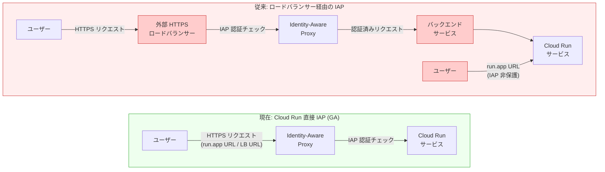

# Cloud Run: Identity-Aware Proxy (IAP) の直接設定が GA

**リリース日**: 2026-03-13

**サービス**: Cloud Run

**機能**: Identity-Aware Proxy (IAP) の Cloud Run 直接設定

**ステータス**: GA (General Availability)

[このアップデートのインフォグラフィックを見る](https://takech9203.github.io/google-cloud-news-summary/20260313-cloud-run-iap-direct-configuration-ga.html)

## 概要

Cloud Run サービスに Identity-Aware Proxy (IAP) を直接設定する機能が General Availability (GA) となった。これにより、ロードバランサーを構成することなく、Cloud Run サービスへのアクセスを IAP で保護できるようになる。2025 年 4 月に Preview として公開されたこの機能が、本番環境での利用が正式にサポートされるステータスへと昇格した。

IAP は Google Cloud のゼロトラスト セキュリティの中核を担うサービスであり、ユーザーの ID とリクエストのコンテキストに基づいてアプリケーションへのアクセスを制御する。従来、Cloud Run サービスを IAP で保護するには外部 HTTPS ロードバランサーの構成が必須だったが、今回の GA により、Cloud Run サービスに直接 IAP を有効化するだけで、デフォルトの run.app URL を含むすべての Ingress パスを保護できるようになった。

このアップデートは、社内向け Web アプリケーションや管理ツールを Cloud Run で運用するすべてのユーザーにとって重要である。特に、ロードバランサーの構成・管理コストを避けたい小規模チームや、迅速にゼロトラスト アクセス制御を導入したいエンタープライズ環境に大きな価値を提供する。

**アップデート前の課題**

- Cloud Run サービスを IAP で保護するには、外部 HTTPS ロードバランサー (Global External Application Load Balancer) の構成が必須だった
- ロードバランサーの構成には SSL 証明書、静的 IP アドレス、バックエンドサービス、URL マップなど多数のリソースの管理が必要だった
- ロードバランサー経由の IAP では、デフォルトの run.app URL は保護されず、別途 Ingress 制限を設定する必要があった
- ロードバランサーの運用コスト (転送ルール料金、処理データ量に応じた課金) が発生していた
- シンプルな社内ツールを IAP で保護したい場合でも、複雑なネットワーク構成が求められた

**アップデート後の改善**

- Cloud Run サービスに直接 IAP を有効化でき、ロードバランサーの構成が不要になった
- デフォルトの run.app URL を含むすべての Ingress パスが IAP で保護される
- Google Cloud Console、gcloud CLI、Terraform のいずれからも簡単に設定可能
- ロードバランサー関連のリソース管理と追加コストが不要になった
- GA によりSLA の対象となり、本番ワークロードでの安心した利用が可能になった

## アーキテクチャ図



上図は、従来のロードバランサー経由の IAP 構成 (上) と、Cloud Run 直接 IAP 構成 (下) を比較している。従来方式ではロードバランサーやバックエンドサービスの構成が必要であり、run.app URL は IAP で保護されなかった。直接 IAP 構成では、すべての Ingress パスが IAP で保護され、アーキテクチャが大幅に簡素化される。

## サービスアップデートの詳細

### 主要機能

1. **ロードバランサー不要の IAP 保護**
   - Cloud Run サービスに `--iap` フラグを指定するだけで IAP を有効化
   - 外部 HTTPS ロードバランサー、SSL 証明書、静的 IP アドレスなどのリソースが不要
   - run.app URL を含むすべての Ingress パスを自動的に保護

2. **コンテキストアウェア アクセスポリシー**
   - IAP のアクセスポリシーを通じて、ユーザーの ID、グループメンバーシップ、デバイスセキュリティ、ロケーション、IP アドレスなどのコンテキストに基づいたアクセス制御が可能
   - Access Context Manager のアクセスレベルと組み合わせた高度なポリシー設定

3. **複数の設定方法に対応**
   - Google Cloud Console: UI 上でワンクリックで IAP を有効化
   - gcloud CLI: `--iap` フラグによるコマンドライン設定
   - Terraform: `iap_enabled = true` による Infrastructure as Code 対応

4. **IAM との二重チェック**
   - IAP と IAM の両方が同じ Cloud Run サービスに設定されている場合、IAP チェックが先に実行される
   - IAP チェックを通過したリクエストに対して、IAP サービスアカウントが Cloud Run の IAM チェックを実行

## 技術仕様

### 必要な IAM ロール

| ロール | 用途 |
|--------|------|
| `roles/run.admin` (Cloud Run Admin) | IAP の有効化・Cloud Run サービスの管理 |
| `roles/iap.admin` (IAP Policy Admin) | IAP アクセスポリシーの管理 |
| `roles/artifactregistry.reader` | コンテナイメージの読み取り (デプロイ時) |
| `roles/iam.serviceAccountUser` | サービス ID の使用 (デプロイ時) |
| `roles/run.invoker` (Cloud Run Invoker) | IAP サービスエージェントに自動付与 |

### 既知の制限事項

| 項目 | 詳細 |
|------|------|
| 組織要件 | プロジェクトは Google Cloud 組織内に存在する必要がある |
| ID の制限 | 同一組織内の ID のみ利用可能 (外部ユーザーには OAuth カスタム設定が必要) |
| IAP の二重設定 | ロードバランサーと Cloud Run サービスの両方で IAP を有効化することはできない |
| 統合サービスへの影響 | Pub/Sub など一部の統合が IAP 有効化時に動作しなくなる可能性がある |
| Cloud CDN | IAP は Cloud CDN と互換性がない |
| レイテンシ | IAP は認証処理のためレイテンシを増加させる |

## 設定方法

### 前提条件

1. Google Cloud プロジェクトが組織内に存在すること
2. IAP API が有効化されていること
3. 必要な IAM ロールが付与されていること

### 手順

#### ステップ 1: IAP API の有効化

```bash
gcloud services enable iap.googleapis.com --project=PROJECT_ID
```

IAP API を有効化する。

#### ステップ 2: gcloud CLI で IAP を有効化して Cloud Run サービスをデプロイ

```bash
# 新規サービスの場合
gcloud beta run deploy SERVICE_NAME \
    --region=REGION \
    --image=IMAGE_URL \
    --no-allow-unauthenticated \
    --iap
```

```bash
# 既存サービスの場合
gcloud beta run services update SERVICE_NAME \
    --region=REGION \
    --iap
```

`--iap` フラグを指定することで、Cloud Run サービスに IAP を直接有効化する。`--no-allow-unauthenticated` を併用することで、認証されていないリクエストを拒否する。

#### ステップ 3: IAP サービスエージェントに Cloud Run Invoker ロールを付与

```bash
gcloud run services add-iam-policy-binding SERVICE_NAME \
    --region=REGION \
    --member=serviceAccount:service-PROJECT_NUMBER@gcp-sa-iap.iam.gserviceaccount.com \
    --role=roles/run.invoker
```

IAP サービスエージェントが Cloud Run サービスを呼び出せるように、Invoker ロールを付与する。Google Cloud Console から設定した場合、このロールは自動的に付与される。

#### ステップ 4: IAP の有効化を確認

```bash
gcloud beta run services describe SERVICE_NAME
```

出力に `Iap Enabled: true` が含まれていることを確認する。

#### ステップ 5: (Terraform の場合) Terraform 設定

```hcl
resource "google_cloud_run_v2_service" "default" {
  provider    = google-beta
  name        = "cloudrun-iap-service"
  location    = "europe-west1"
  ingress     = "INGRESS_TRAFFIC_ALL"
  launch_stage = "BETA"
  iap_enabled = true

  template {
    containers {
      image = "us-docker.pkg.dev/cloudrun/container/hello"
    }
  }
}

resource "google_cloud_run_v2_service_iam_member" "iap_invoker" {
  provider = google-beta
  project  = google_cloud_run_v2_service.default.project
  location = google_cloud_run_v2_service.default.location
  name     = google_cloud_run_v2_service.default.name
  role     = "roles/run.invoker"
  member   = "serviceAccount:service-PROJECT_NUMBER@gcp-sa-iap.iam.gserviceaccount.com"
}
```

Terraform を使用する場合は `google-beta` プロバイダーを指定し、`iap_enabled = true` を設定する。

## メリット

### ビジネス面

- **大幅なコスト削減**: 外部 HTTPS ロードバランサーの転送ルール料金 (約 $18/月~) およびデータ処理料金が不要になる。小規模な社内ツールにとって特に大きなコスト削減効果がある
- **運用負荷の軽減**: ロードバランサー、SSL 証明書、静的 IP アドレス、バックエンドサービスなど複数リソースの管理が不要になり、運用チームの負担が大幅に軽減される
- **迅速なゼロトラスト導入**: 数分で Cloud Run サービスに IAP を有効化でき、ゼロトラスト セキュリティモデルへの移行を加速できる
- **本番環境での信頼性**: GA により SLA の対象となり、エンタープライズ環境での利用が正式にサポートされる

### 技術面

- **アーキテクチャの簡素化**: ロードバランサー層が不要になることで、ネットワーク構成が大幅にシンプルになる
- **run.app URL の保護**: 従来のロードバランサー方式では保護されなかったデフォルトの run.app URL も IAP で保護される
- **統一的なアクセス制御**: ロードバランサー経由と run.app URL 経由の両方のトラフィックに対して、同一の IAP ポリシーが適用される
- **コンテキストアウェア アクセス**: ユーザーの ID だけでなく、デバイスセキュリティやロケーションなどのコンテキストに基づいた高度なアクセス制御が可能

## デメリット・制約事項

### 制限事項

- プロジェクトは Google Cloud 組織内に存在する必要があり、個人アカウントのプロジェクトでは利用できない
- 利用可能な ID は同一組織内のものに限られる。外部ユーザーのアクセスにはカスタム OAuth 設定が必要
- ロードバランサーと Cloud Run サービスの両方で IAP を有効化することはできない
- Pub/Sub などの一部の Google Cloud サービスからの統合が、IAP 有効化時に正常に動作しなくなる可能性がある

### 考慮すべき点

- IAP は認証処理のためにレイテンシを増加させるため、レイテンシに敏感なサービスでの利用は慎重に検討する必要がある
- Cloud CDN との併用はサポートされていない
- IAP と IAM の両方を使用する場合、IAP チェックが先に実行されるため、Pub/Sub などのサービスが IAP に対して正しく認証できない場合がある
- `X-Serverless-Authorization` ヘッダーの扱いに注意が必要。Cloud Run はこのヘッダーの署名を削除するため、別の Cloud Run サービスへのリクエスト転送時にヘッダーを削除する処理が必要

## ユースケース

### ユースケース 1: 社内管理ツールの保護

**シナリオ**: 社内向けの管理ダッシュボードを Cloud Run でホストしており、Google Workspace アカウントを持つ社員のみにアクセスを制限したい場合。

**実装例**:
```bash
# 管理ダッシュボードを IAP 付きでデプロイ
gcloud beta run deploy admin-dashboard \
    --region=asia-northeast1 \
    --image=gcr.io/my-project/admin-dashboard:latest \
    --no-allow-unauthenticated \
    --iap

# IAP サービスエージェントに Invoker ロールを付与
gcloud run services add-iam-policy-binding admin-dashboard \
    --region=asia-northeast1 \
    --member=serviceAccount:service-PROJECT_NUMBER@gcp-sa-iap.iam.gserviceaccount.com \
    --role=roles/run.invoker
```

**効果**: ロードバランサーの構成なしで、数分で社内ツールにゼロトラスト アクセス制御を導入できる。run.app URL も保護されるため、URL を知っているだけではアクセスできない。

### ユースケース 2: マルチリージョン構成での使い分け

**シナリオ**: 単一リージョンの Cloud Run サービスには直接 IAP を使用し、複数リージョンにまたがるサービスにはロードバランサー経由の IAP を使用するハイブリッド構成。

**効果**: サービスの規模やリージョン要件に応じて最適な IAP 構成を選択でき、コストとアーキテクチャの複雑さを最小限に抑えられる。単一リージョンのサービスではロードバランサーのコストを削減し、マルチリージョンのサービスでは集中管理のメリットを活用する。

### ユースケース 3: 開発・ステージング環境の保護

**シナリオ**: 開発チームが使用するステージング環境の Cloud Run サービスを、チームメンバーのみがアクセスできるように制限したい場合。

**効果**: ロードバランサーのコストをかけずに、ステージング環境に IAP を適用できる。Google グループを活用して、開発チームのメンバーのみにアクセスを許可する設定が簡単に行える。

## 料金

IAP 自体には追加料金は発生しない。今回の直接設定機能の最大のメリットは、従来必須だった外部 HTTPS ロードバランサーの料金が不要になることである。

### コスト比較 (IAP 構成方式別)

| 項目 | Cloud Run 直接 IAP | ロードバランサー経由 IAP |
|------|---------------------|--------------------------|
| IAP 利用料 | 無料 | 無料 |
| 転送ルール料金 | 不要 | 約 $18.26/月~ |
| データ処理料金 | 不要 | 処理データ量に応じて課金 |
| SSL 証明書管理 | 不要 (run.app URL 使用時) | 必要 |
| 静的 IP アドレス | 不要 | 必要 (使用中は無料、未使用時課金) |

詳細は [Cloud Run pricing](https://cloud.google.com/run/pricing) および [Cloud Load Balancing pricing](https://cloud.google.com/vpc/network-pricing#lb) を参照。

## 利用可能リージョン

Cloud Run が利用可能なすべてのリージョンで IAP の直接設定が利用可能。ただし、プロジェクトが Google Cloud 組織内に存在することが前提条件となる。

## 関連サービス・機能

- **Identity-Aware Proxy (IAP)**: Google Cloud のゼロトラスト セキュリティの中核サービス。アプリケーションレベルのアクセス制御を提供
- **Cloud Run**: フルマネージドのサーバーレス コンテナ プラットフォーム。今回の IAP 直接設定の対象サービス
- **Access Context Manager**: IAP と組み合わせて、デバイス属性や IP アドレスに基づいたアクセスレベルを定義
- **Workforce Identity Federation**: 外部 IdP のユーザーを IAP で認証・認可するための機能
- **Cloud Load Balancing**: マルチリージョン構成など、ロードバランサーが必要な場合の IAP 構成で利用
- **IAM (Identity and Access Management)**: IAP と連携してリソースレベルのアクセス制御を実施

## 参考リンク

- [インフォグラフィック](https://takech9203.github.io/google-cloud-news-summary/20260313-cloud-run-iap-direct-configuration-ga.html)
- [公式リリースノート](https://docs.cloud.google.com/release-notes#March_13_2026)
- [Cloud Run での IAP 設定ガイド](https://cloud.google.com/run/docs/securing/identity-aware-proxy-cloud-run)
- [IAP for Cloud Run (ロードバランサー経由)](https://cloud.google.com/iap/docs/enabling-cloud-run)
- [IAP コンセプト概要](https://cloud.google.com/iap/docs/concepts-overview)
- [IAP リリースノート](https://cloud.google.com/iap/docs/release-notes)
- [IAP 料金](https://cloud.google.com/iap/pricing)
- [Cloud Run pricing](https://cloud.google.com/run/pricing)

## まとめ

Cloud Run への IAP 直接設定の GA は、サーバーレス アプリケーションのゼロトラスト セキュリティを大幅に簡素化する重要なアップデートである。ロードバランサーの構成が不要になることで、コスト削減、運用負荷の軽減、セットアップ時間の短縮が実現される。社内向け Web アプリケーションや管理ツールを Cloud Run で運用しているチームは、この機能の導入を強く推奨する。既にロードバランサー経由で IAP を使用しているが、マルチリージョン要件がない場合は、直接 IAP への移行を検討すべきである。

---

**タグ**: #CloudRun #IAP #IdentityAwareProxy #ZeroTrust #Security #GA #Serverless
