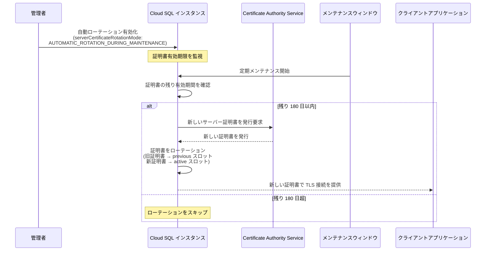

# Cloud SQL: 自動サーバー証明書ローテーション

**リリース日**: 2026-03-13

**サービス**: Cloud SQL (MySQL, PostgreSQL, SQL Server)

**機能**: 自動サーバー証明書ローテーション

**ステータス**: GA (General Availability)

[このアップデートのインフォグラフィックを見る](https://takech9203.github.io/google-cloud-news-summary/20260313-cloud-sql-automatic-certificate-rotation.html)

## 概要

Cloud SQL において、サーバー証明書の自動ローテーション機能が利用可能になった。本機能は Certificate Authority Service (CAS) を利用するインスタンス、すなわち Shared CA (`GOOGLE_MANAGED_CAS_CA`) または Customer-managed CA (`CUSTOMER_MANAGED_CAS_CA`) モードで構成されたインスタンスを対象としている。自動ローテーションを有効にすると、Cloud SQL が定期メンテナンスまたはセルフサービスメンテナンス更新の際に、証明書の有効期限が切れる最大 180 日前にサーバー証明書を自動的にローテーションする。

本アップデートは Cloud SQL for MySQL、Cloud SQL for PostgreSQL、Cloud SQL for SQL Server の 3 つのバリアントすべてに同時に適用される。これにより、データベースエンジンの種類を問わず統一的な証明書管理が可能となった。

主な対象ユーザーは、Cloud SQL インスタンスを本番環境で運用しているインフラエンジニア、SRE、ソリューションアーキテクトである。特に、多数のインスタンスを管理している組織や、セキュリティコンプライアンス要件として証明書の定期ローテーションが求められる環境において大きな価値を発揮する。

**アップデート前の課題**

- CAS ベースの CA モード (Shared CA / Customer-managed CA) を使用するインスタンスでは、サーバー証明書の有効期限が 1 年であり、手動でのローテーション作業が定期的に発生していた
- 証明書の有効期限切れに気づかず、アプリケーションの接続障害が発生するリスクがあった
- 多数のインスタンスを運用している場合、手動ローテーションの運用負荷が高く、ローテーション漏れのリスクも増大していた

**アップデート後の改善**

- メンテナンスウィンドウ中に Cloud SQL が自動的にサーバー証明書をローテーションするため、手動作業が不要になった
- 証明書有効期限切れによる接続障害のリスクが大幅に低減された
- インスタンス数に関わらず統一的な証明書管理が可能となり、運用負荷が削減された

## アーキテクチャ図



Cloud SQL の自動サーバー証明書ローテーションのフローを示している。管理者が機能を有効化した後は、メンテナンスウィンドウの際に Cloud SQL が証明書の残り有効期間を確認し、180 日以内であれば CAS を通じて新しい証明書を自動発行・適用する。

## サービスアップデートの詳細

### 主要機能

1. **自動ローテーションの有効化**
   - `serverCertificateRotationMode` 設定を `AUTOMATIC_ROTATION_DURING_MAINTENANCE` に指定することで有効化
   - インスタンス作成時および既存インスタンスの編集時の両方で設定可能
   - Cloud SQL Admin API および gcloud CLI の両方から設定可能

2. **メンテナンスウィンドウとの統合**
   - 証明書のローテーションは定期メンテナンスまたはセルフサービスメンテナンス更新中に実行される
   - メンテナンス更新がスキップされた場合、証明書の自動ローテーションも行われない
   - 証明書の残り有効期間が 180 日超の場合はローテーションがスキップされる

3. **対応する CA モード**
   - Shared CA (`GOOGLE_MANAGED_CAS_CA`): Google が管理するリージョン共有の CA 階層を使用
   - Customer-managed CA (`CUSTOMER_MANAGED_CAS_CA`): ユーザーが CA Service で独自に作成・管理する CA 階層を使用
   - Per-instance CA (`GOOGLE_MANAGED_INTERNAL_CA`) は本機能の対象外

## 技術仕様

### CA モード別の証明書ローテーション対応状況

| 項目 | Per-instance CA | Shared CA | Customer-managed CA |
|------|----------------|-----------|---------------------|
| CA モード設定値 | `GOOGLE_MANAGED_INTERNAL_CA` | `GOOGLE_MANAGED_CAS_CA` | `CUSTOMER_MANAGED_CAS_CA` |
| サーバー証明書の有効期間 | 10 年 | 1 年 | 1 年 |
| 自動証明書ローテーション | 非対応 | 対応 | 対応 |
| 手動証明書ローテーション | 対応 | 対応 | 対応 |
| 暗号アルゴリズム | RSA 2048-bit / SHA256 | ECDSA 384-bit / SHA384 | ECDSA 384-bit / SHA384 |
| 必要な Auth Proxy バージョン | v1 以降 | v2.13.0 以降 | v2.14.3 以降 |

### 主要パラメータ

| パラメータ | 値 | 説明 |
|-----------|-----|------|
| `serverCertificateRotationMode` | `AUTOMATIC_ROTATION_DURING_MAINTENANCE` | 自動ローテーションを有効化 |
| `serverCaMode` | `GOOGLE_MANAGED_CAS_CA` / `CUSTOMER_MANAGED_CAS_CA` | CAS ベースの CA モード (前提条件) |
| ローテーション実行条件 | 有効期限まで 180 日以内 | メンテナンス時に確認 |

## 設定方法

### 前提条件

1. Cloud SQL インスタンスが Shared CA (`GOOGLE_MANAGED_CAS_CA`) または Customer-managed CA (`CUSTOMER_MANAGED_CAS_CA`) モードで構成されていること
2. Customer-managed CA の場合、有効な CA プールと CA が CA Service に作成済みであること
3. Cloud SQL Auth Proxy を使用している場合、Shared CA は v2.13.0 以降、Customer-managed CA は v2.14.3 以降が必要

### 手順

#### ステップ 1: 新規インスタンス作成時に有効化する場合

```bash
# gcloud CLI を使用して自動ローテーション付きでインスタンスを作成
gcloud sql instances create my-instance \
  --database-version=POSTGRES_15 \
  --tier=db-custom-2-8192 \
  --region=us-central1 \
  --server-ca-mode=GOOGLE_MANAGED_CAS_CA \
  --server-certificate-rotation-mode=AUTOMATIC_ROTATION_DURING_MAINTENANCE
```

Shared CA モードと自動証明書ローテーションを有効にした状態で Cloud SQL インスタンスを作成する。`--database-version` は MySQL (`MYSQL_8_0`)、PostgreSQL (`POSTGRES_15`)、SQL Server (`SQLSERVER_2022_STANDARD`) など、使用するエンジンに応じて変更する。

#### ステップ 2: 既存インスタンスで有効化する場合

```bash
# 既存インスタンスの CA モードを Shared CA に変更し、自動ローテーションを有効化
gcloud sql instances patch my-instance \
  --server-ca-mode=GOOGLE_MANAGED_CAS_CA \
  --server-certificate-rotation-mode=AUTOMATIC_ROTATION_DURING_MAINTENANCE
```

既存インスタンスの設定を編集して自動ローテーションを有効にする。Per-instance CA から Shared CA または Customer-managed CA への変更も同時に行える。

#### ステップ 3: Cloud SQL Admin API を使用する場合

```bash
# REST API を使用して自動ローテーションを有効化
curl -X PATCH \
  -H "Authorization: Bearer $(gcloud auth print-access-token)" \
  -H "Content-Type: application/json" \
  "https://sqladmin.googleapis.com/v1/projects/PROJECT_ID/instances/INSTANCE_NAME" \
  -d '{
    "settings": {
      "ipConfiguration": {
        "serverCaMode": "GOOGLE_MANAGED_CAS_CA"
      },
      "serverCertificateRotationMode": "AUTOMATIC_ROTATION_DURING_MAINTENANCE"
    }
  }'
```

## メリット

### ビジネス面

- **運用コストの削減**: 手動での証明書ローテーション作業が不要となり、特に多数のインスタンスを管理する組織では大幅な運用コスト削減が見込める
- **サービス可用性の向上**: 証明書の有効期限切れによる予期せぬ接続障害を防止し、データベースサービスの可用性を維持できる
- **コンプライアンス対応の簡素化**: 証明書の定期ローテーションが規制要件として求められる業界 (金融、医療など) において、自動化によりコンプライアンス証跡の管理が容易になる

### 技術面

- **ECDSA ベースの強力な暗号化**: CAS ベースの CA モードでは ECDSA 384-bit / SHA384 を使用し、Per-instance CA の RSA 2048-bit / SHA256 より強力な暗号化を提供
- **メンテナンスウィンドウとの統合**: 既存のメンテナンススケジュールに組み込まれるため、追加のメンテナンスウィンドウが不要
- **ゼロタッチ運用**: 一度有効化すれば、以降の証明書ライフサイクル管理を Cloud SQL に委任できる

## デメリット・制約事項

### 制限事項

- Per-instance CA (`GOOGLE_MANAGED_INTERNAL_CA`) モードのインスタンスでは自動ローテーションを利用できない。Per-instance CA の証明書有効期間は 10 年であるため、ローテーションの緊急性は低いが、CAS ベースへの移行が推奨される
- メンテナンス更新がスキップされた場合、証明書の自動ローテーションも実行されない。メンテナンスウィンドウの設定とスケジュール管理が重要となる
- Shared CA モードは App Engine Standard / Flexible 環境および Cloud Run の第 1 世代実行環境からの接続をサポートしていない

### 考慮すべき点

- Shared CA を使用する場合、リージョン内の複数インスタンスで CA が共有されるため、ホスト名検証によるサーバーアイデンティティ検証が必要となる
- Customer-managed CA の場合、gcloud CLI、Cloud SQL Admin API、Terraform でのみ設定可能であり、Google Cloud Console からの設定は現時点では不可
- Cloud SQL Auth Proxy のバージョンが要件を満たしているか事前に確認する必要がある (Shared CA: v2.13.0 以降、Customer-managed CA: v2.14.3 以降)

## ユースケース

### ユースケース 1: 大規模マルチリージョン環境での証明書管理

**シナリオ**: グローバルに展開する SaaS 企業が、複数リージョンに数十台の Cloud SQL インスタンスを運用しているケース。各インスタンスの証明書有効期限を個別に管理し、手動ローテーションを実施する負荷が運用チームの大きな負担となっている。

**実装例**:
```bash
# 全インスタンスに対して自動ローテーションを一括有効化するスクリプト
for instance in $(gcloud sql instances list --format="value(name)"); do
  gcloud sql instances patch "$instance" \
    --server-ca-mode=GOOGLE_MANAGED_CAS_CA \
    --server-certificate-rotation-mode=AUTOMATIC_ROTATION_DURING_MAINTENANCE \
    --quiet
done
```

**効果**: 証明書管理の完全自動化により、運用チームは証明書ローテーション作業から解放され、より付加価値の高い業務に注力できる。

### ユースケース 2: コンプライアンス要件が厳格な金融機関

**シナリオ**: 金融機関が PCI DSS や FISC 安全対策基準に準拠するため、暗号鍵と証明書の定期的なローテーションを義務付けられているケース。Customer-managed CA を使用して独自の CA 階層を管理しつつ、証明書ローテーションの自動化を実現したい。

**効果**: 自動ローテーションにより証明書の定期更新が保証され、監査時にローテーション履歴を容易に提示できる。Customer-managed CA との組み合わせにより、CA 階層の完全な制御権を保持しながら運用を自動化できる。

## 料金

自動サーバー証明書ローテーション機能自体に追加料金は発生しない。ただし、CA モードの選択に応じて以下のコストを考慮する必要がある。

- **Cloud SQL インスタンス料金**: 通常の Cloud SQL 料金が適用される
- **Certificate Authority Service (CA Service) 料金**: Customer-managed CA (`CUSTOMER_MANAGED_CAS_CA`) を使用する場合、CA Service の利用料金が別途発生する。Shared CA (`GOOGLE_MANAGED_CAS_CA`) の場合は Cloud SQL の料金に含まれる

詳細は [Cloud SQL 料金ページ](https://cloud.google.com/sql/pricing) および [CA Service 料金ページ](https://cloud.google.com/certificate-authority-service/pricing) を参照のこと。

## 関連サービス・機能

- **Certificate Authority Service (CA Service)**: Cloud SQL の Shared CA および Customer-managed CA の基盤となるサービス。CA 階層の作成・管理、証明書の発行を担う
- **Cloud SQL Auth Proxy**: Cloud SQL への安全な接続を仲介するプロキシ。CAS ベースの CA モードでは v2.13.0 以降 (Shared CA) または v2.14.3 以降 (Customer-managed CA) が必要
- **Cloud SQL メンテナンスウィンドウ**: 自動証明書ローテーションが実行されるタイミングを制御する。適切なメンテナンスウィンドウの設定が重要
- **Cloud SQL SSL/TLS 設定**: サーバー証明書管理の全体的な枠組み。クライアント証明書の管理や SSL モードの設定も含む

## 参考リンク

- [インフォグラフィック](https://takech9203.github.io/google-cloud-news-summary/20260313-cloud-sql-automatic-certificate-rotation.html)
- [公式リリースノート](https://docs.cloud.google.com/release-notes#March_13_2026)
- [Cloud SQL for MySQL - SSL/TLS 証明書管理](https://cloud.google.com/sql/docs/mysql/manage-ssl-instance)
- [Cloud SQL for PostgreSQL - SSL/TLS 証明書管理](https://cloud.google.com/sql/docs/postgres/manage-ssl-instance)
- [Cloud SQL for SQL Server - SSL/TLS 証明書管理](https://cloud.google.com/sql/docs/sqlserver/manage-ssl-instance)
- [Cloud SQL - SSL/TLS による接続の承認](https://cloud.google.com/sql/docs/mysql/authorize-ssl)
- [Certificate Authority Service ドキュメント](https://cloud.google.com/certificate-authority-service/docs)
- [Cloud SQL 料金ページ](https://cloud.google.com/sql/pricing)

## まとめ

Cloud SQL の自動サーバー証明書ローテーション機能により、CAS ベースの CA モード (Shared CA / Customer-managed CA) を使用するインスタンスにおいて、証明書のライフサイクル管理が完全に自動化された。本機能は Cloud SQL for MySQL、PostgreSQL、SQL Server の全バリアントに対応しており、メンテナンスウィンドウと統合されたゼロタッチの証明書管理を実現する。多数のインスタンスを運用する組織やコンプライアンス要件が厳格な環境では、本機能の有効化を強く推奨する。まだ Per-instance CA を使用しているインスタンスについては、CAS ベースの CA モードへの移行を併せて検討されたい。

---

**タグ**: #CloudSQL #MySQL #PostgreSQL #SQLServer #証明書ローテーション #CAS #CertificateAuthorityService #セキュリティ #TLS #自動化 #メンテナンス
