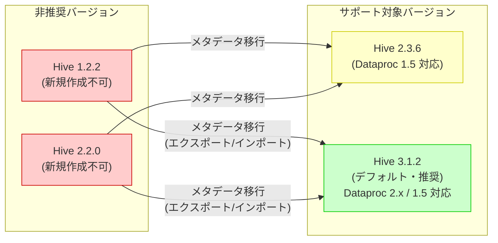

# Dataproc Metastore: Hive Metastore バージョン 1.2.2 および 2.2.0 の非推奨化

**リリース日**: 2026-03-13

**サービス**: Dataproc Metastore

**機能**: Hive Metastore バージョン 1.2.2 および 2.2.0 の非推奨化

**ステータス**: Deprecated

[このアップデートのインフォグラフィックを見る](https://takech9203.github.io/google-cloud-news-summary/20260313-dataproc-metastore-hive-deprecation.html)

## 概要

Google Cloud は 2026 年 3 月 13 日に、Dataproc Metastore で使用可能な Hive Metastore のバージョン 1.2.2 および 2.2.0 を非推奨 (Deprecated) としました。この変更により、これらのバージョンを使用した新規サービスの作成はできなくなります。ただし、既存のサービスは引き続き動作します。

Dataproc Metastore は、Apache Hive Metastore をフルマネージドで提供するサービスであり、Dataproc、BigQuery、その他のデータ処理サービスのメタデータ管理基盤として機能します。Hive Metastore のバージョンポリシーに基づき、古いバージョンは段階的にサポートが終了されます。バージョンポリシーでは、新バージョンのリリースから 12 か月経過後に新規サービスの作成が不可となり、24 か月経過後には既存サービスのサポートも終了することが定められています。

今回の非推奨化は、Hive Metastore 1.2.2 および 2.2.0 を使用している全てのユーザーに影響します。Solutions Architect の観点からは、これらのバージョンを利用中のサービスについて、速やかにサポート対象バージョン (2.3.6 または 3.1.2) への移行計画を策定することを強く推奨します。

## アーキテクチャ図



非推奨となった Hive Metastore 1.2.2 および 2.2.0 から、サポート対象の 2.3.6 または 3.1.2 への移行パスを示しています。推奨される移行先はデフォルトバージョンである Hive 3.1.2 です。

## サービスアップデートの詳細

### 主要な変更点

1. **新規サービス作成の制限**
   - Hive Metastore バージョン 1.2.2 を指定した新規 Dataproc Metastore サービスの作成ができなくなりました
   - Hive Metastore バージョン 2.2.0 を指定した新規 Dataproc Metastore サービスの作成ができなくなりました

2. **既存サービスへの影響**
   - 既存の Hive Metastore 1.2.2 および 2.2.0 サービスは引き続き動作します
   - ただし、バージョンポリシーに基づき、将来的にはこれらの既存サービスのサポートも終了される見込みです

3. **サポート対象バージョンの現状**
   - Hive 3.1.2: デフォルトバージョン。Dataproc 2.x および 1.5 と互換性あり
   - Hive 2.3.6: Dataproc 1.5 と互換性あり

## 技術仕様

### Hive Metastore バージョン対応表

| バージョン | ステータス | 新規作成 | 既存サービス | 対応 Dataproc |
|-----------|----------|---------|------------|--------------|
| 3.1.2 | サポート中 (デフォルト) | 可能 | サポート | 2.x, 1.5* |
| 2.3.6 | サポート中 | 可能 | サポート | 1.5 |
| 2.2.0 | 非推奨 | 不可 | 動作継続 | - |
| 1.2.2 | 非推奨 | 不可 | 動作継続 | - |

*Dataproc 1.5 と Hive 3.1.2 の組み合わせでは後方互換性の問題が発生する可能性があります。この場合、Auxiliary Versions 機能の利用が推奨されます。

### バージョンサポートウィンドウ

| 初回リリースからの経過期間 | 新規サービス | 既存サービス |
|--------------------------|------------|------------|
| 0-12 か月 | サポート | サポート |
| 12-24 か月 | サポート対象外 | サポート |
| 24 か月以降 | サポート対象外 | サポート対象外 |

## 設定方法

### 前提条件

1. 移行元サービスの Hive Metastore バージョンが 1.2.2 または 2.2.0 であること
2. Google Cloud プロジェクトで Dataproc Metastore API が有効化されていること
3. 適切な IAM ロール (roles/metastore.admin) が付与されていること

### 手順

#### ステップ 1: 既存サービスの確認

```bash
# 現在のサービス一覧とバージョンを確認
gcloud metastore services list \
    --location=LOCATION \
    --format="table(name,hiveMetastoreConfig.version,state)"
```

使用中の Hive Metastore バージョンを確認し、1.2.2 または 2.2.0 を使用しているサービスを特定します。

#### ステップ 2: メタデータのバックアップ

```bash
# 既存サービスのメタデータをバックアップ
gcloud metastore services backups create BACKUP_NAME \
    --service=SERVICE_NAME \
    --location=LOCATION
```

移行前に必ずメタデータのバックアップを取得してください。

#### ステップ 3: メタデータのエクスポート

```bash
# メタデータを Cloud Storage にエクスポート
gcloud metastore services export gcs SERVICE_NAME \
    --location=LOCATION \
    --destination-folder=gs://BUCKET_NAME/export/
```

エクスポートしたメタデータは、新しいバージョンのサービスへのインポートに使用します。

#### ステップ 4: 新規サービスの作成

```bash
# Hive 3.1.2 で新規サービスを作成
gcloud metastore services create NEW_SERVICE_NAME \
    --location=LOCATION \
    --hive-metastore-version=3.1.2 \
    --port=9083 \
    --tier=TIER
```

推奨される移行先は Hive 3.1.2 です。

#### ステップ 5: メタデータのインポート

```bash
# エクスポートしたメタデータを新サービスにインポート
gcloud metastore services import gcs NEW_SERVICE_NAME \
    --location=LOCATION \
    --import-id=IMPORT_ID \
    --dump-type=avro \
    --database-dump=gs://BUCKET_NAME/export/
```

インポート完了後、メタデータの整合性を確認してください。

## メリット

### ビジネス面

- **セキュリティの向上**: 新しいバージョンへの移行により、上流でのセキュリティ修正やパッチが継続的に適用されます。End of Life となったバージョンではセキュリティ修正が提供されないため、移行によりセキュリティリスクを低減できます
- **長期的なサポート保証**: サポート対象バージョンに移行することで、Google Cloud によるフルサポートが受けられ、障害対応やトラブルシューティングが保証されます

### 技術面

- **機能拡張の恩恵**: Hive 3.1.2 では、トランザクションテーブルの改善 (HIVE-28121, HIVE-26882 のバックポート)、Data Catalog Sync、gRPC エンドポイントなど、多くの機能が利用可能です
- **Dataproc 2.x との互換性**: Hive 3.1.2 は Dataproc 2.x と完全な互換性があり、最新の Dataproc 機能を活用できます

## デメリット・制約事項

### 制限事項

- Hive 1.2.2 から 3.1.2 への移行では、Hive Metastore スキーマの大幅な変更に伴い、一部のメタデータ互換性の検証が必要です
- 移行中はサービスのダウンタイムが発生する可能性があります。計画的なメンテナンスウィンドウの確保が必要です
- Auxiliary Versions 機能を使用して Hive 2.3.6 を補助バージョンとして設定する場合、補助バージョンではインポート/エクスポート/バックアップ/リストア機能がサポートされません

### 考慮すべき点

- Hive 1.2.2 や 2.2.0 で使用していた Hive 固有の機能 (例: Hive 2 のインデックス機能) が、Hive 3.1.2 では非推奨または削除されている場合があります。移行前にアプリケーションの互換性を確認してください
- 既存サービスは現時点で動作を継続しますが、バージョンポリシーに基づき将来的にサポートが完全に終了します。早期の移行計画策定が重要です
- Dataproc 1.5 と Hive 3.1.2 を組み合わせる場合は、後方互換性の問題が発生する可能性があるため、Auxiliary Versions 機能の利用を検討してください

## ユースケース

### ユースケース 1: Hive 1.2.2 から 3.1.2 への段階的移行

**シナリオ**: 本番環境で Hive Metastore 1.2.2 を使用した Dataproc Metastore サービスを運用しており、データの損失なく Hive 3.1.2 に移行したい

**実装例**:
```bash
# 1. 既存サービスのメタデータをバックアップ
gcloud metastore services backups create pre-migration-backup \
    --service=old-metastore \
    --location=asia-northeast1

# 2. メタデータをエクスポート
gcloud metastore services export gcs old-metastore \
    --location=asia-northeast1 \
    --destination-folder=gs://my-bucket/metastore-export/

# 3. 新規サービスを Hive 3.1.2 で作成
gcloud metastore services create new-metastore \
    --location=asia-northeast1 \
    --hive-metastore-version=3.1.2

# 4. メタデータをインポート
gcloud metastore services import gcs new-metastore \
    --location=asia-northeast1 \
    --import-id=migration-import \
    --dump-type=avro \
    --database-dump=gs://my-bucket/metastore-export/

# 5. Dataproc クラスターの接続先を新サービスに変更
```

**効果**: メタデータのエクスポート/インポートを通じて安全に移行を行い、Hive 3.1.2 の最新機能とセキュリティ修正の恩恵を受けられます

### ユースケース 2: Auxiliary Versions を活用した互換性維持

**シナリオ**: Hive 2.x クライアントを使用するレガシーアプリケーションと Hive 3.x クライアントを使用する新規アプリケーションの両方をサポートする必要がある

**実装例**:
```bash
# Hive 3.1.2 をプライマリ、2.3.6 を補助バージョンとしてサービスを作成
gcloud metastore services create dual-version-metastore \
    --location=asia-northeast1 \
    --hive-metastore-version=3.1.2 \
    --auxiliary-versions="aux=2.3.6"
```

**効果**: 同一のメタデータベースに対して、Hive 2.x と 3.x の両方のエンドポイントを提供でき、レガシーアプリケーションの段階的な移行が可能になります

## 関連サービス・機能

- **[Dataproc](https://cloud.google.com/dataproc/docs)**: Dataproc Metastore は Dataproc クラスターのメタデータストアとして連携します。Hive 3.1.2 は Dataproc 2.x および 1.5 と互換性があります
- **[BigQuery](https://cloud.google.com/bigquery/docs)**: Metadata Federation を通じて BigQuery データセットのメタデータを Dataproc Metastore 経由でアクセスできます
- **[Data Catalog](https://cloud.google.com/data-catalog/docs)**: Data Catalog Sync 機能により、Dataproc Metastore のメタデータを Data Catalog に自動同期できます
- **[Auxiliary Versions](https://cloud.google.com/dataproc-metastore/docs/auxiliary-versions)**: 複数の Hive バージョンを同一サービスで提供する機能。移行期間中の互換性維持に有用です
- **[Managed Migration](https://cloud.google.com/dataproc-metastore/docs/about-managed-migration)**: セルフマネージドの Hive Metastore から Dataproc Metastore への自動移行機能

## 参考リンク

- [インフォグラフィック](https://takech9203.github.io/google-cloud-news-summary/20260313-dataproc-metastore-hive-deprecation.html)
- [公式リリースノート](https://docs.google.com/release-notes#March_13_2026)
- [Dataproc Metastore バージョンポリシー](https://cloud.google.com/dataproc-metastore/docs/version-policy)
- [Dataproc Metastore サービスの作成](https://cloud.google.com/dataproc-metastore/docs/create-service)
- [Auxiliary Versions ドキュメント](https://cloud.google.com/dataproc-metastore/docs/auxiliary-versions)
- [メタデータのバックアップ](https://cloud.google.com/dataproc-metastore/docs/backup-metadata)
- [メタデータのインポート](https://cloud.google.com/dataproc-metastore/docs/import-metadata)
- [メタデータのエクスポート](https://cloud.google.com/dataproc-metastore/docs/export-metadata)

## まとめ

Hive Metastore バージョン 1.2.2 および 2.2.0 の非推奨化により、これらのバージョンでの新規サービス作成が不可となりました。既存サービスは現時点で動作を継続しますが、バージョンポリシーに基づき将来的にサポートが完全に終了するため、早期の移行計画策定が不可欠です。Solutions Architect の観点からは、移行先として Hive 3.1.2 (デフォルトバージョン) を推奨します。移行にあたっては、メタデータのバックアップ/エクスポート/インポートの手順を計画的に実施し、Auxiliary Versions 機能を活用してレガシーアプリケーションとの互換性を段階的に維持することを推奨します。

---

**タグ**: #DataprocMetastore #HiveMetastore #Deprecated #Migration #BigData #GoogleCloud
