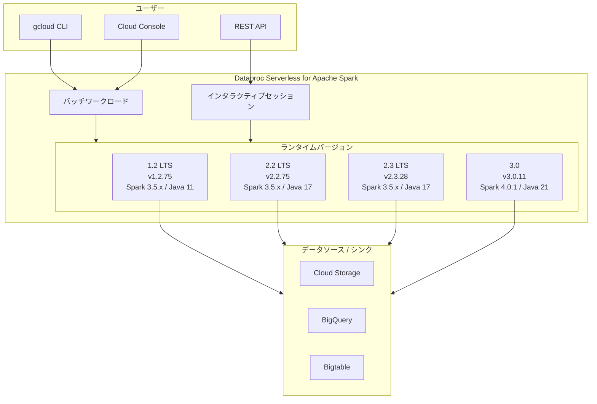

# Dataproc Serverless for Apache Spark: 新ランタイムバージョン 1.2.75, 2.2.75, 2.3.28, 3.0.11

**リリース日**: 2026-03-13

**サービス**: Dataproc Serverless for Apache Spark

**機能**: 新ランタイムバージョンリリース (1.2.75, 2.2.75, 2.3.28, 3.0.11)

**ステータス**: General Availability

[このアップデートのインフォグラフィックを見る](https://takech9203.github.io/google-cloud-news-summary/20260313-dataproc-serverless-spark-runtime-versions.html)

## 概要

Google Cloud は 2026 年 3 月 13 日に、Dataproc Serverless for Apache Spark の新しいサブマイナーランタイムバージョンとして 1.2.75、2.2.75、2.3.28、3.0.11 をリリースしました。これは、Dataproc Serverless が毎週提供する定期的なランタイムアップデートの一環です。

Dataproc Serverless for Apache Spark は、インフラストラクチャの管理なしに Apache Spark ワークロードを実行できるフルマネージドのサーバーレス環境です。今回のリリースでは、4 つのサポート対象ランタイムバージョン (1.2 LTS、2.2 LTS、2.3 LTS、3.0) すべてに対してサブマイナーバージョンが更新されています。週次リリースは完全な後方互換性が保証されており、Spark や Java ライブラリ、Python パッケージのサブマイナーバージョンのアップグレードが含まれる場合があります。

このアップデートの対象は、Dataproc Serverless for Apache Spark を使用してバッチワークロードやインタラクティブセッションを実行しているすべてのユーザーです。サブマイナーバージョンのピンニングはサポートされていないため、メジャー.マイナーバージョンを指定しているユーザーには自動的に最新のサブマイナーバージョンが適用されます。

## アーキテクチャ図



ユーザーは gcloud CLI、Cloud Console、REST API を通じてバッチワークロードまたはインタラクティブセッションを送信し、指定したランタイムバージョン上で Spark ジョブが実行されます。

## サービスアップデートの詳細

### 主要機能

1. **週次サブマイナーバージョンアップデート**
   - 今回リリースされた 4 つのサブマイナーバージョンは、各ランタイムのバグ修正、セキュリティパッチ、依存ライブラリの更新を含みます
   - 完全な後方互換性が保証されており、既存のワークロードへの影響は最小限です

2. **4 つのサポート対象ランタイムへの同時配信**
   - 1.2 LTS (v1.2.75): Java 11 + Scala 2.12 ベースのレガシー互換ランタイム
   - 2.2 LTS (v2.2.75): 現在のデフォルトランタイム。Java 17 + Scala 2.13
   - 2.3 LTS (v2.3.28): Java 17 + Scala 2.13 の新しい LTS バージョン
   - 3.0 (v3.0.11): Apache Spark 4.0.1 + Java 21 を搭載した最新ランタイム

3. **自動適用の仕組み**
   - サブマイナーバージョンのピンニングはサポートされていないため、メジャー.マイナーバージョンを指定するとリージョンへのロールアウト後に自動的に最新のサブマイナーバージョンが使用されます
   - ロールアウトは通常 4 日間かけてすべてのリージョンに展開されます

## 技術仕様

### サポート対象ランタイムバージョンの比較

| 項目 | 1.2 LTS | 2.2 LTS (デフォルト) | 2.3 LTS | 3.0 |
|------|---------|---------------------|---------|-----|
| 最新サブマイナーバージョン | 1.2.75 | 2.2.75 | 2.3.28 | 3.0.11 |
| Apache Spark | 3.5.x | 3.5.x | 3.5.1 | 4.0.1 |
| Java | 11 | 17 | 17 | 21 |
| Python | 3.12 | 3.12 | 3.11 | 3.12 |
| Scala | 2.12 | 2.13 | 2.13 | 2.13 |
| サポート期限 | 2026/09/30 | 2026/09/30 | 2027/11/26 | 2027/01/31 |
| 利用可能期限 | 2028/09/30 | 2028/09/30 | 2029/11/26 | 2029/01/31 |
| LTS | Yes (30 か月) | Yes (30 か月) | Yes (30 か月) | No (12 か月) |

### ランタイムバージョンの指定方法

```bash
# バッチワークロードでランタイムバージョンを指定
gcloud dataproc batches submit spark \
    --region=us-central1 \
    --runtime-version=2.2 \
    --class=com.example.MySparkJob \
    --jars=gs://my-bucket/my-job.jar

# インタラクティブセッションの作成時にランタイムバージョンを指定
gcloud dataproc sessions create spark \
    --region=us-central1 \
    --runtime-version=3.0 \
    --session-template=my-template
```

## 設定方法

### 前提条件

1. Google Cloud プロジェクトで Dataproc API が有効化されていること
2. 適切な IAM ロール (roles/dataproc.editor 以上) が付与されていること
3. ランタイム 3.0 を使用する場合は `dataprocrm.googleapis.com` API の有効化が必要

### 手順

#### ステップ 1: ランタイムバージョンの確認

```bash
# 利用可能なランタイムバージョンの一覧を確認
gcloud dataproc batches submit spark \
    --help
```

#### ステップ 2: バッチワークロードの送信

```bash
# ランタイム 3.0 を使用した PySpark バッチの送信例
gcloud dataproc batches submit pyspark \
    gs://my-bucket/my_script.py \
    --region=us-central1 \
    --runtime-version=3.0 \
    --properties="spark.executor.memory=4g"
```

#### ステップ 3: Premium ティアの利用 (オプション)

```bash
# Premium ティアで Lightning Engine を有効化
gcloud dataproc batches submit spark \
    --region=us-central1 \
    --runtime-version=2.2 \
    --properties="dataproc.tier=premium" \
    --class=com.example.MySparkJob \
    --jars=gs://my-bucket/my-job.jar
```

## メリット

### ビジネス面

- **運用負荷の最小化**: サブマイナーバージョンは自動的に適用されるため、手動でのバージョン管理が不要です。セキュリティパッチやバグ修正が継続的に適用されます
- **柔軟なランタイム選択**: LTS (30 か月サポート) と非 LTS (12 か月サポート) の両方が提供されており、安定性と最新機能のバランスに応じて選択可能です

### 技術面

- **後方互換性の保証**: 週次リリースは完全な後方互換性が保証されており、既存のワークロードを変更することなくセキュリティ改善やパフォーマンス向上の恩恵を受けられます
- **マルチゾーン対応 (3.0 以降)**: ランタイム 3.0 以降では、リージョン内の複数ゾーンにノードを分散配置し、ゾーン単位のリソース不足リスクを軽減します。クロスゾーンネットワークトラフィックの追加コストは発生しません

## デメリット・制約事項

### 制限事項

- サブマイナーバージョンのピンニングはサポートされていません。特定のサブマイナーバージョンに固定することはできません
- ランタイム 3.0 では Persistent History Server (PHS) がサポートされていません。代わりに Spark UI を使用する必要があります
- ランタイム 3.0 では SparkR バッチがサポートされていません。代わりに sparklyr を使用してください
- ランタイム 3.0 では Jupyter セッションがサポートされていません。代わりに Spark Connect セッションを使用してください

### 考慮すべき点

- ランタイム 1.2 LTS と 2.2 LTS のサポート期限は 2026/09/30 であり、約 6 か月後にサポートが終了します。2.3 LTS または 3.0 への移行計画を検討してください
- ランタイム 3.0 は Apache Spark 4.0.1 を使用しており、Spark 3.x からの移行にはアプリケーションの互換性検証が必要です

## ユースケース

### ユースケース 1: 既存ワークロードの安定運用

**シナリオ**: 本番環境で Spark 3.5.x ベースの ETL パイプラインを運用しており、安定性を重視しつつセキュリティパッチを自動適用したい

**実装例**:
```bash
gcloud dataproc batches submit pyspark \
    gs://my-bucket/etl_pipeline.py \
    --region=asia-northeast1 \
    --runtime-version=2.2 \
    --properties="spark.sql.adaptive.enabled=true"
```

**効果**: デフォルトランタイム 2.2 LTS を使用することで、2026/09/30 まで安定したサポートを受けながら、週次のセキュリティパッチが自動適用されます

### ユースケース 2: Spark 4.0 の新機能活用

**シナリオ**: Apache Spark 4.0 の新機能 (ANSI モードのデフォルト化、Spark Connect の強化など) を活用した新規データ分析基盤を構築したい

**実装例**:
```bash
gcloud dataproc batches submit pyspark \
    gs://my-bucket/analytics.py \
    --region=us-central1 \
    --runtime-version=3.0 \
    --properties="dataproc.tier=premium,spark.dataproc.engine=lightningEngine"
```

**効果**: ランタイム 3.0 + Premium ティアにより、Spark 4.0.1 の最新機能と Lightning Engine による高速クエリ実行の両方を活用できます

## 料金

Dataproc Serverless for Apache Spark は、Data Compute Unit (DCU) 単位で課金されます。Standard ティアと Premium ティアの 2 つの料金体系があります。

- **Standard ティア**: バッチワークロード向けの基本料金
- **Premium ティア**: Lightning Engine、拡張メモリ、GPU サポートなどの高度な機能が含まれる一括料金

Premium ティアでは、Lightning Engine や Extended Memory などの機能を有効化しても追加のコンピューティングコストは発生せず、Premium DCU レートに含まれます。また、BigQuery のスペンドベースの確約利用割引 (CUD) が Dataproc Serverless のジョブにも適用されます。

詳細な料金については [Dataproc Serverless 料金ページ](https://cloud.google.com/dataproc-serverless/pricing) を参照してください。

## 利用可能リージョン

Dataproc Serverless for Apache Spark は、Google Cloud の主要リージョンで利用可能です。新しいランタイムバージョンは通常 4 日間かけて全リージョンにロールアウトされます。

## 関連サービス・機能

- **[Dataproc on Compute Engine](https://cloud.google.com/dataproc/docs)**: クラスターベースの Spark/Hadoop マネージドサービス。より詳細なインフラ制御が必要な場合に適しています
- **[BigQuery](https://cloud.google.com/bigquery/docs)**: Spark BigQuery Connector を通じてデータの読み書きが可能です。Spark on BigQuery 機能により BigQuery Studio ノートブックから直接 PySpark を実行することも可能です
- **[Cloud Storage](https://cloud.google.com/storage/docs)**: Cloud Storage Connector を通じて GCS 上のデータに対する Spark ワークロードを実行できます
- **[Autotuning](https://cloud.google.com/dataproc-serverless/docs/concepts/autotuning)**: Spark ワークロードのパフォーマンスを自動的に最適化する機能
- **[Lightning Engine](https://cloud.google.com/dataproc-serverless/docs/guides/native-query-execution)**: Premium ティアで利用可能なクエリアクセラレーション機能

## 参考リンク

- [インフォグラフィック](https://takech9203.github.io/google-cloud-news-summary/20260313-dataproc-serverless-spark-runtime-versions.html)
- [公式リリースノート](https://cloud.google.com/dataproc-serverless/docs/release-notes)
- [Dataproc Serverless ランタイムバージョン一覧](https://cloud.google.com/dataproc-serverless/docs/concepts/versions/dataproc-serverless-versions)
- [Spark ランタイム 3.0 コンポーネント](https://cloud.google.com/dataproc-serverless/docs/concepts/versions/spark-runtime-3.0)
- [Dataproc Serverless 料金ページ](https://cloud.google.com/dataproc-serverless/pricing)
- [Dataproc Serverless ティア比較](https://cloud.google.com/dataproc-serverless/docs/tiers)

## まとめ

今回の Dataproc Serverless for Apache Spark ランタイムバージョンのアップデート (1.2.75, 2.2.75, 2.3.28, 3.0.11) は、週次の定期リリースとして全サポート対象ランタイムに対するバグ修正やセキュリティパッチを提供するものです。Solutions Architect の観点からは、ランタイム 1.2 LTS および 2.2 LTS のサポート期限 (2026/09/30) が迫っているため、2.3 LTS または 3.0 への移行計画を早期に策定することを推奨します。特に 3.0 ランタイムは Apache Spark 4.0.1 を搭載し、マルチゾーン対応やより高速な起動時間など大きなアーキテクチャ改善が含まれていますが、Spark 3.x からの移行には互換性検証が必要です。

---

**タグ**: #Dataproc #Serverless #ApacheSpark #RuntimeVersion #BigData #DataAnalytics #GoogleCloud
