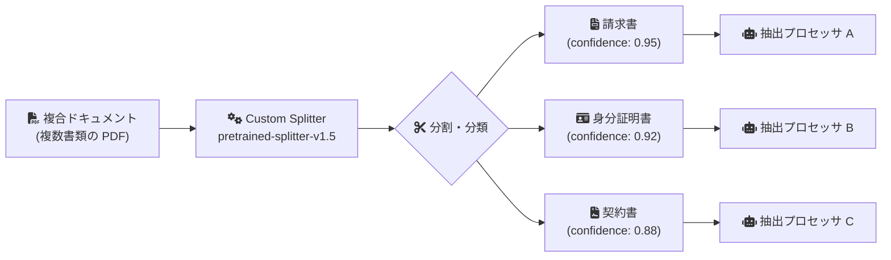

# Document AI: Custom Splitter pretrained-splitter-v1.5-2025-07-14 が GA

**リリース日**: 2026-03-13

**サービス**: Document AI

**機能**: Custom Splitter モデル pretrained-splitter-v1.5-2025-07-14 の一般提供開始

**ステータス**: GA (General Availability)

[このアップデートのインフォグラフィックを見る](https://takech9203.github.io/google-cloud-news-summary/20260313-document-ai-custom-splitter-v1-5-ga.html)

## 概要

Google Cloud Document AI の Custom Splitter において、事前トレーニング済みモデル `pretrained-splitter-v1.5-2025-07-14` が一般提供 (GA) となった。このモデルは Gemini 2.5 Flash LLM を基盤としており、ゼロショットでのドキュメント分割・分類が可能である。

Custom Splitter は、複合ドキュメント (複数種類の書類がまとめられた PDF など) を論理的な単位に分割し、各サブドキュメントを分類するプロセッサである。従来のトレーニングベースのアプローチに加え、本モデルでは事前トレーニング済みの生成 AI を活用することで、トレーニングデータセットを用意することなく即座に本番環境へデプロイできる。

本アップデートの主な対象ユーザーは、大量のドキュメント処理パイプラインを構築する企業の開発者やソリューションアーキテクトである。住宅ローン申請書類、保険請求書類、調達書類など、複数の書類が 1 つのファイルにまとめられたドキュメントを効率的に処理する必要があるユースケースに適している。

**アップデート前の課題**

- 2025 年 10 月 31 日時点では本モデルは Preview (Release Candidate) として提供されており、本番ワークロードでの利用には SLA が適用されなかった
- 従来のトレーニングベースの Custom Splitter (v1.0) では、独自のトレーニングデータセットの準備とモデルトレーニングに数時間を要していた
- Preview 段階ではモデルの安定性や互換性に変更が入る可能性があり、本番環境での長期運用に不安があった

**アップデート後の改善**

- GA となったことで SLA が適用され、本番ワークロードでの利用が正式にサポートされた
- ゼロショット分割・分類により、トレーニングデータなしで即座にドキュメント分割を開始できるようになった
- Gemini 2.5 Flash ベースの生成 AI により、ユーザー定義のクラスに基づく高精度な分類が可能になった
- 信頼度スコア (confidence score) が v1.5 でサポートされ、分割結果の品質判定が容易になった

## アーキテクチャ図



Custom Splitter が複合ドキュメントを論理的な単位に分割し、各サブドキュメントを分類した後、適切な抽出プロセッサへルーティングする典型的なデータフローを示している。

## サービスアップデートの詳細

### 主要機能

1. **ゼロショット分割・分類**
   - トレーニングデータセットを用意することなく、ユーザー定義のクラス (ドキュメントタイプ) に基づいてドキュメントを分割・分類できる
   - Gemini 2.5 Flash LLM を基盤とした生成 AI によりゼロショット推論を実現

2. **信頼度スコアのサポート**
   - v1.5 では各分割結果に対して信頼度スコアが提供される
   - 信頼度スコアを活用して、ヒューマンレビューの要否を自動判定するワークフローを構築できる

3. **柔軟なワークフロー**
   - 事前トレーニング済みモデルをそのまま使用するか、独自データでファインチューニングするかを選択可能
   - 事前トレーニング済みモデルはラベリングスキーマのイテレーションやテストを迅速に行うためにも活用できる

## 技術仕様

### モデルバージョン

| 項目 | 詳細 |
|------|------|
| モデルバージョン | `pretrained-splitter-v1.5-2025-07-14` |
| 基盤モデル | Gemini 2.5 Flash LLM |
| リリースチャネル | Stable |
| ステータス | GA (General Availability) |
| 信頼度スコア | サポート (v1.5 新機能) |
| ゼロショット対応 | あり |
| 最大ページ数 (生成 AI ベース) | 500 ページ |

### 必要な IAM ロール

| ロール | 説明 |
|--------|------|
| `roles/documentai.admin` | Document AI Administrator - プロセッサの作成・管理 |
| `roles/storage.admin` | Storage Admin - データセット用 Cloud Storage バケットの管理 |

### API リクエスト例

```python
from google.cloud import documentai_v1 as documentai

client = documentai.DocumentProcessorServiceClient(
    client_options={"api_endpoint": f"{location}-documentai.googleapis.com"}
)

name = client.processor_version_path(
    project_id, location, processor_id, "pretrained-splitter-v1.5-2025-07-14"
)

with open(file_path, "rb") as image:
    image_content = image.read()

request = documentai.ProcessRequest(
    name=name,
    raw_document=documentai.RawDocument(
        content=image_content, mime_type="application/pdf"
    ),
)

result = client.process_document(request=request)
document = result.document

for entity in document.entities:
    print(f"Type: {entity.type_}, Confidence: {entity.confidence}")
    for page_ref in entity.page_anchor.page_refs:
        print(f"  Page: {page_ref.page}")
```

## 設定方法

### 前提条件

1. Google Cloud プロジェクトで Document AI API が有効化されていること
2. 適切な IAM ロール (`roles/documentai.admin`, `roles/storage.admin`) が付与されていること
3. データセット用の空の Cloud Storage バケット (Google マネージドストレージも選択可)

### 手順

#### ステップ 1: Custom Splitter プロセッサの作成

Google Cloud Console の Document AI Workbench ページにアクセスし、「Custom Document Splitter」から「Create processor」を選択する。プロセッサ名とリージョンを指定して作成する。

```bash
# gcloud CLI でプロセッサを作成する場合
gcloud document-ai processors create \
  --display-name="my-custom-splitter" \
  --type="CUSTOM_SPLITTING_PROCESSOR" \
  --location="us"
```

#### ステップ 2: 事前トレーニング済みモデルバージョンの選択

Console の「Deploy and use」セクションで「Manage versions」ドロップダウンから `pretrained-splitter-v1.5-2025-07-14` を選択する。

#### ステップ 3: スキーマ (クラス) の定義

分割対象のドキュメントクラス (例: invoice, contract, id_document) を定義する。ゼロショットモデルではトレーニングデータのインポートは不要。

#### ステップ 4: プロセッサのデプロイとテスト

プロセッサをデプロイし、テストドキュメントで分割精度を確認する。

## メリット

### ビジネス面

- **導入時間の大幅短縮**: ゼロショット対応により、トレーニングデータの準備やモデルトレーニングの時間を省略し、数時間ではなく数分で本番環境にデプロイ可能
- **ドキュメント処理の自動化促進**: 複合ドキュメントの分割を自動化することで、手作業によるドキュメント仕分け業務を削減できる
- **SLA に裏付けられた本番運用**: GA となったことで Google Cloud の SLA が適用され、エンタープライズワークロードでの安心した運用が可能

### 技術面

- **Gemini 2.5 Flash 基盤**: 最新の LLM を活用した高精度なドキュメント理解と分類
- **信頼度スコアによる品質管理**: 分割結果の信頼度に基づいて自動処理とヒューマンレビューを使い分けるインテリジェントなワークフローを構築可能
- **柔軟なデプロイオプション**: ゼロショットからファインチューニングまで、精度要件に応じたアプローチを選択可能

## デメリット・制約事項

### 制限事項

- 生成 AI ベースのスプリッターは 500 ページを超える論理ドキュメントの分割に対応していない。500 ページ超のドキュメントは手動で分割してから処理する必要がある
- スプリッターはページ境界の識別のみを行い、実際の PDF 分割は行わない。物理的なファイル分割には Document AI Toolbox SDK のユーティリティ関数を使用する必要がある

### 考慮すべき点

- ML モデルの予測精度は完全ではないため、分割エラーが発生する可能性がある。誤った分割は 2 つのドキュメントに影響し、後続の抽出処理にもエラーを波及させる
- ベストプラクティスとして、分割予測後・実際のファイル分割前にヒューマンレビューステップを設けることが推奨される
- 信頼度スコアのしきい値は、ビジネス要件とエラー許容度に基づいて設定する必要がある

## ユースケース

### ユースケース 1: 住宅ローン申請書類の自動仕分け

**シナリオ**: 金融機関が住宅ローン申請パッケージ (申請書、収入証明、身分証明書、不動産評価書など) を 1 つの PDF にまとめて受領するケース。

**実装例**:
```python
# プロセッサスキーマでドキュメントクラスを定義
# - loan_application
# - income_verification
# - photo_id
# - property_appraisal

# 分割結果に基づいてルーティング
for entity in document.entities:
    if entity.confidence > 0.85:
        route_to_extractor(entity.type_, entity.page_anchor)
    else:
        send_to_human_review(entity)
```

**効果**: ローン審査プロセスの大幅な効率化。手作業でのドキュメント仕分けを排除し、処理時間を短縮。

### ユースケース 2: 保険請求書類の自動分類

**シナリオ**: 保険会社が保険請求に伴う複数の書類 (請求書、診断書、領収書、事故報告書) をまとめて受領し、種類ごとに異なる処理パイプラインにルーティングするケース。

**効果**: ゼロショット分類により、新しい書類タイプが追加された場合もスキーマにクラスを追加するだけで対応可能。トレーニングデータの再準備やモデルの再トレーニングが不要。

## 料金

Document AI のトレーニングやアップトレーニングに対する費用は発生しない。ホスティングと予測 (推論) に対して課金される。詳細な料金体系については公式料金ページを参照のこと。

- [Document AI 料金ページ](https://cloud.google.com/document-ai/pricing)

## 利用可能リージョン

Custom Splitter は以下のリージョンで利用可能である。

| リージョン | ロケーション |
|-----------|-------------|
| us | 米国 (マルチリージョン) |
| eu | 欧州連合 (マルチリージョン) |
| asia-south1 | ムンバイ |
| asia-southeast1 | シンガポール |
| australia-southeast1 | シドニー |
| europe-west2 | ロンドン |
| europe-west3 | フランクフルト |
| northamerica-northeast1 | モントリオール |

## 関連サービス・機能

- **Document AI Custom Extractor**: 分割されたサブドキュメントからエンティティを抽出するプロセッサ。Custom Splitter と組み合わせて使用することが多い
- **Document AI Custom Classifier**: ドキュメントの分類に特化したプロセッサ。分割が不要で分類のみ必要な場合に使用
- **Document AI Layout Parser**: ドキュメントのレイアウト解析とチャンク化を行うプロセッサ。生成 AI アプリケーションでの情報検索に活用
- **Document AI Toolbox SDK**: スプリッター出力に基づいて PDF を物理的に分割するユーティリティ関数を提供する Python SDK
- **Cloud Storage**: データセットの保存先として使用。CMEK (顧客管理の暗号鍵) にも対応

## 参考リンク

- [インフォグラフィック](https://takech9203.github.io/google-cloud-news-summary/20260313-document-ai-custom-splitter-v1-5-ga.html)
- [公式リリースノート](https://docs.google.com/release-notes#March_13_2026)
- [Custom Splitter ドキュメント](https://cloud.google.com/document-ai/docs/custom-splitter)
- [スプリッターの動作仕様](https://cloud.google.com/document-ai/docs/splitters)
- [プロセッサバージョンの管理](https://cloud.google.com/document-ai/docs/manage-processor-versions)
- [処理リクエストの送信](https://cloud.google.com/document-ai/docs/send-request)
- [料金ページ](https://cloud.google.com/document-ai/pricing)
- [利用可能リージョン](https://cloud.google.com/document-ai/docs/regions)

## まとめ

Document AI Custom Splitter の事前トレーニング済みモデル v1.5 が GA となったことで、Gemini 2.5 Flash を基盤としたゼロショットドキュメント分割・分類機能が本番環境で利用可能になった。トレーニングデータの準備が不要なため、導入のハードルが大幅に下がり、複合ドキュメントの自動処理パイプラインを迅速に構築できる。大量のドキュメント処理を行う企業は、本モデルの評価とパイプラインへの組み込みを検討されたい。

---

**タグ**: #DocumentAI #CustomSplitter #GA #GeminiFlash #ZeroShot #ドキュメント処理 #OCR #分割 #分類
