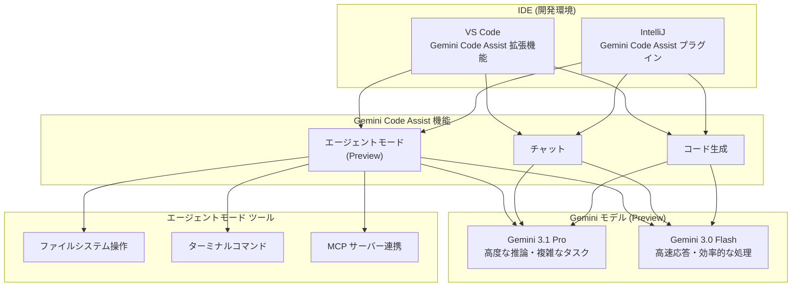

# Gemini Code Assist: Gemini 3.1 Pro および 3.0 Flash が Preview で利用可能に

**リリース日**: 2026-03-13

**サービス**: Gemini (Code Assist)

**機能**: Gemini 3.1 Pro および 3.0 Flash モデルの Preview 提供開始

**ステータス**: Preview

📊 [このアップデートのインフォグラフィックを見る](https://takech9203.github.io/google-cloud-news-summary/20260313-gemini-3-1-pro-3-0-flash-preview.html)

## 概要

Google Cloud は、Gemini Code Assist において Gemini 3.1 Pro および Gemini 3.0 Flash モデルを Preview として利用可能にしたことを発表した。これらのモデルは VS Code および IntelliJ の両 IDE で利用でき、エージェントモード、チャット、コード生成の各機能で使用できる。エージェントモードおよびチャットの応答では、Gemini 3 で生成された場合にラベルが表示される。

本アップデートは、2025 年 7 月に GA となった Gemini 2.5 Pro / 2.5 Flash の後継となる次世代モデルの早期提供であり、コーディング、推論、複雑なタスク処理の能力がさらに向上している。Solutions Architect の観点からは、開発チームの生産性向上に直接寄与する重要なアップデートである。

**アップデート前の課題**

- Gemini Code Assist では Gemini 2.5 Pro / 2.5 Flash が最新モデルであり、より高度な推論能力を持つモデルを利用できなかった
- 複雑なマルチステップのコーディングタスクにおいて、モデルの性能上限に達するケースがあった
- エージェントモードでの計画策定や実行精度について改善の余地があった

**アップデート後の改善**

- Gemini 3.1 Pro により、より高度な推論とコーディング能力を活用した開発支援が可能になった
- Gemini 3.0 Flash により、高速なレスポンスを維持しながら改善された品質のコード生成が利用可能になった
- エージェントモード、チャット、コード生成の各機能で新モデルの能力を活かした開発体験が提供される

## アーキテクチャ図



VS Code および IntelliJ から Gemini Code Assist の各機能 (エージェントモード、チャット、コード生成) を通じて、Gemini 3.1 Pro または Gemini 3.0 Flash モデルにアクセスする構成を示す。エージェントモードではファイルシステム操作、ターミナルコマンド、MCP サーバー連携などのツールも利用可能である。

## サービスアップデートの詳細

### 主要機能

1. **エージェントモード (Preview)**
   - 複雑なマルチステップタスクの計画策定と実行を AI が支援
   - ファイルシステムの操作、ターミナルコマンドの実行が可能
   - MCP サーバーの設定によりエージェントの能力を拡張可能
   - 設計ドキュメント、Issue、TODO コメントからのコード生成に対応
   - 実行中の計画に対するコメント、編集、承認による制御が可能

2. **チャット機能**
   - Gemini 3.1 Pro / 3.0 Flash による応答生成
   - Gemini 3 で生成された応答にはラベルが付与される
   - コードに関する質問、デバッグ支援、コード理解の支援

3. **コード生成**
   - プロンプトからのコード生成
   - コード補完の提案
   - ユニットテストの生成
   - コードのリファクタリング支援

## 技術仕様

### モデル別特性

| 項目 | Gemini 3.1 Pro | Gemini 3.0 Flash |
|------|---------------|-----------------|
| 位置づけ | 高性能・高精度モデル | 高速・効率特化モデル |
| 対応機能 | エージェントモード、チャット、コード生成 | エージェントモード、チャット、コード生成 |
| 対応 IDE | VS Code、IntelliJ | VS Code、IntelliJ |
| ステータス | Preview | Preview |

### Gemini 3 の利用可能条件

| ライセンス / サブスクリプション | Gemini 3 の利用可否 |
|------|------|
| Google AI Ultra | VS Code および IntelliJ の全ユーザーが利用可能 |
| Google AI Pro | VS Code および IntelliJ の全ユーザーが利用可能 |
| Gemini Code Assist Enterprise | 管理者が Preview リリースチャネルを設定済みのユーザーが利用可能 |
| Gemini Code Assist Standard | 管理者が Preview リリースチャネルを設定済みのユーザーが利用可能 |
| Gemini Code Assist for individuals | ウェイトリストから選ばれたユーザーが利用可能 (他のユーザーは近日提供予定) |
| Google Developer Program | 近日提供予定 |
| Google AI Ultra for Business | 近日提供予定 |

### エージェントモードの制限事項

- エージェントモードでは標準チャットの一部機能が利用できない、または動作が異なる場合がある
- エージェントモードではソース引用 (Recitation) が利用不可
- IDE 外のリソースへの変更を元に戻すオプションがない

## 設定方法

### 前提条件

1. Gemini Code Assist の利用可能なサブスクリプションを保有していること
2. Enterprise / Standard の場合、管理者が Preview リリースチャネルを設定していること
3. VS Code または IntelliJ がインストールされていること

### 手順

#### ステップ 1: VS Code での Gemini Code Assist 拡張機能インストール

1. VS Code で拡張機能ビューを開く (Ctrl/Cmd + Shift + X)
2. 「Gemini Code Assist」を検索
3. 「Install」をクリック
4. 必要に応じて VS Code を再起動

#### ステップ 2: IntelliJ での Gemini Code Assist プラグインインストール

1. IDE の設定 > Plugins を開く
2. Marketplace タブで「Gemini Code Assist」を検索
3. 「Install」をクリック
4. IDE を再起動

#### ステップ 3: エージェントモードの利用開始

**VS Code の場合:**

1. アクティビティバーの Gemini Code Assist アイコンをクリック
2. Agent トグルをクリックしてエージェントモードに切り替え
3. プロンプトを入力してタスクを開始

**IntelliJ の場合:**

1. ツールウィンドウバーの Gemini アイコンをクリック
2. Agent タブを選択
3. タスクの説明を入力
4. エージェントの提案を確認・承認

#### ステップ 4: Enterprise/Standard でのリリースチャネル設定

Enterprise または Standard を利用している場合、管理者が Preview リリースチャネルを設定する必要がある。詳細は [Preview リリースチャネルの設定](https://cloud.google.com/gemini/docs/codeassist/configure-release-channels) を参照。

## メリット

### ビジネス面

- **開発生産性の向上**: Gemini 3.1 Pro の高度な推論能力により、複雑なコーディングタスクの完了速度が向上し、開発サイクルの短縮が期待できる
- **コスト効率**: Gemini 3.0 Flash の高速応答により、開発者の待ち時間が削減され、日常的なコーディング作業の効率が改善される
- **柔軟なモデル選択**: タスクの複雑さに応じて Pro と Flash を使い分けることで、品質と速度のバランスを最適化できる

### 技術面

- **エージェントモードの強化**: 新モデルにより、マルチステップの計画策定と実行の精度が向上
- **MCP サーバー連携**: エージェントモードで MCP サーバーを設定し、外部ツールやサービスとの連携が可能
- **IDE 統合**: VS Code と IntelliJ の両方で一貫した体験を提供し、チーム内の異なる IDE 利用者にも対応

## デメリット・制約事項

### 制限事項

- Preview ステータスのため、本番環境での使用は推奨されない (Pre-GA Offerings Terms が適用)
- Enterprise / Standard ユーザーは管理者による Preview リリースチャネルの設定が必要
- Gemini Code Assist for individuals ユーザーはウェイトリストからの選定が必要
- エージェントモードではソース引用が利用できない

### 考慮すべき点

- Preview 機能は「as is」で提供され、サポートが限定的な場合がある
- エージェントモードの自動承認 (Auto-approve) 機能はファイルシステムやターミナルへのアクセスを伴うため、セキュリティに十分注意すること
- Google Developer Program および Google AI Ultra for Business では近日提供予定であり、現時点では利用不可

## ユースケース

### ユースケース 1: 複雑なリファクタリングタスク

**シナリオ**: 大規模なコードベースにおいて、ライブラリのバージョン移行やアーキテクチャの変更が必要な場合

**実装例**:
エージェントモードで以下のようなプロンプトを使用する。
```
Migrate library versions in this repository from Spring Boot 2.x to Spring Boot 3.x.
```

**効果**: Gemini 3.1 Pro の高度な推論能力により、依存関係の解析、必要な変更箇所の特定、段階的な移行計画の策定と実行が自動化される

### ユースケース 2: デザインドキュメントからのコード生成

**シナリオ**: 設計ドキュメントや Issue の記述からコードを自動生成する場合

**実装例**:
エージェントモードで設計ドキュメントへのパスを指定してプロンプトを入力する。
```
Generate code from design documents in docs/design-spec.md, including unit tests.
```

**効果**: 設計仕様に基づいたコードとテストの自動生成により、実装フェーズの初期工数を大幅に削減

### ユースケース 3: 日常的なコーディング支援

**シナリオ**: コード補完やチャットベースの質問応答を高速に行いたい場合

**効果**: Gemini 3.0 Flash の高速な応答により、開発フローを中断することなく AI によるコーディング支援を受けられる

## 料金

Gemini Code Assist の料金は利用するサブスクリプションによって異なる。Gemini 3.1 Pro / 3.0 Flash モデルの利用自体に追加料金は発生しない (各サブスクリプションの範囲内で利用可能)。

| サブスクリプション | 料金 |
|--------|-----------------|
| Gemini Code Assist for individuals | 無料 |
| Google Developer Program Premium | 月額 $24.99 / 年額 $299 |
| Gemini Code Assist Standard / Enterprise | [Gemini Code Assist 料金ページ](https://cloud.google.com/products/gemini/pricing) を参照 |

※ 上記は Google Developer Program の料金であり、Gemini Code Assist Standard / Enterprise の具体的な料金は公式料金ページを確認すること。

## 関連サービス・機能

- **Gemini Code Assist エージェントモード**: 複雑なタスクをマルチステップで自動化するペアプログラミング機能
- **Gemini CLI**: Gemini Code Assist 経由でターミナルから利用可能なオープンソース AI エージェント
- **Firebase Studio**: AI 支援によるフルスタックアプリケーション開発環境
- **MCP (Model Context Protocol) サーバー**: エージェントモードの能力を拡張する外部ツール連携プロトコル

## 参考リンク

- 📊 [インフォグラフィック](https://takech9203.github.io/google-cloud-news-summary/20260313-gemini-3-1-pro-3-0-flash-preview.html)
- [公式リリースノート](https://docs.cloud.google.com/release-notes#March_13_2026)
- [Gemini Code Assist での Gemini 3 ドキュメント](https://cloud.google.com/gemini/docs/codeassist/gemini-3)
- [エージェントモード ドキュメント](https://cloud.google.com/gemini/docs/codeassist/use-agentic-chat-pair-programmer)
- [Gemini Code Assist 概要](https://cloud.google.com/gemini/docs/codeassist/overview)
- [料金ページ](https://cloud.google.com/products/gemini/pricing)

## まとめ

Gemini 3.1 Pro および Gemini 3.0 Flash の Preview 提供は、Gemini Code Assist ユーザーにとって次世代モデルの能力をいち早く体験できる重要なマイルストーンである。特にエージェントモードとの組み合わせにより、複雑なマルチステップの開発タスクを AI が計画・実行する能力が大幅に向上する。Enterprise / Standard ユーザーは管理者に Preview リリースチャネルの設定を依頼し、Google AI Ultra / Pro ユーザーは即座に新モデルを試用することを推奨する。

---

**タグ**: #Gemini #CodeAssist #GeminiCodeAssist #Gemini3 #Preview #AgentMode #VSCode #IntelliJ #AI #コード生成 #開発生産性
