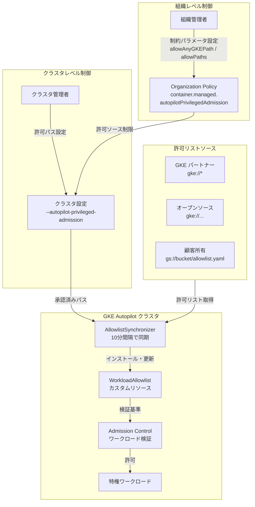

# Google Kubernetes Engine (GKE): Autopilot 特権ワークロードのきめ細かい制御

**リリース日**: 2026-03-13

**サービス**: Google Kubernetes Engine (GKE)

**機能**: Autopilot 特権ワークロードのきめ細かい制御

**ステータス**: Feature

[このアップデートのインフォグラフィックを見る](https://takech9203.github.io/google-cloud-news-summary/20260313-gke-autopilot-privileged-workload-control.html)

## 概要

GKE バージョン 1.35 以降において、組織管理者およびクラスタ管理者が、GKE Autopilot クラスタで実行可能な特権ワークロードをきめ細かく制御できるようになりました。従来から Autopilot パートナーやオープンソースプロジェクトの特権ワークロードは許可リスト (allowlist) を通じて実行可能でしたが、今回のアップデートにより、承認された顧客が独自の特権ワークロード用のカスタム許可リストを作成し、Autopilot モードで実行できるようになります。

この機能は、セキュリティ要件の厳しいエンタープライズ環境において特に重要です。Organization Policy Service を活用した組織レベルでの制御と、クラスタレベルでの許可リスト管理を組み合わせることで、最小権限の原則に基づいた多層的なセキュリティ制御を実現します。

対象ユーザーは、セキュリティエンジニア、プラットフォームエンジニア、クラスタ管理者、および組織管理者です。特に、独自のセキュリティエージェントやモニタリングツールなど、特権アクセスが必要なカスタムワークロードを Autopilot 環境で運用したい組織にとって大きな価値があります。

**アップデート前の課題**

- Autopilot モードではデフォルトのセキュリティ制約により、特権ワークロードの実行が制限されていた
- 特権ワークロードの実行は GKE パートナーおよび承認済みオープンソースプロジェクトに限定されていた
- 顧客独自の特権ワークロードを Autopilot クラスタで実行する手段がなかった
- 組織レベルでどのパートナーワークロードを許可するかの制御が限定的だった

**アップデート後の改善**

- 組織管理者が Organization Policy を通じて許可リストのソースを組織全体で制御可能になった
- クラスタ管理者が `--autopilot-privileged-admission` フラグで個別クラスタの許可リスト設定を管理可能になった
- 承認済み顧客が `WorkloadAllowlist` カスタムリソースを作成し、独自の特権ワークロードを Autopilot で実行可能になった
- `AllowlistSynchronizer` による許可リストの自動同期と継続的な更新が実現された

## アーキテクチャ図



この図は、組織ポリシーからクラスタ設定、許可リストの同期、ワークロードの検証に至るまでの多層的な制御フローを示しています。組織管理者がトップレベルでソースを制限し、クラスタ管理者がクラスタごとに許可パスを設定し、AllowlistSynchronizer が許可リストを自動同期する構造です。

## サービスアップデートの詳細

### 主要機能

1. **Organization Policy によるきめ細かい組織レベル制御**
   - `container.managed.autopilotPrivilegedAdmission` マネージド制約を使用して、組織・フォルダ・プロジェクト単位で許可リストソースを制御
   - `allowAnyGKEPath` パラメータで GKE パートナーワークロードの一括許可・拒否を設定
   - `allowPaths` パラメータで個別の Cloud Storage パスを明示的に承認

2. **クラスタレベルの許可リスト管理**
   - `--autopilot-privileged-admission` フラグによるクラスタ作成・更新時の許可パス指定
   - 空文字列 (`""`) 指定によるすべての許可リストの無効化オプション
   - 組織ポリシーで承認されたパスのみをクラスタで設定可能

3. **カスタム WorkloadAllowlist の作成 (顧客所有ワークロード)**
   - `WorkloadAllowlist` カスタムリソースを YAML で定義
   - Pod 仕様に `cloud.google.com/generate-allowlist: "true"` アノテーションを追加して許可リストテンプレートを自動生成
   - Cloud Storage バケットへのアップロードと組織ポリシーでの承認が必要

4. **AllowlistSynchronizer による自動同期**
   - Kubernetes カスタムリソースとして定義し、許可リストのパスを指定
   - 10 分間隔で許可リストファイルの変更を自動チェック・更新
   - チーム・アプリケーション単位で個別の Synchronizer を作成するベストプラクティス

## 技術仕様

### 特権ワークロードのソース種別

| ソース種別 | パスプレフィックス | デフォルト許可 | 説明 |
|------------|-------------------|---------------|------|
| GKE パートナー | `gke://*` | あり | Google が検証済みのパートナーワークロード |
| オープンソース | `gke://...` | あり | GKE が検証済みのオープンソースワークロード |
| 顧客所有 | `gs://bucket/...` | なし | 顧客が作成した独自ワークロード (要承認) |

### 主要な Kubernetes カスタムリソース

| リソース | API グループ | 用途 |
|----------|-------------|------|
| WorkloadAllowlist | `auto.gke.io/v1` | 特権ワークロードの許可定義 |
| AllowlistSynchronizer | `auto.gke.io/v1` | 許可リストの自動インストール・同期 |

### Organization Policy 設定例

```yaml
name: organizations/ORGANIZATION_ID/policies/container.managed.autopilotPrivilegedAdmission
spec:
  rules:
    - enforce: true
      parameters:
        allowAnyGKEPath: false
        allowPaths:
          - "gke://partner-workload-1"
          - "gs://my-org-bucket/security-agent.yaml"
```

## 設定方法

### 前提条件

1. GKE バージョン 1.35 以降のクラスタ
2. Organization Policy 管理者ロール (`roles/orgpolicy.policyAdmin`) - 組織レベル設定の場合
3. カスタム許可リストを使用する場合は、Cloud Customer Care への申請と承認が必要
4. Cloud Storage バケット (カスタム許可リストの格納用)

### 手順

#### ステップ 1: 組織ポリシーの設定 (組織管理者)

Google Cloud Console の [Organization policies] ページで `container.managed.autopilotPrivilegedAdmission` 制約を設定するか、以下の YAML を適用します。

```yaml
name: organizations/ORGANIZATION_ID/policies/container.managed.autopilotPrivilegedAdmission
spec:
  rules:
    - enforce: true
      parameters:
        allowAnyGKEPath: true
        allowPaths:
          - "gs://my-bucket/my-allowlist.yaml"
```

`allowAnyGKEPath` を `false` に設定すると、GKE パートナーワークロードも含めて `allowPaths` で明示的に指定したパスのみが許可されます。

#### ステップ 2: クラスタの作成・更新 (クラスタ管理者)

```bash
# 新規クラスタ作成時
gcloud container clusters create-auto CLUSTER_NAME \
    --location=LOCATION \
    --autopilot-privileged-admission=gke://*,gs://my-bucket/my-allowlist.yaml

# 既存クラスタ更新時
gcloud container clusters update CLUSTER_NAME \
    --location=LOCATION \
    --autopilot-privileged-admission=gke://*,gs://my-bucket/my-allowlist.yaml
```

#### ステップ 3: カスタム WorkloadAllowlist の作成 (承認済み顧客のみ)

```bash
# 1. ワークロードの Pod 仕様にアノテーションを追加
#    cloud.google.com/generate-allowlist: "true"

# 2. ワークロードのデプロイを試行して許可リストテンプレートを取得
kubectl apply -f workload.yaml
# GKE がワークロードを拒否し、WorkloadAllowlist テンプレートを出力

# 3. 生成された WorkloadAllowlist を Cloud Storage にアップロード
gsutil cp allowlist.yaml gs://my-bucket/my-allowlist.yaml
```

#### ステップ 4: AllowlistSynchronizer の作成

```yaml
apiVersion: auto.gke.io/v1
kind: AllowlistSynchronizer
metadata:
  name: my-team-synchronizer
spec:
  allowlistPaths:
    - gke://*
    - gs://my-bucket/my-allowlist.yaml
```

```bash
kubectl apply -f synchronizer.yaml

# Ready 状態になるまで待機
kubectl wait --for=condition=Ready allowlistsynchronizer/my-team-synchronizer \
    --timeout=60s
```

#### ステップ 5: 特権ワークロードのデプロイ

```bash
kubectl apply -f workload.yaml
```

AllowlistSynchronizer が許可リストをインストールした後、対応する特権ワークロードのデプロイが可能になります。

## メリット

### ビジネス面

- **セキュリティガバナンスの強化**: 組織ポリシーを通じて、特権ワークロードの実行を組織全体で一元管理できるため、コンプライアンス要件への対応が容易になる
- **Autopilot 採用の加速**: 従来 Standard モードでしか実行できなかったカスタム特権ワークロードを Autopilot で実行可能になり、運用コスト削減と Autopilot の自動管理メリットを享受できる
- **マルチテナント環境の安全な運用**: チームごとに異なる AllowlistSynchronizer を使用し、最小権限の原則に基づいたワークロード管理が可能

### 技術面

- **多層防御アーキテクチャ**: 組織ポリシー、クラスタ設定、WorkloadAllowlist の 3 層で特権アクセスを制御し、意図しない特権昇格を防止
- **自動同期メカニズム**: AllowlistSynchronizer が 10 分間隔で許可リストを自動更新するため、セキュリティパッチの迅速な展開が可能
- **宣言的な管理**: WorkloadAllowlist と AllowlistSynchronizer は Kubernetes カスタムリソースとして管理され、GitOps ワークフローとの統合が容易

## デメリット・制約事項

### 制限事項

- カスタム許可リストの作成は承認済み顧客のみが利用可能であり、Cloud Customer Care への申請が必要
- `allowAnyGKEPath` を `false` に設定し `allowPaths` を空にすると、GKE パートナーワークロードを含むすべての許可リストが無効化される
- GKE バージョン 1.35 以降が必要であり、それ以前のバージョンでは利用不可

### 考慮すべき点

- Organization Policy の変更が完全に反映されるまで最大 15 分かかる場合がある
- WorkloadAllowlist の `metadata.name` はバケット内で一意にする必要があり、同名の許可リストを複数インストールすると予期しない動作が発生する可能性がある
- 許可リストを削除する際は、AllowlistSynchronizer から該当パスを削除する必要がある (WorkloadAllowlist オブジェクトを直接削除しても Synchronizer が再インストールする)
- カスタム許可リストのオーナーが、そのワークロードと許可リストの作成・保守を責任を持って行う必要がある

## ユースケース

### ユースケース 1: エンタープライズセキュリティエージェントの Autopilot 展開

**シナリオ**: 大規模企業が独自のセキュリティモニタリングエージェントを全 GKE クラスタにデプロイする必要がある。このエージェントはホストファイルシステムへのアクセスと特権モードでの実行が必要。

**実装例**:
```yaml
# WorkloadAllowlist の定義
apiVersion: auto.gke.io/v1
kind: WorkloadAllowlist
metadata:
  name: security-agent-v1
  annotations:
    autopilot.gke.io/no-connect: "true"
exemptions:
  - autogke-disallow-privilege
  - autogke-no-write-mode-hostpath
matchingCriteria:
  containers:
    - name: security-agent
      image: "gcr.io/my-org/security-agent:.*"
      securityContext:
        privileged: true
  volumes:
    - name: host-logs
      hostPath:
        path: /var/log
```

**効果**: Standard モードへの依存を排除し、Autopilot の自動ノード管理・スケーリングのメリットを享受しながら、セキュリティ要件を満たすエージェントを展開できる。

### ユースケース 2: 組織全体での特権ワークロード制限

**シナリオ**: セキュリティチームが、承認済みのパートナーワークロードと特定のカスタムワークロードのみを組織全体で許可し、未承認の特権ワークロードの実行を防止したい。

**効果**: Organization Policy で `allowAnyGKEPath: false` を設定し、`allowPaths` に承認済みパスのみを列挙することで、組織全体で特権ワークロードの実行を厳格に制限できる。新しいワークロードの追加には組織管理者の承認が必要となり、ガバナンスが強化される。

## 料金

この機能自体に追加料金は発生しません。GKE Autopilot クラスタの標準料金が適用されます。カスタム許可リストを Cloud Storage バケットに保存する場合、Cloud Storage の標準料金が発生しますが、許可リストファイルは非常に小さいため実質的なコストは無視できます。

## 関連サービス・機能

- **[GKE Autopilot](https://cloud.google.com/kubernetes-engine/docs/concepts/autopilot-overview)**: ノード管理を自動化する GKE の運用モード。今回の機能拡張の基盤
- **[Organization Policy Service](https://cloud.google.com/resource-manager/docs/organization-policy/overview)**: 組織全体のリソースポリシーを管理するサービス。`container.managed.autopilotPrivilegedAdmission` 制約を提供
- **[Cloud Storage](https://cloud.google.com/storage)**: カスタム WorkloadAllowlist ファイルの格納先
- **[GKE Autopilot パートナー](https://cloud.google.com/kubernetes-engine/docs/resources/autopilot-partners)**: GKE が検証済みのパートナーワークロード一覧
- **[GKE Autopilot セキュリティ](https://cloud.google.com/kubernetes-engine/docs/concepts/autopilot-security)**: Autopilot モードのデフォルトセキュリティ制約

## 参考リンク

- [インフォグラフィック](https://takech9203.github.io/google-cloud-news-summary/20260313-gke-autopilot-privileged-workload-control.html)
- [公式リリースノート](https://docs.cloud.google.com/release-notes#March_13_2026)
- [Autopilot 特権ワークロードについて](https://cloud.google.com/kubernetes-engine/docs/concepts/about-autopilot-privileged-workloads)
- [Autopilot で特権ワークロードを実行する](https://cloud.google.com/kubernetes-engine/docs/how-to/run-autopilot-partner-workloads)
- [カスタム許可リストの作成](https://cloud.google.com/kubernetes-engine/docs/how-to/autopilot-privileged-allowlists)
- [組織での特権ワークロード制限](https://cloud.google.com/kubernetes-engine/docs/how-to/privileged-admission-organizations)

## まとめ

GKE 1.35 で導入された Autopilot 特権ワークロードのきめ細かい制御は、エンタープライズ環境における Autopilot 採用の大きな障壁を取り除く重要なセキュリティ機能です。Organization Policy による組織レベルの制御、クラスタレベルの許可パス管理、WorkloadAllowlist によるワークロード単位の検証という 3 層の制御メカニズムにより、最小権限の原則に基づいた堅牢なセキュリティガバナンスを実現します。Autopilot への移行を検討している組織は、まず Organization Policy の設定を見直し、許可すべきワークロードソースを明確にした上で段階的に導入することを推奨します。

---

**タグ**: #GKE #Autopilot #Security #PrivilegedWorkloads #OrganizationPolicy #WorkloadAllowlist #Kubernetes #GoogleCloud
