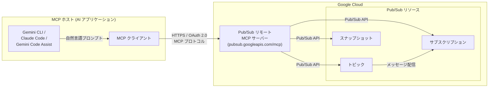

# Pub/Sub: リモート MCP サーバー

**リリース日**: 2026-03-13

**サービス**: Pub/Sub

**機能**: Pub/Sub リモート MCP サーバー

**ステータス**: Preview

[このアップデートのインフォグラフィックを見る](https://takech9203.github.io/google-cloud-news-summary/20260313-pubsub-remote-mcp-server.html)

## 概要

Google Cloud Pub/Sub のリモート Model Context Protocol (MCP) サーバーが Preview として利用可能になった。MCP は Anthropic が開発したオープンソースプロトコルであり、LLM (大規模言語モデル) や AI アプリケーションが外部データソースやサービスに標準化された方法で接続するための仕組みである。

今回の Pub/Sub リモート MCP サーバーにより、Gemini CLI、Gemini Code Assist のエージェントモード、Claude Code などの AI アプリケーションから、自然言語を通じて Pub/Sub リソースを管理できるようになった。トピック、サブスクリプション、スナップショットの CRUD 操作に加え、トピックへのメッセージ発行も MCP ツール経由で実行可能である。

本機能の主な対象ユーザーは、AI 駆動の開発ワークフローを構築する開発者やプラットフォームエンジニアである。特に、イベント駆動アーキテクチャの構築・運用において、AI エージェントによるインフラストラクチャ管理の自動化を推進するソリューションアーキテクトにとって注目すべきアップデートとなる。

**アップデート前の課題**

- Pub/Sub リソースの管理には Google Cloud コンソール、gcloud CLI、またはクライアントライブラリを使用した明示的なコーディングが必要であった
- AI エージェントから Pub/Sub を操作するにはカスタムの「グルーコード」を実装し、認証・API 呼び出し・レスポンスパースを自前で行う必要があった
- 開発者が AI アシスタントとの対話中に Pub/Sub の設定変更を行うにはコンテキストスイッチが発生し、ワークフローが中断されていた

**アップデート後の改善**

- AI アプリケーションから標準化された MCP プロトコル経由で直接 Pub/Sub リソースを管理できるようになった
- 自然言語によるプロンプトで Pub/Sub のトピック作成、サブスクリプション設定、メッセージ発行が可能になった
- Google Cloud が管理するリモート HTTPS エンドポイントとして提供されるため、ローカルサーバーのセットアップや運用が不要になった

## アーキテクチャ図



MCP ホスト内の AI アプリケーションが MCP クライアントを通じてリモート MCP サーバーに接続し、Pub/Sub API を介してトピック・サブスクリプション・スナップショットの各リソースを管理するデータフローを示している。

## サービスアップデートの詳細

### 主要機能

1. **トピック管理**
   - トピックの作成 (create)、一覧取得 (list)、詳細取得 (get)、更新 (update)、削除 (delete)
   - トピックへのメッセージ発行 (publish)

2. **サブスクリプション管理**
   - サブスクリプションの作成、一覧取得、詳細取得、更新、削除
   - AI エージェントからの自然言語指示によるサブスクリプション設定の変更

3. **スナップショット管理**
   - スナップショットの作成、一覧取得、詳細取得、更新、削除
   - メッセージ再生 (replay) のためのスナップショット操作を AI ワークフローに統合

4. **Google Cloud リモート MCP サーバー共通機能**
   - マネージドなグローバルまたはリージョナル HTTPS エンドポイント
   - IAM による細かい粒度の認可制御
   - Model Armor によるプロンプトとレスポンスのセキュリティスキャン (オプション)
   - 一元化された監査ログ
   - MCP tools/list による自動ツール検出

## 技術仕様

### エンドポイントと認証

| 項目 | 詳細 |
|------|------|
| プロトコル | MCP (Model Context Protocol) |
| トランスポート | HTTPS (リモート MCP サーバー) |
| エンドポイント | `pubsub.googleapis.com/mcp` (推定) |
| 認証 | OAuth 2.0 (Google Cloud 認証情報、サービスアカウント、OAuth クライアント ID) |
| 認可仕様 | MCP authorization specification 準拠 |

### 必要な IAM ロール

| ロール | 用途 |
|--------|------|
| `roles/serviceusage.serviceUsageAdmin` | MCP サーバーの有効化 |
| `roles/mcp.toolUser` | MCP ツール呼び出しの実行 |
| `roles/pubsub.admin` | Pub/Sub リソースのフルアクセス (トピック、サブスクリプション、スナップショット) |
| `roles/pubsub.editor` | Pub/Sub リソースの編集 (読み取り専用操作のみなら `roles/pubsub.viewer`) |

### 必要なパーミッション

```
# MCP サーバーの有効化に必要
serviceusage.mcppolicy.get
serviceusage.mcppolicy.update

# MCP ツール呼び出しに必要
mcp.tools.call
resourcemanager.projects.get
resourcemanager.projects.list

# Pub/Sub リソース操作に必要 (操作内容に応じて選択)
pubsub.topics.create
pubsub.topics.get
pubsub.topics.list
pubsub.topics.update
pubsub.topics.delete
pubsub.topics.publish
pubsub.subscriptions.create
pubsub.subscriptions.get
pubsub.subscriptions.list
pubsub.subscriptions.update
pubsub.subscriptions.delete
pubsub.snapshots.create
pubsub.snapshots.get
pubsub.snapshots.list
pubsub.snapshots.update
pubsub.snapshots.delete
```

## 設定方法

### 前提条件

1. Google Cloud プロジェクトが作成されていること
2. Pub/Sub API が有効化されていること
3. gcloud CLI の beta コンポーネントがインストールされていること
4. 必要な IAM ロールが付与されていること

### 手順

#### ステップ 1: gcloud CLI beta コンポーネントのインストール

```bash
gcloud components install beta
```

#### ステップ 2: Pub/Sub MCP サーバーの有効化

```bash
gcloud beta services mcp enable pubsub.googleapis.com \
  --project=PROJECT_ID
```

`PROJECT_ID` を対象の Google Cloud プロジェクト ID に置き換える。Pub/Sub サービスが未有効化の場合は、先にサービスの有効化を求められる。

**注意**: 2026 年 3 月 17 日以降、対応サービスを有効化すると MCP サーバーも自動的に有効化される。

#### ステップ 3: AI アプリケーションでの MCP クライアント設定

AI アプリケーション (Gemini CLI、Claude Code など) の MCP 設定に以下を追加する。

```json
{
  "mcpServers": {
    "pubsub": {
      "url": "https://pubsub.googleapis.com/mcp",
      "transport": "http"
    }
  }
}
```

認証方法は Google Cloud 認証情報、OAuth クライアント ID、またはサービスアカウントから選択する。詳細は [MCP サーバーへの認証](https://docs.cloud.google.com/mcp/authenticate-mcp) を参照。

#### ステップ 4: ツールの確認

MCP inspector を使用するか、tools/list リクエストを直接送信して利用可能なツールを確認する。

```bash
# tools/list は認証不要
curl -X POST https://pubsub.googleapis.com/mcp \
  -H "Content-Type: application/json" \
  -d '{"jsonrpc": "2.0", "method": "tools/list"}'
```

## メリット

### ビジネス面

- **開発者生産性の向上**: AI アシスタントとの対話中にコンテキストスイッチなく Pub/Sub リソースを管理でき、イベント駆動アーキテクチャの構築・運用を効率化する
- **オンボーディングの加速**: Pub/Sub の操作方法を熟知していない開発者でも、自然言語で AI エージェントに指示することでリソース管理が可能になる

### 技術面

- **標準化されたプロトコル**: MCP プロトコルにより、AI アプリケーションと Pub/Sub 間のインテグレーションが標準化され、カスタムコードの削減につながる
- **エンタープライズセキュリティ**: IAM によるきめ細かいアクセス制御、OAuth 2.0 認証、Model Armor によるセキュリティスキャン、監査ログといったエンタープライズ向けセキュリティ機能が利用可能
- **マネージドインフラストラクチャ**: Google Cloud が管理するリモートエンドポイントとして提供されるため、MCP サーバー自体の運用管理が不要

## デメリット・制約事項

### 制限事項

- Preview 段階であり、SLA は適用されない。本番ワークロードでの利用は慎重に検討する必要がある
- Pre-GA の機能であるため、仕様変更やサポートが限定的な場合がある
- MCP ツール呼び出しは AI アプリケーション経由となるため、大量のバッチ操作やリアルタイム性が求められる処理には従来の API / CLI の使用が適切

### 考慮すべき点

- AI エージェントに Pub/Sub リソースの作成・削除権限を付与する際は、最小権限の原則に従い、専用のサービスアカウントを使用することを推奨する
- MCP サーバーは AI エージェントの自律的なアクションを可能にするため、プロンプトインジェクションなどのセキュリティリスクを考慮し、Model Armor の利用を検討する
- 操作対象の Google Cloud プロジェクトとクライアント認証のプロジェクトが異なる場合は、両方のプロジェクトで MCP サーバーを有効化する必要がある

## ユースケース

### ユースケース 1: AI エージェントによるイベント駆動アーキテクチャの構築

**シナリオ**: プラットフォームチームが新しいマイクロサービスのイベントバスを構築する際に、AI エージェント (Gemini CLI) を通じて必要な Pub/Sub リソースを自然言語で作成する。

**実装例**:
```
プロンプト: "orders-events トピックを作成し、メッセージ保持期間を 7 日に設定してください。
また、order-processing-sub と analytics-sub の 2 つのサブスクリプションを作成し、
analytics-sub にはフィルタ 'attributes.priority = "high"' を設定してください。"
```

**効果**: 複数の gcloud コマンドや API 呼び出しを個別に実行する必要がなくなり、設計意図を自然言語で伝えるだけで Pub/Sub リソースの構築が完了する。

### ユースケース 2: 障害対応時のメッセージ再生操作

**シナリオ**: サブスクリプションのメッセージ処理でエラーが発生し、スナップショットを使用したメッセージ再生が必要な場合に、AI エージェントと対話しながら復旧操作を行う。

**効果**: 障害対応の手順を AI エージェントに自然言語で指示しながら実行でき、スナップショットの確認・作成・シーク操作を迅速に行える。運用経験の浅いエンジニアでも、AI エージェントのガイドにより適切な復旧操作が可能になる。

### ユースケース 3: AI 開発ワークフローにおけるデータパイプラインのプロトタイピング

**シナリオ**: AI アプリケーション開発者が、Gemini Code Assist のエージェントモード内でコーディングしながら、テスト用の Pub/Sub トピックやサブスクリプションを作成し、テストメッセージを発行する。

**効果**: IDE を離れることなく Pub/Sub リソースの作成・テストが完了し、開発フローが中断されない。MCP サーバーの統合により、コード作成とインフラ構成をシームレスに実行できる。

## 料金

Pub/Sub リモート MCP サーバー自体の追加料金に関する情報は、本リリース時点では公開されていない。MCP ツール経由で作成・操作される Pub/Sub リソース (トピック、サブスクリプション、メッセージ配信) については、標準の [Pub/Sub 料金](https://cloud.google.com/pubsub/pricing) が適用される。

## 関連サービス・機能

- **[Google Cloud MCP サーバー概要](https://docs.cloud.google.com/mcp/overview)**: Google Cloud 全体の MCP サーバーエコシステムの概要。BigQuery、Spanner、AlloyDB、Cloud SQL、Compute Engine、GKE、Bigtable、Firestore、Cloud Run、Cloud Logging、Cloud Monitoring など 15 以上のサービスでリモート MCP サーバーが提供されている
- **[Model Armor](https://docs.cloud.google.com/mcp/ai-security-safety)**: MCP ツール利用時のプロンプト・レスポンスのセキュリティスキャン機能
- **[Managed Service for Apache Kafka MCP サーバー](https://docs.cloud.google.com/managed-service-for-apache-kafka/docs/use-managed-service-for-apache-kafka-mcp)**: メッセージング分野の関連 MCP サーバー。Kafka クラスターやトピックの AI エージェント経由管理が可能

## 参考リンク

- [インフォグラフィック](https://takech9203.github.io/google-cloud-news-summary/20260313-pubsub-remote-mcp-server.html)
- [公式リリースノート](https://docs.cloud.google.com/release-notes#March_13_2026)
- [Google Cloud MCP サーバー概要](https://docs.cloud.google.com/mcp/overview)
- [MCP 対応サービス一覧](https://docs.cloud.google.com/mcp/supported-products)
- [MCP サーバーの設定ガイド](https://docs.cloud.google.com/mcp/configure-mcp-ai-application)
- [MCP サーバーへの認証](https://docs.cloud.google.com/mcp/authenticate-mcp)
- [Pub/Sub ドキュメント](https://cloud.google.com/pubsub/docs)
- [Pub/Sub 料金](https://cloud.google.com/pubsub/pricing)
- [Pub/Sub IAM ロール](https://docs.cloud.google.com/pubsub/docs/access-control)

## まとめ

Pub/Sub リモート MCP サーバーの Preview リリースは、Google Cloud における MCP エコシステム拡大の一環であり、メッセージングサービスにおける AI 駆動の開発・運用ワークフローを実現する重要なアップデートである。既に BigQuery、Spanner、GKE、Compute Engine など多数のサービスで MCP サーバーが提供されており、Pub/Sub の追加によりイベント駆動アーキテクチャの構築・管理も AI エージェントのワークフローに統合可能になった。Preview 段階であるため本番利用には注意が必要だが、開発・テスト環境での活用やプロトタイピングから導入を開始し、GA 後の本格展開に備えることを推奨する。

---

**タグ**: Pub/Sub, MCP, Model Context Protocol, AI, Preview, メッセージング, イベント駆動, エージェント
