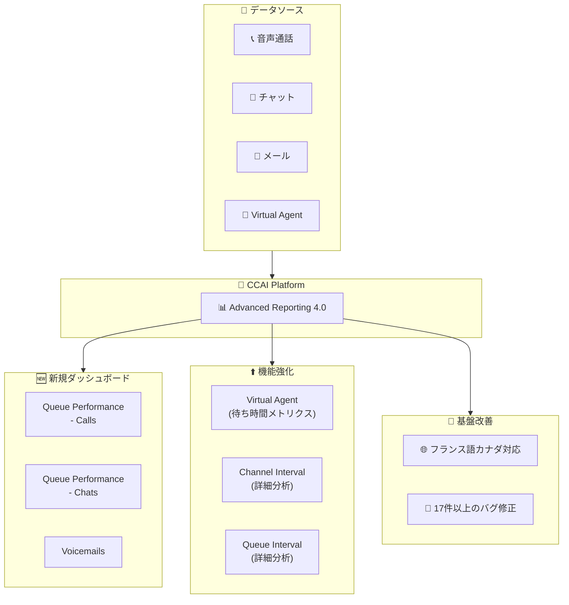

# Google Cloud Contact Center as a Service (CCaaS): Advanced Reporting Dashboards 4.0

**リリース日**: 2026-03-14

**サービス**: Google Cloud Contact Center as a Service (CCaaS) / CCAI Platform

**機能**: Advanced Reporting Dashboards 4.0 - 新ダッシュボード追加、多言語対応、バグ修正

**ステータス**: Feature / Announcement / Fixed

📊 [このアップデートのインフォグラフィックを見る](https://takech9203.github.io/google-cloud-news-summary/20260314-ccaas-advanced-reporting-dashboards-4-0.html)

## 概要

Google Cloud Contact Center as a Service (CCaaS) の Advanced Reporting Dashboards がバージョン 4.0 にアップデートされた。今回のリリースでは、Queue Performance ダッシュボード、Voicemails ダッシュボード、Virtual Agent の待ち時間メトリクスなど複数の新機能が追加されたほか、フランス語 (カナダ) 対応による多言語サポートの拡充、Channel Interval および Queue Interval ダッシュボードの分析機能強化が含まれている。

さらに、Agent Performance ダッシュボードのフィルタ不具合、CSAT ダッシュボードの方向フィルタ問題、時刻フォーマットの表示不整合など、17 件以上のバグ修正が実施されており、レポーティング基盤の信頼性が大幅に向上した。コンタクトセンターの運用管理者、スーパーバイザー、品質管理担当者にとって重要なアップデートである。

**アップデート前の課題**

- キューごとのパフォーマンスメトリクス (通話量、放棄率、対応時間、コールバック、センチメント、CSAT) を一元的に確認する専用ダッシュボードが存在しなかった
- ボイスメールの量、エージェントのアクセス状況、平均応答時間に関するインサイトを得る手段が限定的だった
- Advanced Reporting ダッシュボードがフランス語 (カナダ) に対応しておらず、カナダのフランス語圏ユーザーは英語で利用する必要があった
- Virtual Agent のキュー内待機時間に関するメトリクスが不足していた
- Agent Performance ダッシュボードの Start/End Time フィルタが正しく動作しない場合があった
- 時刻フォーマットフィルタで小数表示と整数表示の不一致が発生していた
- 無効化されたユーザーがダッシュボード上に引き続き表示されていた

**アップデート後の改善**

- Queue Performance - Calls / Chats ダッシュボードにより、キューごとのインタラクション量、放棄率、対応時間、コールバック、センチメント、CSAT を統合的に確認可能になった
- Voicemails ダッシュボードにより、ボイスメールの運用分析が可能になった
- フランス語 (カナダ) 対応により、カナダのフランス語圏ユーザーがネイティブ言語でダッシュボードを利用可能になった
- Virtual Agent ダッシュボードに Total VA In-Queue Interactions、Total VA In-Queue Time、Avg VA In-Queue Time の新タイルが追加された
- 17 件以上のバグ修正により、フィルタ動作、メトリクス計算、フィールド命名の正確性が改善された

## アーキテクチャ図

CCAI Platform の Advanced Reporting 4.0 エコシステムを示す図。音声通話、チャット、メール、Virtual Agent からのデータが CCAI Platform に集約され、新規ダッシュボード、機能強化されたダッシュボード、基盤改善の 3 つのカテゴリに分類されるアップデートが提供される。

## サービスアップデートの詳細

### 新規ダッシュボード

1. **Queue Performance ダッシュボード (Calls / Chats)**
   - キューごとのパフォーマンスメトリクスを提供する新しいダッシュボード
   - キューインタラクション量、放棄数、対応時間 (Handle Time)、コールバック、センチメント、CSAT を一画面で確認可能
   - 通話セッション用 (Queue Performance - Calls) とチャットセッション用 (Queue Performance - Chats) の 2 種類
   - ドキュメント: [Queue Performance dashboards](https://docs.cloud.google.com/contact-center/ccai-platform/docs/dashboards-queue-performance)

2. **Voicemails ダッシュボード**
   - ボイスメールの量、エージェントによるアクセス状況、平均エージェント応答時間に関するインサイトを提供
   - ボイスメール運用の効率化と応答品質の改善に活用可能
   - ドキュメント: [Voicemails dashboard](https://docs.cloud.google.com/contact-center/ccai-platform/docs/dashboards-voicemails)

### 機能強化

3. **Virtual Agent ダッシュボード - 待ち時間メトリクス**
   - 新しいタイルが追加: Total VA In-Queue Interactions、Total VA In-Queue Time、Avg VA In-Queue Time
   - 通話のみに適用される Avg VA In-Queue Time により、Virtual Agent のキュー内待機時間を定量的に把握可能
   - ドキュメント: [Virtual Agent dashboards](https://docs.cloud.google.com/contact-center/ccai-platform/docs/dashboards-virtual-agent)

4. **Queue Interval / Channel Interval ダッシュボードの分析機能改善**
   - バーチャートやデータポイントをクリックすることで、インターバルごとの詳細な履歴メトリクスを確認可能に
   - データのドリルダウン操作により、問題の根本原因の特定が容易になった

5. **フランス語 (カナダ) 対応**
   - Advanced Reporting ダッシュボードがフランス語 (カナダ) で利用可能に
   - インスタンスのロケーションと言語を設定することで有効化
   - ドキュメント: [Configure location and language](https://docs.cloud.google.com/contact-center/ccai-platform/docs/agent-location#configure-location-and-language)

6. **Advanced Reporting Dashboards 4.0 リリース**
   - ダッシュボード基盤のメジャーバージョンアップ (v4.0)
   - 上記すべての新機能と改善を含む統合リリース

### バグ修正 (17 件以上)

7. **フィルタ関連の修正**
   - Agent Performance ダッシュボードの Start/End Time フィルタの不具合修正
   - CSAT ダッシュボードの Direction フィルタの問題修正
   - Time Format フィルタの小数/整数表示不整合の修正
   - Time Format フィルタがダッシュボードに表示されない問題の修正
   - All Interactions for Chats の Location フィルタの修正
   - Failed Interactions の Outbound Phone Numbers フィルタの修正
   - Queue Group Performance の Locations フィルタの修正

8. **メトリクス・データ表示の修正**
   - エージェントエラーによりキューに戻された通話が Queued Calls ダッシュボードに表示されない問題の修正
   - 時刻表示フォーマットの改善 (1 時間未満の場合 HH:MM:SS から MM:SS に変更)
   - Total Failed メトリクスのカウント問題の修正
   - Queue Abandon % タイルが Abandons ダッシュボードに表示されない問題の修正
   - Failed Sessions の Queue Name カラム/フィルタ欠落の修正
   - 無効化されたユーザーがダッシュボードに表示される問題の修正
   - キューなしのアウトバウンドコールが Queue Performance に表示される問題の修正
   - Queue Interactions メトリクスがショートアバンダンを含む問題の修正

9. **パフォーマンス・命名規則の改善**
   - Agent Performance ダッシュボードのパフォーマンス改善
   - Real-time / Queue Group / Email ダッシュボードのフィールド命名改善
   - エージェント設定の日付/タイムスタンプ不正の修正

## 技術仕様

### ダッシュボード一覧と主要メトリクス

| ダッシュボード | 種別 | 主要メトリクス |
|------|------|------|
| Queue Performance - Calls | 新規 | インタラクション量、放棄数、Handle Time、コールバック、センチメント、CSAT |
| Queue Performance - Chats | 新規 | インタラクション量、放棄数、Handle Time、センチメント、CSAT |
| Voicemails | 新規 | ボイスメール量、エージェントアクセス数、平均応答時間 |
| Virtual Agent (強化) | 強化 | Total VA In-Queue Interactions、Total VA In-Queue Time、Avg VA In-Queue Time |
| Channel Interval (強化) | 強化 | インターバルごとの詳細履歴メトリクス (ドリルダウン対応) |
| Queue Interval (強化) | 強化 | インターバルごとの詳細履歴メトリクス (ドリルダウン対応) |

### 利用可能リージョン

Advanced Reporting ダッシュボードは以下のリージョンで利用可能:

| リージョン | ロケーション |
|------|------|
| us-east1 | サウスカロライナ |
| us-central1 | アイオワ |
| us-west1 | オレゴン |
| europe-west2 | ロンドン |
| asia-northeast1 | 東京 |
| northamerica-northeast1 | モントリオール |
| australia-southeast1 | シドニー |

## 設定方法

### 前提条件

1. CCAI Platform インスタンスが上記の対応リージョンに存在すること
2. Advanced Reporting 拡張機能が有効化されていること
3. 適切な IAM 権限が付与されていること

### 手順

#### ステップ 1: Advanced Reporting 拡張機能の有効化

1. Google Cloud コンソールで対象プロジェクトを選択
2. ナビゲーションメニューから **CCAI Platform** をクリック
3. 対象インスタンスをクリックし、**Edit > Configure extensions** を選択
4. **Extensions** で **Advanced reporting** チェックボックスを選択し、**Save** をクリック

注意: Advanced Reporting を有効化すると、レガシーの CCAI Platform ダッシュボードは使用できなくなる。

#### ステップ 2: フランス語 (カナダ) の設定 (必要に応じて)

インスタンスのロケーションと言語設定でフランス語 (カナダ) を選択する。詳細は [Configure location and language](https://docs.cloud.google.com/contact-center/ccai-platform/docs/agent-location#configure-location-and-language) を参照。

#### ステップ 3: 新規ダッシュボードへのアクセス

1. CCAI Platform ポータルで **Dashboard > Advanced Reporting** をクリック
2. Advanced Reporting Landing Page から目的のダッシュボードを選択
3. フィルタ設定を行い、**Update** をクリック

## メリット

### ビジネス面

- **キューパフォーマンスの可視化**: Queue Performance ダッシュボードにより、キューごとのパフォーマンスを詳細に分析でき、SLA 遵守率の改善やスタッフィングの最適化に活用可能
- **ボイスメール管理の効率化**: Voicemails ダッシュボードにより、ボイスメールの応答状況を可視化し、顧客対応の品質向上を実現
- **多言語サポートの拡充**: フランス語 (カナダ) 対応により、カナダのバイリンガルコンタクトセンターでの運用利便性が向上
- **Virtual Agent ROI の定量化**: 待ち時間メトリクスにより、Virtual Agent のキュー内待機時間を把握し、自動応答の効果を定量的に評価可能

### 技術面

- **データドリルダウン機能**: Channel Interval / Queue Interval ダッシュボードでインターバルごとの詳細分析が可能に
- **レポーティングの信頼性向上**: 17 件以上のバグ修正により、フィルタ動作、メトリクス計算、データ表示の正確性が大幅に改善
- **ダッシュボードパフォーマンス改善**: Agent Performance ダッシュボードの応答速度が向上

## デメリット・制約事項

### 制限事項

- Advanced Reporting は上記 7 リージョンでのみ利用可能。対応リージョン外のインスタンスでは Advanced Reporting 拡張機能を有効化できない
- Advanced Reporting を有効化すると、レガシーの CCAI Platform ダッシュボードは利用不可となる (不可逆的な変更)
- ダッシュボードの日付範囲指定は最大 45 日間に制限されている

### 考慮すべき点

- レガシーダッシュボードからの移行計画を事前に策定すること。カスタムレポートやワークフローがレガシーダッシュボードに依存している場合は影響を確認する必要がある
- バージョン 4.0 へのアップグレードに伴い、既存のカスタムダッシュボードや Look の動作確認を推奨

## ユースケース

### ユースケース 1: キューパフォーマンスの最適化

**シナリオ**: コンタクトセンターのスーパーバイザーが、特定のキューで放棄率が高く、顧客満足度が低下している原因を調査したい。

**効果**: Queue Performance ダッシュボードにより、キューごとのインタラクション量、放棄数、平均対応時間、CSAT を一覧で確認し、問題のあるキューを特定。データに基づくスタッフ再配置やルーティング変更により、放棄率の低減と CSAT の向上を実現。

### ユースケース 2: Virtual Agent の効果測定

**シナリオ**: Virtual Agent を導入したが、キュー内での待機時間に与える影響を定量的に把握できていない。

**効果**: Virtual Agent ダッシュボードの新しい待ち時間メトリクス (Total VA In-Queue Interactions、Avg VA In-Queue Time) により、Virtual Agent がキュー内待機時間の削減にどの程度貢献しているかを数値で把握。導入効果の報告や追加投資の判断材料として活用可能。

### ユースケース 3: バイリンガルコンタクトセンターの運用

**シナリオ**: カナダのコンタクトセンターで英語とフランス語の両方で運用しており、フランス語圏のスーパーバイザーがダッシュボードを母国語で利用したい。

**効果**: フランス語 (カナダ) 対応により、フランス語圏のスーパーバイザーやアナリストがネイティブ言語でダッシュボードを操作でき、レポート解釈の正確性と業務効率が向上。

## 料金

CCAI Platform (CCaaS) の料金はサブスクリプションベースで、個別の見積もりが必要となる。Advanced Reporting ダッシュボード自体の追加料金については、公式ドキュメントを参照のこと。

- [CCAI Platform の料金に関する問い合わせ](https://cloud.google.com/contact-center/ccai-platform/docs/get-started)

## 関連サービス・機能

- **Dialogflow CX**: Virtual Agent の構築に使用される会話型 AI プラットフォーム。Virtual Agent ダッシュボードのメトリクスと連携してパフォーマンスを評価
- **Customer Experience Insights (CCAI Insights)**: 自然言語処理を活用したインサイト機能。センチメント分析やコールドライバーの特定に使用され、ダッシュボードの CSAT やセンチメントスコアと補完的な関係
- **Agent Assist**: エージェントのリアルタイム支援機能。Agent Performance ダッシュボードで支援効果を測定可能
- **Gemini Enterprise for CX**: CCAI Platform を含む Google Cloud のコンタクトセンター AI 統合ソリューション

## 参考リンク

- 📊 [インフォグラフィック](https://takech9203.github.io/google-cloud-news-summary/20260314-ccaas-advanced-reporting-dashboards-4-0.html)
- [公式リリースノート](https://docs.cloud.google.com/release-notes#March_14_2026)
- [Advanced Reporting Dashboards 概要](https://docs.cloud.google.com/contact-center/ccai-platform/docs/dashboards-overview)
- [Queue Performance ダッシュボード](https://docs.cloud.google.com/contact-center/ccai-platform/docs/dashboards-queue-performance)
- [Voicemails ダッシュボード](https://docs.cloud.google.com/contact-center/ccai-platform/docs/dashboards-voicemails)
- [Virtual Agent ダッシュボード](https://docs.cloud.google.com/contact-center/ccai-platform/docs/dashboards-virtual-agent)
- [ロケーションと言語の設定](https://docs.cloud.google.com/contact-center/ccai-platform/docs/agent-location#configure-location-and-language)
- [Advanced Capabilities](https://docs.cloud.google.com/contact-center/ccai-platform/docs/dashboards-advanced-capabilities)
- [CCAI Platform 概要](https://docs.cloud.google.com/contact-center/ccai-platform/docs)

## まとめ

Advanced Reporting Dashboards 4.0 は、Queue Performance、Voicemails、Virtual Agent 待ち時間メトリクスなどの新機能追加と、17 件以上のバグ修正を含む包括的なアップデートである。コンタクトセンターの運用可視化とデータドリブンな意思決定を強化するものであり、CCAI Platform を利用しているすべての組織で早期の適用を推奨する。特に、キューパフォーマンスの最適化や Virtual Agent の効果測定に課題を感じている場合は、新規ダッシュボードの活用を検討すべきである。

---

**タグ**: #GoogleCloud #CCaaS #CCAIPlatform #ContactCenter #AdvancedReporting #Dashboard #VirtualAgent #QueuePerformance #Voicemails #BugFix
