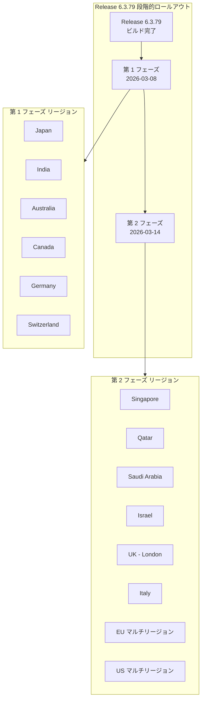

# Google SecOps SOAR: Release 6.3.79 が全リージョンで利用可能に

**リリース日**: 2026-03-14

**サービス**: Google SecOps SOAR (Security Orchestration, Automation and Response)

**機能**: Release 6.3.79 の全リージョン展開完了

**ステータス**: Available (全リージョン)

[このアップデートのインフォグラフィックを見る](https://takech9203.github.io/google-cloud-news-summary/20260314-google-secops-soar-release-6-3-79.html)

## 概要

Google SecOps SOAR の Release 6.3.79 が全リージョンで利用可能となった。本リリースは 2026 年 3 月 8 日に第 1 フェーズのリージョン (日本、インド、オーストラリア、カナダ、ドイツ、スイス) への展開が開始され、2026 年 3 月 14 日に第 2 フェーズのリージョン (シンガポール、カタール、サウジアラビア、イスラエル、英国、イタリア、EU マルチリージョン、US マルチリージョン) への展開が完了した。

本リリースには、内部およびカスタマー向けのバグ修正が含まれている。個別のバグ修正の詳細は公開されていないが、プラットフォームの安定性と信頼性の向上を目的とした継続的なメンテナンスリリースである。

本アップデートの対象は、Google SecOps SOAR をスタンドアロンプラットフォームとして利用しているユーザー、および Google SecOps 統合プラットフォーム内の SOAR コンポーネントを利用しているユーザーの両方である。

## アーキテクチャ図

Google SecOps SOAR のリリースは 2 段階のロールアウトプロセスを経て全リージョンに展開される。第 1 フェーズで先行リージョンに適用し、問題がないことを確認した後、約 1 週間後に第 2 フェーズの残りリージョンへ展開される。

## サービスアップデートの詳細

### 主要内容

1. **内部バグ修正**
   - Google SecOps SOAR プラットフォームの内部コンポーネントに対するバグ修正が含まれている
   - プラットフォームの安定性と信頼性の向上に寄与する

2. **カスタマー向けバグ修正**
   - カスタマーから報告された問題に対する修正が含まれている
   - 個別のバグ修正 ID や詳細は本リリースノートでは公開されていない

3. **段階的ロールアウトの完了**
   - 第 1 フェーズ (2026-03-08): 日本、インド、オーストラリア、カナダ、ドイツ、スイス
   - 第 2 フェーズ (2026-03-14): シンガポール、カタール、サウジアラビア、イスラエル、英国、イタリア、EU マルチリージョン、US マルチリージョン

## 技術仕様

### リリース情報

| 項目 | 詳細 |
|------|------|
| リリースバージョン | 6.3.79 |
| 第 1 フェーズ展開日 | 2026-03-08 |
| 全リージョン展開日 | 2026-03-14 |
| リリース内容 | 内部およびカスタマー向けバグ修正 |
| メンテナンスウィンドウ | 毎週日曜日 11:00 - 15:00 UTC |

### 段階的ロールアウトのリージョン構成

| フェーズ | リージョン |
|----------|-----------|
| 第 1 フェーズ | Japan, India, Australia, Canada, Germany, Switzerland |
| 第 2 フェーズ | Singapore, Qatar, Saudi Arabia, Israel, UK (London), Italy, EU (multi-region), US (multi-region) |

### バージョン確認方法

現在のプラットフォームバージョンは、SOAR プラットフォームの「Settings > License」ページで確認できる。

## メリット

### ビジネス面

- **プラットフォーム安定性の向上**: バグ修正により、セキュリティオペレーションの信頼性が向上し、SOC チームの業務効率が改善される
- **段階的ロールアウトによるリスク低減**: 2 段階のロールアウトプロセスにより、全リージョンに一斉展開する場合と比較して、問題が発生した際の影響範囲を限定できる

### 技術面

- **継続的なプラットフォーム改善**: 定期的なバグ修正リリースにより、既知の問題が迅速に解決され、プラットフォームの品質が維持される
- **全リージョン統一バージョン**: 全リージョンで同一バージョンが展開されることにより、リージョン間でのバージョン不整合が解消される

## デメリット・制約事項

### 考慮すべき点

- 本リリースはバグ修正が中心であり、新機能の追加は含まれていない。新機能を期待しているユーザーは今後のリリースを確認されたい
- 段階的ロールアウトの特性上、第 1 フェーズと第 2 フェーズのリージョン間で約 1 週間のバージョン差異が発生する。マルチリージョンで運用している場合は、この期間中のバージョン差異を考慮する必要がある
- メンテナンスウィンドウ (毎週日曜日 11:00 - 15:00 UTC) は必ずしもサービス停止を伴うわけではないが、この時間帯に更新が適用される可能性がある

## 利用可能リージョン

Release 6.3.79 は 2026 年 3 月 14 日時点で以下の全リージョンに展開済みである。

| フェーズ | リージョン | 展開日 |
|----------|-----------|--------|
| 第 1 フェーズ | Japan | 2026-03-08 |
| 第 1 フェーズ | India | 2026-03-08 |
| 第 1 フェーズ | Australia | 2026-03-08 |
| 第 1 フェーズ | Canada | 2026-03-08 |
| 第 1 フェーズ | Germany | 2026-03-08 |
| 第 1 フェーズ | Switzerland | 2026-03-08 |
| 第 2 フェーズ | Singapore | 2026-03-14 |
| 第 2 フェーズ | Qatar | 2026-03-14 |
| 第 2 フェーズ | Saudi Arabia | 2026-03-14 |
| 第 2 フェーズ | Israel | 2026-03-14 |
| 第 2 フェーズ | UK (London) | 2026-03-14 |
| 第 2 フェーズ | Italy | 2026-03-14 |
| 第 2 フェーズ | EU (multi-region) | 2026-03-14 |
| 第 2 フェーズ | US (multi-region) | 2026-03-14 |

## 料金

Google SecOps SOAR のリリースアップデートに伴う追加費用は発生しない。Google SecOps の料金体系はサブスクリプションベースのモデルであり、Standard、Enterprise、Enterprise Plus の 3 つのパッケージが提供されている。料金はデータ取り込み量に基づいて設定される。

Google SecOps SOAR をスタンドアロン製品として購入している場合は、Google Cloud Billing プラットフォームではなく、サービスオーダーフォームに記載のメールアドレス経由で請求書が送付される。詳細は Google アカウントチームに確認されたい。

## 関連サービス・機能

- **Google SecOps SIEM**: SOAR と統合されたセキュリティ情報イベント管理プラットフォーム。脅威の検出、調査、対応の統合ワークフローを提供
- **Google SecOps Marketplace**: SOAR プラットフォームで利用可能なインテグレーションやプレイブックのマーケットプレイス
- **Remote Agent**: オンプレミスやプライベートネットワーク内のリソースと SOAR プラットフォームを接続するエージェント。高可用性デプロイメントもサポート
- **Gemini によるプレイブック作成**: 生成 AI を活用して SOAR プレイブックを自動作成する機能 (GA)

## 参考リンク

- [インフォグラフィック](https://takech9203.github.io/google-cloud-news-summary/20260314-google-secops-soar-release-6-3-79.html)
- [公式リリースノート](https://docs.cloud.google.com/release-notes#March_14_2026)
- [Google SecOps SOAR リリースノート](https://cloud.google.com/chronicle/docs/soar/release-notes)
- [段階的ロールアウトのリージョン構成](https://cloud.google.com/chronicle/docs/soar/overview-and-introduction/soar-gradual-release)
- [Google SecOps 料金体系](https://cloud.google.com/chronicle/docs/onboard/understand-billing)
- [Google SecOps パッケージ](https://cloud.google.com/chronicle/docs/secops/secops-packages)

## まとめ

Google SecOps SOAR Release 6.3.79 は、内部およびカスタマー向けバグ修正を含むメンテナンスリリースであり、2026 年 3 月 14 日に全リージョンへの展開が完了した。新機能の追加はないが、プラットフォームの安定性と信頼性の向上に寄与するアップデートである。SOAR プラットフォームを利用しているユーザーは、「Settings > License」ページでバージョンが 6.3.79 に更新されていることを確認されたい。

---

**タグ**: #GoogleSecOps #SOAR #Release6379 #バグ修正 #セキュリティオペレーション #段階的ロールアウト #Chronicle
