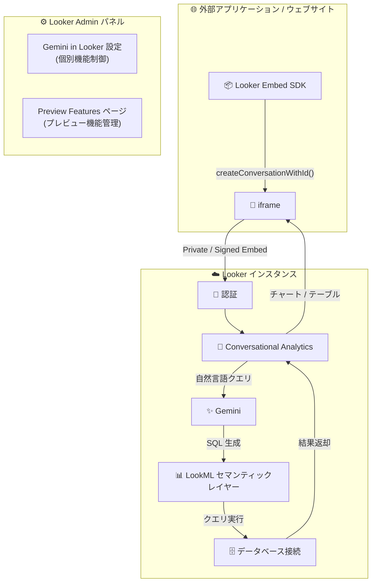

# Looker: 26.4 リリース - Embed Conversational Analytics GA、Gemini 管理画面リデザイン、Preview Features ページ

**リリース日**: 2026-03-14

**サービス**: Looker

**機能**: Looker 26.4 Release - Embed Conversational Analytics GA, Gemini Admin Redesign, Preview Features Page

**ステータス**: Feature / Breaking / Fixed

📊 [このアップデートのインフォグラフィックを見る](https://takech9203.github.io/google-cloud-news-summary/20260314-looker-26-4-release.html)

## 概要

Looker 26.4 は、埋め込み Conversational Analytics の一般提供 (GA)、Gemini in Looker 管理ページのリデザイン、Looker (Google Cloud core) 向け Preview Features ページの追加、およびセキュリティに関する破壊的変更とバグ修正を含む包括的なリリースである。Looker (Google Cloud core) へのデプロイは 2026 年 3 月 16 日 (月) に開始され、最終デプロイは 2026 年 3 月 23 日 (月) に予定されている。

Embed Conversational Analytics の GA は、Gemini を活用した自然言語によるデータ分析機能を外部アプリケーションやウェブサイトに埋め込むことを正式にサポートするものであり、Looker のエコシステムにおける AI 分析の展開を大きく前進させる。管理者向けには、Gemini 機能の個別制御と Preview Features の段階的な有効化が可能になり、組織のガバナンス要件に応じた柔軟な導入が実現する。

**アップデート前の課題**

- Embed Conversational Analytics は Preview 段階であり、Looker (Google Cloud core) では利用できなかった
- Embed SDK が Conversational Analytics の埋め込みに対応しておらず、署名付き埋め込み URL を手動でコーディングする必要があった
- 埋め込み時のテーマ適用がサポートされていなかった
- Gemini in Looker の機能は一括で有効/無効を切り替える必要があり、個別の機能制御ができなかった
- Looker (Google Cloud core) では Preview Features ページが利用できず、プレビュー機能の管理が制限されていた

**アップデート後の改善**

- Embed Conversational Analytics が GA となり、本番環境での利用が正式にサポートされた
- Looker (Google Cloud core) での埋め込み Conversational Analytics が利用可能になった
- Embed SDK が Conversational Analytics をサポートし、プログラマティックな埋め込みが容易になった
- 埋め込みテーマの General オプションが部分的にサポートされた
- Gemini in Looker の各機能 (Conversational Analytics、Looker Assistants、Code Interpreter など) を個別に有効/無効にできるようになった
- Looker (Google Cloud core) で Preview Features ページが利用可能になり、Access Content Certification、Granular Dashboard Sizing、Internal Dashboard Theming、Tile Download Default Options の 4 機能を管理できるようになった

## アーキテクチャ図



Looker Embed SDK または iframe を使用して外部アプリケーションに Conversational Analytics を埋め込むアーキテクチャを示す。ユーザーの自然言語クエリは Gemini を介して LookML セマンティックレイヤーで SQL に変換され、データベースから結果が返却される。

## サービスアップデートの詳細

### 主要機能

1. **Embed Conversational Analytics の一般提供 (GA)**
   - Conversational Analytics を HTML iframe タグを使用してウェブサイトやアプリケーションに埋め込み可能
   - Looker (Google Cloud core) での埋め込みが新たにサポートされた (Preview 段階では Looker (original) のみ対応)
   - Looker Embed SDK が Conversational Analytics をサポートし、`createConversationWithId()` などのプログラマティックな制御が可能に
   - 埋め込みテーマの General オプション (背景色、フォントなど) が部分的にサポートされた
   - Private Embedding (Looker ログインによる認証) と Signed Embedding (アプリケーション側の認証) の両方に対応
   - Conversational Analytics API エンドポイントが Looker API に追加され、エージェント、会話、メッセージの作成・管理が可能に

2. **Gemini in Looker 管理ページのリデザイン**
   - Admin パネルの Gemini in Looker ページが刷新され、個別の機能トグルで Gemini 機能を選択的に有効化可能
   - Looker (Google Cloud core) と Looker (original) の両方で利用可能
   - GA 機能: Conversational Analytics、Looker Assistants (Visualization Assistant)
   - Trusted Tester 機能: Code Interpreter、Explore NL Summary
   - Trusted Tester Data Use の同意設定も個別に管理可能

3. **Preview Features ページ (Looker (Google Cloud core))**
   - Admin パネルの General セクションに Preview Features ページが追加
   - トグルスイッチによる簡単な有効化/無効化
   - 利用可能なプレビュー機能:
     - **Access Content Certification**: ダッシュボード、Look、セルフサービス Explore のコンテンツ認証機能
     - **Granular Dashboard Sizing**: ダッシュボードタイルの詳細なサイズ・レイアウト調整 (デフォルト有効)
     - **Internal Dashboard Theming**: 内部ダッシュボードへのテーマ適用 (デフォルト有効)
     - **Tile Download Default Options**: ダッシュボードタイルダウンロード時のデフォルト行数・列数制限の設定
   - Labs カテゴリの機能は Looker (Google Cloud core) では利用不可

4. **破壊的変更: プロジェクトレベルのローカル Git フック廃止**
   - セキュリティ上の理由により、プロジェクトレベルのローカル Git フックがサポート対象外に
   - Looker ホスト型インスタンスには影響なし
   - カスタマーホスト型インスタンスでは Git 設定によって影響を受ける可能性あり

5. **バグ修正**
   - ClickHouse 接続を使用するダッシュボードが `ClassCastException` エラーで読み込みに失敗する問題を修正
   - カンマ区切りの否定フィルタがフィルタ UI で OR ロジックとして誤って解釈される問題を修正

## 技術仕様

### Embed Conversational Analytics

| 項目 | 詳細 |
|------|------|
| ステータス | 一般提供 (GA) |
| 対応プラットフォーム | Looker (Google Cloud core)、Looker (original) |
| 埋め込み方式 | Private Embedding、Signed Embedding |
| Embed SDK サポート | 対応 (26.4 以降) |
| テーマサポート | 部分的 (General オプションのみ) |
| 必要な権限 | `chat_with_explore` など Conversational Analytics 関連権限 |
| API エンドポイント | ConversationalAnalytics (エージェント、会話、メッセージの CRUD) |

### デプロイスケジュール

| プラットフォーム | デプロイ開始 | 最終デプロイ |
|-----------------|------------|-------------|
| Looker (original) | 2026 年 3 月 8 日 (日) | 2026 年 3 月 19 日 (木) |
| Looker (Google Cloud core) | 2026 年 3 月 16 日 (月) | 2026 年 3 月 23 日 (月) |

### Embed URL の構成

```
# 会話ページの埋め込み URL
https://<instance>.looker.com/embed/conversations

# エージェントページの埋め込み URL
https://<instance>.looker.com/embed/agents

# 特定の会話の埋め込み URL
https://<instance>.looker.com/embed/conversations/<conversation_id>
```

## 設定方法

### 前提条件

1. Looker 26.4 以降がデプロイされていること
2. Looker Admin 権限を持つユーザーであること
3. 埋め込みを利用する場合は、Admin > Platform Embed で Embed Authentication が有効化されていること

### 手順

#### ステップ 1: Gemini in Looker 機能の個別有効化

Admin パネル > Platform > Gemini in Looker ページで以下を設定:

1. **Enable Gemini in Looker** を有効化
2. 必要な GA 機能のトグルを有効化:
   - **Conversational Analytics**: 自然言語データ分析
   - **Looker Assistants**: Visualization Assistant
3. (任意) **Enable Trusted Tester Features** で Preview 機能を有効化:
   - **Code Interpreter**: Python による高度な分析
   - **Explore NL Summary**: Explore の AI 要約

#### ステップ 2: Conversational Analytics の埋め込み (Embed SDK 利用)

```javascript
// Embed SDK の初期化
import { LookerEmbedSDK } from '@looker/embed-sdk'

LookerEmbedSDK.init('your-instance.looker.com', '/auth')

// Conversational Analytics の埋め込み
LookerEmbedSDK.createConversationWithId('conversation_id')
  .appendTo('#conversation-container')
  .on('conversation:message', (event) => {
    console.log('New message:', event)
  })
  .build()
  .connect()
```

#### ステップ 3: Preview Features の有効化 (Looker (Google Cloud core))

Admin パネル > General > Preview Features ページで必要な機能のトグルを有効化する。

## メリット

### ビジネス面

- **セルフサービス BI の拡大**: Conversational Analytics を外部アプリケーションに埋め込むことで、技術的な知識がないビジネスユーザーでも自然言語でデータ分析が可能になり、データドリブンな意思決定が加速する
- **ガバナンスとセキュリティの両立**: Gemini 機能の個別制御により、組織のコンプライアンス要件に応じた段階的な AI 機能の導入が可能になる
- **顧客向けアプリケーションの差別化**: 埋め込み分析により、SaaS プロダクトやポータルサイトに AI データ分析機能を組み込み、製品の付加価値を向上できる

### 技術面

- **Embed SDK サポート**: プログラマティックな制御が可能になり、イベントハンドリングやカスタマイズが容易になった
- **Looker (Google Cloud core) 対応**: マネージドサービスでの利用が可能になり、インフラ管理の負担が軽減される
- **API エンドポイント追加**: Conversational Analytics をアプリケーションのワークフローに深く統合できる
- **Preview Features の段階的導入**: Granular Dashboard Sizing や Internal Dashboard Theming などの機能を検証環境で事前にテストできる

## デメリット・制約事項

### 制限事項

- 埋め込みテーマは General オプション (背景色、フォントなど) のみサポートされ、その他のテーマオプション (チャート色、軸スタイルなど) は非対応
- Conversational Analytics は FedRAMP High/Medium の認証境界には含まれていない
- Labs カテゴリのプレビュー機能は Looker (Google Cloud core) では利用不可
- Gemini の出力は事実と異なる情報を含む可能性があり、使用前の検証が推奨される

### 考慮すべき点

- **破壊的変更への対応**: カスタマーホスト型インスタンスでプロジェクトレベルのローカル Git フックを使用している場合、26.4 へのアップグレード前に代替手段への移行が必要
- **SDK アップグレード推奨**: Looker SDK バージョン 26.4 以降へのアップグレードが推奨される。今後 26.18 リリース (2026 年 10 月) で API 認証情報の URL クエリパラメータ渡しが廃止予定
- **権限管理**: Conversational Analytics を埋め込みユーザーに提供する場合、`chat_with_explore` などの適切な権限付与が必要
- **データガバナンス**: Gemini for Google Cloud のデータ処理ポリシーを確認し、組織の要件との整合性を検証すること

## ユースケース

### ユースケース 1: SaaS プロダクトへの AI データ分析機能の組み込み

**シナリオ**: B2B SaaS 企業が自社プロダクトに Looker の Conversational Analytics を埋め込み、顧客がダッシュボードデータについて自然言語で質問できる機能を提供する。

**実装例**:
```html
<iframe
  src="https://my-instance.looker.com/embed/agents/agent_id"
  width="100%"
  height="600"
  frameborder="0">
</iframe>
```

**効果**: 顧客のデータリテラシーに依存せず、誰でも自然言語でビジネスデータにアクセスできるようになり、プロダクトの利用率と顧客満足度が向上する。

### ユースケース 2: 段階的な Gemini 機能導入

**シナリオ**: 大規模企業の Looker 管理者が、まず Conversational Analytics のみを限定的なユーザーグループに有効化し、ガバナンスとセキュリティの検証後に Code Interpreter などの Trusted Tester 機能を展開する。

**効果**: リスクを最小化しながら AI 分析機能を段階的に導入でき、各機能の影響を個別に評価できる。

## 料金

Looker の料金は Looker のエディション (Standard、Enterprise、Embed) に基づく。Gemini in Looker 機能の料金については、Preview 期間中は追加費用なしで利用可能だが、Preview 期間終了後は追加料金が必要になる可能性がある。

詳細は [Looker 料金ページ](https://cloud.google.com/looker/pricing) を参照。

## 関連サービス・機能

- **Gemini for Google Cloud**: Conversational Analytics の基盤となる AI モデルを提供。データガバナンスポリシーに従ってデータが処理される
- **Looker Studio Pro**: Conversational Analytics は Looker Studio からも利用可能。Looker Studio Pro ライセンスが必要
- **LookML**: Conversational Analytics が基盤とするセマンティックモデリングレイヤー。LookML の品質が分析精度に直結する
- **AlloyDB for PostgreSQL**: Looker 26.4 で AlloyDB 接続の完全サポートが Preview として追加された
- **Looker API**: Conversational Analytics エンドポイントが追加され、プログラマティックなエージェント・会話管理が可能に

## 参考リンク

- 📊 [インフォグラフィック](https://takech9203.github.io/google-cloud-news-summary/20260314-looker-26-4-release.html)
- [公式リリースノート](https://docs.cloud.google.com/release-notes#March_14_2026)
- [Embed Conversational Analytics ドキュメント](https://cloud.google.com/looker/docs/conversational-analytics-looker-embedding)
- [Conversational Analytics 概要](https://cloud.google.com/looker/docs/conversational-analytics-overview)
- [Gemini in Looker 管理設定 (Looker (original))](https://cloud.google.com/looker/docs/admin-panel-platform-gil)
- [Gemini in Looker 管理設定 (Looker (Google Cloud core))](https://cloud.google.com/looker/docs/looker-core-admin-gemini)
- [Preview Features ページ](https://cloud.google.com/looker/docs/admin-panel-general-preview-features)
- [Embed SDK ドキュメント](https://cloud.google.com/looker/docs/embed-sdk-intro)
- [Conversational Analytics API ベストプラクティス](https://cloud.google.com/looker/docs/best-practices/ca-apis-in-looker-api-best-practices)
- [料金ページ](https://cloud.google.com/looker/pricing)

## まとめ

Looker 26.4 は、Embed Conversational Analytics の GA による AI 分析の埋め込み正式サポート、Gemini 機能の個別制御、Preview Features ページの Looker (Google Cloud core) 対応という 3 つの柱で構成される重要なリリースである。特に、Embed SDK サポートと Looker (Google Cloud core) 対応により、マネージド環境でのプログラマティックな AI 分析埋め込みが実現し、SaaS プロダクトや社内ポータルへの展開が大幅に容易になった。カスタマーホスト型インスタンスを運用している場合は、プロジェクトレベルの Git フック廃止に伴う影響確認と、SDK バージョン 26.4 以降へのアップグレードを推奨する。

---

**タグ**: #Looker #ConversationalAnalytics #Gemini #EmbedSDK #GA #BreakingChange #PreviewFeatures #LookerGoogleCloudCore #AI #BI
