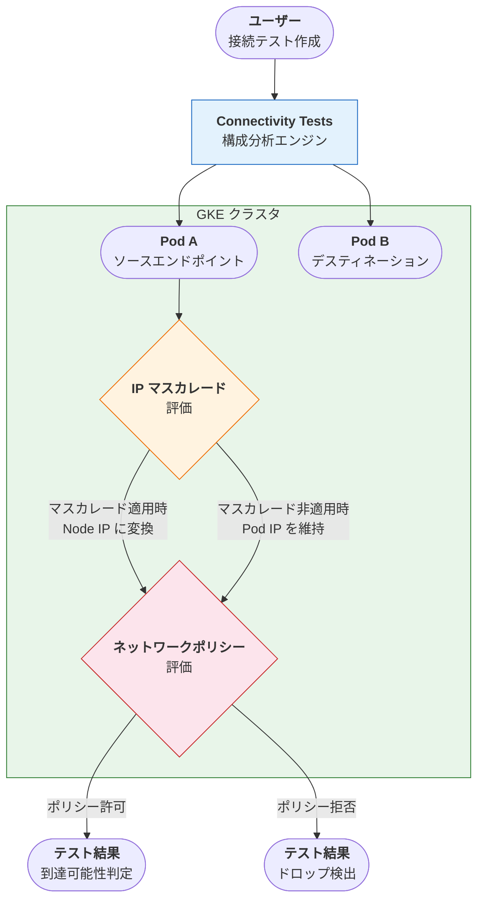

# Network Intelligence Center: Connectivity Tests - GKE Pod エンドポイント、IP マスカレード、ネットワークポリシー評価

**リリース日**: 2026-03-14

**サービス**: Network Intelligence Center

**機能**: Connectivity Tests - GKE Pod endpoint, IP masquerading, Network policy evaluation

**ステータス**: Feature

📊 [このアップデートのインフォグラフィックを見る](https://takech9203.github.io/google-cloud-news-summary/20260314-network-intelligence-center-connectivity-tests-gke-pod.html)

## 概要

Network Intelligence Center の Connectivity Tests に、Google Kubernetes Engine (GKE) Pod に関連する 3 つの新機能が追加された。GKE Pod をエンドポイントとして指定できるようになったほか、IP マスカレードの評価およびネットワークポリシーの評価が可能になった。

これにより、GKE 環境におけるネットワーク接続性のトラブルシューティングが大幅に強化される。従来は GKE ノードやコントロールプレーンレベルでの接続テストに限定されていたが、今回のアップデートで Pod レベルの粒度でネットワーク経路の診断が可能になった。Kubernetes のネットワーク設定に起因する問題を、インフラストラクチャ層から Pod 層まで一貫して検証できるようになる。

**アップデート前の課題**

- Connectivity Tests で GKE Pod を直接エンドポイントとして指定できなかったため、Pod 間の接続性テストには IP アドレスの手動指定が必要だった
- IP マスカレード (SNAT) がトラフィックに適用されるかどうかを Connectivity Tests で評価できず、マスカレード後のアドレスに基づくテストができなかった
- GKE ネットワークポリシーによるトラフィック制御の影響を Connectivity Tests で確認できなかったため、ポリシー起因の接続問題の特定が困難だった

**アップデート後の改善**

- GKE Pod をソースまたはデスティネーションのエンドポイントとして直接指定して接続テストを実行できるようになった
- IP マスカレードの適用有無を自動評価し、マスカレードが適用される場合は変換後のアドレスを使用してテストが実行される
- FQDN ネットワークポリシーが有効でない GKE クラスタにおいて、Pod エンドポイントに適用される GKE ネットワークポリシーが評価されるようになった

## アーキテクチャ図

Connectivity Tests が GKE Pod エンドポイントからのトラフィックに対して、IP マスカレードの適用可否を評価し、その後ネットワークポリシーの評価を行うフローを示している。

## サービスアップデートの詳細

### 主要機能

1. **GKE Pod エンドポイントのサポート**
   - GKE Pod をソースまたはデスティネーションのエンドポイントとして接続テストに指定可能
   - Pod 間、Pod と外部リソース間の接続性を直接テストできる
   - 従来サポートされていた GKE ノードやコントロールプレーンに加え、Pod レベルの粒度でテスト可能

2. **IP マスカレード評価**
   - GKE Pod エンドポイントから送信されるトラフィックに IP マスカレード (SNAT) が適用されるかどうかを自動的に評価
   - IP マスカレードが適用される場合、変換後のアドレス (ノード IP) を使用してテストが実行される
   - ip-masq-agent の設定に基づいた正確なパス分析が可能

3. **ネットワークポリシー評価**
   - FQDN ネットワークポリシーが有効でない GKE クラスタにおいて、GKE ネットワークポリシーの影響を評価
   - Pod エンドポイントに適用されるネットワークポリシーのルールに基づいてトラフィックの許可・拒否を判定
   - ネットワークポリシーによるトラフィック制御の問題を事前に特定可能

## 技術仕様

### エンドポイントタイプの対応状況

| エンドポイント種別 | ソース | デスティネーション |
|---|---|---|
| GKE Pod | 対応 | 対応 |
| GKE コントロールプレーン | 対応 | 対応 |
| Compute Engine インスタンス | 対応 | 対応 |
| Cloud SQL インスタンス | 対応 | 対応 |
| Cloud Run リビジョン | 対応 | - |
| ロードバランサ | - | 対応 |

### IP マスカレード評価の動作

| クラスタ構成 | SNAT 動作 |
|---|---|
| ip-masq-agent あり + カスタム nonMasqueradeCIDRs | nonMasqueradeCIDRs 以外の宛先で Pod IP をノード IP に変換 |
| ip-masq-agent あり + nonMasqueradeCIDRs なし | デフォルト非マスカレード宛先以外でノード IP に変換 |
| ip-masq-agent なし + --disable-default-snat なし | デフォルト非マスカレード宛先以外でノード IP に変換 |
| ip-masq-agent なし + --disable-default-snat あり | すべての宛先で Pod IP を維持 |

### 制約事項

- ネットワークポリシー評価は FQDN ネットワークポリシーが有効でないクラスタに限定される
- GKE ネットワークポリシーと IP マスカレードの評価には Pod をエンドポイントとして指定する必要がある (GKE サービス経由のテストでは評価されない)
- Cloud Load Balancing 経由で GKE サービスへの接続テストはサポートされるが、その場合ネットワークポリシーと IP マスカレードの評価は行われない

## 設定方法

### 前提条件

1. Network Intelligence Center API が有効化されていること
2. `networkmanagement.connectivitytests.create` 権限を持つ IAM ロールが付与されていること
3. テスト対象の GKE クラスタが存在すること

### 手順

#### ステップ 1: Google Cloud コンソールから接続テストを作成

Google Cloud コンソールの [Connectivity Tests ページ](https://console.cloud.google.com/net-intelligence/connectivity/tests/list) にアクセスし、「Create Connectivity Test」を選択する。

#### ステップ 2: ソースエンドポイントに GKE Pod を指定

ソースエンドポイントメニューで GKE Pod を選択し、対象のクラスタと Pod を指定する。

#### ステップ 3: デスティネーションエンドポイントを指定

デスティネーションには GKE Pod、VM インスタンス、IP アドレスなど任意のサポート対象エンドポイントを指定する。

#### ステップ 4: テスト実行と結果確認

テストを実行すると、IP マスカレードの適用有無やネットワークポリシーの評価結果を含む詳細なトレース結果が表示される。

## メリット

### ビジネス面

- **トラブルシューティング時間の短縮**: Pod レベルのネットワーク問題を迅速に特定でき、障害対応時間を短縮できる
- **運用コストの削減**: 手動でのネットワーク経路確認やパケットキャプチャの必要性が減少する

### 技術面

- **Pod レベルの可視性**: GKE 環境のネットワーク経路を Pod 粒度で診断可能になり、Kubernetes 固有のネットワーク問題を特定しやすくなる
- **IP マスカレードの考慮**: SNAT が適用される環境で実際のトラフィック経路を正確にシミュレーションできる
- **ネットワークポリシーの事前検証**: デプロイ後のネットワークポリシーの影響を接続テストで確認でき、設定ミスを早期に発見できる

## デメリット・制約事項

### 制限事項

- FQDN ネットワークポリシーが有効なクラスタではネットワークポリシーの評価がサポートされない
- GKE ネットワークポリシーと IP マスカレードの評価には Pod を直接エンドポイントとして指定する必要があり、Cloud Load Balancing 経由のテストでは評価されない
- Google Cloud Armor ポリシーは外部 Application Load Balancer IP アドレスへのテストでは考慮されない

### 考慮すべき点

- IP マスカレードの設定 (ip-masq-agent の ConfigMap) がクラスタの Pod CIDR 範囲を正しくカバーしているかを事前に確認すること
- ネットワークポリシーのテスト結果は構成分析に基づくものであり、実際のデータプレーン動作と異なる場合がある

## ユースケース

### ユースケース 1: マイクロサービス間の接続性検証

**シナリオ**: マイクロサービスアーキテクチャで、フロントエンド Pod からバックエンド API Pod への接続が失敗している場合に、ネットワークポリシーが原因かどうかを特定する。

**効果**: Connectivity Tests でソースにフロントエンド Pod、デスティネーションにバックエンド Pod を指定してテストを実行することで、ネットワークポリシーによるブロックを即座に検出できる。

### ユースケース 2: IP マスカレード設定の検証

**シナリオ**: GKE Pod から外部サービスへの通信時に、IP マスカレードが正しく適用されているかを確認する。ファイアウォールルールがノード IP に基づいて設定されている環境で、Pod からの通信が期待通りにマスカレードされるかを事前検証する。

**効果**: テスト結果で IP マスカレードの適用有無と変換後のアドレスが確認でき、ファイアウォールルールとの整合性を検証できる。

### ユースケース 3: ネットワークポリシー導入時の影響評価

**シナリオ**: 既存の GKE クラスタに新しいネットワークポリシーを導入する際に、既存の Pod 間通信への影響を事前に評価する。

**効果**: ポリシー適用後に各 Pod 間の接続テストを実行することで、意図しないトラフィックのブロックを早期に検出できる。

## 料金

Network Intelligence Center の Connectivity Tests の料金については、[Network Intelligence Center の料金ページ](https://cloud.google.com/network-intelligence-center/pricing)を参照。Connectivity Tests の構成分析テストは、テスト数に基づいて課金される。

## 関連サービス・機能

- **Google Kubernetes Engine (GKE)**: テスト対象となるコンテナオーケストレーション基盤。Pod、ネットワークポリシー、IP マスカレードの設定元
- **Network Analyzer**: VPC ネットワーク構成の自動監視とミスコンフィグレーション検出。GKE IP マスカレード設定に関するインサイトも提供
- **Network Topology**: GKE Enterprise ビューでクラスタ、Namespace、ワークロード、Pod のトポロジーを可視化
- **VPC ファイアウォールルール**: Connectivity Tests で評価されるファイアウォール設定。ネットワークポリシーと併せて接続性に影響
- **Cloud Monitoring**: GKE ネットワークメトリクスの監視。Connectivity Tests の結果と組み合わせた運用が効果的

## 参考リンク

- 📊 [インフォグラフィック](https://takech9203.github.io/google-cloud-news-summary/20260314-network-intelligence-center-connectivity-tests-gke-pod.html)
- [公式リリースノート](https://docs.cloud.google.com/release-notes#March_14_2026)
- [Connectivity Tests 概要](https://cloud.google.com/network-intelligence-center/docs/connectivity-tests/concepts/overview)
- [GKE に関する考慮事項](https://cloud.google.com/network-intelligence-center/docs/connectivity-tests/concepts/overview#gke-supported-features)
- [GKE IP マスカレードエージェント](https://cloud.google.com/kubernetes-engine/docs/concepts/ip-masquerade-agent)
- [GKE ネットワークポリシー](https://cloud.google.com/kubernetes-engine/docs/how-to/network-policy)
- [Connectivity Tests の作成と実行](https://cloud.google.com/network-intelligence-center/docs/connectivity-tests/how-to/running-connectivity-tests)
- [Network Intelligence Center の料金](https://cloud.google.com/network-intelligence-center/pricing)

## まとめ

今回のアップデートにより、Connectivity Tests で GKE Pod をエンドポイントとして直接指定できるようになり、IP マスカレードとネットワークポリシーの評価も自動で行われるようになった。GKE 環境のネットワークトラブルシューティングが大幅に効率化されるため、Kubernetes ワークロードを運用しているチームは積極的に活用すべき機能である。特にマイクロサービスアーキテクチャやネットワークポリシーを導入している環境では、接続性の事前検証ツールとして有用である。

---

**タグ**: Network Intelligence Center, Connectivity Tests, GKE, Google Kubernetes Engine, Pod, IP masquerading, Network Policy, ネットワーク診断, トラブルシューティング
