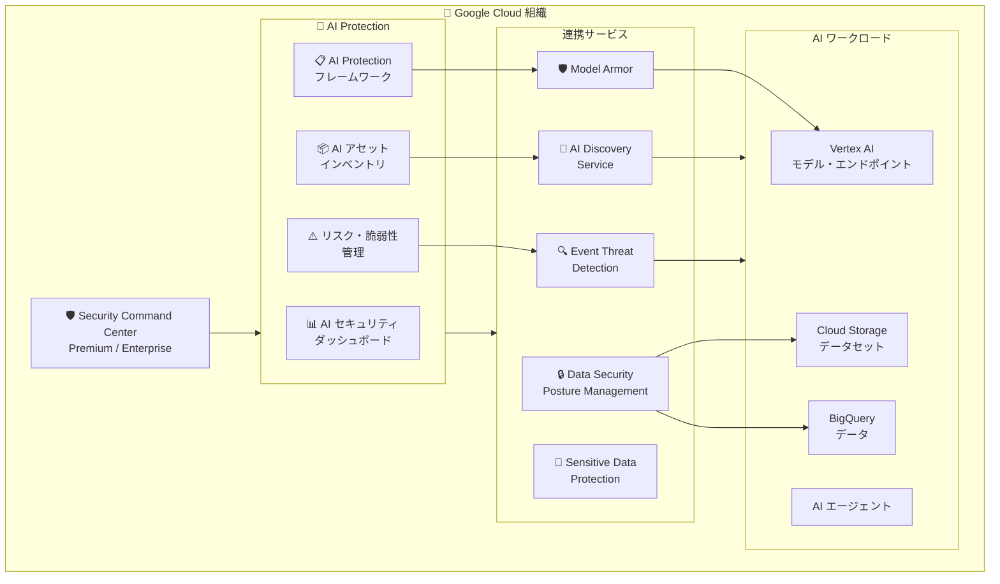

# Security Command Center: AI Protection が一般提供 (GA) に昇格

**リリース日**: 2026-03-14

**サービス**: Security Command Center

**機能**: AI Protection (一般提供)

**ステータス**: Feature (GA)

📊 [このアップデートのインフォグラフィックを見る](https://takech9203.github.io/google-cloud-news-summary/20260314-security-command-center-ai-protection-ga.html)

## 概要

Security Command Center の AI Protection が Premium ティアにおいて、組織レベルで一般提供 (GA) となった。AI Protection は、AI ワークロードのセキュリティポスチャーを管理し、脅威を検出して AI アセットインベントリに対するリスクの軽減を支援する機能である。

AI Protection は、組織全体の AI アセットの検出・評価・管理を一元化するダッシュボードを提供し、Vertex AI、Cloud Storage、BigQuery を含む全プロジェクトのモデル、データセット、エンドポイントなどの AI アセットを横断的に可視化する。Enterprise ティアでは 2025 年 11 月に Preview として提供されていたが、今回の GA 昇格により Premium ティアでも利用可能となり、より多くの組織が AI セキュリティ管理の恩恵を受けられるようになった。

**アップデート前の課題**

- AI ワークロードのセキュリティ管理が各プロジェクトやサービスごとに分散しており、組織全体の AI アセットを一元的に把握することが困難だった
- AI 固有の脆弱性、設定ミス、脅威に対する専用の検出・管理機能が存在せず、汎用的なセキュリティツールで対応する必要があった
- AI Protection は Enterprise ティアの Preview としてのみ利用可能であり、Premium ティアのユーザーは利用できなかった

**アップデート後の改善**

- AI Protection が Premium ティア (組織レベル) で GA となり、本番環境での利用が SLA で保証されるようになった
- 組織全体の AI アセットインベントリの自動検出、AI 固有のリスク・脆弱性管理、コンプライアンスフレームワークによるポリシー管理が利用可能になった
- AI セキュリティダッシュボードにより、全プロジェクト・リソースの AI セキュリティ状況を一元的に監視できるようになった

## アーキテクチャ図



AI Protection は Security Command Center の組織レベルアクティベーションに統合され、AI Discovery Service、Event Threat Detection、Model Armor、DSPM など複数のサービスと連携して AI ワークロード全体のセキュリティを管理する。

## サービスアップデートの詳細

### 主要機能

1. **組織全体の AI アセットインベントリ**
   - 全プロジェクトにわたる AI システムとアセット (モデル、データセット、エンドポイント、AI エージェントなど) を自動検出・管理
   - Vertex AI、Cloud Storage、BigQuery を含む宣言的 AI アセットおよび推論 AI アセットの両方をカバー
   - AI エージェント (Vertex AI Agent Engine にデプロイされたもの) の可視化にも対応

2. **統合リスク・脆弱性管理**
   - AI 固有の脆弱性、設定ミス、脅威、リスクを組織全体のコンテキストで特定・分析・管理
   - Event Threat Detection による Vertex AI アセットへの脅威検出ルール (新規 AI API メソッド、異常な地域からのアクセス、サービスアカウントの不正昇格など)
   - Attack Path Simulations による AI アセットへの攻撃経路の可視化

3. **AI Protection フレームワークによるコンプライアンス管理**
   - デフォルトフレームワークが組織に自動適用 (Detective モード)
   - Compliance Manager と連携し、AI セキュリティ標準への準拠を検証
   - カスタムフレームワークの作成により、特定のフォルダやプロジェクトに対する個別のポリシー適用が可能

4. **データセキュリティの可視化**
   - Data Security Posture Management (DSPM) との統合により、AI ワークロードに関連するデータの機密性、リネージ、リスクに関する分析を提供
   - データアクセスガバナンス、データフローガバナンス、CMEK によるデータ保護のクラウドコントロールを利用可能

5. **統合 AI セキュリティ管理**
   - 単一のダッシュボードから組織全体の AI セキュリティポリシーとベストプラクティスを一貫して監視・適用
   - 脅威、脆弱性、設定ミスの検出と対応を統合的に実施

## 技術仕様

### 連携サービスと機能

AI Protection の完全な機能を利用するために、以下のサービスが自動的に有効化される。

| サービス | 状態 | 説明 |
|---------|------|------|
| AI Discovery Service | 自動有効化 | AI アセットの自動検出 |
| Event Threat Detection | 自動有効化 | AI アセットへのランタイム脅威検出 |
| Attack Path Simulations | 自動有効化 | AI アセットへの攻撃経路シミュレーション |
| Cloud Audit Logs | 自動有効化 | 監査ログの収集 |
| Cloud Monitoring | 自動有効化 | リソース監視 |
| Compliance Manager | 自動有効化 | AI Protection フレームワークの管理 |
| Data Security Posture Management | 自動有効化 | データセキュリティポスチャー管理 |
| Sensitive Data Protection | 自動有効化 | 機密データの検出・保護 |
| Model Armor | 追加設定が必要 | AI モデルの入出力フィルタリング |
| Agent Engine Threat Detection | 自動有効化 (Preview) | AI エージェントへのランタイム脅威検出 |
| Notebook Security Scanner | Enterprise のみ自動有効化 (Preview) | ノートブックの脆弱性スキャン |

### 必要な IAM ロール

| 用途 | IAM ロール |
|------|-----------|
| AI Protection の設定およびダッシュボード閲覧 | `roles/securitycenter.admin` |
| ダッシュボード閲覧のみ | `roles/securitycenter.adminViewer` |
| DSPM 管理 | `roles/dspm.admin` |
| Model Armor 管理 | `roles/modelarmor.admin` |
| コンプライアンス管理 | `roles/cloudsecuritycompliance.admin` |

## 設定方法

### 前提条件

1. Security Command Center Premium ティアが組織レベルで有効化されていること
2. 組織管理者権限 (`roles/securitycenter.admin`) が付与されていること

### 手順

#### ステップ 1: AI Protection の有効化

Security Command Center Premium のアクティベーション後、Settings > Manage Settings の AI Protection カードから設定を行う。

```
Google Cloud Console > Security Command Center > Settings > AI Protection > Set up
```

#### ステップ 2: リソースのディスカバリー有効化

AI Protection で保護するリソースのディスカバリーを有効化する。

```bash
# AI Protection の設定を確認する際の IAM ロール付与例
gcloud organizations add-iam-policy-binding ORGANIZATION_ID \
  --member="user:USER_EMAIL" \
  --role="roles/securitycenter.admin"
```

#### ステップ 3: AI セキュリティダッシュボードの確認

```
Google Cloud Console > Security Command Center > Risk Overview > AI Security
```

ダッシュボードにデータが反映されるまで、しばらく時間がかかる場合がある。

## メリット

### ビジネス面

- **AI ガバナンスの強化**: 組織全体の AI アセットとリスクを一元管理することで、AI 利用におけるガバナンス体制を確立できる
- **コンプライアンス対応の効率化**: AI Protection フレームワークにより、PCI DSS、GDPR、HIPAA などの規制要件への準拠状況を自動的に監視・報告できる
- **リスク低減**: AI システムへのセキュリティ侵害や規制違反に伴う財務的・法的リスクを最小化できる

### 技術面

- **AI 固有の脅威検出**: Event Threat Detection の AI 専用ルールにより、従来の汎用セキュリティツールでは検出できなかった AI 固有の脅威 (異常なモデルアクセス、サービスアカウントの不正利用など) を検出可能
- **統合セキュリティビュー**: 複数のセキュリティサービス (DSPM、Model Armor、Sensitive Data Protection など) の検出結果を単一のダッシュボードに集約
- **自動化されたポリシー管理**: デフォルトフレームワークの自動適用により、セキュリティポリシーの設定漏れを防止

## デメリット・制約事項

### 制限事項

- 組織レベルのアクティベーションが必須であり、プロジェクトレベルのアクティベーションでは利用できない
- Premium ティアでのデータレジデンシーは米国のみサポート
- AI Protection フレームワークをアプリケーションに直接割り当てることはできない (組織、フォルダ、プロジェクトへの割り当てのみ)

### 考慮すべき点

- AI ワークロードの配置リージョンによって利用可能な機能が異なる (下記「利用可能リージョン」参照)
- 全サービスの設定完了後、ダッシュボードにデータが反映されるまで時間がかかる場合がある
- Model Armor は自動有効化されないため、別途設定が必要

## ユースケース

### ユースケース 1: 金融機関における顧客データを処理する AI モデルの保護

**シナリオ**: 大規模な金融機関が、機密性の高い顧客の財務データを処理する AI モデルを運用している。データ漏洩、トレーニング・推論時のデータ流出、AI インフラストラクチャの脆弱性といったリスクに対処する必要がある。

**効果**: AI Protection がAI ワークフローの不審なアクティビティを継続的に監視し、不正なデータアクセスや異常なモデル動作を検出する。機密データの分類も行われ、PCI DSS や GDPR などの規制へのコンプライアンス改善を支援する。

### ユースケース 2: 医療機関における患者情報を扱う AI 診断システムの保護

**シナリオ**: 医療機関が電子健康記録を管理し、診断・治療計画に AI を活用している。Protected Health Information (PHI) を処理する AI モデルが HIPAA の厳格な規制に準拠する必要がある。

**効果**: AI Protection が潜在的な HIPAA 違反を特定し、モデルやユーザーによる不正な PHI アクセスを検出する。脆弱な AI サービスや設定ミスをフラグ付けし、データ漏洩の監視を行う。

### ユースケース 3: 製造業における AI アルゴリズムの知的財産保護

**シナリオ**: 製造業の企業がロボティクスと自動化に AI を活用しており、AI アルゴリズムと製造データに重要な知的財産が含まれている。

**効果**: AI Protection が AI モデルやコードリポジトリへの不正アクセスを監視し、トレーニング済みモデルの流出試行や異常なデータアクセスパターンを検出して知的財産の窃取を防止する。

## 料金

AI Protection は Security Command Center Premium ティアに含まれる機能であり、追加料金なしで利用可能。Security Command Center Premium の料金体系は以下の通り。

- **従量課金 (Pay-as-you-go)**: 組織内の Google Cloud サービスの使用量に基づく課金
- **サブスクリプション**: 予測可能なニーズを持つ顧客向けの固定料金

詳細は [Security Command Center の料金ページ](https://cloud.google.com/security-command-center/pricing) を参照。

## 利用可能リージョン

AI Protection の完全な機能を利用するには、AI ワークロードが以下のリージョンに配置されている必要がある。

| リージョン | ロケーション | 備考 |
|-----------|-------------|------|
| europe-west4 | オランダ | Low CO2 |
| us-central1 | アイオワ | Low CO2 |
| us-east4 | 北バージニア | - |
| us-west1 | オレゴン | Low CO2 |

マルチリージョンエンドポイントは EU (`eu`) および US (`us`) で利用可能。

**リージョンごとの機能差異:**

| リージョン | Notebook Security Scanner | Model Armor | 制限事項 |
|-----------|--------------------------|-------------|---------|
| us-east7 | 対応 | 非対応 | Model Armor によるモデル保護なし、Findings 非対応 |
| europe-west1, europe-west2, asia-southeast1 | 非対応 | 対応 | パッケージ脆弱性 Findings 非対応 |
| その他のリージョン | 非対応 | 非対応 | 複数の機能が利用不可 |

## 関連サービス・機能

- **[Model Armor](https://cloud.google.com/model-armor/overview)**: AI モデルへの入出力をフィルタリングし、プロンプトインジェクションや有害コンテンツから保護する。AI Protection の完全な機能には Model Armor の設定が必要
- **[Data Security Posture Management (DSPM)](https://cloud.google.com/security-command-center/docs/dspm-data-security)**: AI ワークロードに関連するデータのセキュリティポスチャーを管理。データアクセスガバナンス、データフローガバナンス、CMEK によるデータ保護を提供
- **[Agent Engine Threat Detection](https://cloud.google.com/security-command-center/docs/agent-engine-threat-detection-overview)**: Vertex AI Agent Engine にデプロイされた AI エージェントに対するランタイム攻撃を検出 (Preview)
- **[Sensitive Data Protection](https://cloud.google.com/sensitive-data-protection/docs)**: AI ワークロードで使用される機密データの検出・分類・保護
- **[Vertex AI](https://cloud.google.com/vertex-ai/docs)**: AI Protection による保護対象の主要な AI プラットフォーム。モデル、エンドポイント、パイプラインのセキュリティを管理

## 参考リンク

- 📊 [インフォグラフィック](https://takech9203.github.io/google-cloud-news-summary/20260314-security-command-center-ai-protection-ga.html)
- [公式リリースノート](https://docs.google.com/release-notes#March_14_2026)
- [AI Protection 概要ドキュメント](https://cloud.google.com/security-command-center/docs/ai-protection-overview)
- [AI Protection 設定ガイド](https://cloud.google.com/security-command-center/docs/configure-ai-protection)
- [Security Command Center ティア比較](https://cloud.google.com/security-command-center/docs/service-tiers)
- [利用可能リージョン](https://cloud.google.com/security-command-center/docs/regional-endpoints)
- [Security Command Center 料金ページ](https://cloud.google.com/security-command-center/pricing)

## まとめ

Security Command Center の AI Protection が Premium ティアで GA となったことで、AI ワークロードのセキュリティ管理が大幅に強化された。組織全体の AI アセットインベントリの自動検出、AI 固有の脅威検出、コンプライアンスフレームワークによるポリシー管理など、包括的な AI セキュリティ機能が本番環境で利用可能となった。AI/ML を活用する組織は、AI Protection を有効化して AI セキュリティダッシュボードを確認し、Model Armor の設定を含む AI ワークロード全体のセキュリティポスチャーの確立を推奨する。

---

**タグ**: #SecurityCommandCenter #AIProtection #GA #AIセキュリティ #CNAPP #セキュリティポスチャー #Vertex AI #ModelArmor #DSPM #コンプライアンス
